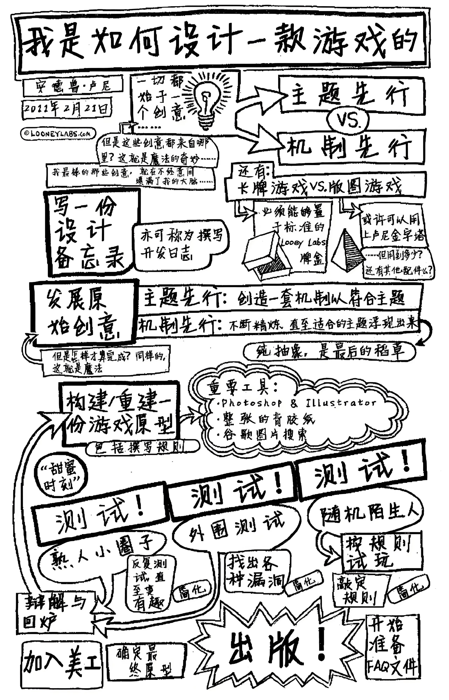
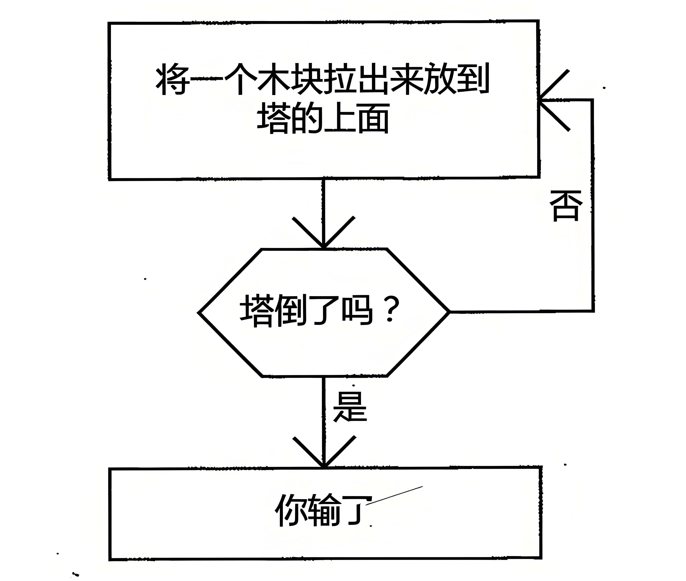

## 前言

我们一行人坐进了"船面"餐厅，准备享受一顿美味的泰餐。在餐桌上，每人面前都摆着一份他家的菜单。当被问及他们想要点几级的辣度时，其他五个人各自选择了从一星到三星不等的辣度。然后，服务员问到了我。

"你们本身设有多少星等？"我问到。

"二十五个。"她说，使得在坐的所有人都倒吸一口气。

"好的，那么我选八星。"

"八星？！"当即，我便被同伴追问到，"为什么？你至少也要选十二或十三星啊，至少一半起！"

"我看你们没有哪个人变更了你们的选择啊，"我说。

"但是，"质疑声继续传来，"你怎么能选八星呢？"

我告诉自已，因为我是一名游戏设计师。我这些同事们，所参考的标准（至少是对当地的西北人来说）是建立在一套由1至4的标准。每个走进餐厅大门的人都知道这套标准：1代表微辣，4表示特辣。餐馆也明白，若1和4只是代表着些微差别的微辣等级，他们将失去一半的顾客。在这个"猜猜你的食物有多辣"（讲真的，每当你尝试一家新的泰餐餐厅时，都要进行这样的游戏）的游戏中，1表示低、4表示高。我的策略从来都是：往高了选。

我只不过是揭示了一种不同游戏的存在，4仍然代表着高等级，但25则表示是无法想象的高等级。新出现的这个游戏并没有致使此前的游戏被遗弃。在这一新游戏中，我会选择谨慎地进行。而且，我告诉你，八星亦很辣。对于膳食而言，过高的史高维尔指数并无意义。因为，在我享受辣味晚餐的同时，仍要品味其它特有的味道和其中的些微差别。所以，我赢得了游戏。

藏于本书书页中的那些家伙，深谙如何进行游戏并获得胜利之道。因为正是他们设计了那些游戏。在本书中，你会读到很多设计师的文章，他们的游戏可能正是你所钟爱的，亦可能是你并未听说过的，但他们都同样出色。虽然身为游戏设计师，但他们同样擅长写作，其文章都有着清晰的思路和明确的主题。

在你完成本书的阅读后，亦会明晰他们所阐述的内容。因为他们非常乐于与你分享他们的工作流程。如果你希望从事与他们一样的职业，遵循他们的指引将会帮你做得更好。我和他们中的所有人都曾有过合作。如果你足够幸运，你也会有机会的。

在策划和编写这些文章的过程中，我们涵盖了诸多的主题。有些文章更偏重于哲理性------如何思考、如何准备、如何评估。有些则侧重于实用性------如何进行游戏测试、如何调整平衡、如何制作原型。但无论文章的主题落于何处，它们都非常重要。如果你在设计自己游戏的同时，能够花一点时间去思考每一位设计师的肺之言，那么你将在各个层面的工作中完成得为出色。

狗头人酋长，沃尔夫冈·鲍尔（Wolfgang Baur），希望能够展现来自设计师们的不同经验和思考。有些来自于大众市场，而有些源自专业市场：有些内容着重于某一领域，而有些则覆盖游戏业的各个环节。设计师们至彼此亦有争论。也许你想知道，究竞要如何在这些不同的建议中进行选择。我相信你足够聪明，一定可以找到 答案。

已经讲得足够多了，赶快开始阅读吧。

**迈克·塞林格（Mike Selinker）**

**华盛顿州，西雅图**

---

---

## 概念

**理解我们要创作怎样的游戏、谁会玩那些游戏、以及我们将给玩家们留下怎样的印象**

### 游戏不等于规则

**作者：James Ernest**

*我是迈克。作为本书的主编和编辑，我的职责就是要帮助你理解本书将要讲述的内容，以及游戏设计的大致过程。而我会以旁白的方式来进行。我将向你介绍在行业中一些出色的思想，并在每篇文章前辅以如此的一小段文字。我们将从詹姆士·欧内斯特（JamesErnest）的命题文章开始，他是我进行版图和卡牌游戏设计的首席搭档。他能比我更好地向各位阐述游戏设计的基本原则，注意听。*

游戏是一种根据一系列规则进行的娱乐活动。出色的规则可以帮助你发现和享受游戏的乐趣，而糟糕的规则会将这一切搞砸。但是！有趣的并不是规则本身。如果直接陈述这一观点，相信不会有人反对，甚至认为这是显而易见的事实。可是，有些游戏设计师即便具备全面的能力，仍然会落入这样的思维陷阱：游戏和机制其实是一种概念的不同表述而已。

游戏乃是一个完整体，而非各种部件的集合体。一款游戏可以包括有主题、机制、品牌、故事背景，甚至是生活方式等元素，这些组成元素都是无法被其它游戏中的元素所替代的，是拥有唯一性的。所谓完整的游戏，我们必须要将游戏所引发的共鸣、得到的关注、参与的玩家和对生活的影响都包括在一起，才能称之为真正意义上 的完整。

如果你想创作一款全新的游戏，那么你决不能仅仅是改进某些现有的规则，你必须要做得更好才行。你需要从更高的层面去考虑一个间题：为什么玩家要选择这款游戏。

#### "引人瞩自的游戏机制"

最近，我参加了一个地区性的游戏聚会。在其中一场聚集了不少游戏专业人士的研讨会上，有位参与者向我提问："对于游戏机制需要具备独特性、创新性的观点，你是怎么认为的？"我的答复是"你的问题本身就包含了一些错误的观念。"

游戏机制就好像是手表的零部件。对于手表的零件来说，有什么是令你觉得无与伦比的？我想我能讲出的关键词也就只有齿轮、发条和条轴等等。即便如此，你也无法通过我所讲的这些名词来真正理解如何制造一块品质上乘的手表。事实上，没有人会因为一块手表配有优质的零件而去购买它，即便有人向你强力推销。

游戏机制相当于手表内部的机械零件。所谓优秀的游戏机制：只有置于特定的游戏之中才具有意义。若是硬将某一游戏机制移植到其它游戏之中，没人能够保证这种机制还可以发挥作用，更别说保持其优秀的特性了。

当然，这并不意味着游戏不能从其它作品中借鉴游戏机制，恰恰相反，借鉴是完全可以的。但是，盲目地将一种游戏机制中的部分内容直接地移植到其它游戏中的做法，是一种非常糟糕的设计方法，甚至可能让整个游戏变成一堆废品。还是以手表为例，你不可能指望将你四处拾来的手表零件简单地堆在一起，就拼凑出一块真正的、能够计时的手表。简单地说，你必须要拥有自已的设计图纸。

当你将一款游戏拆分成一个个独立的部分，你会对其有一个非常充分的了解，可是这并不能让你学会该如何创作一款新的游戏，你若将某事物细分至各个独立的组成部分，只能让你对各个部分更加了解，熟悉它们的属性和组合机制，但你却失去了对于全局的把握即全局观。就好像当你展开一张西班牙的地图，你所能看到的只有西班牙的地形地貌，可这个世界到底是怎样的，你则完全没有概念。

#### 评判法

如果你仅仅具备对游戏的评判赏鉴能力，你不可能成为一个创造者。这就是为什么你会发现，评论家和创作者这两种职业极少有实质上的交集。

如果我现在提出这样的一个问题："所有优秀的表都<u>    -----</u>"，你会怎么回答呢？空自处可以填上任意你想到的答案，现在开始！

它们都有指针。它们都有表盘。它们都刻有数字。它们都很精准。它们都很时尚。它们的价格都能让百姓接受。它们都是报时的。还有\...它们都具有机械装置。它们都使用电力驱动。它们都有定时提醒功能。它们都\...或许还有许多。

你可以继续发散，给出各种令你满意的答案。而我要说，无论你的答案为何，我都能举出反例来驳斥这一睿案。比如说，这世界上的确有没有指针的表。当然，关于表所必须具备的元素这一问题：我可以想到许多特例来推翻某一答案。可事实上，这些回答义都是通过大家集思广益征集而来的。

这些答案对我们有帮助吗？我们全面的定义了什么是表，但是这并无助于我们创造一款新表。如果我们将定义中的每个特点都罗列出来，我们会发现即便其中每项特征都具备，也无法创作出一款优秀的产品，而且很多表实际上并不符合这个单子上的很多特征。

玩家是游戏的实际消费者，你需要考虑到玩家的想法，并且要去讨好他们。换句话说，是什么因素使一个人要去购买一块新手表呢？功能、实用性、还有时尚感。人们购买手表，是为了想要通过手表表达自已是怎样的人。即他想表达的"自已是怎样的人"的概念是："我之所以购买一块便宜的手表，是因为我并不在乎别人怎么看我，尤其是那些通过我佩戴的手表去评判我的人。"

所以，如果你想要设计一款新表，你必须要考虑市场和消费者的购买需求。这款表的机芯品质显然是必须要纳入考虑的，基至不少消费者只因为这一个要素就会为之付钱。

游戏也是同理，甚至（我认为）更为复杂。从某种角度来说：分析和定义一款游戏其实是非常困难的，因为这项工作比起单纯的观察机械零件要复杂的多。当游戏设计师完成了他的工作之后，游戏的"机械零件"就会全部隐藏进游戏之中，即便你将之"拆解"也不能帮助你更好地认识它。

此外，游戏还拥有一项非常特别且沉重的关键属性，我想任何手表都不会具备的一点，那就是"有趣"。我认为不会有任何一个手表设计师会想要创造一款"有趣"手表。当我们试图去定义"有趣"的时候，我们经过一番思前想后，会发现我们需要去重复定义"游戏"的这一过程，于是现在，我们文回到了起点。

好吧，大伙们。"所有的游戏都<u>     ----</u>。"开始咯！

它们很有趣。它们拥有很多玩家。它们有规则。它们都有板图、卡牌、般子或一些其他的小配件来进行游戏，或者什么都不需要。它们被限定了游戏时间。它们最终会决出胜利者。它们有规定的回合数或阶段。是的，那些好游戏都有好几个阶段。它们有时含有运气成分。它们有时有很强的策略性。它们耐玩度很高。至少应该耐玩度很高......

没错，"表"的问题在这里也同样适用：我可以逐一为上面的每个特点举出一个个反例，同样我也可以给那些不是"游戏"的行为加上这些标签，比如说跳迪斯科。

这些意味着什么？请允许我重申一下我的观点：我不认为你可以通过将一款已有的游戏拆分成许多可以量化的部分，就保证你能将这些东西重新组合成一个新游戏。用这种方法得到的只不过是一个拷贝。也许你的版本会比之前的版本有所改善，也许没有。但是它绝对不会是个新游戏。

好吧，也就是说，分析不能带来独创性。那么问题来了，什么 能呢？

#### 你的两个大脑

你有两个天脑，孩子的大脑和成人的大脑，它们分别反映了你性格中的创造性和挑剔的部分。

孩子的大脑是一个充满了乐趣的大脑，他充满热情与信任，每件事情看起来都那么神奇与新鲜。孩子大脑喜欢机器人、僵户和海盗，他知道怎样的主意是非常带棒的，你应该完全信任他的判断。但是他缺少纪律性，不太擅长去完完整整地做好一件事。

成人的大脑很无趣。她是那个挑刺的人，在你做每件事之前，她都会第一个跳出来。成人大脑会不停地崂吻，反复提醒儿童大脑：已经有数不清的僵户游戏了，不管这个游戏有多酷，这个世界不需 要它。

当你为一款新游戏构想创意时，你需要让你的成人大脑闭嘴。这很难做到，成人的声音听上去挺有道理的。但是她根本就不知道怎么区分一个主意是个好主意还是只是重蹈他人覆撤。

假设你参加了一个推介会，每次你抛出一个新想法都会被打击。如果有人听过类似的想法，他们会说："我们不能用它，已经有人用过了。"如果没人听过类似的想法，他们会说："我不知道这东西是怎么运作的。"没有一个想法有哪怕一丁点的机会去实现，从而创造出新东西。很不幸，我不需要动用想象力去体验这样一个会议，因为我经历过。

玩家，很不幸的，被他们的成人大脑所左右。他们可以说服自已不相信任何事。所以如果你是一名想成为游戏设计师的玩家，你必须重新学习如何思考。让自已充满热情，不要给任何想法下断言，让自己成为一个孩子。

孩子总是充满热情。他们很天真，他们会想到一个主意就付诸实施，他们没有顾虑。他们确实不知道自已的想法是前人已经做过的，这种状态使他们能把某些熟悉的东西变成另外一个全新的东西。

今天早上我的女儿来找我，告诉我她做了一个关于在亚马逊丛林探险的梦，她的队伍与狮子进行了一场惊心动魄的战斗，然后他们变成了《史酷比》电影中的角色并且解决了一个谜题。我和你有同样的想法："亚马逊丛林中没有狮子。"但是我没有说出来，因为我希望听完梦后面的部分。

当你处在构思游戏的头脑风暴阶段时，成人大脑需要保持沉默。否则，你永远无法听到完整的梦。

一且孩子大脑做了个他非常喜欢的东西，成人大脑就可以回来了。她的工作是查看设计，并指出这个设计是否符合基本规范范围、受众、市场一一所有那些孩子大脑不关心的事情。

在创造性思维心满意足地完成工作之后，批判性思维就可以介入游戏设计环节了。写下目标，理清思路，严格执行。如果你的游戏设计进行得不太成功，这个时候才是用那些你熟悉的概念来分析它的时候：其它游戏、游戏理论、数学性、科学性和动机。但是你只有在你的孩子大脑完整建立起他的目标之后才能搞定这些事情。

#### 动机

如果我要选一个游戏必须具备的因素，我会选"动机"。这是个难懂的术语，基本上意思是"玩游戏的理由"。我不喜欢说"引子"，它表达的意思太浅薄了。这不是简单地让你进门，而是要让你流连忘返。这是区分两个从表面上看一模一样的游戏，为什么一个成功一个失败的关键判断标准。

很多理由会导致"动机"的出现，并且（这是最难的部分）玩家常常不能解释其原因。如果你问一位万智牌玩家为什么他喜欢这个游戏，他会和你谈游戏机制，列出他最喜欢的牌，最后用数不清的锦标赛见闻来把你逼疯。但是他大概不会告诉你的是："方智牌让我觉得自已很聪明。"

万智牌中的每件事，包括手牌、构建套牌和交易卡牌，都让玩家觉得自已比别人聪明。它满足了他们的需求------在智力上部视所有人，包括游戏设计者和市场。这不坏，基至非常棒，当聪明人的感觉很不错。但也有很多和万智牌具有同样的游戏机制、卡牌能力和锦标赛的游戏。所以，他告诉你的理由并不完全正确。

流行的游戏就像这样：你可以随意指摘《强手棋》的机制，可是人们就是喜欢他。人们不是为了它的机制来玩这个游戏的。他们玩是因为它熟悉、简单，而且他们想要体验很有钱的感觉。人们不会用玩拼学游戏来炫耀自已对于电影、书籍和名人的了解。他们玩是因为他们喜欢看着朋友在自已面前出丑。人们不是因为喜欢冒险才去玩《龙与地下城》的，他们玩是因为他们认为没有某种共同兴趣，他的小圈子就会分崩离析。

现在问问你自己，我为什么喜欢那些我喜欢的游戏？我想要为我的玩家带来一种什么样的感觉？别提那些你喜欢的游戏机制，或是你喜欢的主题。直接用最简单的话来说明你想要让你的玩家有什么样的感觉。"我想让他们觉得有趣"可不算有效的答案。无数东西都能带来乐趣。

没有什么游戏机制是吸引人的，倒是有不少吸引人的游戏。玩家几乎在无意识的情况下就被某些游戏所征服了。作为一名设计者，你必须意识到吸引人们玩你的游戏的真正原因------尽管他们自已并 没有察觉。

此后当有人称赞你无与伦比的游戏规则时，只需要微笑并且说 "谢谢"就可以了。

*詹姆士·欧内斯特（James Ernest）是西雅图CheapassGames的幕后高层，该公司曾为其发行过多款桌游，诸如：《杀死幸运博士》（\<KillDoctorLucky\>），《瓶中人》（\<ButtonMen》），《斗》（\<Brawl\>），《给我你的脑子》（\<GiveMetheBrain\>）等。他还曾通过其他公司出版过诸如《西班牙海上的海盗》（\<PiratesoftheSpanishMain》），《罗马贵族逃亡记》（\<GloriaMundi\>），《赌城传奇》（\<LordsofVegas\>）等游戏。在业余时间，他也会为微软和Gazillion等公司设计电脑游戏。他曾著有《接触戏法》（\<ContactJuggling\>）一书，并与他人合作撰写过《庄家的选择：周末扑克完全手册》（\<DealersChoice:TheComplereHandbookof SaturdayNightPoker\>）一书。他也是众多游戏聚会的常客和各个设计学院的特约讲师。*

---

### 玩更多的游戏

**作者：Richard Garfield**

*在某个平行宇宙里，有一个叫理查德·加菲尔德（RichardGarfield）的人发明了万智牌，然后就去安度晚年了。这是一个挺奇怪的宇宙，因为我认识的那个理查德·加菲尔德在过去几十年里根本就不知追"安度晚年"是什么意思。他不断地以娴熟的手法挑这只被称为"游戏设计"的野兽，观察什么会让它高兴，什么又惹得它发怒。这种探索的关键是敢于且乐于去接触一切游戏。以下是理查德谈游戏研究。*

任何想要设计游戏的人都应该玩游戏。很多很多游戏。

有些设计师说他们从来不玩其他人的游戏，因为他们怕别人的游戏概念会影响到他们自己的设计。他们相信设计需要"真空"。想象这样个世界------斯皮尔伯格不看任何电影，史蒂芬金不读任何小说霍金不认同自已的理论以外的任何其它理论。你觉得他们会比现在做得更好吗？在那个世界里，我认为我都不会知道他们的名字。

牛顿曾说过，"如果说我比别人看得更远些，那是因为我站在了巨人的肩膀上。"事实上，闭门造车并没有什么优势可言------无论是在艺术还是在科学领域。游戏和它们文有什么不同呢？量然有些成功的设计师坚持认为应该最大限度的减少外界影响来保持"纯洁"，我却认为如果顺应传统并且与同行多多交流，他们的作品会更出色。他们这样的态度是在拿游戏的品质为代价来体现他们的个人设计才华。

"好吧。"你会说，"我是设计桌面游戏的，所以我会去玩桌面游戏。"而我会说，"还不够！"你应该去玩桌面游戏、卡牌游戏、电子游戏、体感游戏、街机、角色扮演游戏、模型游戏、战棋、数学游戏、聚会游戏、解谜游戏和老虎机。你应该去看电子竞技节目，体育比赛和游戏锦标赛。杰出的设计往往会从所有的游戏中汲取灵感。

想看看玩不同类型的游戏到底有多重要？没有比角色扮演游戏更能说明这个问题的了。角色扮演游戏的始祖是《龙与地下城》（\<Dungeons&Dragons\>）。它的设计者加里·吉盖克斯（GaryGygax）和戴夫·阿纳森（Dave Arneson）没玩过角色扮演游戏一------因为那时候它们还不存在呢------他们是军事战争游戏与战棋游戏的发烧友，而这些游戏对许多角色扮演游戏都产生了深远的影响。但大多数桌面角色扮演游戏玩家至今都没玩过战争游戏，甚至没想过把它当成一个兴趣爱好。伟大的游戏常常出自令人惊的地方，有时甚至是从一个没人听说过的地方。如果你能够将你的设计传播得够远够广泛，它也许会变成一个令你意想不到的东西。

如果你不喜欢时下流行的某一款游戏，你就有责任找出为什么大众喜欢它。和这些人玩，观察他们，并且理解他们喜欢这款游戏并没有什么错。理解为什么人们喜欢一款特定游戏的好处在于，你会渐渐地欣赏它，甚至最终喜欢上它------这些会让你的人生更丰富。

拿《强手棋》（\<Monopoly\>）来说，它可谓是一款游戏设计师最喜欢指摘的游戏。以现代的眼光来看，《强手棋》太糟糕了------它的设计师用这款游戏的长盛不衰嘲弄着历史。如果你和朋友来玩这款游戏，你可能会得出以下这些观察结果：

·玩家真的很喜欢游戏中的建筑元素。强手棋是第一款允许玩家收集和获取资源的游戏，以此来吸引"建筑师"类玩家。

·玩家在参与一场可能被淘汰出局的游戏。如果你玩游戏不是为了挣钱，是什么吸引你去玩游戏呢？游戏中的金钱带来了乐趣，能够把人淘汰出局也是卖点之一。现代游戏设计认为淘汰出局太过残酷了，它使得玩家的一切努力归零。

·玩家在其他玩家的回合中浪费时间。在很多"投殷-移动"的游戏中，一个玩家的回合只对那名玩家有意义。所以和其他三名玩家一起玩游戏意味着只有25%的时间对你来说有意思。在强手棋中，很多很棒的事情都发生在别的玩家的回合中。

在任何受欢迎的游戏中都能找到像这样的经验总结，甚至是那些我们不会立刻喜欢上，或是认为"差劲"的游戏。对玩家宽容些用"他们没见过比这更好的游戏"来说服自已不要那么昔刻。

从那些不受欢迎的游戏中也同样可以学到不少东西------为什么有人喜欢这款游戏，即使正是它的这种特性使得它不受欢迎？如果你来设计的话，你是否能够整合这些特性，让那些玩家依旧喜欢这款游戏，而去掉那些让其他玩家不喜欢的东西？

我最喜欢的游戏之一------《泰坦》（\<Titan\>），也许就会被归为以上那一类。这个游戏的游戏时间不固定但往往会拖得很长玩家会被淘汰：而且玩家常常在半个小时甚至更长的时间里无事可做------为什么有人会喜欢这样一款游戏呢？在《泰坦》中，你会有一种很强烈的感觉------你正在建造一些非常独特的东西，也许这正是它所要呈现的一部分。但我最喜欢的特色是它高度互动的游戏方式，而不是直接"选出胜利者"。很多现代游戏设计不是将互动减少到几乎没有，就是运用复杂的政治因素来影响玩家，以决定与谁发生冲突。其实有些特点，比如淘汰规则，并不像我们想的那样糟糕。

那么究竞在什么时候，你应该担心你的设计过于模仿他人的作品？这通常是一个很难回答的问题，但如果玩家从你的游戏中得到了一些其它游戏中没有的乐趣，你大概就不用再担心这个问题了。如果你足够仔细地审视任何游戏的话，你会发现没有什么是原创的但这并不意味着所有设计都不是原创的。就好像一锅炖肉可远不是肉加香料这么简单，一段旋律也不仅仅是几个音符的列表。这才是设计师应有的、整合规划设计元素的重要能力。

事实上，新手设计师常常过度创新。游戏最棒的一点在于它可以给玩家带来多少东西------好的游戏为人生带来愉悦。但事实上学习新游戏很累人，所以我们不得不努力工作，让人们想要去尝试新游戏。创新是必要的------这会诱惑玩家------但太多改变会让游戏变得很难学会。每一个特殊的配件、每一次打破常规的游戏方式不仅仅是引诱玩家来玩的机会，同样也有造成困惑、使得上手变得更加困难的风险。设计师有责任确保每一项打破常规的改变都值得玩家花费时间去学习。如果设计师不知道常规标准，就无法衡量这种改 变是否值得。

优秀的游戏常常使人感觉其中的创新成分比他们实际所做的要多。想想那些享誉全球的公司，比如：暴雪。他们做出了优秀的游戏但比起他们在游戏形式上的创新，他们做得更多的是大大完善了现有的游戏形式。《星际争霸》和《魔兽世界》对于大多数读者来说是非常完美的游戏，但与相应类型的创始者相较而言，其创新程度完全不可比，比如说首款即时战略游戏（RTS）《沙丘2》（\<Dune2\>），或是更早的图形大型多人在线角色扮演游戏（MMORPG），如《网络创世纪》（\<UltimaOnline\>）或《无尽的任务》（\<Everquest\>）。

作为一名设计师，我始终坚信，你应当充分理解并善用你所受到的"影响"。深入理解它们，可以使你成为一名更加优秀的游戏设计师：给予它们认可，则可以在许多方面给设计师团体带来帮助和鼓励。设计师在努力提升自已技巧的同时，会对这些作品有更深刻的理解，并能从中波取自已所需的灵感。对于设计师而言，他的设计即便没有取得市场的成功，但创意和想法也会获得相应的认可。同样的，这些设计成果必然会成为一座巨大建筑物的砖石------一座记录着游戏发展史的丰碑。回溯到19世纪，我们会发现那时的游戏基本上是没有文件记载的，就算是今天，我们能从文件记载中得到的东西也并不比从文学、民间故事或者音乐中得到的信息多。所以，如果你不想成为一名游戏史学家的话，就请积极地去体会并与他人分享你所受到的"影响"吧，我相信这会是你做过的最棒的一件事。

这种"影响"如何显现作用的一个例子，就是我设计的《东京之主》 （\<King ofTokyo\>）。这款游戏的机制建立在《快艇般子》（\<Yahtzee》）的基础之上。我之所以想到《快艇般子》是因为我以前玩过《卡坦般子版》（\<Catan Dice Game\>），那次的游戏经历令我印象深刻，我不认为我是直接受了《卡坦般子版》的影响，但如果没有那种游戏经历，我可能永远也不会回到我的《快艇殷子》，并且问自已如何让游戏变得更有互动性。游戏风格则是受了《吃了伊根的怪善》 （\<TheCreature That Ate Sheboygan\>）和电子游戏《砸毁咬》（\<CrushCrumble，and Chomp!\>）的影响，肯定还有很多我没有意识到的影响因素没有算进去。如果我没有玩过大量的游戏，不论新旧，并且仔细地分析过它们，《东京之王》是不会存在的。不论是谁玩它，都不会认为这是哪款游戏的"双胞胎"，对此我很有信心。如果他们不认同的话，我会用超新星喷吐把他们炸到没影儿的。

你应该多玩游戏而不仅仅是研究它们：你要去玩游戏，因为它们很有趣。如果它们不那么有趣，你应该修正你的想法，让它们变得有趣。在我生命中的有段时间，我没有时间去玩游戏，这使得我的设计过程变得无比艰难------它变得又于又癌。我确信你会用你的方法来度过这段时间，但对我来说最好的方式就是抽出时间来玩我马上又感受到游戏带来的愉悦，并且这也会反映在我的设计中。

和我一起站在巨人的肩膀上，这里风景很好------玩游戏、从游戏中学习、享受游戏，终有一天，设计师们会站在我们的肩膀上。

*理查德·加菲尔德（RichardGarfield）在1993年，设计了世界上第一款集换式卡牌游戏一------《万智牌》。这位曾经的数学教授曾出版过数个集换式卡牌，还曾出版过一系列的版图游戏和卡牌游戏诸如《一夜暴富》（\<FilthyRich\>）、《脑子进水》（\<WhatWereYouThinking?\>）、《一起飞》（\<LetsJet\>）和《东京之王》等。他曾经为许多游戏设计公司提供咨询服务，例如微软、EA和《口袋妖怪》的公司等等。他还开设一门名为"游戏的特质"的课程，其课件和教学内容最终由麻省理工大学出版社编辑成册并出版发行。*

---

### 游戏节奏

**------像上帝和亚里士多德那样讲故事**

**作者：Jeff Tidball**

*虽然合作写这本书的每个人都知道怎么写文，但其中只有一个人是真正的科班出身。本文的作者杰夫·蒂德博尔（Jeff Tidball）曾经求学于南加州大学的电影艺术专业，这或许也能解释为什么玩他设计的游戏总是让人感到在经历一个个引人入胜的故事。当我第一次和我的伙伴们玩他所设计的《银币》（\<Pieceof Eight》）时------这游戏的组件仅仅是一些只手可握的硬币------我就已经能感受到指尖跃动着的故事的分量。海盗船长和他的船在危机四伏的大洋上破浪前行，集结于船长手下的悍匪船员们和船长一起把对手们送去大洋深处长眠。仅仅是几枚硬币，他就能妮妮道来这样的一个故事。也正因为如此，我邀请他来给我们讲进如何像故事一样设计游戏。*

#### 你可能听说过亚里士多德

很久很久以前，亚里士多德曾经在一本叫做《诗学》的著作中阐述了戏剧的原理。在这本书中他写到：对一段高质量的戏剧情节而言，包含完整的开场------发展------结尾三幕剧式结构（也称三一律）是最重要的因素之一。

亚里士多德说的有道理。从三幕剧式结构的角度来对故事进行分析，可以帮助我们窥视故事运作的规律，更可以看到故事发展的节奏。同时，这个角度也能帮助解释为什么有些故事扣人心弦引人入胜，而另一些故事会像《X战警3》一样索然无味。

我们的意识把生命中的每一件事情以故事的形式单独存放、回忆并理解。无论这些事情是矛盾碎的，还是非常重要的，都不会影响到意识对它们的处理。一个电话就会分散我的注意力，然后我的吐司就烤焦了。罗马专注于扩张和覆盖更大的领土，这最终导致了它的衰败和灭亡。总而言之，无论是大事、小事还是不大不小的事，我们都会以故事化的方式去记忆它们。这也能在一定程度上解释为什么奇闻轶事总是如此引人入胜。虽然它们是没有营养的内容，但作为一个个有趣的故事，我们的大脑真是爱死它们了。

对于玩家来说，玩游戏------如同烤土司或是罗马帝国的覆灭一样------也是他们所经历的故事：你圈下了产羊的地块，你建造了羊港你用最长的道路连接了羊港和产羊的地块，最后你碾压了所有对抗你的玩家获得了游戏的胜利。这不就是一个故事么？

而对于游戏的创作者来说，在这里应该关注的要点则是：对于玩家来说把玩游戏的经历看成故事会让他有满满的成就感。或者稍微换个角度来说，最好的理解游戏节奏的方式，就是把玩游戏的过程看作是玩家所经历的故事。

另外，把玩家进行游戏的故事以开场、发展、结尾的方式来分析------也就是以经典三幕剧式结构来分析的话会让游戏设计者很有收获。这些收获能够帮助你构建并且微调游戏的细节，让游戏契合玩家对一个故事的开场、发展和结尾的最内在的期望，当你能够做到这一点的时候，你的游戏也就能获得成功。

#### 将故事写成多幕剧的形式 从根本上来说是为了更好地分析

这个标题就是我们在这一段所讨论的理论。也就是说，对于创作者而言，多幕剧的形式可以帮助他们更好地分析并修订那些未完成的作品。一个有助于分析的理论框架能让创作者们搞清楚哪些是正常的，哪些是奇怪的；搞清楚哪些是成功的，而哪些则是彻头彻 尾的灾难。

不过要注意的是，这个理论并不能帮助游戏创作者来进行游戏的原始设计。一个关于榔头的理论和使用榔头的过程是两回事。如果这个说法还不够清楚的话，那你可以试试看用关于榔头的理论来快速地修建一栋房子。我会在这里等你建------

------啊，已经回来了？很好，让我们继续吧......

#### 对于每一幕应该发生什么，每个人都有不一样的想法

柏拉图的理想国并不包括一个圆满的开场，一个完美的发展以及一个理想的结尾。而为什么亚里士多德用三幕剧式架构来定义经典希腊悲剧故事，也只是因为他觉得俄狄甫斯王是一出最棒的戏剧。悉德·菲尔德（Syd Field）用一个完全不同的架构来解释戏剧，并通过把他的书卖给那些想成为电影工作者的年轻人挣到了许多钱。

剧作家、小说家、编剧、电视电影评论家以及无数的学院派人士曾经提出了各种各样、数量庞大的理论来帮助大家写出更好的开场，来分析什么样的内容应该放在第二幕剧情发展阶段，来解释第三幕结尾部分应该如何构成。也有人根本不同意戏剧和故事的三幕架构。有人则提出了五幕甚至六幕架构。而对于电视剧来说，功能性的多幕架构被商业广告打断，现在传统戏剧也难逃这一结局（有些时候它们甚至会在同一个位置被打断）。

亚里士多德、悉德·菲尔德，啐，别管他们啦，让我来告诉你们： 我是怎么想的：

##### 故事的第一幕：设定背景

这一幕需要介绍角色。角色们需要被代入到一个有戏剧间题的场景中，这个问题要让观众愿意去关注，并且要在故事剩下来的所有时间都让观众维持这种意愿。

##### 故事的第二幕：回答这个戏剧问题

在纠结和发展中，观众们被引导着去关注这个戏剧问题是如何被回答的。最终，一个设计完满的戏剧故事的第二幕将彻底地回答第幕提出的戏剧问题，无论这个答案是悲伤的亦或是欢欣的。

##### 故事的第三幕：告诉观众最终的结局是什么

这一幕或许会讲述这个世界最终怎么样了，或许会告诉你故事里英雄的最终结局，也或许这一幕的主角是一个在前面的戏剧问题中根本没有出现的第三者。故事的第三幕是为了将观众刚刚经历的故事放到一个对观众有意义的环境中，这样才能让观众明白这个故事在真实世界中的价值。

#### 把你的手放在后面

在上一节中，我对三幕架构在戏剧故事中的作用表达了我的看法，其实无论这些看法是对的、是好的还是正确的都无关紧要，因为我们下面要开始讨论游戏这件事情了。不过在我们真正开始讨论之前，我们必须再次明确一下本文的核心概念：故事包含开场、发展、结尾三幕，每一幕都有它不同的功能，而幕与幕之间的转换也同样重要。因为无论读者或者观者是否意识到幕间转换的存在，正是这些转换决定了故事的节奏。我们从直觉层面上就会寻找这些转换。当我们发现缺乏转换的时候甚至会感到愤怒。

当故事的不同章节在我们眼前展开，故事的表达和风格的变化会告诉我们，什么时候我们应该放下手里的爆米花集中注意力观察剧情；也会告诉我们什么时候应当憨住不去洗手间直到关键剧情结束：还会告诉我们什么时候应该打电话叫一个保姆来照顾宝宝，因为我们注定会要多待一会儿了。对于一个观众来说，他预想在这个时间点会发生的事情没有发生------应该没有比这个更让他感到恼怒 的事情了。

#### 像游戏体验中的故事， 可以用类似戏剧的多幕架构来考虑

玩游戏的第一幕------就和戏剧中的开场一样------就是游戏初始设定结束而冲突正在玩家之间慢慢孕育的阶段。战线逐渐明晰，而玩家们也开始对斗争在哪些维度展开有了明确的概念。

玩游戏的第二幕------就和故事的发展一样------是为了获得胜利而不断拼搏的核心阶段。每个玩家通过不停款的努力来试探其他玩家抗争和忍耐的底线，只有这样他才能最终一击制胜。

玩游戏的第三幕------就如同结尾------是达成胜利的过程。一个或者多个玩家一个接一个，要么努力然后失败，要么努力并最终以他自己的胜利结束游戏。

我希望这些关于游戏不同阶段的描述能够自然地和你的游戏体验吻合。如果上述关于游戏模式的分析对你来说是有价值的话，我相信你应该已经开始不住点头了，并且意识到，在你经历过的许多游戏中，已经感受到我说的这些了。

我同样也希望这些关于游戏节奏的分析可以解释为什么有些游戏是那么的无聊。有些游戏里面，根本没有游戏场景背景的说明和设计。有些别的游戏里面，人们还没有努力，游戏就莫名其妙地结束了。另外有些时候，游戏因为没有人可以赢而结束。这些都是没有把握好节奏的关系。

那么，让我们更多地讨论游戏的每一幕吧。

##### 开场第一幕：明确战线在哪里

很多游戏的游戏空间要比实际游戏核心冲突所要求的更大------甚至可能大得多。这个"游戏空间"可能是字面上的，比如在一个二战主题的战棋游戏中，波兰会成为游戏的制胜点，而游戏的版图可能会包括整个欧洲：当然这个"游戏空间"的说法也可能是抽象的，或者是机制上的。对于一次游戏进程或者是一款游戏来说，冲突的核心部分可能被初始机制限定在：哪一个玩家会通过时机选择获得至关重要的优势（无所请游戏是不是有许多其他机制）：也可能会被定义为对资源的获取（无所谓游戏的胜利条件中是否包含战斗胜 利的要素）。

当理智的玩家清晰地意识到冲突的边界已经被标定出来时，第一幕也就到此终结。与此同时他们也会清楚在游戏剩余的大部分时间里他们应当主动去尝试完成哪些任务[^2]。而对于这些玩家来说，胜利条件在此时从规则书所表达的句字（"占领三个首都来获得胜利"）变成了玩家自已明确的胜利计划（"我或许可以通过占领阜、巴和梵蒂冈城来获得胜利"）。

理想情况下，第一幕能帮助新玩家了解游戏的规则是如何运作的，而且要保证他们至少在游戏机制的理解上能和所有其他玩家站在同一水平线。只有这样新玩家们才能满怀信心的进入第二幕。那些要花更长时间理解核心规则的游戏对于玩家来说是一种惩罚。

没有玩家应该在第一幕的时候感到一一或者在事实上发现自己已经不可能获胜了。如果这种情况在第一幕时发生的话，那么这个游戏是有巨大漏的。比如《沙丘》（\<Dune\>）就是这样的一 个坏例子。

虽然"构建场景"这个词在故事分析理论中被用来描述第一幕应该发生的事情，但布置游戏一一包括把游戏组件从盒子中拿出来然后按照游戏需求拼装好一一并不在游戏进程第一幕的涵盖范围内，也就不是这一章节要讨论的内容。不过《魔镇惊魂》（\<ArkhamHorror\>）在这方面可是做了不少努力。

##### 第二幕是整个游戏的戏肉部分

在第二幕，玩家们与其他玩家缠斗，逐步积累自已的优势，随 时准备一击制胜。

在第二幕中，只有那些没有真正关注游戏的人才会疑惑于他应该采取什么样的措施。同时，玩家们也应该被诱惑着去干那些不正确的事，这种诱惑有可能来自于恶魔般的机制，也有可能是被其他玩家的聪明策略所诱导。但无论如何，战线就在那里，玩家们应该在这条战线上收获乐趣，而不应该在不同的游戏机制中迷范。

在好的游戏里，玩家们应该在第二幕的斗争中直面其他玩家。合作类型的游戏看上去是个例外，但其实并非如此；对这样的游戏我们仅仅需要理解为玩家们结成统一战线来对抗游戏本身就可以了。单人游戏中也是一样的道理。

在最好的那些游戏里，每一个玩家都会得到许多机会，获得对于其他人的优势。一个每时每刻都与先前预知的结论一样的游戏并不好玩。在一个已经失控而且领先者优势巨大的游戏里，即使领先者有着令人厌恶的施虐欲望，他唯一的乐趣也仅仅可能来自于无情地碾压对手------如果规则允许的话，而这其实并没有那么有趣。当然，这并不是说当你快要赢的时候，你应该把胜利优势送给其他人否则你就是个恶棍。我是想说就像所有玩家都想赢一样，他们更想让游戏能尽可能地让人兴奋：我也想说这种兴奋来源于不知道谁将会赢你玩下去的动力也在于努力去知道自已会不会赢。

##### 第三幕是为了胜利而努力，也就是结局

当我还在大学的时候，我的玩家小圈子里有这样一个说法："我们得一起阻止乔，他就快赢了。"无可避免的，在某些情况下当游戏快要被结束时，我们可以清晰地感觉到是乔将要赢得游戏，而也就在此时，所有其他人会团结起来阻止他获得胜利。不过这种努力往往会失败[^3]。

第二幕向第三幕的转变点发生在一些聪明的玩家发现另一个玩家已经拥有了明显优势的时候。除非有人能够绝地大反击，这个拥有优势的玩家将获得游戏胜利。

伴随而来的情感上的警报（相应的对于那个领先者来说也可能是愉悦感）是通向第三幕结尾剧情的钥匙。每个玩家都意识到游戏即将结束，他们所能做的无非是两个选择：努力进行最后一击来争夺领先的位置，或是努力再坚持一会儿并最终保住自已的胜利。一个玩家在第二幕的胜利和失败最大程度上决定了他在第三幕争夺胜利的过程中所处的位置。如果游戏的结果并不是这样的，那么这个游戏就有点......嗯......"优秀"的反义词是什么来着?

对于一个情绪上最让人满意的第三幕，一个核心的特点就是领先者的胜利并不是不可阻挡的。如果领先者的胜利不可阻挡，那么整个第三幕的设计机制就是失败的，因为无论是在表意识里还是在潜意识里，我们都希望故事有一个令人满意的结局。所以在第三幕，除了领先者以外的其他玩家，或者应该说其他任何一个玩家应当虽然可能非常非常难一依然可以从失败的情况下逆转。当个玩家发现自已不可能赢的时候，游戏对他来说就不再有趣了，因为他再也没有情绪上的紧张感了。而如果这个不可能胜利的玩家依然能够影响到最终胜利的玩家，那这就更糟糕了。出现这种拥王者效应（Kingmakereffect）[^4]绝不是好的游戏设计。

在第三幕的有些时候，必须要让玩家能够做到一击制胜。对于游戏设计者和发行者来说，游戏无止境的进行下去对游戏带来的伤害比想象中的还要可伯。因为这种完长乏味会牢牢地占据玩家的大脑，让他们觉得游戏就是在允长乏味中结束的。有些游戏你玩着玩着会变得不在乎是谁赢得了胜利。你遇到这种情况的时候，就是因为第三幕太完长了！

#### 对于上面这些问题，我有三个额外的想法

##### 想法一：

在电影中，各幕之间的分界线其实很明显。一个特别的事件发生了，而这个事件明确标志着旧的一幕故事结束而新的一幕故事开始了。比如，恐怖分子占领了中富大厦[^5]"。分析游戏则要更困难些，当然部分原因是因为即使是同一个游戏每一次玩也需要被区别分析。我觉得，游戏的幕间转换比起戏剧、故事和电影而言似乎具有更强的渐进性。也就是说，玩家们从一幕进入另一幕的过程更缓慢一些。想想你自已的作品，一个值得思考的问题是：到底是快速切换还是缓慢转进更有趣，考虑一下这个问题并把结论用在你自已的设计里。另一个值得思考的问题是，设计那些能够影响游戏未展开部分的机制对游戏节奏是有益还是伤害。也就是说，你到底希望让幕间切换更明显，还是让一切都在无声无息中发生。

##### 想法二：

一个用来分析角色扮演游戏、甚至用来分析故事类卡牌或桌面游戏的多幕框架体系，和本文所讲的分析框架并不相同。因为一个用来分析角色扮演游戏的框架体系的出发点是故事讲述者，而这个出发点和我所描述的基于玩家游戏体验的框架是不相干的。我的这个模型也与任何游戏机制的装饰性设定无关。一个角色扮演游戏或是一个美式桌游可能会用三幕来单纯描述故事，这个同样与我所提出的基于游戏体验的三幕结构并无相关的部分。或许会有别人决定来讨论这两者之间是互相依赖、无关或是其它关系，但这并不在本 文的范畴内。

##### 想法三：

对我来说"欧式游戏[^6]"的作品经常误入歧途，因为它们只有第二幕。注意：这仅仅是一个讨论话题罢了。

#### 我看出来了，你想要去你自己的博客大声咆哮了

不，不是说你要指责我指责欧式游戏。而是因为你想要指出这个分析方法毫无价值，因为没有一个游戏设计者设计游戏的时候：脑子里就已经有了这个三幕结构。

你说得对：我不认为在我之前有任何人曾经提出过这种将游戏进程划分为多幕架构的理论。至少我从来没见过。人们曾经对于基于故事的游戏讨论过类似的话题，并且以这样的方式把故事分成多幕形式。但是无论如何，他们讨论的都只是将故事分成一幕幕，而非将玩游戏的进程分成多幕架构。

所以让我再次重申这个残酷的观点：这个划分三幕架构的方法是一个理论和分析工具，不是一个游戏设计工具。这是一个用来评估蓝图或是改进第一版设计的方法，不是用来一锤定音的手段。那些理论博客和论坛里关于"没有任何现实游戏设计基于这样的三幕结构进行设计"的反驳并没有意义，因为成年人可以在比单纯设计游戏更高的层面上发表有创造性的观点。事实上，个聪明的游戏设计者会带有前瞻性地去寻找关于他们作品的更产阔维度上的探讨，因为这些观点能帮助他们提升他们的素材和作品的质量，不仅仅在设计直觉层面上，而且在更高的层次上。

#### 观点是基于事实分析产生的， 但重点是为了设计出更好的游戏

这个用三幕剧式架构考虑游戏节奏的核心；不在于画出三个盒子让你往里面装上不同的机制：更不是为了将120分钟的游戏时间生硬地分成一段段，然后争吵我们是否将幕间转换的标志放在了它应该放的位置。我希望游戏设计者能够思考三幕剧式架构，从而理解玩家对游戏的无意识期待，并且作为这种思考的收获，我希望游戏设计者能够避免盲目设计和不停试错，最终能够设计出更好的游戏。

我猜测我提出的这套理论能够帮助那些设计师或是游戏开发者，特别是处理以下的问题：在游戏测试后发现游戏机制行得通，但是玩家并没有感受到乐趣，或者没有感受到足够的乐趣。事实上，当我第一次写下这篇文章的大纲的时候，这个方法已经帮助改进了一个我当时正在设计的游戏。因此从某个角度而言，这个方法已经成 功了。

*杰夫·蒂德博尔（JeffTidball）是一位独立游戏设计师，他曾经设计过的游戏包括《银币》（\<Piecesof eight》）、《克苏鲁500》（\<Cthulhu500\>）和《荷鲁斯的瓶乱》（\<Fantasy Flight Games' Edition of HorusHeresy\>）。他和威尔·希德玛芝（WillHindmarch）一起撰写了《我们对游戏的看法》（\<Things We Think About Games\>》）。他曾是Fantasy Flight Games公司产品开发部门的副总裁，并曾经在南加州大学获得了影视编剧方向的艺术硕士学位。他的个人网站是：jefftidball.com。*

---

### 游戏背景VS.游戏机制

**------不要试图分裂它们**

**作者：Matt Forbeck**

*马特·弗贝克（Matt Forbeck）可能会因为很多理由而对一个游戏设计项目说"不"------比如时间、收入，又或者是因为要训练他家的四胞胎踢足球------但他绝对不会因为不熟悉某一个游戏类型而拒绝游戏项目。或许应该这么说，马特已经把所有你能想到的创作类型都尝试过一遍了。而正因为他对事物应有的形态有着无可比拟的洞察力，他能给他设计的游戏赋予一种他特有的风格------每一个元素都恰如其分地在它应该出现的地方出现。同时，你阅读他的作品的时候会感到他仿佛在你的耳边低语，我发誓你会喜欢他的声音的。这里，我让马特给大家讲进他是如何整合他创作的游戏的每一个元素，从而让这些元素实现一加一大于二的效果的。*

许多游戏设计者坐下来启动一个新游戏项目的时候，他们要么会先确定游戏的机制，要么会直接考虑游戏的背景，两者必居其一。

为了达成游戏设计的目的，游戏机制包括了让游戏运转的核心规则和基本入门规则，是让你能玩起来的部分，而背景则描述了这个游戏是关于什么的。

举个例子，《强手棋》的机制包括：掷两个般子并将它们的点数相加来确定你的指示物在棋盘上向前移动的方格数：用点数（以虚拟货币的形式）来建立相对于其他玩家的优势，在玩家中转移这种优势，保持点数和优势以及如何决定游戏结束：游戏版图上包括与游戏进程相关的各种配件的放置：规则则是用来在最后交易优势 （资产）的。

在《强手棋》中游戏背景是这样的：每个玩家都是一个资本家：玩家们通过用自已拥有的资源投资来让自己变得更富有。当你把所有资本都集聚在自已手里并且迫使其他所有玩家都破产以后，你就获得了游戏的胜利。

游戏机制是抽象出来的游戏的运作方式。游戏背景则是游戏给你带去的美丽谎言，是让游戏获得意义和更多价值的幻想。

所以，哪一个更重要？如果我们想要设计一个好游戏的话，我们应该从何处开始？

哪个回答都是错的，真糟。

#### 让你的游戏更纯净

游戏是许多元素的复杂聚合，包括美术、规则、组件、机制和背景。想象一下，这些元素就好像是汽车引擎中的活塞。假如活塞无法有序工作的话，汽车或许依然可以皖嘛叽味地缓慢前行，但如果你想极速奔驰的话，不让所有活塞都同步工作是不可能的。游戏也是如此。没有游戏机制的游戏不是一个游戏，它只是一个故事，抑或只是一个思想实验。而没有背景故事的游戏也不是游戏，它只是一个数学问题，一个谜题，或是一个简单玩具。

即使最抽象的游戏也会用一点点背景来装饰自已。这些故事背景会帮助玩家将他们的思绪围绕游戏机制跳跃，并且让玩家们的思 考有价值。

最有名的抽象游戏一我所指的是那些重视游戏机制远甚于背景故事的游戏------是国际象棋。这个游戏要求玩家通过在方格板上移动抽象的棋子来模仿一场两个国家间争夺权利的战争。你在玩这个游戏的时候可以不考虑任何游戏背景，但这样会让你失去游戏的意义。为什么骑士以这种方式移动？城堡的意义是什么？为什么主教只能在斜线上移动？为什么兵一开始很弱小但可以升变为强大的 战力？

所以对于一个游戏设计者而言，从什么地方开始你的设计？从游戏背景还是游戏机制？

这完全取决于你，每个游戏的方式也可以不同，这取决于设计这个游戏时所处的环境。

#### 从机制入手的方法

有时候，你灵光一闪想到了一个与众不同的游戏机制，或是可以发明一个游戏组件，你想要基于这个灵感设计一个游戏。可能这是一个卡牌游戏，你每次购买的牌组是从一个巨大的牌库中随机选择的，就像《万智牌》一样；也可能这是一个绝妙的组件，比如一个头饰，你戴上它就能用脑电波控制一个球的移动，这就是《思绪无常》（\<Mind Flex\>）。

无论是哪种情况，一旦你拥有了这个基本元素，你就可以基于这个元素去设计一个游戏，但也请谨记，不要把这个游戏元素等同于游戏本身。即使是中等复杂度的游戏也需要一定数量的不同游戏机制如交响曲一般协作。而如果你想尽量让你的游戏设计变得优雅（让你的游戏最基本的那些规则相互组合就足以让人印象深刻并能感受到游戏的乐趣）：你所有的游戏机制就必须要被无缝地整合在 一起。

当你完成了你的游戏机制时，你就拥有了游戏的基本骨架，你可以往这个骨架上添加血肉。一个好的游戏机制的组合可以用来与任何类型的游戏背景结合。你可以看看理查·伯格（Richard Borg）的《命令与战旗》（\<Command and Colors\>）规则，它被用于设计《44年回忆录》（\<Memoir'44\>）、《战吼》（\<Battle Cry\>）以及其它许多优秀的游戏。还有史蒂夫·杰克逊游戏公司（Steve JacksonGames）的GURPS，字面上可以翻译为"泛统角色扮演系统"，在过去的十年里，基于这个规则体系诞生了一大批设定（游戏背景）。

拥有一个健全的游戏机制意味着如果玩家学习了一次，那么对于之后每一个包含相同机制的游戏，玩家就已经了解了大量的规则。这就降低了玩家的学习负担，也让他们更容易适应一个新游戏。在玩家心中，游戏体现的是对一种复杂情况的抽象表达。这意味着即使是泛用的、可重复用的规则在使用的时候，依然需要被植入特定的游戏背景或设定中才能真正地成为一个游戏。

#### 从故事的角度来思考

要想确定游戏的故事背景，试试看把故事简化到最基本的层面上。花时间想想你的游戏是关于什么的，把它写下来，尽可能简化，让它不超过一个小节。如果你能把游戏背景表述成一句简单的话那就最理想了。试试看如下的格式：

【游戏名】是一个【游戏类型】游戏，在这个游戏中，【玩家或玩家的化身】【使用游戏提供的什么东西】【相互竞争或做什么事情】。

举例来说：

·《强手棋》是一个桌面游戏，在这个游戏中，玩家扮演的资本家们通过购买、增加资产和索取他们所能索取的最高租金来迫使对 手破产。

·《万智牌》是一个集换式卡牌游戏，在这个游戏中，强大的魔法师通过开发他们的"地"来获得魔法能量，并使用魔法驱使手下来进行不死不休的决斗。

·《电影问答》（\<Trivial Pursuit\>）是一个桌面游戏，在这个游戏中玩家们通过互相提问六大类卡片上记载的小问题来竞争获胜。

当你完成了这个描述，你就至少拥有了一个关于你最终想要的游戏的基本轮廓。从这里起步，你只需要并始逐步填充线条就好了。

#### 游戏背景和授权

很多时候，基于一个已经存在的背景来设计游戏会更容易。如果有人给你一份已授权的故事背景，无论是基于电视剧、电影、书籍、动漫、歌曲或是随便什么其它东西，那么关于故事最复杂的部分已经完成了略？故事已经在那里了。

但即使如此，你依然需要指出在原作故事中到底是什么如此吸引人，并且要能够将这最引人入胜的部分"翻译"成你设计的游戏。每一种承载故事的媒介都是不同的，而在一个媒介中运作地很棒的素材往往很难被翻译到另一个媒介中（间问那些非常喜欢某本书但超级讨厌它的电影版的人你就知道了）。举例来说，像战警这样的漫画系列中，角色与角色之间的爱恨情仇就很难被设计成一个桌面游戏，而其中文战警与他们最危险敌人的超能力战争则很容易被转换成桌游。对于一个角色扮演游戏来说，上述情况可能正好相反。

而关于游戏的最棒的事情也正在于此，相比于把整个宏大史诗完全收录，游戏的设计者可以选择只是专注于故事的一个角落。你当然可以用加粗的文字来描述那个宏大的故事背景，但你也总是可以挑选那些最适合桌面游戏的元素。而且更重要的是，你可以选择那些最契合你想要设计的游戏的元素。你可以把那些最匹配你的游戏的部分着重推出到台前而让其它的因素隐藏在幕后。

#### 找到融合点

在最好的游戏中，游戏机制和游戏背景是相互支撑的。他们在每一个层面以直观的方式相辅相成。如果在并发游戏时在机制或背景中的某一个方面陷入了困境，你完全可以切换到另一个方面去获得灵感。如果你同等尊重游戏机制和游戏背景，这种不断切换和互相促进的工作模式会表现得很好。

当你创作自已的游戏时，你可以改变两者中的任意一个来适应另一个，但你需要确保他们总是无缝地结合在一起。对于那些已经存在的设定或是游戏背景，你往往并没有自由来改变背景的内容，这时候你就需要更改游戏机制来使其契合游戏背景。

无论如何，你完成的游戏决不能不合常理。如果这是一个关于在不断变化的环境中魔法师们互相施放魔法进行决斗的游戏，那么关于帝国上层政治阴谋的规则会瞬间让玩家们出戏。而如果这是一个为孩子们设计的简单轻量级游戏的话，那各十二个小时的游戏时长、中学教育背景的游戏要求也会让这个游戏完全无法进行下去。

游戏需要告诉玩家们他们能从游戏中期待什么。而作为一个设计师，只有你才能决定使用何种工具，特别是用何种游戏机制、用什么样的游戏背景来更清晰地将这种期待传递给玩家们。如果你不遵从玩家们的期待，并且完全不顾人们合理的设想，那么你最终会让你的玩家们心生疑惑甚至愤怒。他们或许就再也不会来玩你的游戏了。因为，总有很多更好的选择，不是么？

#### 游戏的关键

任何一个要素，如果它不能支撑游戏，或是不能让游戏变得更好（无论是机制还是背景）都应该被从游戏中去除。无论这个特别的机制或是巧妙的故事是如何地让你着迷，如果它不够合适，就把它放在一边。

但同时有一件很棒的事情一一这些你喜欢的要素并不会因为你把它们放在一边而被浪费。它们有无限的生命力。你总是可以之后再在其它地方使用它们，比如一个相比于目前的游戏更合适它的项 目中。

当然，事情不总是很容易权衡。有些时候，你需要在游戏机制和游戏背景两者间求得一个平衡和妥协，在两个极端的中间点。最好的游戏并不是总要从抽象的游戏机制和充满故事性的游戏内容中二选一。他们往往会把两者探合在一起，并且将他们杂烩成一份欢 乐大餐。

让我们把《大战役》（\<Risk\>）这个游戏的地图设计作为一个例子吧。这个游戏据说是通过控制一个个国家来最终征服世界的。但在游戏中，为了地理上的方便，有些实际存在的国家被分成了几块而另一些则是几个相邻的国家被拼在了一起。相比于将世界按照真实的地理分成200多个国家，《大战役》中的地图被分成42块地域，这会更方便游戏的进行。如果真的是200多个国家的话，有些国家你得需要放大镜才能在板图上看清楚它们了。而当你把代表收益的游戏配件放到那些强大的国家时，你可能需要几车的小木块才行。

相应的，与游戏本身不和的游戏背景也应该被放弃，或者至少在设计游戏时应该被忽略。"梅教授"（Professor Plum）可能有令人动容的背景和完整的角色发展，而这些最后导致了令人悲伤的结局，其情节曲折远甚于《第六感》这样的佳作一一但这些对于《妙探寻凶》（\<Clue\>）这个游戏来说毫无意义。如果你想要讲述这些故事，要么专门为这些故事设计一个游戏，要么用这些素材写一篇小说或 是短故事。

最后我想说，让游戏中的每一个元素对游戏都有价值，同时让游戏中的每一个元素为那些将要玩这个游戏的人带去快乐，这是每一个设计者的工作。而作为一个游戏设计者的你如果能做到这一点的话，那么这就是让引擎发出美妙轰鸣声的活塞的合奏。

*马特·弗贝克（Matt Forbeck）曾经设计过集换式游戏《狂野风暴》（\<WildStorms\>）、《漫威超级英雄大乱斗骰子版》（\<Marvel HerosBattle Dice\>），桌面游戏《德古拉的复仇》（\<Dracula'sRevenge\>），模型游戏《寂静死亡：新千年》（\<Silent Death：The NextMillennium》），角色扮演游戏《美丽新世界》（\<Brave NewWorld\>）、《魔戒》（\<The Lord of theRings\>》），以及玩具"星际迷航任务工具腰带"（Star Trek Mission UtilityBelt）、"R.E.V.s"。他还撰写小说、漫画书、纯文学以及电脑游戏剧本和故事。如果你想更多地了解他的工作，请访问Forbeck.com。*

---

### 游戏究竞属于谁？

**作者：Mike Selinker**

*我不会上来给大家写这么篇介绍，就为了直接炫耀直已有多醋我希望能通过展示一系列朋友们的文章，然后由你们直已来判断这个事儿。不过，这里我会先告诉大家我的名字有多酷。在现实生活里，它给人的感觉也就一般般。"迈克"，其实是个很没劲的常见名字。不过，当它印在游戏外包装上的时候，看起来就有那么一点酷了。对我来说，这个情景已经发生过好几十次。但每一次它都让我如初见般欣喜愉悦。你们应该也想要了解这种感觉吧。其实你们还应该了解的，是署名一款游戏真正意味着什么。*

桌游设计师，按惯例，应该是些聪明人。我们在高中的熔炉里锻炼我们的智慧。那时，我们可能不是最引人注目的孩子，也不是运动健将，或者社交明星之流。但是我们学会了如何思考，如何手工制作，还有如何加工处理。对我们中的很多人而言，桌游设计更像是我们自学的一门工艺课程。

其后果之一就是我们中很多人是单枪匹马完成设计的。体育项目大多是集体活动，所以那些致力于发展体育技能的人会去发掘自身的合作潜能。音乐也与之类似，舞蹈也一样。还有科研，独自搞科研绝对是危险至极。对于上述活动而言，总会有若干客观原因迫使人们去寻求合作者。

但是，艺术与之略有不同。相似的还有写作。这些都是纯粹的个人行为，因为你很难想象两个人握着一把画笔进行创作或者俩人一起打字。当我们在这些活动中寻求合作者时，实际的操作应该像是流程分工：我先画铅笔稿，随后你来上色。每项内容都是在个人的设计空间里独立完成的。正所谓：灵感所致，家园所在。

游戏设计与艺术相类似，而操作起来，设计游戏的过程更像是写作。其中充满了灵感，挫折，和期待。它不太会给你寻找搭档的契机。在游戏设计时你没法玩挡拆配合，毕竞它和打篮球时的合作是完全两码事。

不过，这也正说明我们需要主动战胜单兵作战的情性，找人合作完成共同设计，而它是如此的重要。的确，很多游戏你是可以独自设计完成的，但是如果你一时没法找到内在的灵感来呈现最好的效果，那么你的游戏将受限于你的才华和表现。回想一下，在你的生活中有多少事情你是因为自身的局限所以必须要与人合作的。不要觉得游戏设计会是与合作绝缘的特例。

我希望你能够清醒地知道你对这篇文章标题的答案。或者至少让我能欣慰地知道，你们能猜测到我希望你们的答案是什么。你的名字印在包装上，所以，这就是你的游戏。这是个很容易被轻松接受的观念。但是现实往往会更为复杂。一款游戏的真正所有人其实是全体为之付出过心血的参与者。让我们来看看那些可能同样有权利拥有一款游戏的其它人，以及这些人的贡献是如何融入到你的游 戏中的。

#### 游戏属于合作设计师

香侬·阿佩尔克莱因（Shannon Appelcline）曾经在2006年做了一张表，名为"布鲁诺·法伊杜蒂（Bruno Faidutti）的六度人际关系"。布鲁诺是名来位巴黎的设计师，他是游戏工业领域里的巨人。比如你们应该经常能玩到的《富饶之城》（\<Citadels\>），就是他设计的。而且用香依的话来说，他还是"我们游戏工业领域里的凯文：贝肯 （KevinBacon）（奥斯卡最佳男配）"。布鲁诺的合作名单绝对是人丁兴旺，其中包括美国设计师艾伦·R·穆恩（Alan R. Moon），德国设计师米歇尔·沙赫特（Michael Schacht），意大利设计师利奥·克罗维尼（Leo Colovini），还有他家乡法国的本土设计师布鲁诺·卡 塔拉（BrunoCathala）、塞尔·拉格特（Serge Laget）、卢多维奇·茂 布朗（LudovicMaublanc）等。

香侬给出的表就像一款大型数桥[^7]谜题一样，由一系列小岛和连接它们的桥梁所组成。写在各个岛上的是若干设计师的名字，而连接它们的桥梁则是这些设计师合作完成的游戏名字。所以，连接布鲁诺兄弟二人的桥梁上面写着《炸弹镇》（\<Boomtown\>）、《圆顶冰屋》（\<Igloo Igloo》）、《任务：红色星球》（\<Mission：RedPlanet\>）和《女王的项链》（\<Queen's Necklace\>）。

在这张表上我处在中央附近。我所在的浅蓝色岛屿名叫"孩之宝"，就是我已经工作了六年的公司。在布鲁诺和我之间的桥梁是游戏《大堡礁》（\<Key Largo\>），它是我俩加上保罗·兰德尔斯（PaulRandles）一同设计完成的。在图上还有一座桥将我连到拉里·哈里 斯（LaryHarris），桥梁上写的是2004版《联盟与轴心》（\<Axis &Allies\>）和《联盟与轴心：登陆日》（\<Axis & AlliesD-Day\>），另外将我连到詹姆士·欧内斯特（James Ernest）的桥是《战斗球》（\<Fightball\>）、《罗马贵族逃亡记》（\<Gloria Mundi\>）和《西班牙公海海盗》（\<Pirates of the Spanish Main\>）[^8]。

《联盟与轴心》和《战斗球》几乎毫无相似之处。它们中的一个试图重现戏剧性的二战场景，而另一个是未来混搭风的篮球／轮滑球游戏。但是你在两款游戏中都能找到属于我的设计风格基因。同样你也能在《联盟与轴心》发掘出拉单的雄壮气势，在《战斗球》里遇见詹姆士专有的膝盖修复手术之类的幽默气质。

因为合作，这些游戏有了更加出色的基因组合。我可以独立完成一款二战游戏，也能自已创作出一款篮球游戏。但是它们都不会像合作出的成果那么出色。

当然，找到与你合拍的设计师是个很大的挑战。不是所有人都可以一同完成设计。但是如果你不去尝试，你就永远不会知道结果。没有合作，我无法做到现在这么出色。这并不意味着我无法独立完成游戏设计。了解到这一点能够让我没有牵纤地脱离独自作战。

#### 游戏属于后续开发者

为《万智牌》设计扩充系列的工作是个让人满怀谦卑的过程 威世智（Wizards ofthe Coast）公司的研发部会组织个最多由五名设计师组成的团队。他们一起工作，利用头脑风暴式的讨论在几十种新游戏机制的基础上创造出几百张卡牌。随后，他们的工作到此结束，游戏进入下一开发环节。

随后接手的是开发团队，一般是由四名来自研发部的其它成员加上一名来自设计团队的原成员构成。开发团队会把设计团队的劳动成果全部打散，然后从零开始重新组装。完成后，游戏要递交给规则主管将其内容规范化，接着还有个后续团队负责为卡牌命名并撰写卡牌的文字描述，并最终交由编辑进行润色。在完成整个系列三百五十张卡牌的过程中，可能会有多达二十名研发部成员和编辑参与其中。

这里没有脆弱自尊的立足之地。过分坚持你的创意可能意味着你将被从工作中剥离。关键之处并不是在于让某个人的某个创意成为闪光点。关键是让整个游戏光彩耀人。在整个创作过程完成后，游戏应该要达到尽善尽美的程度。

你可能并不愿意在这种流水线式的环境中工作。但是请至少把你的游戏递交给一位其他开发者，这将会是非常有益的。《山屋惊魂》（\<Betrayal at House on the Hill\>）就是一款不断从不同的理念中受益的游戏。最初，这款鬼屋游戏是布鲁斯·格拉斯科（BruceGlassco）在1995年完成初始设计的。之后孩之宝的罗伯·达维奥 （RobDaviau）在2001年进行了重新设计，它顺利衔接了之前的风格。2003年，效力于威世智的我和我的团队再次将其改变，让规则更精炼让场景更庞大。最后，当2010年比尔·麦克昆兰（Bill McQuillan）的团队完成了它的二版设计后，它变得愈加平衡典雅。

设计师们对于后续开发的最大担心是，他们怕永远再也见不到他们原本设计的游戏了。但是，作为一名优秀的设计师，我们应该学会放手。曾经在我刚刚完成字母游戏《闪击阿尔法》（\<AlphaBlitz\>[^9]）时，一天保罗·彼得森（Paul Peterson）在走廊上拦下我，带我走到一边，指着一间会议室小声说"你最好去看看，他们在折腾你的游戏呢。"于是我推开门，在若干诉异眼光的注视下坐了下来旁观吉姆·林（Jim Lin）团队的工作。他们正在做的，是让我的游戏玩起来节奏更快。结果是，我的游戏极富策略深度，而他们改良后的版本则更火热而富于激情。我发明的是新型的拼字游戏，而他们发明的是新奇的聚会游戏。我看了会儿测试，随后拿起帽子，走出了那个房间。

之后我们有些进退两难。这里有两款看起来很类似，也都非常优秀，但风格却迥然不同的游戏。吉姆知道，我不会就此放手我的游戏原型，因为我知道字谜玩家们不会去欣赏一款无法挖掘他们全部大脑潜力的游戏。但是我也知道，吉姆也不会放手他的游戏，因为他知道有些不是特别擅长拼字游戏的玩家会需要更多的激情。于是在势不两立之外，我们找到了一个让人惊穿的绅士的解决方案：我们把两款游戏放到一个盒子中，把其中一个命名为"阿尔法"，另一款命名为"闪击"。随后，它摘取了游戏杂志的年度字母游戏大奖[^10]，于是我们都出色了完成了自已的工作。

我很少最终决定用一份游戏的价格打包印刷两款游戏[^11]。但是，即便我事先知道有人会在我完成游戏设计后继续开发该游戏，我也只会感到放松而不是紧张。如果我不喜欢最终的结果，我会说"它应该保持原来的样子"。而这种情况几乎从未发生过，因为我的后续开发者们都非常、非常优秀。

#### 游戏属于出版商

曾经我去参加Origins Game Fair，计划用整个周末召集一次会议。我找到Mayfair Games的拉里、鲍勃和皮特，告诉他们"明天11点，我想给你们看个游戏"。他们在第二天的行程单上留出了时间来见我和詹姆士。这是他们第一次见到《罪与沙》（\<Dust & Sin\>），这款游戏最后成为了《赌城传奇》（\<Lords of Vegas\>）。一个小时后，他们决定买下这款游戏。尽管我开始时不知道他们是否会喜欢它，但是我很清楚，如果他们喜欢，他们就会买下它。这种信心完全出于一个简单原因：我了解他们的品味和需求。

《赌城传奇》是一款带有美式纠结特色的欧式桌游。它的配件和游戏感觉有点像《唐人街》（\<Chinatown\>》），而后者的外观和组成又类似《并购》（\<Acquire\>）。如果说，有个游戏能让每家欧式出版社都青踩，那一定是它们自已版本的《并购》。由席德·萨克 森（SidSackson）创作的这款游戏所引发的德式桌游变革，极大影响了后来的很多可称为这波桌游浪潮的奠基之作，如《现代艺术》 （\<ModernArt\>）、《曼哈顿》（\<Manhattan\>）等。但是在《赌城传奇》单有一个上述游戏都没有的特色：40个般子。欧洲厂商经常因为他们的游戏里（除了抽卡之外）没有太多运气成分而感到自豪，而美国公司更青般子。《赌城传奇》就是一款为生产欧式游戏的美国厂商设计的。就像Mayfair Games。

《赌城传奇》契合Mayfair的风格。《钮扣人》（\<Button Men\>）适合CheapassGames。抛开罗伯·达维奥的迈克·格雷（MikeGray）的风格差异不说，《山屋惊魂》其实并不符合隶属于孩之宝的 AvalonHill公司的气质，类似同属孩之宝的公司还有Parker Brothers 和MiltonBradley。只有当它落到了当时在威世智工作的我的手里时，感觉才有点契合。即便如此，争取将其出版的过程也是经历了一番争斗。在公司运作环境中，这么一款：带有拼接底板、角色扮演风格、配件丰富、半合作式、还有三本规则书的游戏，绝对没法被轻易接受但是当它面世后，没有一个人会说"哇哦，我不敢相信这是威世智公司的产品。"这就是属于我们公司的游戏，尽管它流转了十年才 来到我们这单。

一个出版商的品牌认同，对于大多数设计者而言，都有一种罗塞塔石碑般的指引和向导作用。在相关研讨会上我被问及最多的问题就是"谁会出版这个游戏？"只要你花点时间去了解那些出版商曾经的产品，答案将不问自明。如果你真的很擅长此事，那么你基至能有根据地猜测到一个出版社在各种不同选择单，最终将出版哪些它们还没涉足过的东西。例如，当Fantasy Flight Games发布售价在20美金以下的新银线（Silver Line）产品线时，很多人都很惊。而我没有。FFG的确出版过很多80美金以上的大型桌游，当我为《深入绝地：任务参考》（\<Descent's Quest Compendium\>）项目工作时，它们曾把这款游戏及所有扩充都放在一个盒子里寄给了我，差点压死了那个邮递员。但是，也只有这家拥有了这么多类似昂贵游戏的公司才会不加思索地求问："我们能不能做一些让我们的顾客买起来更轻松的游戏？"

当你把游戏卖给出版商时，游戏中与出版商气质不符的那部分其实就已经开始消逝了。当你在合同签字栏上落笔之前，你就应该知道这一点。如果你想不通为什么出版商不把你的游戏照原样出版原因其实就是因为他们不愿意。但是这些公司仍然可能想要你这个游戏，而你，也仍有可能会喜欢那个最终不一样的产品结果。

#### 游戏属于授权方

《善举：天主教游戏》（\<Merit: The Catholic Game\>）是EducationalResearch Corporation在1962年出版的一款关主教教义问答游戏。就如同游戏标贴上注释的"官方认证！"一样，它是"教会许可印制"的------也就是说由天主教机构认可的。这也是我所有游戏中唯一一款带有"临终涂油礼"字样的游戏。

玩家在善举中使用代表教皇、麦当娜等游戏标记，在强手棋风格的游戏版图上移动，并需要抽取问题卡，例如"律总共有多少条？"或者"请说出玫瑰经的痛苦五端"。如果玩家能够回答正确（例如针对上述问题，答案是"十条"和"山园祈祷，系受鞭答，受茨冠之苦厚，负十字架陟山受死，被钉十字架上死"），那么他／她就能根据卡牌指示将人物标记向前移动对应距离。当返回起始点时，若玩家拥有700善举或者完成七项圣礼中的六项[^12]，那么他将获胜。

教育研究公司（Educational Research Corporation）的爱德华·J·阿格纽（Edward J. Agnew）得到了斯波坎教区主教代表天主教廷的许可，印制这款《善举》游戏。阿格纽最终印出了几千份拷贝[^13]。但是天主教自身在1962年发生了一些变化------局外人看起来就是件小事，他们召开了第二次梵蒂冈大公会议。这次具有里程碑意义的会议重新南明了天主教实践中的绝大部分内容，影响了《善举》里几乎所有的问题条目。就连临终涂油礼都被改名为病人传油礼。阿格纽的教育类游戏还没开卖就变成了散播教廷不再支持教义的异端桌游。于是，这一版游戏中唯一残存于世的，恐怕就只剩下在我游戏橱里静静躺着的那四份未拆封拷员了。

对于游戏设计师而言，不是每份授权都像上述跟天主教建打交道这么艰涩，但是类似的情况却也屡见不鲜。我参与过很多基于其它游戏授权的桌游：辛普森一家，哈利波特，蜘蛛侠，迪斯尼等等。授权方都不是游戏出版商。游戏出版商关心的是如何做出优秀的游戏。而授权方关心的是保护他们的品牌。这两个概念彼此相关，但并不总是一致。

保护品牌意味着赶走任何想要对品牌内涵进行重新定义的企图，当时我在开发七款由漫威（Marvel）授权的游戏，我渐渐理解到他们几乎不会对我的游戏机制投否决票。但是，如果我让蜘蛛侠穿上了不合适的服装，或者让他说出与其基调相异的言语时，来自末日博士的债怒就会立刻降临。漫威关心的是蜘蛛侠具体做了什么，而不关心我会让玩家做什么。

保护品牌同时还意味着保证游戏上将印有品牌的特定标识。通常这意味着在游戏外包装上印制品牌商标。在做威世智的授权品牌创意总监时，我曾在一个会议上说"除非我的游戏被贴得像个花花绿绿的跑车一样，否则我绝不满意。"不过在游戏出版之后，我更想说的是"游戏上贴的商标越多，这游戏越难做好。"

不过，这只是些表象。更糟的情况往往是游戏机制与品牌内容发生了冲突。威世智曾经做过一个伟大的棒球集换式卡牌游戏，名字叫《决战美国职棒大联盟》（\<MLB Showdown\>），还有一款伟大的足球游戏《足球冠军》（\<Football Champions\>）。但是当这个系列游戏发展到橄榄球领域时，我发现很显然橄榄球这种带有阵型的游戏对于集换式卡牌游戏来说还是太复杂了。有太多关键内容没法表现：最小码区，攻击线，防守线，等等。作为一名橄榄球迷，我觉得我没有办法处理好这些无法一致的内容，所以最后我只能拒绝加入《决战美国橄榄球联盟》的团队。我真的很希望这些机制能用于橄榄球游戏，但是对我来说，它就是不行。

当你从一个伟大的许可方那里得到了为一个伟大品牌工作的机会时，你可能会沿着这条星光大道做出你有史以来最棒的作品。虽然这种情况不是每次都会发生。但是对我而言，它还是出现得很频繁。

#### 游戏属于你

当你听到"Cheapass Games"这个公司名的时候，你有什么感想？如果你从未听说过它，你会觉得它的游戏一定都很廉价。没错，你猜对了。它们都装在白色信封单，不会带有般子，代币或者其它繁配件。但是如果你曾听说过这家公司，那么你想到的将不仅是这此些表面的东西，你会想到的是另一件事：这些游戏的作者都是詹姆土·欧内斯特。

作为设计师，詹姆士的个性特质已经渗入到了所有CheapassGames产品中。它们大多带着该谐恶搞的调调，有些自已动手做的成分，而且体积较小。你不会去花费一整天时间玩《给我你的脑 》（\<Give Methe Brain\>）或是《杀死幸运博士》（\<Kill DoctorLucky\>）。但是你玩这些游戏度过的时光绝对会是轻松愉快的，这要感谢詹姆士的出色设计。

他也做过一些售价更高的彩色游戏，它们也都很出色。但是人们从不会对他有那方面的期待。人们只想要更多自信封单的游戏，如果想要把这种期待扩展到大盒游戏，那他必须要先破坏掉他精心积累树立的标志性特质。此时，我恰好加入了进来。那段时间里我处于只参与制作大型游戏的阶段：《联盟与轴心》、《神风暴》 （\<RiskGodstorm》）、《背叛》（\<Betrayal\>）、《龙与地下城第三版》等类似游戏。这就是我的设计师特质。我希望尝试詹姆土式的风格，而詹姆士非常著名。他独立工作的方式使他成为一个可亲的精英设计师，这看起来非常符合我的需要。他想要进一步开发大游戏，而我想要做小游戏。我们的设计师特质交织起来组成团队一定会让人 们有所期待。

设计师特质有可能会造成局限，但是对于商业来讲说它们却是 好东西。比如GutBustin' Games的丽莎·斯蒂森（Lisa Steenson），她设计的产品都很低价宜人：《愤怒人生》（\<Redneck Life\>）、《房车营地战争》（\<Trailer Park Wars!\>），还有关于花园侏儒的游戏《侏儒别动》（\<Oh Gnome You Don't!\>）等。如果你喜欢其中一款，那你就会喜欢其它所有。你甚至想都不想就会去买它们。

如果你具备某种设计师特质，你的游戏就会反映出这一点。就算你的名字没有被印在包装盒上，人们也同样会发觉它。这一点很棒。不要让你的气质约束了你的创造性。享受它的存在。

#### 游戏属于每位工作人员

下面是大战役：神祇风暴的创作人员名单：

*游戏设计：Mike Selinker*

*游戏开发：Richard Baker,Michael Donais, and Bill McQuillan基 于AlbertLamorisse的经典游戏《大战役》和Craig Van Ness与Rob Daviau的《大战役2210A.D》。*

*编辑：Cal Moore*

*世界观：Brandon Bozzi, Eric Cagle, Brady Dommermuth, Skaff Elias ChrisGalvin, Brian Tinsman与 Teeuwynn Woodruff Game Design: Mike Selinker*

这还只是在我们还没找到美工和生产人员时的名单。

所以，《神祇风暴》是我的游戏么？当然，它确实是。但它也是属于上面那些伙计的游戏。我们一起创作它。我用头脑来耕种，但是如果没有理查德绘制的地图，没有迈克做出的卡牌，克雷格和罗伯没有把阿尔伯·拉摩里斯（Albert Lamorisse）[^14]的游戏移换到2210年的未来背景，《神风暴》绝不会就这样诞生。我了解这一点，而游戏也体现了这一切。

荣誉是最容易给予的东西。如果总是独揽荣誉，你就是在亲手将人们推开。只要可能，我同事们的名字都会和我的名字紧密相连地印在一起。当人们告诉你，你做了一个伟大的游戏时，你要为你的团队感到骄傲，然后回应道，"不，是我们做了一个伟大的游戏。"

*迈克·塞林格（Mike Selinker）是西雅图一家设计工作室LoneSharkGames的总裁。他参与制作的游戏有《西班牙公海海盗》、《耕地》（\<Harrow》）、《赌城传奇》、《不可言说之字词》（\<UnspeakableWords\>）、《野人堡》（\<Yetisburg》）、《大堡礁》和《罗马贵族逃亡记》等。在创立LoneShark之前，迈克是威世智公司的创意总监和创作人员，他曾参与创作了《联盟与轴心修订版》、《龙与地下城第三版》、《大战役：神祇风暴》、《闪击阿尔法》、《哈利波特集换卡牌游戏》、《漫威超级英雄宣险游戏》还有《山屋惊魂》等游戏。他的谜题作品曾出现在纽约时报、游戏、连线和许多其他刊物上，同时各种刊物也大量报道有关于他的访谈和游戏介绍。*

---

---

## 设计

***帮助我们确定，我们的游戏将如何运转、它们会是怎样的模样，以及它们是否有任何可取之处。***

### 我是怎样设计游戏的

作者：Andrew Looney

*本书能让你们窥视众多游戏设计师的大脑深处。但我仍认为这其中没有一个头脑思路能与安德鲁·卢尼（Andy Looney）相比。安德鲁会让自已和所有思路结合，般子，卡牌，版图，甚至彩色金字塔等等。他会吸收所有内容，然后为世界奉献出像《万象无常牌》（\<Fluxx》）和《冰屋》（\<Icehouse》）这种杰作。这是值得你们一窥的大脑。我们很幸运。下面就请大家一起看看他是如何设计游戏的。*

我不是来讲述其他人是如何设计游戏的一一每位艺术家都有他们独特的创作理念，通常这是由他们各自的特殊经历所决定的。我只会简单解释我自已的创作流程，一套我经过几十年探索和试错所总结出的体系，我希望这套方法对于其他人来说会是有用的，或者至少会是有趣的。

附带的图表是我的创作流程图：

#### 一切都起始于个创意

经常有人问我，我的创意都来自哪里，而事实是我真的不知道------各种创意就是不经意间浮现在我脑海中了。（如果你不是那种拥有天马行空思路的人，那么设计游戏可能真的不适合你。）

#### 主题先行VS.机制先行

我发觉我的游戏设计基本上不是从主题开始就是从机制开始的。比如，《时间旅行牌》（\<Chrononauts\>）的开发是源自个想法"我应该做一款关于时间旅行的卡牌游戏！"从这个想法出发，接下来的问题就是怎样利用卡牌来模拟时间旅行的效果。另一个截然不同的例子是《黑冰》（\<BlackICE\>），它是起源于某个想象画面的一款记忆类游戏，这个游戏有点像猜豆，是由一行三个不透明的大金字塔组成，每个金字塔里面还包含一个小金字塔。最初我的设计标题是"猜豆屋"，就是因为它就是一款灵感来源于猜豆的《冰屋》类游戏。在游戏的开发过程中，我意识到更合适的主题应该是计算机黑客尝试破解密码，而密码恰好可以表示为游戏中的隐藏颜色。这个主题跟游戏实在是太贴合了，以至于很多人都觉得我是主题先 行的！

有时，找到一个符合设计机制的好主题实在是件很困难的事。纯抽象游戏固然有其存在价值，但是我总觉得这是一种偷懒。即使主题的存在感再差，它也能够以某种重要的方式改善游戏设计，比如用来为游戏命名。（为游戏命名通常是游戏设计中最困难的内容之一。）同时，即便游戏主题实在过于轻薄，这些主题本身也会激发出一两条相关规则来加强其自身存在感。（不过，让我最气愤的事情是某个纯抽象游戏宜称自已是某种主题，结果它根本不搭边。所以如果对应主题实在没有存在感，也别太勉为其难了。）

#### 卡牌游戏VS.版图游戏

桌面游戏通常会被分为卡牌游戏和版图游戏两类，其实有时实在很难界定。很多卡牌游戏本质上是带着一个无形的版图来进行游戏的。《时间旅行牌》里的时间线其实就是一个由卡牌组成的底板，在《水瓶座》（\<Aquarius\>）里你是随着游戏自已搭出底板。另一方面，很多使用卢尼金字塔（Looney Pyramid）的游戏都是在一个平面上游戏，除了金字塔模型外不使用任何其它部件，但我们还是将其称为版图游戏。问题就出在对游戏底板的执念上来，而在一款"版图游戏"中，其实版图可能是也可能不是重要的组成元素。这也正是我更乐于笼统称我们的产品称为"桌面游戏"的原因。

真正的差别其实在于卡牌游戏只使用到卡牌，而版图游戏可以拥有其它配件包含各种组成品，比如般子、卡牌，通常还会带有一 副版图。

#### 可行性确认

在开发早期我们就应该审视产品的生产事宜。把设计中的配件控制在你能够生产的部品范围内，这要比把你自已束缚到一款只存在于梦想里而实现中极难生产的大型产品要好的多。（相信我，我经历过。）这种限制同时也会帮助你集中精力，大家如果尝试写过句或者55字微小说的话，相信一定会懂这个道理。

做出一款内容极佳但是基本无法批量生产的游戏绝不是什么好事情。同理，基于版权许可的设计也要尽量小心行事，毕竞如果版权方对你说不，那你将无法出版你的游戏。

无论怎样，在我职业生涯的此刻，我的开发游戏的宗旨总会落入下面两条之一：a）卡牌游戏应该包含56～140张牌（理想是100张）而且不要附带任何无法放入我们标准的Looney Labs牌盒的配件b）用卢尼金字塔做配件的版图游戏

以上就是我在开发游戏时所牢记于心的信条。

#### 写一份设计备忘录

我会使用科学研究的方法来对待我的新创意。我保留有一套标准的工作记事本专门用来记录各种各样的创意。（很久以前，还是一名新人的时候，我曾读到说保留一份开发日志是非常好的习惯日后我时常能体会到这个建议的正确性。）当某个创意似乎非常棒的时候，我会额外写一些我觉得它会如何运作的备注。在所有糟糕创意和确实可行创意的区分方法中，没有什么比把它们写下来更有 效的。

如果你写下某个创意的相关内容并耳日后再回顾它们时，你还有可能会发觉，这个创意并不像你当初在下半夜3点从床上跳起勿广记下它以免忘记时感觉的那么出色。不过，也有可能它就是那个险些让你在不经意间漏过的绝佳创意。

#### 发展这个原始创意

就像解释创意来自何处一样，这里还有一个很难讲得清楚的开发阶段。用一个我乐意使用的类比来说这就像做汤或炖菜。你有那么一锅医酿中的原材料，你要把它们重复混合，再加一点这个调味品，洒一些那个佐料，在此过程中时不时尝一尝，最终试着把它烹饪成某种桌上的每个人都会喜爱的东西。

#### 定位你的受众

好吧，这里你必须牢记的是，你不可能做出所有人都喜欢的东西竞不同的人群口味各有差异。无论这锅炖菜多么美味，总有那么几把叉子永远不会戳进来，而且你也不会想浪费你的时间在为那些根本拒绝尝试的人们去烹饪。所以，定位你的受众非常重要！

对我而言，我最重要的目标受众成员就是我自已。很久以前我就发觉，我必须愿意一遍又一遍直到想吐地玩我自已的游戏，否则我将无法在这个领域单获得成功。而且如果我开发的游戏连我自已都不是真心喜欢玩的话，那它的下场一定会很惨。

无论怎样，我总是在收集创意而且会一次集齐好多份汤和炖菜（最后到底做出来是汤还是炖菜？这时我也不知道！）。然后它们会时不时地自已变得清晰，直到某些内容明确地浮现出来，接下来就轮到我上工了。有时某些炖菜会在后厨等上很长一段时间，直到加入了某种让它们可行的调料，也有时你会觉得我是使用了超市半成品才会用这么快的速度就煮好了这份汤。

#### 构建/重建一份游戏实体原型

在有一份实际的游戏配件可供使用之前，所谓游戏都只是一些笔记本上的创意内容而已。我用来创建原型的主要工具是名为Photoshop和Ilustrator的软件（当然，是苹果电脑上的），整张的背胶纸，再加上谷歌的图像搜索功能。我会将卡牌设计成每页九张的格式，并将其打印在标准尺寸背胶纸上。接下来我会手动用剪刀将其裁下贴在废旧卡牌上。这会让这些卡牌变厚并且洗牌会有一点困难，不过这仍是个快速做原型的好办法。当我只是检验各种创意时，我会使用谷歌图像搜索来获得图片。·（当然我们最终会用完成品的美工来将其替换掉，所以当你只是进行测试时，使用他人的图片是没问题的。）当你键入关键词搜索时，各种各样图像都会很神奇地跳出来，换句话说，我有时没法找到精准的替代图片，这时我通常会快速画一幅自己的草图来代表它。

#### 撰写规则

也许仅仅是因为我曾经做了很多年的电脑程序员，但我发觉游戏规则与软件模块源代码之间有很多相通之处。规则书就像是程序一样需要你的玩家们作为电脑进行分析运行。所以规则书也应当像程序的一部分，必须能够用来寻址定位每个场景问题，同时要尽力避免所有的细微语法错误和重大的游戏崩溃可能。

对于你设计的游戏而言，就算还没最终完成，整理写下当前的游戏规则也是非常重要的。事实上，试着写下规则本身就是帮助你查找设计漏洞的一个绝佳方法。

#### 甜蜜时刻

当我完成了一份游戏原型时（更理想的是同时完成了规则初稿），我进入了一个可称为甜蜜时刻的阶段。

如果我的游戏能完美运行，就我所知，甜蜜时刻会变成真正的幸福时光。当有人实际试玩的时候，往往各种问题会瞬间暴露出来，不过在此之前我还是乐于坚信这份设计可以成功弥补前一个版本里行不通的地方。

有时我会急切地尽快找人试验我的新创意，但是通常我更享受游戏开发周期中的这段时光，即便它此时只是处于勉强可供测试的状况而已。当然甜蜜时刻恐怕也只能延续至此了。

#### 测试，测试，测试！

一款成功的游戏在你能最终确定它可行之前必须一遍一遍又一遍地经历反复测试。同一组测试员可能会很融洽，但这可能仅仅是因为其中没有一个人能足够狡诈地尝试某种破坏游戏性的策略。又或者某些不常见的行动组合会产生一种罕见的情景，然后在你之前从未预料过它的存在时，它就已经毁掉了整个游戏。所以，尽量频紧地测试吧，关键还要尽可能在各种不同玩家群和不同类型玩家间 进行测试。

#### 熟人小圈子

抛开独自进行测试和试推之外，我的游戏测试通常是从我的朋友小圈子内开始进行的。他们都是我最好的游戏伙伴，是我多年以来一直仔细维护的群体，并且他们愿意尝试我的任何疯狂创意并为我提供他们最诚挚的建议。在游戏进行过程中，当我实时修订规则时，这些玩家可以随时跟上我的步伐一一当然，你也无须大惊小怪：毕竞我已经用《万象无常牌》培训过他们了。

#### 辩解与回炉

很多批评是很难处理的，尤其是当你的游戏设计内容就在你和你的玩家面前，明显出现问题的时候。一个很好的处理策略是把它当成一局你已经输掉的游戏，然后尽量富有体育精神地平静对待它。可借，说起来容易做起来难。它可能会为你带来巨大的不适和不快。你会发现你自已很急于解释为什么之前你会觉得它能呈现不同的效果，你甚至可能想要责怪玩家们没能玩好这场游戏。但是你还是应该仔细接受反馈，然后说"让我们从头来过！"再自己回炉思考哪里出了错，直到你能想出一个新方案。接下来要么更新游戏原型要么于脆重新做一套，再从头开始测试。记得在你的开发备忘录上详细写清楚哪些内容无法运作，而这次又新增了哪些内容。然后，再次享受你的甜蜜时刻吧。

#### 趣味程度测试

我何时才知道游戏是"足够有趣"？对我而言有个一很简单的测试方法。当游戏结束时，最终输掉的玩家是否会说"让我们再来一局！"或者他们是否会说"好吧，这游戏挺有意思的，然后呢？"如果有人在输掉我所设计的游戏后，第一时间说"让我们再来一次"，我通常会说"这是我最心仪的一句话啊。"

#### 外围测试

当一款新设计的游戏在我的熟人小圈子里通过了趣味测试后我会开始找其他朋友尝试它。这个阶段里，有时它会运行良好，于是余下的主要工作就是锤炼各种小细节问题：但是也有时外围的测试会呈现出一些小圈子测试所忽略的问题，甚至它可能直接将我送回上述的辩解和回炉阶段。

#### 随机陌生人和按规则试玩

如果一款游戏设计很成功，我会在经过朋友测试之后去让随机陌生玩家去尝试它。这些随机陌生人到底是谁呢？嗯，理想状态下他们应该是那些游戏聚会玩家或者乐于尝试游戏的其它小团体。再次提醒各位：现实中的随机玩家可能会也可能不会那么细致地对待你的游戏，你要保持淡定。

此时我们的工作重点要从完善游戏结构转移到写出清晰规则上来。当设计成熟时，书面规则也应该同步就位了......但是它们真的是完整而且足够清晰的吗？为了确保这一点，我会尝试按规则试玩就是让一组玩家在没有任何教学提示的条件下玩这款新游戏。不过我会建议他们假装这是款刚刚从店里买来的新游戏，然后他们必须自已阅读规则来进行游戏。实际上完全拒绝回答他们迫切提出的规则问题是很难做到的，但是有时我必须控制自已的言行只露出旁观者的微笑。（理想状态里，我希望拥有一个带单向镜子的测试房间，这样我能够在不被看到的情况下观察到游戏进程。）我旁观这些玩家们学习游戏的整个过程，随后和他们一起讨论规则中让人困惑的那些节点。所有这一切都是为了找出能让规则书更加清晰明确的可 行方法。

#### 简化，简化，简化

再次使用我的熬汤／炖菜类比，在烹饪时你永远无法做好的一件事是把你加入的佐料再捞出来。游戏规则也是同理。有时候，一款游戏中明显含有，请允许我用类比来说，太多盐。但是，从情感上讲，要砍下游戏中你已付出劳动的某块部分，这实在太难了。有时它就像字面意思上的让人"想不到"，就是你根本没有意识到能去除它们。不过，砍掉那些行不通的游戏内容是你能采取的最重要行动步骤之一。也许仅仅是因为你初始时计划做一份鸡汤，于是你根本不会意识到你的汤里可以根本不放鸡肉：但这也可能就是那个关键性突破，它能最终能让你的蔬菜肉汤获得大奖。

吉姆·柯林斯（Jim Collins）的书《从优秀到卓越》（\<Good toGreat\>）让我深受启发。在书中我真正牢记于心的一件事就是那份终止事项清单。放弃一项你已然投入其中的习惯是非常困难的，但是意识到这一点并能最终抛弃这个习惯才是你所能做出的最佳扶择。

我再次用编程来类比下简化游戏规则的方法，这就像优化程序代码。比如，一个好的软件程序员知道，我们要找出那些能相互合并的完余子程序，并将那些浪费时间的代码模块提速或于脆删除。同理，如果你意识到你的"软件"正因为某些耗时的阶段而陷入拖查时，那就要确认这些"程序"内容是否是真正重要的部分，是否值得为它们分配如此多的处理时间。如果答案是否定的话，简化它们让其行动起来更快，或者于脆整体删掉它。

总的来说，面对每个游戏部分我都会试着问自已"这项内容真的行得通吗，如果我把它去掉会怎样？"

#### 出版！

我的表格底部一行是一款游戏在获得一路出版绿灯之后要面对的各阶段。但是通常在我觉得一款设计可以出版，到真正绿灯亮起的时刻之间，还是会有一个很长的时间要等待。当然，我的身份是很让人羡募的，因为即便有时无法得知具体上市时间，但我也早就知道它的出版商会是谁。所以，尽管我的表格中不需要"寻找出版商"阶段，我觉得我还是应该加入一栏，写上"说服出版团队这款游戏应该获得绿灯放行。"

我有一个挎包，里面塞满了各种已做成原型的游戏，它们都等着被采纳投入生产的那一关，而所有这些设计，理论上都仍处于测试阶段。当我时不时有一个新创意能改善其中某个未出版原型时，我都会重新完善它们，让它们进一步做好面对市场的准备。

当绿灯最终亮起后，我们需要加入最终的美工，把它们加工成可供印刷的卡牌图像文件，设计产品包装，完成市场推广用素材，以及做一些出版一款游戏所需要的其它工作。现实中不可避免的事情是，无论游戏设计得多完善，也不管规则多么齐备，当游戏经过付诸印刷的荣耀之日后，总会有各种问题再次出现。不过，嘿，这也正是互联网上常见问题（FAQ）文件的意义所在嘛！

以上这就是我如何设计一款游戏的全过程了！

*安德鲁·卢尼（Andy Looney）是坐落于马里兰州College Park的 游戏公司LooneyLabs的联合创始人和首席创意官。他最为人知的设计产品是《万象无常牌》系列游戏，以及卢尼金字塔（又名《冰屋》的配件）。他用这些金字塔配件设计了十余款游戏，包括《树屋》（\<Treehouse\>）、《冰塔》（\<IceTowers\>）、《火星棋》（\<MartianChess》）、《火星火山车》（\<Martian Coasters》）、《第五次世界大战》（\<World War Five\>）、《冰般》（\<lceDice\>）和《扎克城》（\<ZarkCiy\>）等等。他还是一位星际迷航粉丝，一个嬉皮士，一名鹰童军，还會作为前NASA工程师为哈勃太空望远镜编写过软件代码。*

---

### 让设计直观

**作者：Rob Daviau**

*在我认识的人中，若有人的生计仰赖人们对其游戏以外的了解那便是孩之宝的设计师罗伯·达维奥（Rob Daviau）了。简单地结合两样东西，对他来说稀松平常（就像皮克斯《汽车总动员》碰上《手术》（\<Operation\>）这款游戏！）。同时我们也都知道，在让游戏玩法简单直观这件事上他很少犯错。很酷的是，当罗伯处理一个更复杂的问题，如：《大战役：黑色行动》（\<Risk：Black Ops\>）或《英雄战场》（\<Heroscape》）时，你可以看到直观性如光线穿过一般，清晰可见。*

几年前我在MIT[^1]时，我这儿大约有25个非常聪明的人。就像每个人一样，我尝试了残酷的实验。我对他们说："两人一组，选择一个看起来很好玩，但是你们对它一无所知的游戏"。他们急切地拿起他们的游戏并回到位子上，准备打开游戏，看看里面有什么。

"这个挑战很简单。"我继续说道："你和你的队友有五分钟的时间去学习这个游戏，并将它介绍给我们其他人"

"对了，还有。我把所有的说明书都去掉了。"

接招吧！聪明的人们。

但与我历来期待相反的是，他们表现的实在太棒了。当然，他们平常大部分间里都在发明分子或做冷剧变咖啡机，因此，他们也许比许多人要聪明。但事实是，对于先前从未接触过这些游戏的人来说，就算只有一些配件、盒子和五分钟时间，"如何进行这些游"戏的直觉仍然是存在的[^2]。

这个插曲改变了我对游戏规则的整体观念。正如你们一样，我 也顿悟到：

<u>规则不该解释一个游戏：</u>

<u>他们应该只是用来确认游戏未告诉你的部分。</u>

也就是说，如果你的游戏从玩家打开游戏的那一刻起，便令玩家产生这种直觉，那么你在人们如何学习这款游戏上所做的功课会比你想象中的多更多。

因为桌面游戏不像电子游戏，需要所有玩家都了解整个游戏系统才能进行。你需要了解的不只是配件、目标、规则和游戏的流程，还有如何将这些组成一个能带你走向胜利的全面策略[^3]。

我们都玩过没有意义的游戏，其中的每个规则都互相对立，而配件像是后来才想到的。别设计这种游戏，去设计规则书越少越好 的游戏。

如果你使用规则书去处理一个不直观的游戏，这会让你的玩家很难去享受你所设计的游戏。

#### 什么才算是个游戏？

前阵子我突然想到我对游戏的定义是什么，而这对游戏设计师来说是个里程碑[^4]。我们将利用这个定义去探索不同领域，以聚焦于直观的设计上：

游戏是一个互动的数学系统，具体为之，常常会呈现一个故事。

来阐明一下：

"互动的数学系统"=机制和规则

"具体为之"=卡片和图形

"故事"=主题

虽然所有的游戏都有这三个要素，但在不同的游戏之间，这些要素的差异却很大。例如：角色扮演游戏几乎都由故事和足够的数学系统来支持其运作，[^5]它们往往可以不用任何配件或图形来进行游戏；欧式游戏很重视数学系统，故事相较无关紧要，不同的游戏也常用相同的配件；抽象游戏完全忽略故事；[^6]微缩模型游戏则充满配件，等等。平衡这些要素可没有万灵法宝可用。如果你想设计一个欧式游戏，你就要知道数学系统将在游戏中有十足的份量，因而需要特别注意设计的直观性一一你的受众（玩家）不会介意与其较为无关的主题，或是常见的木块和米宝。而如果你在设计一个战棋游戏，配件则会变得更为重要。

来看看，我们在这个定义下，如何在设计中让每个要素符合直觉，驱使玩家毫无挣扎地喜欢你的游戏。

#### 直观的互动数学系统的乐趣

机制是螺母和螺栓，这是个好东西。

每个游戏都可以被拆解成一个丑陋的流程图，以梳理其游戏流程以及玩家所需要知道的一切。我不知道有谁会在设计的时候做这种流程图，但我在此做了个例子

即使不把你的设计做成流程图，它仍能帮助你思考，因而你司以明确地看出你想要你的玩家学什么或了解什么。如果你的流程图中充满了无法解释控制/平衡各种细节的分支，那你就该重新掂量掂量了。脑中的流程图越直观，你的游戏就越容易学，也越容易进行游戏。规则，往往是以词汇作为巧妙伪装的流程图。当你开始着手写规则时，你就会知道你的设计有多直观。如果你不能简单地说清楚规则或者梳理出该先说什么，那还是赶快想想怎么改变机制吧，别把时间浪费在怎么让规则更明确了。规则是对笨拙的设计的 整脚补丁。

如果你正在读这本书[^8]，那么你很可能已经比99%的学游戏的路人学得更好了。你在看新的规则时，会不知不觉地在你过去玩过的数百款游戏中找出一款与这款游戏相呼应。但你并不是在为你自己设计游戏。你的设计是为了其他99%的人。

所以，尽可能的让你的设计越"干净"越好，也就是说，所有的机制都是相互关联且必要的。如果你的游戏需要玩家掷一堆般子并寻求配对，那就不要加入玩家必须投一颗般子，且数字低于4的特例[^9]。同样地，不要只是因为觉得顺时针很无聊，就以逆时针进行游戏。保持简单与合理：一款优雅、概念易懂或机制仅有95%如你所愿的游戏，比起一个100%如你所愿但笨拙、愚钝的游戏好得多。

同样地，如果你想到一个罕有的机制，便尽你所能地关闭漏洞，如此你才不需要"补丁"。，当我在2000年完成《吸血鬼猎人巴菲》（大部分是其他人的设计，我不想在这伟大的作品前邀功）的时候我们碰到了关于奥兹这个角色的问题。这个问题的来源是这个人有时候是人类有时候是狼人，而他可能被一个吸血鬼初拥。我们有一整页是关于狼人吸血鬼的规则。这规则有用，例子也很不赖，但是几乎不会被用到。因此，最后这一整页被改成"因为奥兹的狼人血统，他不会被吸血"。这是不是更"现实"呢？也许不会。更有趣吗？也许不，虽然狼人吸血鬼听起来很酷。这样这款游戏是不是更容易学、玩、教新人？没错，绝对没错。不要在你的游戏中沉溺于无关紧要的要素里[^10]。

当然，没有任何设计始于于净、优雅和直观。最重要的是，它终结于此。有些设计师（如：我），是雕刻家：我们将任何我们能做的，尽可能地充斥于我们游戏早期的设计中。接着，透过测试删除任何不能执行的部份。其他设计师比较像是画家，从一张白纸开始，一次增加一个机制，直到完成他们的设计。

但记住，如果你不谨慎一点，即使是一个优雅、直观的系统，也可能难以解释。例如《两河流域》的计分系统总是让新玩家卡住。游戏过程中，你会得到四种不同颜色的方块；最后的计分取决于你所拥有的最少颜色方块的数量。如果你没玩过"两河流域"，你也许会停下来再读一遍那句话；为了分数，请将注意力放在你最弱的颜色上的要求看似有常理。但如果我们将文字改成"最后的计分等于你将四种颜色方块算作一组之后的组数"，突然地，计分方式变得更容易理解，即使这些说法所指的计分方式都是一样的，现在每个玩家都很明显地发现，要将四个颜色凑成一组，并将它想成"那 是1分"。

测试你的游戏时，你立刻会注意到人们会忘记哪个机制，或更容易在哪个机制上犯错。例如，如果你发现要不断提醒玩家在回合结束时必须掷一颗般子，那你接下来可能会想找一个能达到同样效果但与之不同的方式，并将其加入你的设计中。

#### 具体而为之：图片和配件

机制是幕后的魔法师，但没有人是用流程图玩游戏的。流程图是始终存在于玩家心中的一个组合，一个由"现在要做什么"和"如果那么"组成的看不见且抽象的组合。但数学模型必须转换成某些玩家看得到、摸得着和移动得了的东西：配件、卡片、骰子。这些东西可以妆点你的数学模型，让它们成真。

忽略物体和图片是一件很容易的事，但如同机制一样，你也应该在这里多下点功夫。一个游戏的外观和给人的感觉会传达出这个游戏将如何进行，并成为无意间对游戏规则的提醒。记住：玩家打开游戏时的第一件事情不是打开超过50页的规则书。他们做的第一件事是将游戏里所有的配件都拿出来，享受，甚至是品尝着他们即将玩的那个游戏的神奇的时刻。

具体的配件提供了各种的机会，让你的设计尽可能的直观：

##### 颜色：

如果玩家看到某些颜色不断的出现，他会认为它们应以某种方式被分在一起。如果你给他四种颜色，或对或错，他就会知道这是个四人游戏。如果不是这样，你可能会想用其他可辨识的特征一一像是用形状一一而非颜色。如果你的游戏将颜色作为两种不同的用途[^11]，那就用两种不同的颜色系统。《阿尔罕布拉宫》就犯了这个用不同方式使用同样颜色的失误。这是玩家必须忘掉以往的经验才能进入的系统。同样的规律还有：白色，就代表好的，而黑色指的是不好的：如果你有当钱的黄金就用黄色；如果你受伤就用红色。

##### 形状：

如果它看起来像一把枪，它应该用来射击。如果它看起来像艘船，它应该航行在水上。这些都是显而易见的例子，但你应该好好想想你的每一个配件应该是什么样子，才能顺利地传达出它们的功能。如果你的船移动3格，就给它3个奖。如果它可以发动2次攻击，就放2门大炮在上面。如果它能载5个货物方块，就要确定上面能放上5个货物方块，或者印一个5在上面。

##### 大小：

较大代表比较多、更强大、精英或更好。较小的则相反。

##### 整合：

所有的游戏配件应该运作成为一体。在游戏中，如果颜色扮演了一个有意义的角色，就要确定般子或是卡片的背面要能反映游戏的配色方案。同样地，如果你的游戏包含圆形指示物，而你的图板有圆形格子，玩家自然会试着将配件放到格子上。

##### 游戏图板：

如果你的游戏有图板，不要只是看正面，要从很多角度去看它。当图板倒过来看时，是否也看得懂呢（当玩家坐在桌子的另一头看的时候）？同样地，我们已经被训练成在图板上的特定位置对应特定的游戏元素；例如：围绕着图板周围的数字轨道指的是"计分轨"。所以如果图板上特定的区域与特定配件、规则有关：最好用黯淡的（褪色的）符号来清楚地标示它们。不要让你的符号变得复杂：如果你用了一个符号，那么最好能保证它的辨识度可以让它无论是在图板上、颠倒着或是在昏暗的灯光下看都仍然看得懂，就算是以褪色的方式也一样。

##### 参考：

不要让没用的信息塞满你的图板，确保你把这些金贵的地方用在了提示关键规则上。如果在图板上有个位置写着"银行"，而在银行的位置上有个"+3"的图示，他便很直观地表示出这个位置会产生什么效果。虽然参考卡对你来说是多余的，但对一个新手玩家而言，它们就好比是一个天赐之物。不要羞于给予提醒和参考卡。

测试原型最好的办法，是我在麻省理工学院所做的：把没有规则书的游戏放着，让一些人试着去猜想如何玩这个游戏。听一听、问问题。你的测试人员是否曾告诉过你，她以为游戏该怎么玩。他不能完全地猜出来，但如果你有机会听他的假设，你会学到更多在你游戏中，哪些是（或不是）直观的。

#### 讲故事

显然，在一些游戏中，故事比其他要素更多一些。但只有大多数抽象游戏的设计师会完全忽略主题。如果你设计的是欧式游戏主题往往是后话一但仍要花时间去找一个让游戏变得直观的主题。

一个游戏的名字和主题所设置的舞台比你想象的更重要。玩家在满怀期待认为游戏应该向一个方向发展的时候，却突然发现游戏拐了个弯一一这可是最让玩家感觉内心煎熬的事情了。《银河大卡车》这个名字让玩家想到他们将会驾驶一辆星际货车，没准还带着货物。你猜如何？这就是你要在游戏中做的事情。另一一个例子，《银河竞逐》（\<RacefortheGalaxy\>）这个名字暗示这是个竞速游戏，至少是个在星际比赛谁先达成某个目标的游戏。这种例子并不多，但这个游戏却是关于文明建设的竞赛。在这个游戏里游戏，玩家必须立刻忘掉自已的误解，才能理解这个游戏。不过，这仍是一个非常好的游戏。

所以，如果你的游戏叫做《海盗历险记：公海叛乱》，但它其实是一个关于货物装载和工人摆放的欧式游戏，那你就等着玩家花大量时间去尝试寻找大炮、黄金、掠夺和埋藏的宝藏吧。但是，如果你把它叫做《码头工人和货物》，我就知道我接下来该做什么了。这不是一个令人兴奋的名字，但是凭着直觉，我知道那是什么游戏[^12]。好的游戏名称应该是由它的主题和精神所定义，且能够触及到这个游戏的灵魂。

同时，小心不要因为主题而得意忘形，那会造成玩家学习游戏的阻碍。我们都知道回合（turn）和轮（round）[^13]，或是"胜利分数"和"阶段"的概念。所以坚持使用这些通用术语，除非新的字词或词组能让你的游戏更容易被理解。

例如，如果你的游戏在最后四个回合后将会有计分的情况产生，你可以这样写道："在四回合后，会有能得到分数的计分事件"。很直白，但至少我们都明白了。

如果你的主题可以把这个概念包装成"四季合为一年，每年的最终会有计分事件"，这样会更好。它带来逻辑意义，而人们会直觉地期待每个冬天过后会发生的事。

但要是写成"有四次征召，之后将会推算得到声望点数"，就是弄巧成拙了。也许这样增加了主题喜剧感，但却需要更多不明的术语来解释，那玩家们最终就只会耸耸肩，出戏地想，就是玩玩游 戏而已。

#### 这些到底是在说行么？

设计游戏不只是琢磨出有意义的规则而已，而是琢磨一个更有意思的体验，以让玩家完全地沉浸在游戏中。

多数人相信，规则是唯一介于设计师愿景和玩家乐趣间的事。但机制、配件和主题齐心协力设置了一个舞台，并暗示了玩家所要学习的是什么。要让这些要件符合逻辑、和谐、直观，这样你就会创造出一个超越数学和草稿纸的游戏。在游戏时，玩家不单单是跟随一套规则而行动，也是在享受一种体验，讲述着一个故事。游戏会有它自己的生命，甚至是在规则书被打开之前。

以上为作者观点，并不代表孩之宝公司。

*罗伯·达维奥（Rob Daviau）一开始在游戏耕夜，于1988年开始为《巨龙志》（\<Dragon》）撰写文章。他在孩之宝工作时，转为设计游戏工作，并开始设计各种不同年龄层的游戏。这个阶段的他设计或参与设计了《大战役：公元2210》（\<Risk 2210 A.D.》）、《轴心与同盟：太平洋》（\<Axis & Allies: Pacific》）、《大战役：星球大战》（\<Risk Star Wars\>）、《英雄战场》（\<Heroscape》）和《大战役：遗产》（\<Risk Legacy\>）等游戏。*

---

### 请进，坐一下：谈入门游戏设计

**------设计给新玩家的入门游戏**

**作者：Lisa Steenson**

*你13岁的侄女套拉着一张臭脸，无疑，她的脑袋已经和Pad融为一体了。如果要我找我一位设计师，请他试着将我的倒女变成一名骨灰级玩家，我会选Gut Bustin Games的创始人丽莎·史丁森（LisaSteenson）。丽莎因设计了一系列鹤立鸡群的游戏而闻名于世，我们相信，她对什么是好游戏一定有着老到的见解。她会一边享用百威啤酒一边跟你聊她是怎么办到的。你可以在她的游戏和文章中看到，游戏是如何创造了死思玩家。*

#### 什么是入门游戏？

在这篇文章中，入门游戏指的是桌面型、传统或社交游戏，可以引领非玩家进入"正规军游戏"的世界。入门游戏可以在游戏商店和专卖店（HobbyStore）中找到，并且，它们和大多数美国人在被问到什么是桌面游戏时所列出的大众游戏不太一样，而它们的策略类型、复杂性以及游戏机制，通也和它们更为知名的兑弟们不一样，同时，它们也不像大家从小玩的《糖果乐园》和西洋跳棋那样为人所熟知。

#### 入门游戏给谁玩？

入门游戏能帮助你将一些特定对象（非玩家朋友、家庭成员和那些只知道大礼包的人们）转化成玩家。我们得承认，有些人压根就不是成为玩家的料，而我们要尊重这一事实，如果这些人被迫玩游戏，大家的体验都会很糟糕。如果你邀请的玩家已经喜欢玩一些像是《七拼八凑》、《强手棋》或《乌诺》（\<Uno\>）这类常见的游戏，对他们而言，学习新游戏会相对简单一些。然而，入门游戏真正的魅力在于规则易懂。当你教一款新游戏时，很重要的一件事是不要说太多，越少越好！少介绍几个游戏就好，免得让潜在的玩家打退堂鼓。如果你的新手玩家想要再玩一次，或产生了学习其它游戏的意愿，你的推广就成功了！给你自已一点鼓励，开始规划你的下一个桌游日吧。

#### 人们会出于三个主要的原因玩桌面游戏：

##### 1.社交。

桌面游戏这种把人们凝聚在一起的方式，是我们现代生活所缺乏的。在日益个人化的世界中，人们过度依赖虚拟的友谊，而非一个个活生生的个体。一项有趣的活动，让一群人一起聊天、竞争，同时也可以变得十分激烈。这是入门游戏最为强调的部分。

##### 2.挑战。

如果你喜欢和朋友们进行心理战（或和他们一起解决一个问题），桌游是一个用来消磨整晚的好方法。这很可能就是让玩家选择投入的动力。

##### 3.爱好。

对某些人而言，搜集游戏和玩游戏是严肃的爱好。一位新玩家对游戏欲罢不能，进而发展成新的兴趣。你绝对会希望自已的游戏能得到这个最佳归宿

#### 入门游戏的属性

为了能够成功地开发入门游戏，我们需要先考虑是什么让这些游戏有别于它们的亲戚。以下几点，请在开发这类游戏时稍加思考。入门游戏的特点是：

##### 1.易于学习。

入门游戏应该能轻易地开始和教学。它的教学应该可以籍由示范来完成，从介绍到开始游戏，所需时间应当在十分钟以内。如果讲解规则花了半个小时，而潜在玩家们开始为此而昏昏欲睡，你的机会也会丧失始尽。在写作游戏规则时也是一样的一如果写得令人困惑，或者杂乱无章，恐怕你的游戏很难被人拿 起来玩。

##### 2.主题。

这是用来吸引人的东西，吸引玩家接近游戏，让他们想把它拿起来看一看。过于"特立独行"的主题，比如科幻或奇幻也许会让一般玩家三思而后行，因为它让人感到离自已的世界过于遥远。针对特定性别（战棋与约会游戏）或年龄（股票交易与收集小动物）的主题，也可能会限制你的爱好者。一款好的入门游戏，其主题应该要能吸引大多数人。像我们的《乡下人的生活》（\<Redneck LifeBoard Game\>）这款桌游，就拥有-个有趣、吸引人的主题，老少咸宜，自认保守和见多识广的人都能玩。许多玩家会因为它的主题而玩这款游戏，它的销售口碑也一直很好。

##### 3.低复杂度。

入门游戏不应过于复杂。如果将现有游戏的复杂度分成1到10的等级，其中1是像《战争》（\<War\>）一样依靠运气的游戏；若复杂度为10，则可能是一款用步兵单位微缩模型重现突出部战役（Battle of the Bulge）的游戏。入门游戏的复杂度应该介于2到4之间。一款游戏也可能拥有多种复杂度。例如，Gut Bustin公司的《侏儒你别动》（\<Oh Gnome You Don't!\>），基础版的复杂度为3，而它的扩展版则为4，供有经验或已经掌握基础版的玩家进行游戏。玩家可以选择的行动数量也应纳入考虑；有配件的图板会复杂一些；每一轮会出现多少新信息，不论在卡片或图板上，像是文字或符号或是一些其他的意思，当它使游戏变得复杂时，都应全面的考虑。将复杂度维持在3和4之间是一个很好的目标。

##### 4.互动性。

让玩家能够影响其他玩家的行动或处境，避免某些游戏中会出现的所谓"多人接龙"的感觉，营造玩游戏的社交体验。然而，若游戏中含有过多的陷害和冲突，可能会令有些玩家倍感威胁，降低他们的游戏体验，断送他们再玩一次的可能。除非游戏时间很短比如在30分钟以内，否则应避免游戏内有淘汰机制。因为缩减玩家人数会使游戏变得分散和无趣。

##### 5.运气。

在游戏中加入一点运气成分，让每个玩家都有一些机会获得胜利，或至少能顺利结束。如果一名玩家处于劣势，却没有机会翻身，这会让游戏体验很糟糕。即便玩家无法取胜，在游戏过程中，运气也可以提供小有优势的成功感受。

##### 6.时间。

一个好的入门游戏，其游戏时间应该至少有45到90分钟。耗时过长的游戏可能会使新玩家流失，但短于30分钟的游戏可能会让玩家觉得购买的游戏有些不值。

##### 7.原创性。

借着使用新的机制和主题，你的游戏会在拥挤的游戏市场上独树一帜。另一方面，如果你的游戏让玩家说"嘿，这真的很像那个，和那个"，你也许会发现，他们反而跑去玩那个游戏了。

##### 8.耐玩度。

在某些方面，耐玩度可以视为玩家对游戏的整体评价。良好的耐玩度来自于游戏中各个层面成功的平衡。而且，若玩家觉得有趣，他们会想和同一群朋友再体验一次，或是追不及待地想要将它介绍给新的玩家。然而，若游戏让他们觉得自已缺乏技巧、愚盒、被针对或是尴尬，因为被淘汰或觉得主题无聊而坐在旁边，就不会有太多人给你第二次机会。《侏儒你别动》就会在玩家觉得好玩、想再玩一次的时候结束，而且玩家会觉得下一场可以改进策略玩得更好。有一点陷害元素，但不要太多，就会很好玩。

#### 设计一款入门游戏

设计游戏时，首先应该考虑的就是概念。游戏灵感可以有许多不同的来源；一个主题、一个新的机制、市场的某个细分，甚至是一句口号，都可能由一个概念缘起。精炼概念的最好方法之一，就是心自问：游戏为了谁而设计？游戏的各个层面整合得越好，你的游戏就会越成功。请记得，入门游戏要有趣、简短、简单，并能 吸引更多人。

当你打造游戏的概念时，权衡上述八个属性。其中最重要的考虑点应该是复杂度。有许多不同的因素会增加游戏的复杂度，而每一项都应该加以考虑。例如，它也许能有效的限制玩家可执行的行动次数，或是图板之外配件的数量。即使是图板之外的配件，其所扮演的角色也是有限制的。因为，光是看着那么多的东西，就足以吓跑许多潜在的玩家。显然，执行行动也是一样的一一我发现如果我这么说，就能比较顺利地开始游戏："在你的回合，你只有三个动作可以执行，听好了。"每回合可选择三个动作，对于入门游戏而言是一个刚刚好的数字。它能让游戏进行得更快，也能让玩家学得又快又容易。

例如，《侏儒你别动》每轮有四个步骤：掷殷、移动、打一张卡片和抽一张卡片。真的很简单。然而，有额外的卡片可以让玩家在同一格成为竞争者时"互殴"。这个附加的机制从实质上改变了游戏动力，并激发了更多策略和陷害元素。藉由在游戏中增加互殴这一特色机制，有些轮会有五个步骤：掷般、移动、互殴、打一张卡片和抽一张卡片。对有些玩家而言，增加这第五个步骤也许太多了。因此，可以根据说明选择是否加入互殴。

在更加深入之前，让我们来看看古老的游戏之所以如此成功的原因，看看它对于开发入门游戏是否有所帮助。回想我们人类的历史，你会发现几乎每个文化都曾发展过游戏。在业余人类学家斯图尔特·科林（Stewart Culin）关于20世纪早期的系列书籍中便有记载。只要看看散布在各个文化中的游戏是哪些，你绝对会发现无所不在的竞赛、轨道或赌博类的游戏。某个竞赛游戏需要玩家掷殷（甚至掷好多个殷子，或者其它替代物），然后根据殷般出的结果，在轨道上移动配件。第一个到达轨道终点的人获胜。这种游戏完全依赖运气乍看之下似乎毁了游戏的重点一一为什么不要只掷般，然后看谁般的数字最高就获胜呢？何必玩呢？

如果我们参考行为主义学者斯金尼（B.ESkinner）的实验，就可以理解其中部分缘由。他发现，若将食物随机地奖励给推杠杆的老鼠：它们就会成天坐在杠杆上，期待奖励。另一方面，若在固定的间隔给予相同奖励（例如，在第三次推杠杆时），老鼠就会推杠杆，达到固定的次数，得到食物，然后离开。动物，包括我们，天生就对随机奖励有着强烈的欲望。答案的另一面很简单：运气拓展了游戏的领域。即使是你4岁的小孩，也可以轻易地在《糖果乐园》中打败你。这就是为什么比起西洋棋，她更想玩这个游戏。因为这个游戏中，每个人都有获胜的机会，完美地符合它的类型。再想想入门游戏的目的，你就会发现运气是很重要的一项：不怎么会玩游戏的玩家仍有不错的机会可以成为赢家。如果他们赢了，就很有可能会一次又一次的玩这个游戏。

限制游戏的复杂度并不意味着一旦玩家掌握了游戏，就无可避免的不想再玩了。你有许多办法防止已经掌握游戏的玩家流失。将说明分成两到三个不同复杂度的层级，可为不同的团体提供更多选择。增加进阶的要素，这样即使玩家玩了无数次，仍会有些什么东西吸引他们继续游戏。在游戏中添加不同层次的玩法的方式包括：

1.各种不同的般子。

2．在游戏中增加额外卡片。更多复杂的卡片也许会给游戏添加更多元素，在以后的扩展玩法中使用。

3.新的机制，像是《侏你别动》中的选择性"互殿"机制。

4．额外的计分规则。例如，在玩家掌握了游戏基本规则之后，可以添加其它变体计分规则。

同样的方法也可用于为你的游戏开发扩充包。例如，《乡下人的生活》便有一个扩充包，提供各种各样的装备和家庭，全新的图表，可供玩家选择的不同昵称，以及额外50张的牌堆。扩充包不只增加耐玩度，也是一种营销方式，你可以降低基础游戏的价格，再通过贩卖扩充包或额外配件来为基础游戏增加内容。而且，因为基础游戏易学，玩家会更愿意增加一点额外的东西来扩展游戏体验。

我们尚未讨论的一件事，是游戏的视觉呈现，这包括游戏盒子的美术、图板以及配件。虽然我们都知道不能靠外表评断一本书，但我敢打赌，我们每个人都会因为一本书出色的装顿而拿起它。为什么不呢？如果一位新手玩家来到一家店里，想找一些可以和朋友、家人一起玩的有趣的东西，他很有可能拿起一款看起来很酷、色彩缤纷又有趣的游戏。无论是一般消费者还是玩家，这都会使销售游戏变得更为简单。玩家喜欢他们面前摸得到的配件一一卡片、木头、片状代币、方块、塑料饰品和任何与游戏相关的物品。同样地，游戏的名称也至关重要。它要能引起共鸣，足以刺激买家，让他们想要拿起它，并想了解更多。一旦游戏拿在他手上，美术和盒底就是接下来该努力的地方了，它们有助于吸引玩家玩这款游戏。在读过盒底信息之后，价格将会是下二个考虑点。买家会下意识地据据游戏在他们手中的重量，感觉里面的价值。如果主题、美术、描述、重量因素和价格综合在一起，你就成交了！......但愿如此。一且他玩了这个游戏，口耳相传会带来更多销售机会。

一款入门游戏不一定要包含文章上述的所有属性，但若你能够在你的游戏中融入越多，你成功的机会就越大。玩家希望让他人能领略新游戏的风采，培养下一代的玩家。如果他们的朋友和家人能够得到美妙的游戏体验，他们就会期待你的下一款作品。然后，你就可以将他们转化为真正的玩家了。

*丽莎·史丁森是美国华盛顿州战地市Gut Bustin'Games的大统领她设计了《乡下人的生活》及扩充包《欲望》（\<Bustin'a Gut\>），《房车大战》（\<Trailer Park Wars!\>）和《保儒你别动》。她的游戏在2500家游戏店、兴趣品店、礼品店、运动用品店、农产品店和药房中出售。同时这些游戏也在Walmart.com，Target.com，和ToysRUscom有售。丽莎的员工包括她的三个女儿：瑞娜（Raina）、吉尔（Jill）和罗琳（Lauren），他们是著名的"直觉欲望三人组"。她的网站是：www.GutBustinGames.com*

---

### 最美的游戏机制

**作者：Mike Selinker**

*我曾写过一个名为最美事物的专栏（http://selinkerlivejournalcom），在其中我探讨了在各种分类中，比其它同类更美丽、更优雅、更让人愉悦的种种事物。这篇文章就是这个专栏的游戏版，我把它献给我所玩过的卡牌和版图游戏中最美的那些游戏机制。面对这些机制，只有荣誉感、道德感和对版权法的敬畏才能够阻止其它设计师去直接盗用它们。好吧，也许真正起作用的只有版权法。*

是什么让游戏变得动人？销量，显然不是。奖项，哈，说得好像它们真算那么回事呢。至于评论，我甚至不愿意放下我高贵的自尊去考虑它们。不，当人们想到美丽的游戏时，他们想到的绝不是这些虚幻的东西。他们想到的会是漂亮的配件，玩伴的互动，还有他们还未上手就会想到的游戏机制。

当然，对于美丽，不同的人眼中会有不同的标准。对我而言，唯一的标准是"这份规则是否有让我马上就玩的欲望？"比如《七拼八凑》（\<Scrabble\>），尽管是非常优秀的游戏，但它的规则不符合这个标准。它就是一份流程，游戏内容仅仅取决于你和对手的能力。但是，美丽的机制会让你们谈论它，就仿佛是它在为你进行着游戏，它属于个人游戏经验的一部分------它会指引你的想象力。努力理解是什么造就了这些美丽将有助于你打造与之相通的美丽机制，当然这需要你花功夫去钻研。本文中列出了按出版时间排序的十种典型机制。希望能有所助益。

#### 《拥王者》（\<Kingmaker\>）的贵族拉拢机制

在1974年Avalon Hill出版的游戏《拥王者》中，设计师安德鲁· 麦尼尔（AndrewMcNeil）试图模拟出与玫瑰战争相关的所有人和所有事件。事实上，这是个相当高的标准。他所要面对的关键间题是在游戏中某些骑士更具历史特色------因此比其它人更强力。不那么高明的设计师们可能会让这些骑士的使用费用更昂贵，但麦尼尔却另辟蹊径。在整个游戏过程中，会发生很多事件：海盗侵袭、恶劣天气和瘟疫蔓延等等。如果你拥有一个强力贵族，这些事件可能会让其离场。举个例子，有一张农民暴乱卡，效果是："内维尔到雷比、斯克罗普到马萨姆、鲁斯到赫尔姆斯利、莫布雷到威索、约克郡的大主教去约克郡，马歇尔去韦克菲尔德"。如果你把金钱都投资到这些贵族身上，当你在诺丁汉城堡的关键性政治风暴中挣扎时就会突然异地琢磨，他们到底跑哪儿去了。《拥王者》的机制为玩家们提供了馋人的诱饵：传奇性的贵族，例如游戏中能力最强的贵族珀西。但用好他的前提是他能留在你身边为你所用。当他深入腹地清剿苏格兰人，去参加宗教会议，或者因瘟疫而去世时，你恐怕会很恢恼把所有希望都寄托在他一人身上。如此设定，就再次让所有的贵族能力平衡了，尽管某些贵族可能看起来更平唐一些。

#### 《机甲战士》（\<Battle Tech\>）的机器人过热机制

对于一切强道玩家进行艰难决择的机制，我都是热枕的拥护者。如果你拥有某些专长优势，而你又可以一直去做，那你恐怕永远无需做选择。在FASA于1984年出版的巨型机器人战斗游戏《机甲战土》中，你的机甲只有一项专长：破坏。但是如果你在一个回合中使用了所有武器，你的"过热等级"会上升。这会煎烤你的驾驶员，让你的机甲过热，武器系统短路，机甲行动能力瘫痪，甚至让你的瞄准屏幕失效。这时，你将成为一只水塘中坐以待的鸭子。当然，如果你不使用武器，也同样无法避免死亡的结局。热度控制成为了这个游戏中的重要策略。这个机制同样被带入了桌面游戏之外的其它类型的同背景游戏中。最著名的就是《机甲战士》街机游戏（巨大的可以爬进去驾驶的框体街机），当你的机器人过热时街机会有警示灯闪烁，如果你继续忽视它，你的机甲随后就会爆炸，碎裂成千百片。即便如此，当一架黑鹰机甲在你案拙的阿特拉斯机甲周围穿梭靠近时，你仍会忍不住倾泻出所有的弹药。一个好的规则仅仅是告诉你使用的原则。剩下的，只能靠玩家自已的实践了。

#### 《配对》（\<Set\>）的卡牌匹配机制

在遗传学家玛莎·法可（Marsha Falco）于1990年设计的经典游戏《配对》中共有81张卡牌，它的游戏机制也只可能容纳81张牌。这些牌都有四种特性：数量（一、二或三），颜色（红、绿或紫），、底纹（实心、条纹和空心），以及花色（菱形、波浪、和椭圆）。利用这些信息，法可构建了一个游戏：从一组牌开始，直到你凑出一套"匹配"。即一组三张牌，它们的所有四种特性，要么全部相同，要么全部不同。这意味着，对游戏中的任意两张牌而言，只有一张牌可以与他们凑成"匹配"。所以，如果你手里有一张"2-红色-实心-椭圆"和一张"3-红色-实心-菱形"的话，你必须找的是"1-红色-实心-波浪"。但是你手里有的不仅仅是两张牌。你还有另外十张牌，这种纯粹的信息处理绝对是爆脑的。同时，还有一大堆其他玩家也在实时地进行各种计算，试图为手中的牌找出匹配来。实现这一切的不过是菱形、椭圆和波浪。

#### 《万智牌》（\<Magic\>）的横置机制

威世智在1993年出版的理查德·加菲尔德（Richard Garfield）的游戏《万智牌》中，最有趣（也是标志性）的内容是通过将卡牌旋转90度来动态体现一张卡牌的"开""关"状态。事实上这被称为"横置"，英文的原意是利用和开发的意思，所以这里代表使用卡牌获得能量或其它加成效果。我不记得在之前任何卡牌中见过这个构思，这种方式之前偶尔会用于某些游戏的物理配件中，例如在《联盟与轴心》（\<Axis & Allies\>）中表示已方已下潜的潜艇。不过"已横置"状态与无数的其他游戏信息相关联。横置过的卡牌无法攻击，也无法使用需要横置才能实施的能力；已重置的卡牌无法再次重置，而且可能会触发各种各样的其它效果。横置机制真正的价值在于，它在游戏中用一种可视化的方式，实时地对玩家资源状态进行了汇总。你可以从玩家头上十英尺外就解读出哪个玩家还有足够的资源可用于进攻，而哪个玩家已经资源债乏。于是当比赛画面出现在ESPN上时，它为整个游戏带来了更多的可视性和吸引力。

#### 《战牛》（\<Battle Cattle\>）的战牛倒地机制

在Wingnut Games公司1996年发布的微缩模型对战游戏《战牛》中，玩家们控制巨大的武装战牛，用火箭彼此攻击。在所有内容中让我惊喜雀跌的是倒地防御点数（TDN）的设定。每只牛都根据自身重量拥有一个倒地防御点数。越重的战牛拥有越低的防御点数（3或4），而越轻的战牛对应的防御点数则越高（10或11）。当有人猛烈撞击你的战牛时，你必须掷般，当结果高于你的防御点数时，你的牛才能保持站立。然而，当你的牛倒地后，你也必须掷般，若结果低于该牛的防御点数，牛才能爬起。这里只用一个状态值就涵盖了重量、均衡和协调性等因素。一只高防衔点数的战牛看起来似乎很容易跌倒，但是你也可以在情况恶化前让其迅速站起。低防御点数则让你的战牛如直布罗陀巨岩般最立，但是一旦摔倒就几乎不可能重新站起。这种均衡实在让人着迷。而它居然出现在一个关于 牛的游戏中。

#### 《少儿不宜》（\<xXxenophile\>）的卡牌啪啪机制

詹姆斯·欧内斯特（James Ernest）在1996年开发了轻度色情集换卡牌游戏《少儿不宜》，它是基于菲尔·福利奥（Phil Foglio）绘制的一点也不轻度的同名色情漫画所改编的，某些卡牌的效果是让你现实中的对手脱去若干衣着。这实在是够狠。不过更酷的是，卡牌的每条边上都标有若干数量的特定符号。每个回合中，你可以将卡牌旋转180度，如果相邻一侧卡牌的符号与之对应，那么拥有更少符号数量的卡牌将被"啪啪[^14]"出游戏。如果符号与数量都相同两张牌将同时被啪啪。当你的卡牌同时与两侧的相邻牌图案对应，你将同时与两边啪啪。这个对抗机制最令我欣赏之处在于，它类似一种基于统计学的直接数值比较机制，表面上就是"对比攻击值，数值大的胜出"。但是它表现得更漂亮，还带有更多的附带内容，比如卡牌位置、颜色匹配还有卡牌被啪啪出游戏的效果。这个机制无论从字面上还是实质上，都可谓是革命性的。

#### 《种豆子》（\<Bohnanza\>）的手牌次序机制

如果种豆子对你来说毫无兴奋点，那么你显然没有玩过1997年德国人吴维·罗森博格（Uwe Rosenberg）开发的卡牌游戏《种豆子》。此款游戏最成功的部分就是要求你按摸取次序使用手牌。在每个回合开始时，你必须从手牌中打出一张或两张豆子"种在"自已选择的土地中，每块土地里只能存在一种豆子。随后你抽两张牌，并且必须种下或交易它们。因为你只有两块豆子地，所以这两张卡牌若是不同种类，则必然超出了可用土地的上限。于是你必须在因手牌次序而被迫种下它们之前，通过交易来丢弃各种不需要的豆子。如果你能在不得已摧毁已有豆子之前尽量最大化它们的种植效益，那么你将被冠以豆子之王的美誉。上述所有互动和流程的出发点就是那条阻止你去做最自然选择的规则：禁止重新安排手牌次序。

#### 《密西西比皇后号》（\<Mississippi Queen\>）的轮桨机制

在沃纳·霍德尔（Werner Hodel）于1997年出版的游戏《密西西比皇后号》中，每位玩家驾驶一艘蒸汽轮浆船沿神奇的密西西比河竞速，沿途还要搭载南方淑女到终点的三角洲。一艘船带有两个六面轮浆：一个用于控制速度，另一个代表剩余的燃煤。游戏开始时你的速度为1，每个回合你可以转动速度轮桨将其加速或减速1。如果你想要改变更多，你可以使用燃煤来提升或降低速度。速度值可用来进行对应数量的移动或转向，其总量不能增减。不过，你还有个问题。因为你必须尽可能加速行驶，但沿河道飞驰很可能会导致你因为来不及减速或躲避，而冲上河岸和小岛。而这个过程还伴随着另一个问题，你根本不知道要开往哪个方向。只有当一个玩家穿越某条线或某个板块后，才由该玩家沿着自已想要的方向继续放置后续板块。冲出河道，你将直接出局。为了荣耀，冲吧。

#### 《时间到了》（\<Time's Up!\>）的沟通限定机制

在1999年出版的《时间到了》（\<Timcs Up!\>）中，彼得·萨 莱特（PeterSarrett）用一种现代方式改编了传统游戏《名流》（\<Celebrities\>）。游戏的目标是，让你的搭档猜出你从一组写有社会名流名字的卡牌中抽出的是谁，而唯一的线索就是你在游戏时间内能给出的提示。如果这就是游戏的全部内容，那么它不会成为如此经典的聚会游戏。这个游戏真正出彩的地方在于，随着时间流逝它对玩家沟通添加的限定。当猜过十几个或更多名字之后，《时间到了》要求玩家们记得在第一轮游戏中发生的几乎所有事情。因为在第二轮单，你必须猜出同样的几个人名，但是有一点不同，这次你的同伴提示只能是一个单词。所以，如果你第一次为布拉德·皮特提供的线索是"在十一罗汉电影中与乔治·克鲁尼搭档的演员，"那么下一轮里你恐怕只能说"十一"或者"克鲁尼"。一个单词听起来好像挺难，但它完全无法和第三轮的难度相比，到那时你必须为同样的人物提供线索，但不能用任何语言。也许你可以用你的手比划出一个大下巴一不管养治·克鲁尼是不是你的线索所指的那个人。也许你的同伴能够领会它。只是也许。

#### 《皇舆争霸》（\<Dominion\>）的重复洗牌机制

大约十年前，游戏设计师们提出了构建独立牌组的游戏概念，由玩家们从某个固定范围中构建自己的独特牌组。但是，没有作品向世。在这个概念中还缺少某些部分，使其无法实现。唐纳德·维 卡瑞诺（DonaldX. Vaccarino）意识到关键点是要在游戏的进行过程中构建牌组。不过，即便加上这点也仍然无法完成2008年的《皇舆争霸》。真正的革新内容在于让玩家们在各自的回合结束时弃掉手牌。开始时，你的牌组单只有仅仅10张牌，抽出5张，打出一些，弃掉剩余手牌。下个回合里，再抽取5张，弃掉剩余，此时牌组用光了。于是在游戏开始后几分钟内你就要开始洗牌，此后还要洗很多很多次。这也意味着，你购入的卡牌不久后就会出现在你的手牌中。随着你用火箭般的速度循环使用，你的牌组逐渐成形。这份机制就是《皇舆争霸》成为最近十年最优秀游戏的主要原因。

*迈克·塞林格是西雅图一家设计工作室孤鲨游戏（Lone SharkGames）的总裁。他参与制作的游戏有《西班牙公海海盗》（\<Pirates of theSpanish Main》）、《神迹》（\<Harrow》）、《赌城传奇》（\<Lords ofVegas》）、《不可言说之字词》（\<Unspeakable Words\>）、《野人堡》（\<Yetisburg》）、《大堡礁》（\<KeyLargo》）和《罗马贵族逃亡记》（\<GloriaMundi\>）等。在创立孤游戏之前，迈克是威世智公司的创意总监和创作人员，他曾参与创作了《同盟与轴心修订版》（\<Axis & AlliesRevised\>）、《龙与地下城第三版》（\<D&D 3rd Edition》）、《大战役：神风暴》（\<Risk Godstorm\>）、《极速风暴》（\<AlphaBlitz》）、《哈利波特集换式卡牌》（\<the Harry Potter Trading Card Game》）、《漫威超级英雄冒险》（\<the Marvel Super Heroes Adventure Game》）及《山屋惊魂》（\<Betrayal at House on the Hill\>）等游戏。他的谜题作品曾出现在《纽约时报》、《游戏》、《古怪》和许多其他刊物上，同时各种刊物中也曾大量报道有关于他的访谈和游戏介绍。*

---

### 策略即是运气

**作者：James Ernest**

*詹姆士撰写了两篇关于混乱和运气的文章，交相辉映。第一篇关于一条大家可能素绕于心的问题："我的桌游应该侧重于策略亦或是运气呢？"试想桌游盒子背部装上滑杆控制，一边策略，一边运气，以上问题将会迎刃而解。可是，像小丑和冰淇淋的关系一样，策略和运气并非水火不容的反义词。你的桌游可以同时具备策略和运气于一身。詹姆士将会告诉我们如何做到。*

#### 策略即是运气

你是不是已经膛目结舌了？

容我澄清，即使文章题目如是说，策略仍并非等同运气。本文的真正论点是"策略"与"技巧"之分：策略会受运气影响，技巧则不受其左右。懂得运气、策略和技巧的角色，将有助你设计更好的桌游。

术语定义

##### 运气：

在桌游的世界内，"运气"一词并无褒贬。这代表一切你未能掌握的事件，随机地帮助你或伤害你。这包括掷般、揭牌和其他玩家的决定。

##### 策略：

"策略"代表你在有限的信息和资源下所作的计划和决定。

##### 技巧：

"技巧"则是一种游戏世界以外的能力。运用于游戏当中，使你知道某个特定情况下最佳的决定和选择。

游戏通常包含以上三项要素。可是，每位玩家对三者的掌握都 不尽相同。

初次接触二十一点的玩家，需要深思熟虑才能下决定。若牌面有16点，我是否该要牌呢？有哪些信息我需要顾及？上回合的手牌是否包含重要的信息？庄家台面的牌又如何？

这种思考过程令游戏变得有趣。玩家可以调整策略、尝试新的方法和探索游戏的各种可能等。拉普·克斯特（Raph Koster）曾在《游戏设计的黄金法则》（\<A Theory of Fun for Game Design\>）一书中说，玩家的乐趣源于他们明白各种选择的优劣，而不是每次都知道选择哪个才是上策。如果完全无法理解游戏的进展，他会有挫败感，而如果在他认为他已经完全控制了游戏的节奏，他又会感到无聊。乐趣就埋藏在这两者之间。

玩二十一点不能单靠直觉驾驭，基本的技巧是必需的。基础之上你却不能仅仅依靠进行一般的游戏而提升游戏的水平。你还需要图表、计算机（计算器）、别人的协助和自我练习。掌握游戏之后，技巧将会取代策略。

基本策略告诉我们，若庄家牌面大于6而我们拿着16点，我们应该要牌。假若你照单全收，那么每次遇到相同状况时，你都只会选择要牌，不加思索。学会记牌以后，你可以调整策略，即使这是另一种例行公事。换个角度，当你完全掌握牌库及一切其他信息时，是否要牌已经不成问题。因为你能够完美地应付游戏，游戏已经变得没趣。剩下只有击溃整座赌场的快感。敬请乔装，祝你好运。

让我猜想，各位大概把"策略"定义为致胜之道。其实这是一词多义：区别在于我认为"策略"是指据理推测，"技巧"则是不加思索地执行已知的判断。

为了方便讨论，姑且把二十一点当作一种已解游戏。假若面对未知之数，"据理推测"则是唯一的游戏方式。举例来说，卡坦岛的随机起始布置可能包含一个最优解，但是世上却没有相应的书籍和玩家做教学和咨询。所以玩家在这里需要的是策略。

是否一切依靠策略做出的决定都能成功？从我的定义来看，答案是否定的。当你排除了所有错误（至少你认为没用）的决策，剩下来的选择就纯粹是运气了。

专业棋手知道每种情况的上策，从而降低运气的影响。而直至技巧取代策略之前，他们的正确决策都是依赖于据理推测。

#### 井字游戏

五岁的你，正在玩井字游戏。你随意地画圈，疼爱你的父亲也随意地画叉。对你来说，并字游戏只是纯粹的运气。随意的画使你胜负参半，这却是乐趣所在。

过了不久，父亲认为是时候做出指导，不再随意输掉游戏。他开始教你把圈放到两个叉的中间，捣破危机。他亦教你制造机会，连成一线。直至有一天，这美好的日子结束了，你发现无论如何游戏都会以平手结束，井字游戏已经不再是游戏。

对于父亲来说，这确实不是游戏，而是练习。井字游戏是个已解游戏。当他先画，便是常胜将军；当你先画，他可胜可平手。这正是他希望你能学到的地方。除此之外，他还希望告诉你关于圣诞老人的真相。

他仍然是个好父亲吗？当然。他以井字游戏为例，让你明白了什么是策略。与此同时，他准备教你玩象棋。

象棋是种"策略"游戏，比井字游戏更需思考。象棋没有必胜的一着。当你不再认为井字游戏是策略游戏，你会知道它与象棋在结构上毫无分别，只是程度有深浅。它们都是回合制的抽象类桌游，而且一切信息公开。玩家们每回合需在有限的棋路选择一条行之。按照这个说法，它们还有什么结构上的分别？

因此，它们只是程度有深浅，而非种类有别。你在并字游戏中能轻易取胜，并不代表你能够在象棋中压倒对手。象棋棋局的数量，比全宇宙的原子还多。井字游戏却只有30种不同的棋局（实则有26，830种，但感觉上只有30种）。

一个成年象棋棋手实际上和玩井字游戏的人没有本质区别。他们都能在数步之中推测较好的一步，却不一定是上策。尚若玩家们不能识别上策，这与据理推测又有什么分别？若然你的推测对错不定，这与运气又有什么分别？

象棋是部分解构的，有很多开局走法需要学习（就像"开始就画九宫格的正中央"一样）。这意味着专业棋手在真正进行临机决断之前可以先按照记忆中的走法进行。鲍比·费彻勒（BobbyFischer）很讨厌这模式，认为它沉闷不堪。他建立了一套近代的象棋玩法，名为象棋960。这代表着960种起始设置，随机选择一种，无需背诵。实际上，其实这种玩法应该称为"象棋959"，试问谁会想 玩1号棋局呢？

费彻勒认为，"创意"是令游戏有趣的要素。了解完美策略并不会令你觉得游戏有趣，只会令你更易取胜。我们很容易被"胜利等同趣味"这种说法吸引着，而一个反例就是：会计师比专业的二十一点玩家能赚取更多金钱。而且会计师还不用带假胡子。但是玩21点的人仍然多于会计师。

技巧和策略还有些细微的差别在象棋上组织战略，你需要以"下象棋的技巧"下每一步。因此，影响策略的是排除明显不当步法的技巧。剩下来的，却只能够推猜推测来选择。

#### 这如何协助我们设计桌游？

在设计桌游的过程中，我们常感困惑。若是策略游戏，你会希望有些"有趣的选择"。你是否想让玩家感到举步维艰？大概不会你会否让玩家感到轻而易举？还有什么其他选择吗？怎么能让选择既简单支不那么明显？

某些桌游采取随机模式，以达到"棋局简单，却没有明显上策"的境界。例如掷殷之前，估数字并下注。猜中即胜，不中即败。《蟹殷》做成了这个效果，但是却不是策略游戏。

重复游戏会让决定变得很明显。首次接触某特定的棋局时，你不知如何是好。而第十次遇到该棋局时，一切决定开始变得简单。你会开始按照习惯做同样的选择，哪怕这是错误的。初学二十一点的玩家很快便会养成重复的习惯，包括很烂的选择习惯。但是，对着分析图表来进行游戏并不有趣。

让选择变得简单而不会令人熟悉又如何？这是正确的解决方案，因此，你需要为你的桌游设计非常多的游戏状态，让玩家总是处身于新的环境其中，并清晰了解他们可以做出的选择。通常情况下，这些选择中没有明显的上策。这种设计方法很有挑战，但是至少我们知道自己的方向是怎样的了。

扑克拥有上述特质。德州扑克变化多端，玩家先后次序、不同手牌和台面开牌的组合，构成数之不尽的游戏情境。而在每个情境内，玩家的选择很有限。但是由于过往经验和个人风格等，玩家实际很难找到最佳选择。要把A收牌吗？有时是的。你会在手里一手烂牌的情况下却紧跟对手吗？有时候会。

延长的游戏时间会给你更多机会以构建易于达到而难于破解的局势。以《强手棋》为例，玩家的选择通常简单而不明显。在这个游戏中，玩家不能选择自已走到哪，所以主要的决定都是围绕着如何花出手里的钱进行的：有多少钱，，有哪些地产，其他玩家情况如何等等。这些情境在每次进行游戏都不尽相同，让玩家无法根据以往的游戏结果做出选择。

只要玩家能持续遇到不同而有意义的游戏局面，他们便会享受游戏提供给他们的选择。而当他们认为他们已经见识了游戏能提供的所有情况之后，这个游戏就从象棋变成了井字游戏。

将"策略即是运气"的概念融入游戏中，你就给玩家提供了展现创造力的机会。你要不断给他们有明确选择的新局面。而不是要求他们去记表格，这个不是他们想要的。抛给他们有明确选项，但是却不容易扶择哪种最好的局面。这样，他们就真的会乐在其中了。

---

### 让我们把它变得有趣一点

**------设计赌博游戏**

**作者：James Ernest**

*乍看起来，赌博游戏似乎平并不是这本书的讨论范围。虽然这些游戏都有卡牌、般子、转盘、图表，以及围在一起抱忽自已运气不好的一些人。但好象这些游戏根本没有一种让玩家有公平互相争胜的元素。有些设计师会认为赌博当中没有任何可商的特性。当你在看乐透彩抽奖的彩池时你可能会问："其实这有什么好玩呢？"然后，当你看着那些号码一个一个被抽出来的时候，你却又会觉得好像这也很有趣呢！如果你想知道这当中的奥秘，就让詹姆士来告诉你吧！*

"让我们把它变得有趣一点！"其实就是"让我们赌一把吧！"这亦即是将一项本来就不太有趣的活动拿出来，然后打赌！究竟为何"赌博"会令一个简单的游戏变得有趣呢？而游戏设计师又应怎样设计一个赌博游戏呢？

首先，我们要知道赌博的趣味性从何而来。

我不太会看足球，我对本土的足球赛事或足坛的现状也不太关心。我亦不能想象为何有些球迷能对某些球星转会这样的信息了如 指掌。

但是当我有机会看球赛时，我会随意挑选一支队伍来支持，这样做我才能令自已投入到观赏球赛之中。当我选择支持的球队领先或落后。我会为他们庆祝或感到伤感。其实还有什么方法能够比打赌更令人投入呢？

究竟我这样支持的球队胜出与否对我有什么实质影响呢？当然没有。但是我仍然会很在意我打赌的胜负。这样和瞎猜没有分别的打赌，当中根本没有任何"战略"可言。没有丝毫压力，纯粹为了 自娱。

跟很多人一样，我当然可以将我的选择理性化或合理化，我也可以告诉你我出于什么原因做出这样的选择，推测我所选的这队会胜出。但是更多的人其实都是出于个人情感或喜恶而选择所支持的球队，或者是打赌他们的主队会胜出。

那么在赌场中文如何呢？

如果你和一个游戏设计师进入赌场，他一定会告诉你为何每一个游戏都不值得投注。大概除了二十一点以外你根本不可能会赢（当然二十一点其实很难玩）所以你根本不应该下注。如果真的要玩赌般子吧，但只能在"过线"（PassLine）这个位置下注，争取最大的机率。而且无论如何绝对不要给那些伴游小姐一分一毫，她们永远不会为你赢钱。

当然，会有以上论点的一定都是理性的人。如果每个人都是这样的话赌场还能开下去吗？当然不可能。那么这是不是代表所有的赌徒都是没有理性的呢？也不尽然。很多游戏设计师会认为赌徒是容易被迷惑或是感盒的，但这并非事实。

你可以去问一下那些职业赌徒关于赌博风险的问题，其实他们自已都十分明百。他们清楚知道每一个游戏中的概率，也知道自己愉的机会永远是比赢的更大。他们的策略与其说是赚钱，不如说他们只是想令自己的赌资在一段时间内不会减少得太快。如果要赚钱的话，找一份工作一定是他们更好的选择。

他们赌博的原因其实只是在享受过程。在赌桌的一旁看着自已的赌本涨落，其实有着我们所支持的球队在绿茵上驰骋所感受到的快感。你可能会赢，但你输的机会其实更大。这就像你支持自已的球队一样，即使胜出的机率非常小，你仍会很享受。

当你与一个赌徒走进赌场，他们会和你分享当年他中大奖的故事、哪一款游戏较容易胜出、因为他自已某一段的亲身经历所以不要玩轮盘......但是他们不太可能告诉你，在他们的赌博生涯中他们是赢多还是输多，不是因为他们没有好好的记录，而是他们根本不 在乎这件事。

再说一次，他们根本不在乎这件事。

如果你是一个游戏设计师，大概你会跟一般游戏设计师一样掌握了概率或者是统计学上的一些技巧。也希望能以策略去玩不同的游戏，因为你喜欢的是认真地玩这些游戏而不是让这个游戏过程单纯地"发生"。所以你从来不会在一场没有什么胜出希望的赌博中下注。你从来不喜欢赌博，亦认为所有理性的人都不会喜欢上赌博。

在此我给大家一个小建议。如果你是认真的想学习如何成为一个游戏设计师，你必须要尝试去玩一些你不喜欢却又有其他人喜欢的游戏。与其不停地告诉别人这些游戏有多"垃圾"，不如静静地在一旁观察，究竟是什么令他们这样喜欢这些游戏。

我第一次看见一个很出名的休闲游戏《宰已兔仔蓝》（\<Killer Bunnies and theQuest for the Magic Carrot\>）的游戏说明时，我完全不明白这个游戏的乐趣在哪里。以下是这个游戏的大致说明：游戏开始时，每一位玩家在一副十二张牌的牌库中抽出一张"魔法萝卜"。然后将此卡放置在一边，不要让其他玩家知道。当玩家们展示完另一叠卡牌时，谁手中所有的"魔法萝卜"能够配上便算是胜出游戏。没错，整个游戏根本就是一个乐透彩，游戏目标就是获得更多可以 中奖的彩票。

在游戏完结时找到那张代表胜利的"魔法萝卜"其实是一个排减的过程。设计者没有选择用般子来决定（其实同样可以得出游戏结果，但大概是这个直接的方法会令人感到太没有意思吧。），却选择用开牌的方法排除一张一张等同于彩票的"萝卜"牌，当翻到最后一张时，拥有能够配上的"魔法萝卜"便算是胜出游戏。

这其实就是一个大家可以用三秒钟时间玩完的游戏，但这样平凡的玩法并没有减少这个游戏的魅力。当我看着一群玩家玩这个游戏时，我根本不能明白他们为什么觉得这个游戏好玩。我觉得自已好像简·古道尔（Jane Goodall，著名生物学家、动物行为学家，致力于黑猩猩的野外研究）。渐渐，它们开始信任我，邀请我进入它们的圈子，然后我才开始明白。

谁胜出这个游戏根本不重要。

"宰已免仔蓝"是一个故事，不是一场竞赛。重点是玩这个游戏，不是胜出这个游戏。那些卡牌很有趣、玩家之间的互动很有趣，人亦很有趣。即使是那个用来挑出"不中奖萝卜"充满悬念的倒数也是很有趣。如果玩这个游戏时玩家仍需要像工作一般认真，大概就没有人会喜欢上它了。

信不信由你，大部分的人都会认为游戏是一种娱乐，而不是一项挑战。他们玩的原因是为了逃避，而不是投入。他们希望同朋友轻松地消遣，而不是互相管束。一个游戏如果需要玩家想得太辛苦的话，就会破坏他们这种消遣的心态。

我明白这个事实可能会令你很难接受，但是游戏胜负根本不重要。无可否认，如果你问一个赌徒"你是否想赢？"他一定会说"想。"但当你在一旁细心地观察他的赌博行为，你会发现胜负对他而言其实不太重要。他会一直玩，直至赌本输光，或者是没有时间。如果他们真的在乎胜负，大概早就跑去干其他的事了。

#### 如何才能算得上一个好的赌博游戏？

如果赌博是追求娱乐，而不是挑战，且胜负根本不重要。那么如何才能创作出一个好的赌博游戏？

一个好的赌博游戏需要有以下完素：熟悉感、清晰、简单及不可预测性。熟悉感是第一项，亦是大家最难打破的一个框架。作为一个游戏设计师，你永远都希望自已可以制作出一些创新的东西。但当你要闯进赌博这个圈子时，这个想法绝对会成为你的阻碍。如果你是为了你的角色扮演游戏创作一个新的赌博游戏的话，我想你可能还有一点成功的机会。

##### 熟悉感

熟热悉感当中可以细分为三条可供你选择的路。

第一种是从某种传统游戏中演变而来。几乎每一种传统赌博游戏都有悠长的血统：二十一点、般子、轮盘、百家乐。时不时也会有不是传统赌博游戏的新游戏被引进赌场。如果这些游戏是从某种传统游戏中演变出来的话，玩家其实已经能掌握大部分的游戏规则。

第二种是名气。这其实和第一种方法很相似，但发生效力的过程却很短。对很多扑克玩家来说，德州扑克在九十年代中期的时候仍很陌生。但当时出现了几个不同的因素让这个游戏走上了舞台：一种特制的可以让电视机旁的观众看到玩家底牌的镜头，令观看比赛直播变得更有趣；赌场提供了不同的方法让小赌本的玩家可以更容易地参与游戏；互联网让新一代玩家掌握更多玩牌技巧。综合以上因素，直至2001年，赌场中大量玩传统七张牌梭哈的房间已经改为玩德州扑克了。

第三种方法是嵌入其他已知的游戏机制，但很容易使用过度，特别是在赌场内。有一段时间，很多不同的"新"游戏出现在赌场好像是一些用上类似宝石方块玩法来玩的角子机。类似宝石方块的玩法对很多玩家来说都是易于上手的。即使这样的角子机每台也好像不一样，但仅仅因为这个为人熟知的游戏机制，就已经可以把玩家留下然后慢慢学会这个游戏了。

##### 清晰度

掷殷子是一个很热闹的游戏，每当殷子停下来的时候，每一个人都会在欢呼。为什么？因为每一位玩家都能实时、清楚地明白这些般子所代表的结果。这个被我称为"殷子时刻"的元素是一个可以放入任何游戏的好选择。玩家可以在一瞬间明白并实时处理游戏所反馈给他们的信息，如果这个过程还需要用上几秒的时间才能达成，这个游戏也会不可避免的变得平淡无奇。

游戏中的一些可动配件需要简单，而其用法亦要清晰，最好能够令人一眼就能明了如何操作，即使他可能猜错。

以下是一个例子。"命运之轮"（Wheel of Fortune）是一个在拉斯维加斯内很成功的老虎机游戏，很多人会认为这个游戏的成功是因为它有一个同名而又街知巷闻的电视节目。但事实是，若单单如此不会令这个游戏成功，有其他利用同样品牌作曦头的角子机却营生惨淡。

"命运之轮"最诱人的一个配件亦是其最简单的一个配件：一个安装在机顶的巨型转盘。每一次玩家触动了游戏奖励时，它便会转动。所以很清楚：你只需要在玩角子机时获得"转动"的符号便可以了。（这个方法是否出色，我想最好留给读者自己判断。）

当轮盘转动时，玩家会获得它停下时那一格的奖励，所有奖励都已经直接标示在轮盘上，没有空白格，没有"破产"格，所有的都是金钱奖励或者是更多的金钱奖励。这样的机制无比的清晰，但却是一个大谎言。

就像角子机本身的轴轮一样，这个转盘本身的设计绝不是公平的。它更容易转到奖励较少的格子。这样的设计当然合法，但却一直是赌博行业内的一个道德争议。但重要的是，这个看似清晰、公平的表象令这个游戏更具有吸引力。

如果你只是为一小群玩家设计赌博游戏，你可能不会用上这样偏颇的设定。但是如果你想这游戏能够进入赌场，相信你亦会这样做。不过无论你采用哪种方式，玩家一样需要清楚他自已在这个游戏中可以做什么，也要知道游戏会怎样发展。

##### 玩法简单

除了熟悉感和清晰感，你的游戏需要简单的操作和明快的节奏。有一些赌博游戏一局不会需时多于两秒，玩一手的扑克大概也只需一分半钟。而绝大部分的赌博游戏需时也只会介于上述两个时间长度之间。是的，一局需时一分半钟的游戏已经算是长的了。

在这些游戏之中作决定非常简单，假设其中确有需要做决定的内容。但这不代表这些游戏很容易（有一些例子中恰恰相反），重要的是选择必须清晰。例如：视频扑克的最佳玩法需要你记下大约一百手的图表。而且当赔率表不同时需要记的并不相同。选择是很简单的，留下零至五张的牌，但做一个正确的决定却很难。作为一个玩家，你只需要做一件简单的事：留下一些牌。

##### 不可预测性

有时需要偶尔有一些惊喜，否则你的游戏会变得没有趣味。每个赌博游戏都会有不同程度的不可预测性。即使是二十一点，这样一个胜负率基本上是50/50的游戏中，你可以分牌、再分牌、双倍更不用说连赢几把的情况了。轮盘也有35至1等数字让玩家下注，所有这些都有中大奖的机会。即使是在玩扑克的赌桌上也有机会中不同的大奖，这增加了游戏的刺激性。

这种不可预测性令玩家有一种认为自己已有机会赢更多的错觉想象一下如果有一款赌博是保证有99%的回报率，但却没有任何不可预测性。即使你每下注一元，你都可以拿回0.99元，这样的游戏，即使胜利的概率很高，但也没有任何可取之处吧。

另一边的极端是低概率但高回报，你只有一个机会赢到100倍奖励的角子机。而你在绝大部分的时间里都不会从它手上得到一分钱。对大部份玩家来说，这样的赔率大概会很令人讨厌。

所以技巧在于制作一个同时包含了这两种极端的回报，而这回报需要足够频繁足够大。角子机和视频扑克机都是这种设计的典范。例如视频扑克，几乎在每一个级别都有个奖项，可以让玩家一直都会保持有胜出机会。

#### 扣除率

其实每一个赌博游戏都会有一个内置的扣除率，这是赌场本身的一种先天优势，如何去设定这些扣除率可能已经超出了这篇文章的范畴。一个没有庄家的游戏，例如扑克，一般是没有扣除率的，除非赌场按玩家收座位费或者是抽佣金。但如果游戏是需要赌场作庄家，例如二十一点，玩家与荷官则需要按着不同的规则玩这个游戏，而这些概率是需要以计算机仿真分析，然后分析出一种"完美"的玩法的（需要考虑到有多少信息可以提供给玩家），这是一种十分复杂的操作。

如果你是为赌场设计新游戏的话，这种计算是无法避免的。但如果你只是设计一个自娱的新游戏，这一方面则可以不用考虑太多。

#### 总结

赌博不在乎胜负，而是在乎有什么会发生。玩家希望自已有可能成为下一个中大奖的幸运儿，虽然更可能发生的是他们都会输。而且他们还会认为如果要把钱花在什么地方的话，那花在有可能会有回头钱的地方无疑是最有吸引力的。

过去四十年，角子机都是在赌场中最受欢迎的玩意。一方面是因为他是全自动的。另一方面也因为它能构成一个好的故事。把一块钱投进去，然后中了个大奖，打开一扇门，然后找到宝藏还救了公主，最后赢了九毛钱。就像在玩"已免仔蓝的玩家，你会看到很多美好的事情发生。花了这一毛根本是无关重要。

还有一个小备注，我完全明白这个世上有一些病态赌徒。任何简单、有趣及危险的事物都会容易令他们上瘾。如果你设计了一个好玩的赌博游戏，这些病态赌徒大概也会喜欢上，对此，你也只能坦然接受。然而，我却认为绝大部分的玩家仍是些普通玩家，而不是病态赌徒。所以，还是为这些玩家们设计一个好游戏吧！

---

---

## 开发

**让我们平衡、测试、改写、再平衡、再测试、再改写，如此反复直至我们的游戏趋于完善**

### 开发领土

**------关于游戏开发的一切**

**作者：Dale Yu**

*很少会有游戏会让每位设计师都觉得美幕和嫉妒，而Rio GrandeGame公司的《皇舆争霸》（\<Dominion》）就是其中之一。它在2008年震动了整个游戏界，不但大卖并且获奖无数。戴尔·余（Dale）曾是《皇舆争霸》开发团队中的一员，所以我邀请他与我们分享关于这一切的过程，主要是因为我也很感兴趣。温馨提示：这篇文章会提及《皇舆争霸》的一些游戏规则，而戴尔并不会花费笔墨进行详述。如果你之前尚未了解它的玩法，也可以借此机会来学习。因为说实话，如果你是位设计师，就绝不能不会玩《皇舆争霸》。*

在从原型到正式出版的漫长过程中，大部份的游戏设计都会经历一个开发阶段。游戏开发是游戏出版前必须经历的最后阶段之一。将一句语换个说法：你购买的许多游戏并非由游戏开发人员所设计，但是由他们之手所改善的。

在开发阶段中，设计师提交的游戏最终版本会经由游戏开发人员修整，准备好投入市场。将棱角打磨光滑，将规则书细心修改以保证良好的游戏体验。游戏的主要创意和机制在开发阶段通常都不会改变，不过只要能让游戏变得更好，任何修改都可以接受。

当我的家人，或者一些非玩家人士问我游戏开发人员到底是做什么，我会这样解释："可以把我的工作想象成类似书刊编辑，只不过我做的是桌游而不是书刊。我将从游戏设计师（作家）那里拿来游戏原型（原稿），然后极尽心思地全面梳理。我的目标是确保最后出版的版本是公司能做到的最完美作品。"我总是会迅速阐明游戏设计师跟游戏开发人员之间的巨大差异。游戏的灵感以及原始的创意都是来自设计师。而开发人员则从这些创意中制作出完整的 成品。

虽然目前还没有固定的"开发者方法论"来列举出我们为每个游戏所做的事情，但有一些事项是在开发过程中总是会出现的。这里我会说明它们，并且附上我与搭档瓦莱丽：帕特曼（ValeriePutman）共同开发《皇舆争霸》过程中的一些示例。

#### 初测

当我开始一个新项目时所做的第一件事情，就是只对着提供的规则书去玩游戏。如果可能的话，我会从规则书中直接学习，而避免从设计师或者已经玩过的玩家中获得任何帮助或是策略建议。这些初步测试是唯一能让我作为"新人"来接触游戏的机会，因此我会希望尽可能多地获得这种体验。在最初两三局试玩时，我只是随意地进行游戏，尝试自已发现一些不同的可行策略。既然我是在学习游戏，我也会将学习过程中遇到的间题写下来。我也会注意其他玩家所用的策略，以及其中哪一种能够制胜。最后，我会记录任何感觉别扭或是令人需要回头查阅规则的机制。

一旦我已经积累了若于局游戏的经验，我会回头重新复习每个单独的机制。我会希望游戏过程中的每个元素都是必不可少的，并且确保每个机制都尽可能简洁。一个游戏中过度复杂的元素经常会造成理解上或者学习上的错误，导致游戏体验感不佳。所以只要有可能，我会让一切保持简洁。当我们在开发《皇舆争霸》时，这个游戏最初有两种"空白"的卡牌------"诅咒"（价格0、分数-1）以及"困惑"（价格0、分数0）。用这两种牌来搞乱对手的牌库是很不错，但是看起来显得太多余。没有什么理由需要保留两种不同的但效果文相似的卡牌。所以我们决定只保留"诅咒"，这样能令 游戏保持精简。

一旦我确定了游戏中哪些元素需要处理，我会针对这些单独的机制或策略再玩几局游戏。我会不断评估游戏的机制，确保它们可行并且简洁。我也会在脑中列出主要策略的可能性并且逐个尝试在《皇舆争霸》里，我们会评估不同的卡牌组合，检查是否有组合能始终取胜。然后为了保持平衡，我们当中会有一人专门使用这个策略，而其他人则想出其他的途径来获胜。围绕"礼拜堂"卡牌建立的牌库压缩策略虽然非常强劲，但也被证明并非是无敌的------因此游戏中保留了"礼拜堂"。

游戏的开发阶段也是我们不断地进行极限测试以暴露游戏中任何缺陷的时候。基本上，我会尽可能想出最极端的策略去破坏游戏，我明白自已想出的这些策略多数都不可能赢，但我必须了解，即使在有玩家决定把同一种资源全部买光，或者尽可能大量围积卡牌或者其他类似策略的情况下，游戏是否还能运作（并且依然有趣）。

我们对一个现在被称为"公国速推"的策略所进行的尝试，为《皇舆争霸》的开发带来了突破性的进展。在最初的游戏中，《皇舆争霸》的游戏结束条件是"三送分数牌中任一被取完"。因此"公国速推"有个简单的算法：当你手上有0到2元时什么都不买，手上有3或4元时就买"银币"，手上有5元或更多时就买"公国"。就这么简单。这个策略完全忽略桌上的所有王国卡------而这本应是游戏中最吸引人的部分！但无论如何，"公国速推"却能基本上百战百胜。击败它的唯一方法就是采用同样的策略。因此，为了让王国卡重新有意义，我们将结束条件修改为"行省"或者供应区任何三迭卡牌取完。同时我们还将"行省"的价值从5分提升到6分。这样，使玩家明显有了动力去获取价值更高的"行省"。并且新的游戏结束条件也让游戏的时间变得足够长，因此玩家得以构筑一个包含主国卡的套牌去对抗任何买光所有"公国"的玩家。

我也会建立一些极不可能发生的场景------例如一连串运气完美的抽牌------来看看游戏规则如何处理这些极端情况。就算在一千次游戏中只会出现一次游戏"崩溃"的情况，你仍需要在开发中将它找出来。因为如果它留在了最终产品中，一旦有任何人发现这种情况，无论概率有多低，整个网络世界都会注意到这个缺陷，这将很有可能毁掉你的游戏。一个有名的特例是《热气球大赛（BalloonCup）》，这是来自Kosmos双人游戏系列的作品，游戏在某个场景下会完全锁死。尽管是如此，公司很快便发布了一个修正规则来弥补，然后游戏接下来获得了当年的SD（Spiel des Jahres）奖项提名。不过这个特例显然和规则本身无关。

测试游戏的极限也会帮助我们确信不存在"团体定式"的策略问题。在游戏的设计阶段，经常是由设计师和自已的游戏团体反复玩的。因为他们都熟悉游戏，因此可能会发展出游戏中的习惯或者定式思维。风险就在于这样可能会有设计师在测试时没有涵盖的策略或情况，而这些问题会在有人刻意破坏游戏，或是一个纯粹新手不带任何预设的"正确"思路来玩的时候暴露出来。无论哪种情况，开发人员都需要从所有角度检查游戏，确保游戏不会在意外发生时 崩溃。

#### 规则书

一旦游戏的核心机制完成，那么就到了专注于规则书的时候了。对我来说，游戏规则是至关重要的，因为当玩家第一次学习游戏时，游戏规则是我和他们沟通的唯一媒介。游戏规则必须通俗易懂，并且应该有足够的插图及示例让任何玩家能够进行游戏。如果可能的话，我非常提倡游戏中包含一张规则提示卡牌。当然，在《皇舆争霸》中并没有包含提示卡一一取而代之的是我们为回合的三个阶段发明了非常棒的口决："A-B-C"，代表"行动（Action），购买（Buy），结束（Cleanup）"。我们在规则中着重强调了这几条，这便成了让玩家记住每回合该做什么的好方法。测试的结果让我们发现不需要再有一个提示卡来让玩家想起回合流程，因为他们在自己回合能够 背诵"A-B-C"。

接下来，因为我不是美术设计师，所以我会让其他人负责完成排版但我会确保自已一定要密切关注排版的流程以确保规则能保持易读性。每次我拿到规则的最新版本，我会阅读每个字以确保没有任何疏漏的拼写错误。

#### 育测

一旦核心机制和规则书完成，我通常会着手新一轮的游戏测试以确保万事俱备。而下个阶段就是游戏开发的试验场：盲测。在这个时候，游戏应该已被充分打磨，因此任何团队都可以拿起游戏并且从规则中学习玩法。而这正是我在这里要做的。

我会将游戏交给一群没有玩过这游戏的玩家，并让他们自已阅读规则、设置游戏然后进行。当我在场观察他们的游戏时，我也会告知他们我不会回答任何可能出现的间题一一如果他们有问题，必须查阅游戏规则作为唯一的依据。当然，我会在整个游戏过程中记录下测试人员们在游戏设置和流程中的哪量产生问题，以及规则是否足够回答这些问题。本质上说，我正尝试模拟一个游戏团体的"初次游戏"。第一印象始终是最重要的，因此我希望看到一个团体能够自已启动这个游戏并运行下去。

游戏结束时，我会向测试入员提出一系列问题。首先，我需要知道他们是否享受这个游戏，以及是否觉得它有趣。其次，我会询问他们在规则或者机制上遇到的任何障碍。最后，我会询问他们有什么可以改善的地方。虽然在这个时间点绝大部分机制都已经确定，你却无法预料一个局外人是否有可能会对规则或机制提出一些很棒的简化手法。就像我会担心设计师的团体中有"团体定式"一样我也要尽力避免自已的团体不掉入相同的"团体定式"陷阱！

每局游戏完成后，就是为游戏做更多工作的时间一一根据需要来修改规则书，或者根据测试人员的意见对游戏本身进行调整。在我们为《皇舆争霸》所做的工作中，我们最重视的是确保玩家能够从规则中学会游戏。有许多细微但重要的关于时间点的规则（例如在何时洗匀你的弃牌堆），对游戏能够如预期运行起到关键性的作用。我们花了大量时间在规则的措辞以及插图上，以确保玩家能够理解这些规则中的细节。

在《皇舆争霸》开发中的这个阶段，我们同样做了大量工作来确定进行《皇舆争霸》初次游戏的新手套组。就像我们要规则足够易懂一样，我们也要选择一套让新手玩家能够尽快上手的卡牌。我们首先确定的是初次游戏中不能有"谊咒"。它们会让游戏变慢而且对新手而言也难以操控。我们同样发现很多盲测人员会因为满手都是行动卡而停顿。玩家会觉得非常丧，因为手牌中抽到五张行动卡却没有任何额外行动，因此只能从五张卡牌中打出一张然后弃掉其余的。从这个经验中，我们了解我们必须要包含尽可能多具有"+1个行动"的卡牌，这样新手无论购买什么牌都能在每次手牌中有各种不同的选择。当我们确定了这两个重要的参数后，我们便会选择能够包括每一个重要术语（如行动、购买、移出游戏、抽牌、反击、攻击、获得）的卡牌作为新手模组的游戏卡牌，因此玩家在初次游戏后就可以尽可能熟悉更多的术语。

#### 游戏名称与主题

游戏开发的最后一步就是设计适合的主题和名称。虽然有些游戏是建构在某个主题上的（即是说，首先确定故事背景，然后把游戏建构在该背景的框架中），但大部分游戏可以视为是抽象产物并且可以"贴"上任何主题。再以《皇舆争霸》作为例子，它基本上是一个卡牌构筑游戏。游戏的主题和感觉会来自于卡牌的名称和美 术。如果 RioGrande Games 想要个外太空主题、罗马主题，或者埃及主题的游戏，卡牌的名称和美术只要设计好就可以完美符合这些概念。而当时Rio Grande Games刚刚出版了《银河竞逐》，这已经是外太空的背景，因此我们基本上否决了这个选项。当时市场上罗马主题和海盗主题的游戏也正处于井喷时期，所以我们也避开了这些没有新意的主题。显而易见，我们拿到卡牌的时候它们使用的是中世纪主题，而且似乎也非常贴切，因此我们完全没有改动它。

而一旦我们确定了中世纪主题后，拼图的最后一块就是设计一个合适的游戏名称。游戏的设计师会为自己大多数的游戏原型取一个基本的描述性名称。这个游戏最初的名称是"城堡建筑师（CastleBuilder）"。虽然这个名称能让人很快将它与其它原型区分开来，但读起来却非常不上口。设计一个能表现出构筑（build）是游戏核心的感受、吻合中世纪主题、又没有被其它游戏使用过的名字，其 实是很难的。

我很快想到了用"领土（Dominion）"这个词，它在字典中的 定义是：

1.控制或行使控制权；统治权；或

2.由影响力或控制力建立的疆土或领域；王国。

这很符合我们选取游戏名称时的要求，并且它还额外有个优点，就是不局限于特定的时期年代。这对于以后的扩充来说会变得重要，因为这个名称不会将我们限死在任何特定的年代或主题上。

#### 总结

开发阶段是游戏出版的整个过程中非常重要，却往往会被低估的环节。这个阶段要做的事情会有很多不同，这取决于游戏原型，取决于出版商的要求，并且取决于游戏市场当时的情况。开发人员负责处理游戏原型，以和设计师不同的视角来审视它，并且为它做好出版的准备。有些游戏需要彻底的修整而另一些则不需要做太多工作。但是无论是哪一种情况，开发都是确保游戏能完美符合出版商需求的重要过程。当游戏看起来"开发得非常完整"的时候，你就知道自己已经为它提升了更多的价值。

*戴尔·余（Dale Yu）是卡牌构筑游戏《皇舆争霸》，以及扩充《暗潮泌涌》、《炼金术士》、《海国图志》、《繁荣盛世》（\<Prosperity\>》，该扩充无官方中文版）、《丰收祭典》（\<Cornucopia\>，该扩充无官方中文版）的核心开发人员。他是boardgamenews.com的专栏作家，boardgamegeek.com的管理员，同时也是opinionatedgamers.com的创办人及编辑。除了他为桌游写作的时间，他还是一位在辛辛那提市 的医生。*

---

### 脑力爆炸

**------关于集换式游戏中失衡的棘手问题**

**作者：Paul Peterson**

*当我想要设计一个游戏时，我可以去找本书中提到的任何一位优秀设计师。但如果我想要毁掉一个游戏，我会去找保罗·彼得逊（PauPeterson）。保罗在游戏研发部门获得第一份工作的过程非常传统：把游戏玩得和部门里所有同事一样好。在《万智牌》的初期他被称为"百宝箱先生"，因为他表现出自已能够在脑中装下一筐的创意，并分析它们彼此优劣的能力，这在游戏行业中鲜有人能做到。本文中他将和我们分享他如何利用海量的信息，来设计一个持续发展的集 换式游戏。*

我们在设计任何游戏时，其中的一个目标就是保证"平衡性"。玩家们因为和其他玩家有相同的规则和资源，应该会觉得拥有同样的获胜机会。这个目标对于所有元素包含在一盒中的普通游戏已经很有难度。而对于集换式游戏则会变得更困难。我们将需要克服众 多的挑战。

最大的挑战是数量。而其他的挑战都或多或少与它有关。数量众多的元素有助于加强游戏的集换性概念，也能确保游戏具有各不相同的有趣玩法。不过，大量的元素也带来爆炸式增长的组合可能性。而即使是两个平衡的元素之间产生的组合，也有可能会出现失衡。

数量众多的元素也使游戏变得更加复杂。游戏中的每个元素都需要具有某种程度的独特性，才能满足游戏的集换性。而一旦所有的基本机制已经完成，那么每一个新添加的东西都会变得更加复杂。在复杂的元素彼此之间调整平衡，会带来更加复杂的组合而让问题 更加麻烦。

解决这个难题的方法在于用数量去对抗数量。这主要是说花时间去测试尽可能多的组合，但同时也是指测试的方式要有所决窍。我们要从游戏中找出最具风险的元素：找出技能最复杂或者对游戏影响巨大的元素。然后针对它们集中测试。然后转向下一个高风险元素并且重复。随着时间经验的累积，这个过程会变得越来越熟练。

寻找更多的测试人员也是有帮助的，这不仅是因为你能在同样的时间里测试更多的组合，还因为不同的人能发现不同的问题。需要牢记的是，一万个玩家在同一天里玩一个游戏的次数，会比十个设计师在六个月时间里玩的还多：他们能够发现连游戏设计师都完全没有想到的游戏方式。

整合所有这些测试数据本身就是个巨大的挑战，但它是至关重要的。·记录测试过程中的对局情况和胜负结果有助于更快地发现问题，并且能验证相关的解决方案是否有效。建立这样的数据库，可以让我们将目前的元素设计和早前的版本进行比较，防止产生重复劳动或者不必要的复杂度上升。设计师们需要尝试一切可能的工具：来使他们的游戏变得更有趣。

关于游戏平衡方面的第二个困难是关于"费用"这个话题，以及如何设计它的维度。无论玩家们是否注意到，在游戏中使用某个元素总会有个费用。像《万智牌》中有些"费用"是显而易见的，比如要使用一张卡牌必须支付对应数量的法术力。这样的"费用"是非常细致的。每张卡牌根据自已具有的机制效果，都必须被分配一定数量的法术力费用。而卡牌同样也有隐性的费用，比如玩家手牌的价值，套牌张数以及其它等等。所有这些都会影响价值，不过"费用"是其中最重要的。

费用设计会让许多卡牌之间的平衡变得困难。一张卡牌的"价值"很有可能刚好落在不同费用等级之间的位置。对于某个费用等级，这张卡牌和其它类似的卡牌相比显得太强，而换一个费用等级又会显得太差。有些卡牌可以稍微修改一下能力以更好地符合其费用等级，而其它的卡牌却需要你纠结是否真要发售这样一张略弱或者略 强的卡牌。

不过，费用问题有个简单的解决方案；就是无论如何都把卡牌发售出去。因此有些卡牌将会稍微优质而另一些将会略微差劲。再不然就是有些卡牌强到逆天而另一些差劲到底。

不能达到完美平衡并非一定是坏事。在《神奇宝贝集换式卡牌 游戏（PokemonTrading Card Game，又译口袋妖怪）》的"心金魂银 （HeartGold andSoulSilver）"系列中，有一张叫"比尔（Bill）"的牌允许玩家"抓两张牌"。而在隶属同一个系列的"无畏（Undaunted）"扩展中有一张牌叫"火箭队的诡计（Team Rocket Trickery）"，这张牌允许玩家"抓两张牌。然后，你的对手从他或她的手中弃掉一张牌。\"对大多数设计师来说，这简直是无法容忍。他们会告诉你永远不应该让一张牌明显强于另一张。但在现实环境中检验后，我们会有很多理由来解释为什么要设计这样一张牌。

设计这样两张牌的最好理由是有助于玩家能在自已的一套牌组中加入更多的某种特定效果。大多数集换式游戏对于玩家如何使用游戏元素来构筑都有规则限制，比如在《神奇宝贝》（以及很多其它集换式卡牌游戏）中，玩家在一套牌组中只能放入最多四张同名的牌。而两张效果相似但名称不同的牌就让玩家可以避开这些规则。在很多核心玩家向的游戏，例如《万智牌》中，这会更加有效，因为牌组构筑的规则更加严格，玩家们在牌组中已有"闪电击"的情况下会很乐意再放入"电震"，虽然同样的费用下"电震"造成的 伤害要减少一点。

设计这些卡牌的另一个原因，是能够支持不同的系列发售。如果你希望玩家只能使用规定的某些系列中的卡牌，并且想确保他们在每个系列中都能找到每种特定的效果，那么，你要么重印一张具有这个效果的旧卡牌，要么就设计一张类似的新卡牌。甚至还有的时候在某个系列中的某种效果太强或太弱了，需要再调整一下，那么我们也会使用同样的做法。

当然，比起直接加强或者削弱卡牌，我们也有其他的选择。如果"比尔"这张牌同样也有第二个效果，并且还和"火箭队的诡计"的不同，那么比较这两张牌的优劣就会变得更加困难。《万智牌》中的很多红色牌都是支付两点法术力，造成三点伤害，然后再附加一个其他效果。这就让玩家很难直接进行比较。不过，像"抓两张牌"这样的效果本身是非常简练的，如果只为了带来区别就在上面增加太多额外效果的话，会让游戏的复杂性变高。

失衡的元素也能对游戏带来其他方面的好处。比如其中一条，是带来兴奋感。像《万智牌》中的"黑莲花（BlackLotus）"和"时间行走（TimeWalk）"这些牌，面世之初就为大家展示了《万智牌》的无限可能性。《游戏主》和《神奇宝贝》则用他们超强的稀有卡牌来持续创造刺激的兴奋点，这些卡牌通常会明确比其它的卡牌要强大。玩家们热爱去挖掘游戏中的各种失衡点。这让他们觉得自己既聪明又房害。

真正的技巧是要控制这种失衡，而非去抹杀它。集换式游戏的一个已知特性就是会有全新的内容持续发售。这赋予设计师有能力可以随着时间而改变游戏环境。有技巧地利用失衡点，可以为这种变化带来强大的威力。

复杂游戏中的另一个问题是，某种策略可能会称霸整个游戏。设计师可以通过为其它策略设计明显强大的新元素并在接下来的系列中发售，强化这种策略以让它更具有竞争力。玩家们会因此很快注意到新策略并开始使用它，于是游戏的对抗性就会获得提升。设计师们也会设计出卡牌来专门削弱某种令人讨厌（或者用《方智牌》的话来说，"没品（degenerate）"）的战术，并将它们在当前的游戏环境中发售。由于这种效果具有针对性，因此这些卡牌虽具有不错的强度，但也不会造成严重的失衡。不过使用这个技巧要非常小心谨慎，因为强化某种策略去克制另一种策略，可能造成无限循环，即新策略又需要被克制，克制它的策略文需要被克制，直到整个世 界崩塌。

对于如何设计"合理失衡"的卡牌，我也有几个小技巧。第一个是了解如何设计"组合技（Combos）"。所谓组合技就是指某两个元素由于机制能互相配合，因此组合在一起后会非常强大。两个元素中的每一个单独来看都十分平衡，但组合在一起使用时会比它们各自的效果总和还要来得强大。一旦设计师学会从自已的设计中发现那些偶然的组合技，接下来就可以开始思考如何有目的性地刻意设计组合技了。

通常，一个结构合理的组合技可以非常强大，同时还不破坏游戏的乐趣。这是因为我们需要大量的成本和运气才能让这个组合技发挥作用。比如在《万智牌》中，玩家要准确拿到需要的卡牌，并且同时使用它们来完成组合技。要在一副60张的牌组里这么做可是非常困难的，因此他们必须加入更多的其它卡牌来保证组合技的完成。一个组合技需要的卡牌越多，完成的威力可能也就越大。而当组合技成功完成时，玩家会有极大的成就感，但这依然不会真正无敌，因为完成组合技并不是件容易的事。

有一个技巧是让稀有的元素被设计得非常强大，但实际上并不怎么管用。很多设计师以为如果一个东西越是难以获得，就意味着它可以越发强大。但如果真是如此，只能意味着产品已经完蛋。否则，我们应该做出这样的假设，即每位希望进行高水平对战的玩家手里都已经有全部需要的牌。让稀有卡牌太强大，只会让其它所有卡牌失去价值，让游戏沦为谁愿意花更多金钱的产品。不过，的确很多"合理失衡"的卡牌最终被设计成稀有卡牌，这是因为这些卡牌具有普通卡牌没有的复杂机制和特别使用方式。这种情况和刻意根据稀有度来设计强弱的做法，是有天差地别的。

集换式游戏可以说是做设计和平衡最为复杂的游戏类型之一。当玩家可以选择在游戏中使用哪些元素时，带来的组合可能性会变成天文数字，而记录这些组合并围绕它们设计平衡更是一个令人精疲力竭的工作。好消息是这类游戏的结构都非常稳定，因而能够不断发售全新的内容，令设计师能拥有巨大的权限让游戏环境持续进 化和改变。

*保罗·彼得逊（Paul Peterson）是一位游戏设计师和开发人员，其参与项目包括众多集换式卡牌游戏例如《万智牌》、《神奇宝贝》、《机甲战士》（\<BattleTech》）、《血族：永恒之战》（\<Vampire:TheEternal Struggle》）、《激斗奇兵》和《贝拉萨拉》（\<Bella Sara\>），以及传统非集换式卡牌游戏例如《断头台》（\<Guillotine\>）和《没爆炸的牛》（\<Unexploded Cow》）等。他也参与大型多人角色扮演游戏、电脑游戏和社交平台游戏的工作。*

---

### 被剥夺的游戏乐趣

**作者：Dave Howell**

*多年等待之后，我终于幸运地听说，戴夫·豪威尔（DaveHowell）将自已思考已久的"游戏设计的黄金法则"汇总完毕了。在我们设计师的圈子里，很多人都曾将戴关的法则尊为信条，在遇到迷范的时候脑中就会回想起他的教海。我在这里没法尽述所有的法则内容，否则它本身就是一本完整的书了。我希望有朝一日戴夫能将它出版。那么今天，他在这里与我们分享，当你在一场游戏中已经不想再玩下去时，那些你原本认为应有的乐趣，是否依然都存在。*

在某个游戏中，你是否曾陷入过这样的困境，即：你计算了自已的总分，或者分析了你的军队战斗力，或者查看了你的手牌，然后意识到虽然游戏还未结束，但你已经根本不可能获胜？于是你必须在剩下的游戏时间中遵守"体育精神"，假装依然在仔细思考，而实际上当桌子对面的那个家伙仔细查看手中的每张牌时，：你都忍不住地想要冲他说："快点！随便挑一张打出来就行了！反正又没 差别！见鬼！"

我知道我就有过这种体验。我在游戏中还遇到过另一种情况：即自已虽不能百分百确定会输，但劣势看起来已经无法挽回，而完成游戏更像是应付差事。有许多种情况会让游戏剥夺玩家的乐趣，只让他感到满腔的苦涩，而所有这些都源于一个非常重要的原则：只有当一个玩家坚信自已在游戏结束前依然有合理的获胜机会时，游戏对他来说才是有趣的。

好吧，好吧，的确有一些特别罕见的特例。有些人会玩一个毫无疑问肯定会输掉的游戏，原因是他们要从中学习一些东西。又或者他们是为了哄其他人开心而敌意输掉游戏（俗称"放水"）。但在正常状态下，99.99%的游戏玩家们都是为了赢而玩游戏，因为他们觉得自已能赢。

安下心来仔细读一下这条原则。首先，玩家不需要非常大的获胜机会。他只需要一种期望。"没错，和其他玩家相比我是落后了一点点，但是没准儿谁的引擎就突然哑火，还有谁突然走了神或者掉进黑洞量：这绝对有可能！"他们只是需要着起来触手可及的些许希望，以保持游戏的乐趣。

其次，玩家不需要真的拥有"合理的获胜机会"。他们只需要相信自已有就可以。这个机会可能是个十万分之一的概率，或者有时候如果他们真的记住其他玩家的"仓库"单准备了什么，就会知道这个机会其实根本不可行。但是只要他们还认为自已有获胜的机会，那么游戏就是充满乐趣的。那么，让我们来看一看游戏中几种糟糕的情况。一个游戏要避免哪些问题，才能有助于玩家直到游戏结束之前，都能保持自已有合理获胜机会的信心呢？

#### 法则#1：在游戏结束前不要让玩家出局

让一位玩家意识到他没有任何机会赢的一个确定办法，就是在游戏进行时就把他踢出局。《强手棋》就是这种游戏中的典型。而《强手棋》同时还为法则#1延伸出一个推论，那就是"不要让玩家觉得自已宁可出局。"比如玩家马克还需要很长时间才会真正破产并离开游戏，但他的财务状况显然已恶化到令他知道必输无疑。他并没有合理的获胜机会，但却依然要表现出体育精神，假装自已有可能会赢而继续玩下去，尽管他其实更想和某个玩家随便做笔交易，卖光，然后退出游戏。

这也为我们引出了法则#2.........

#### 法则#2：拥王是个差劲的东西

"拥王"是指玩家处于这样的地位，他可以决定谁会赢得游戏但不会是他自已。它有三种不同的表现形式。

##### 法则#2a：绝对不要制造选王者

假想有个游戏叫《马虎背的九个指环》，游戏中的玩家邦妮必须抽一张牌然后交给左手边的马瑞恩或者右手边的克里斯丁。邦妮结果抽到了\...·一张指环牌。马瑞恩和克单斯丁都已经拥有八张指环牌，因此邦妮接下来的这个行动会决定谁赢得游戏。

无论由于何种原因，邦妮把牌交给了马瑞恩。那么后者会因此而享受胜利吗，当他发现自已之前在游戏中投入的所有努力最后仅仅取决于别人内心一次掷硬币般的决定，甚至只是因为邦妮是他的女朋友而已？我想他不会的。因为邦妮并没有任何战略或战术上的理由，任何属于游戏本身的原因来进行选择，因此克里斯丁会觉得他们就像是每个人随机发牌然后在玩谁抽到黑桃A似的。而且玩抽牌还比现在这个盒游戏要快捷多了。

##### 法则#2b：不要为拥王者提供奖扇

如果游戏已经让一位玩家失去获胜的希望，则千万不要再为他带来破罐破摔的乐趣。《大战役》就是一个经典的反例。玩家达米安是目前游戏中的最后三人之一，并且明显是最弱的一方。他本应该做的是坚守首已当前的位置，在受到其他玩家进攻时龟缩并看着他们获得奖励卡牌，直到有人可以把他从版图上彻底扫平，顺便拿走他的卡牌并因此赢得游戏。但我从未见过事情真的这样发展。相反达来安已经对坐以待感到厌倦，就会对着艾德发动一次自杀攻击。达米安不可能消灭艾德，因此攻击只能导致两败俱伤，然后双方再被菲奥娜一起歼灭。不过这样也比呆坐在那里要带劲，不是么。

##### 法则#2c：尽量避免出现反王者

拥王中间最温和的一种，叫做反王者。反王者能在其他玩家手中破坏已有的胜利果实。在赛车终点线前的玩家格雷果和宏仁现在正并驾齐驱，而贾马尔紧随其后。玩家李却已经落后半圈。虽然李并没有合理的机会能够获胜，但他对着格雷果打出一张路面钉刺卡牌。于是现在获胜者要么是宏仁，要么是贾马尔了。

不过，如果卡牌的效果是让钉刺布满整个路面，而所有人都要掷般来做躲避的检定，那就变成另一回事了。这次是由般子而不是李，来决定谁会爆胎，而且要我说，谁都有可能，甚至包括李也可能（仅仅是可能）因此而成功追上其他人。这可就好多了！

反王者和另一些优秀的游戏设计元素，实际上只是恐尺之遥的距离，所以也很难完全避免。通常来说，玩家方面的体育精神能够防止它毁掉整场游戏。

所以，选王者会被迫要指定哪位玩家将获得胜利。拥王者会把胜利拱手送给其他玩家。而反王者则是破坏其他玩家已有的胜利。简单的说法是"拥王是个差劲的东西"，但要理解这几种的彼此差异，以及为什么有的比其它的更加不好，还是非常重要的。

#### 法则#3：不要为领先者提供奖励

第一辆冲进坑道的赛车不该有权挑选"最好"的位置；前一轮中分数最高的玩家在下一轮中不应该首先挑选卡牌。否则这会造成"滚雪球"效应而且非常糟糕。如果在早期领先的玩家能够控制更多的资源，那么只要有人占据领先位置，其他玩家就会随时准备退出游戏。请记下《强手棋》中的另一个缺陷就是这条；"富者愈富"可能符合现实，但非常无趣。

很多真正优秀的游戏会沿着这个法则再进一步，就是对领先者反而加以惩罚。这样做需要适度，而且要有精致的平衡，不过我喜欢的大多数游戏都具有这样的"迎头风"机制。以《马里奥赛车》为例，可收集的"特殊"能量道具中会有一些（香蕉皮）在你领先时更有效果，而另一些（红龟壳"追踪"手雷）在你落后时更加强力。香蕉皮的效果很弱，而红龟壳的效果却很强大；简单来说，玩家落后越多，奖励武器的效果就越厉害。设计良好的迎头风有助于落后的玩家相信依然有机会获胜。

法则#3的另一种表述方式是："滚雪球很烂，迎头风很赞。"

#### 法则#4：要设计自减速机制

玩家距离游戏的终点越近，需要攀爬的高度应该越大。这一点和法则#3很容易混淆。区别在于迎头风是针对领先玩家的，而不管他们距离终点还有多远，但自减速机制则是针对每个人的，只不过对于终点附近玩家来说影响会更强烈。

《卡坦岛》就具有一些优美精致的自减速机制。玩家们尝试获得10点分数。开始的2分非常轻松，在你的第一个回合就已经完成。接下来的几分也不难。如果你有大量的砖头和木头，则可以通过建造更多道路和村庄来得分。如果你有大量的铁矿和麦子，则可以做城市升级，或者获得"最多的骑士"。但无论你走哪个路线，你都没办法通过单一路线就获得10分。游戏中你只有五个村庄，所以在某些时候你就必须将其中一些升级为城市；另一方面，如果你不建造更多可以升级的村庄，你也没有办法将它们升级为城市从而赢得游戏。最后的几点分数，是需要通过远比最初的5或6分时更加困难的手段才能完成。因此4分玩家与6分玩家之间的差距，要比7分与9分之间的差距要接近得多。

《10步牌》（\<Phase 10\>）是一个类似拉密的卡牌游戏。玩家们要尝试在手中完成一组特殊的卡牌，称为一个组合。如果玩家完成了一个组合，那么在下一轮的手牌中，他们就要继续根据列表，完成表上的下一个组合要求。而没有成功的玩家则用下一轮手牌继续完成当前的组合要求。初期的组合非常简单，因此如果玩家在组合2，他们离正在尝试完成组合4的玩家并不太远。后期的组合难度要大得多，所以从组合#8、#9，到#10是非常困难的，所以在游戏后期，差距两个组合的玩家其实比预想的还要更加落后。作为额外的机制，《10步牌》的流程中也提供了迎头风。因为在任何一位玩家完成组合之后这轮手牌就会很快结束，所以那些仍在尝试初级组合的玩家，都会尽可能快速地完成自已的组合，而让高级组合的玩家们来不及完成自已的组合，这给予了那些落后玩家更多的追赶 机会。

自减速机制的主要意义在于建立一个合理获胜机会的场景：在游戏接近尾声时，玩家们会更加觉得自已和领先者的距离比实际更近。而这正好是你用来鼓励他们相信自已仍有合理获胜机会的方法。

#### 法则#5：一名玩家对其它玩家要介于"毫无影响" 和"巨大影响"之间

没有玩家互动会意味着你们是在玩团体的单人游戏，但互动太多则意味着领先者会首先被打压。很多玩家和设计师都在处理这一问题上遇到麻烦。有些游戏在开始时并没有呈现出类似的问题，直到你玩了多次后，总结出了可以压制其他玩家的所有不同手段。而且要注意，如果玩家们本身是一个相对"温和"的玩家测试团体他们是无法测试出不借任何代价去围剿领先者的问题的。

不同的玩家会喜欢不同程度的互动影响。《午餐费》（\<LunchMoney\>）的互动是"不计其数"，对我而言太多了，但有些人就是喜欢它。而另一方面《睿扣》（\<Rack-O\>）的互动为零，每位玩家都在进行首已的单人游戏，唯一的互动只是胜利条件：以最少的步数完成游戏的玩家获胜。这有点类似《银河竞逐》（除非你使用军事接管\<takeover\>规则），不过《银河竞逐》的确有一些精心设计的间接互动：你选择执行游戏的哪个阶段，·以及弃掉哪些牌。我见过许多出版的游戏是互动很少甚至没有的，但我从未发现其中有优秀 的游戏。

这与法则#3也有密切的关系，因为当玩家能彼此影响时，显而易见他们通常会尝试拖慢领先者的步伐。如果游戏机制本身没有提供任何内在的迎头风，玩家们经常会亲自上阵。

#### 法则#6：不要强迫玩家后退

让玩家可以选择减少自已的资源去购买某些东西的方式，是绝对没问题的，但如果强迫玩家在得分栏上后退，失去金钱，或者扣除分数，这会比让所有其他人的得分上升还要更令人沮丧，尽管这二者的结果本质上相同。设想一个南极背景的竞速游戏。某个类似"暴风雪：没有额外帐篷的玩家后退六格"的事件就会比"泰风害：没有护自镜的玩家失去接下来的两回合"要更令人沮丧。这就是常人的思维方式。

上面是这条法则的最简单版本。现实中，使用它还有很多值得注意的要点。因为有的时候，游戏的确需要让某个玩家后退的方法。如果你发现自已遇到这种情况（好吧，更应该说是"当"而不是"如果"），下面有若干方法可以减轻危害。

想一想各种体育赛事，曲棍球、美式橄榄球、篮球、英式橄榄球、高山滑雪等等。你什么时候见过记分板上的得分减少？几乎完全没：有。但绝大多数体育运动都有规则以处罚运动员。美式橄榄球里有时会让一支队伍距离球门更远来处罚他们，减少他们的位置优势而不是直接减少他们的得分。在一个赛马游戏中，降低玩家的速度要比让他沿赛道后退更加合适。

说到赛道，有那么一整个类型的游戏是完全关于在赛道上移动的：举例来说有《糖果乐园》，《飞行棋》（\<Parcheesi\>），《抱款！》（\<sorry!》）以及《怒火》（\<Aggravation\>）等。这些游戏中唯一的资源就是赛道上的位置。尤其是当每个玩家都在赛道上有多个棋子的时候，让所有这些棋子都能前进简直是太复杂的计算了。我认为那个名字为《怒火》的游戏，已经充分说明了为什么这类游戏会让深思型玩家避而远之。

另一种包含后退但又不会引起痛苦的方法是通过金钱惩罚，这有两个原因。首先，玩家们都对金钱有合理的心理预期；很多时候你必须支付一些罚款，或者费用，或者一次紧急维修费。金钱在获得的时候，大家就已经做好花费它们的准备，有的时候还是被道花费的。另一个好处是来自于金钱使用的方法。在大部分游戏里你都会有一堆金钱（纸币，金币，或者信用点），但计算出每个人相对于其他人的贫富差距是非常困难的。如果你不确定每个人的金钱数量，那么被迫后退（损失一些金钱）就显得不那么痛苦了。最后如果玩家们的金钱面额是多种多样，那么从一大堆钱单损失若干纸币或硬市就显得不是那么惨，尽管这是几张大面额的纸市。说得深刻点，我们大脑中有部分的意识，是宁可要七枚5分的硬币而不是两枚25分的硬币，因为七比二感觉起来要更大。

所以请尝试不须强道玩家后退的方法，但如果真有必要，则要隐藏这种后退，通过使用间接性的资源，使用难以和其他玩家比较的资源，使用计量单位各不相同的资源，和／或利用玩家们已有心理预期会经常消耗掉的资源。

那么，就算游戏已经设法避开了上文列出的种种缺陷，这也并不意味大家一定会喜欢它。毕竟你需要的还是一个开头就要有趣的游戏。但当一个游戏已经产生了很多乐趣，而在几个钟头之后乐趣却又被剥夺，这就是一件令人差愧的事情了。比它更羞愧的是玩家在游戏开头就发现没有乐趣，但毕竞这样的游戏很快就会被丢弃，还有，不要错误地认为本文所述的这些法则涵盖了游戏的全部。游戏中过多的混乱事件是会让玩家卡死的"死胡同"。甚至写得糟糕的规则书，都会让玩家感到身陷一种困境，看不清能够通向胜利的 明确路径。

顺便说一下，本文的法则还有另外一个推论，那就是"只有当一个玩家坚信自己在游戏结束前依然有合理输掉的机会时，游戏对他来说才是有趣的。"进行一场注定会赢的游戏和一场注定会输的游戏同样糟糕（除非你在玩赌博游戏）。无论哪种情况，法则的核心就是在最后计算总分时，那种到底谁会赢的不确定性。记得要为玩家们保留这份神秘感，而不要剥夺他们的乐趣。

*戴夫·豪威尔（Dave Howell）是威世智（Wizards of the Coast）公司首款产品的核心设计师，随后成为了《方智牌》的测试人员编辑以及产品经理。他同时还是Cheapass Games公司至少75%产品的测试人员，因为，正是他为该公司创办人詹姆斯·欧内斯特（JamesErnest）提供了在游戏领域的第一份工作。本文节选自《游戏设计的黄金法则》（\<Golden Guidelines of Game Design》），这是他在各种不同场合主持过的游戏设计讲座，其中阐述了超过二十条设计优秀 游戏的法则。*

---

**~~用精确的方式写规则~~**

**~~精确地写规则~~**

### 写准确的规则

**作者：Mike Selinker**

*我曾经参与设计过许多大型游戏（包括再版、扩充、修正或者直接设计），其中包括：《轴心与同盟》（\<Axis & Allies\>）、《龙与地下城》（\<Dungeons & Dragons\>）、《进攻》（\<Attack!\>》）、《大战役》（\<Risk》）等。通常它们都有一份厚重的规则书，这意味着我们对规则中的各种定义和内容额外重视。否则的话，我很可能将会面对一份比游戏规则书本身还要亢长的FAQ。下面我想要介绍的是，对于撰写说明书而言，哪些举措是合适的，而哪些行为不合适。*

对于我而言，玩游戏是一份谋生的职业。而写规则却属于个人爱好。身为一名游戏设计师，我最乐在其中的是有能力将规则打造得优雅平衡，因为这实在是件很难做到的事。我有一些写规则时要遵循的信条，但我从未将其汇总在一起过。它们都是你在游戏已经完成研发阶段并且定型之后写出来，并提供给那些不是开发人员的游戏玩家们看的。如果你想试试看这些方法，那么请跟我来。

在下述十句格言的每一条中，我都配上了一段与之对应的游戏规则作为示例用以进一步说明。

#### 不要使用多余的替代术语

*在游戏底板上印有六角形格子来规范移动效果。后续规则中我们将称这些六角格为"方格"。*

***------《非洲军团》（\<Afrika Korps\>）***

我的语法老师恐怕要一头撞死在这个诡异的六角形上面了。六角形可以有很多称谓------六角格、格子、区域------但是无论在哪种语境下，它们都没法被称为方格吧。

用事物本来的名字去称呼它，这样人们才会记住你写的内容。比如般子袋中的东西是按照多边形的面数命名的：这是个12面般子（D12），那个是20面般（D20）。首个使用多面体般子的设计师没有用"破坏者"或者"雷击先锋"这类的词汇为其命名。为了让用户理解一个事物而给他起别名，最终只会阻碍人们对其本意的理解。

曾经有出版方要求我和搭档詹姆斯·艾内斯特（James Ernest）把一款英文桌游重制，出一份国际通用版。于是这款名为《罗马贵族逃亡记》（\<Gloria Mundi\>）的游戏里所有卡牌都要重新起一个拉丁名字，因为反正大家谁也看不懂拉丁语，扯平。我搜肠刮肚去找那些能与英文短语对应的拉丁名称：比如，鱼贸市场变成了Piscatorium。但是更艰难的一项任务是要用合适的符号来替换原有的各种类似"在你的回合结束时，你可以弃掉一张场上的建筑牌（包括市场），并将其替换为步兵"这样的卡牌文字效果。最终，我们为了避免过多的符号化翻译，我们去掉了所有复杂卡牌。而结局就是游戏因此变得很糟。所以，现在我们所能玩到的都是英文版的了[^1]。

适当地使用符号是件好事，但是符号本身并不是以一当十或者万能的。像很棒的游戏《砰！》（\<Bang!\>》）用到的那种偷懒的方式我是不赞同的。这款游戏里很多卡牌上都有一个书本符号，意思是"参看规则书"。啐。

#### 措辞通俗易懂

*2.2401 火炮对决：当进攻车辆面对非空军防御方宜布进行的未被取消的首轮防御射击时，该部队有机会使用其MA（或其他FP，包括成员FP/SW）抢先对防御方进行首次压制射击，其使用条件是该车辆无需改变CA，也不计算OVR(D7.I），其火炮对决DRM总数（即，其基本火力【5.】与其潜在射击所能获得的【6.5】TH DRM）小于等于防御方，且防御方的此次开火不是反击开火（D7.2）。在计算火炮对决DRM时，陀螺稳定器提供的+1 DRM和TH Case C4（5.35）中其它装备中较低DR造成的加倍效果，均不计算在内。非火炮／SW的开火均被视为火炮判定执行次序【例外：只有当部队／武器所搭乘的车辆在变换CA时才适用TH Case A；所有此类非炮塔火炮的 开火在使用THCase C时均被视为NT：A.5适用于所有类型FG。】如果攻击方与防御方的火炮对决DRM总值相等，拥有较低最终TH（或非火炮IFT）DR一方首先开火------而且可以通过造成消灭，溃散，压制，或打击效果使对方还击火力失效。如果双方最终DR相等同时结算双方开火战果。在计算防御方火炮对决总DRM时，防御方为实施开火而执行的所有CA变换均在进攻方开火前处理。*

***------《高级步兵队长》（\<AdvancedSquadLeader\>）***

如果你要把游戏卖给以英语为母语的玩家，那毫无疑问你必须用英语来写规则。《高级步兵队长》是历史上最伟大的游戏之一，但是想玩的话，你最好得先找个罗塞塔石碑式的指南。我知道怎么玩这个游戏，但正因为它是我最心爱的战棋，所以我绝不会让任何新玩家通过自行阅读规则来学习它。

上面的规则示例并不是个坏规则。事实上它是个很严谨的好规则。翻译过来，它的意思是说，当车辆遭到防御方攻击时，它可以抢先还击，当然还要遵守着于环境条件并且不违反其它相关规则。

但是规则撰写者忘记了大多数的玩家都不是按次序详读规则的，所以他们很可能不知道"尝试使用自身MA（或其他FP，包括成员FP/SW）进行DFF（D3.3）"到底是啥意思。同时似乎作者还觉得类似"首次压制射击"能做动词用。

对手某个概念，一且你有了个现实词汇可以对应，就不要再用其它词汇了。设计师乔纳森·特威克（Jonathan Tweet）的信条是："事物要么是相同的，要么是不同的。"如果你将攻击行动称为"齐射"，那么它就应当一直是"齐射"，决不能再是"攻击"。如果你对此觉得别扭的话，那你还是于脆就叫它"攻击"算了。

#### 不要画蛇添足

*命官（游戏主持人）随后进行百分比掷般来确定该太空船是否安全。首次掷般结果为33，这意味着该船只有33%的概率能完好。命官随后再次掷般。结果为40，于是他们的船无法返航了。至于该船是何时以及如何迷航的，则由命官负责解释。*

***------《希尼巴尔世界》（\<The World of Synnibarr\>）***

是的，我知道我们这是本关于版图和卡牌游戏设计的书，而我刚刚在上面引用了一份角色扮演游戏（RPG）规则------甚至它不是别的角色扮演游戏，而是很多人公认的史上最烂产品。（其实它不是，但也差不多了。）可是在希尼巴尔的规则中，我们也能找到对卡牌和版图游戏而言值得注意的一个基本的、重要的误区：它让游戏玩家做了太多额外的不必要工作。

我们就说，你是个"命官"（吓死我了）。你需要知道船只是否安全。规则告诉你掷殷来确定该船只的安全概率。随后，规则让你再掷一次般，如果你的结果小于等于第一次掷殷结果，船只就迷航了。那么船只的安全概率到底是多少？下面我们计算一下。你的首次掷般结果介于1到100之间。你的第二次掷般也是一样。对比一下就知道，你有1%概率掷到1以下，2%概率掷到2以下，以此类推你100%会掷到100以下，随后结果汇总除以100......你的结果是50.5%。换句话说，这基本就是扔硬币。所以，告诉游戏主持人------哦对不起，命官------这般船有50%概率迷航，然后让他扔一次般子不 就行了么。

不仅仅某些烂游戏有这个尚题。当我帮忙重新启动《轴心与同盟》产品时，我核对了每条规则，来了解玩家到底需要确认哪些游戏效果。在1986年的版本中，有两种战斗流程：陆战和海战。这简直太繁项了。经过几周的测试和调整，我们拿出来一套包含所有内容的流程从防空火炮轰下伦敦上空的斯图卡机群，到潜艇舰队击沉日本商船。表中列出的《轴心与同盟》从旧版到新版的更多术语变化，看看大家能不能明白为什么要做出这些变更。

看，编制规则是一门手艺。当玩家学习游戏时，他只是想用瑕简单的方法学会怎么玩。把规则中那些需要玩家二次学习的内容都 踢出去吧。

#### 风趣轻松（但不要太多插科打诨）

*NATO规则包括了使用战术核武器的内容。如果想模拟使用战略核武器，大家需要在地图上浇上火机油，然后将其点燃。*

***------《北约：70年代欧洲战斗行动》（\<NATO：Operational Combatin Europein the 1970's\>）***

1973年的时候，吉姆·邓尼安（Jim Dunnigan）觉得写出上述规则很风趣。但今天的我可能觉得没法接受它。这看起来太像规则内容了，就是说很可能会有玩家真的这样做。（我知道：除非他们是呆瓜。但有些玩家就是呆瓜。）

* * *

      《轴心与同盟》术语（1986）   《轴心与同盟》术语（2004）
               动作                         阶段
              战争                         战斗
         陆战/海战顺序                   战斗顺序
          战斗阶段行动                   战斗行动
            海军战斗                       海战
       攻击能力或攻击因子                  攻击
       防御能力或防御因子                  防御
              反击                         防御
           敌人控制的                     敌对的
             盟友的                       友善的
            海军单位                     海上单位
            步兵单位                       步兵
            炮兵单位                       炮兵
            装甲单位                       坦克
              飞机                       空中单位
         飞机（战斗机）                   战斗机
             战斗轮                        循环
            先攻攻击                       偷袭
            支援攻击                       轰炸
          执行支援攻击                     轰炸
          国家控制标记                   控制标记
             损失线                       损失区
             I.P.C.                        IPC
            IPC损失                        损失
            投出骰子                       投骰
            撤出潜艇                       下潜
             岛屿组                        岛屿
         国家或世界能力                    能力
            首都领土                       领土
              夺取                         俘获
              物体                         单位
           放在版图上                      动员
           多玩家部队                    多国部队
              杀死                         摧毁

---

戏谐的文字通常要写在规则之外，而且大多标为斜体或写在文字框里甚至是放在卡通人物嘴里吐出的气泡中。它们基本上是简短，精炼，常常起搞笑作用的。在集换式卡牌游戏（TCG）中，这些内容大多以卡牌规则下方的斜体字方式出现。例如，在赛博朋克风格集换式卡牌游戏《矩阵潜袭》（\<Netrunner\>）中，有一张程序牌名为斯芬克斯2.0（Sphinx 2.0）。我当时写到，"什么早上用四条腿，中午用两条腿，晚上用三条腿？"当我写完这些文字，我知道这张牌的趣味内容到此为止了。我不需要更多谈谐内容，卡牌上的其它部分可以留给那些重要规则了。

当你把该谐文字和规则混杂在一起时，气氛会变得很异。曾有一个编辑告诉我，打趣文字和规则文字就像是油和水；它们没法混杂在一起。该编辑错了。它们更像是街上的奶油花生酱：你可以把它们放一起，但是你最好先知道怎么做。比如，在《海特菲尔德和迈考伊》（\<Hatfields & McCoys\>）中------一款模拟奥扎克印第安人战斗生涯的游戏------规则基本全篇都是用下述风格写成的：

当河中存在那些其他玩家的精英战士时～在它四格范围内汝之猛士必趋之向前与之纠缠堆叠～双方相逢之勇士必将以命搏杀～其余之人等皆站那儿围观～

这真是太带感了，直到你读到"站那儿围观"......我是说，如果你之前真的很沉浸这种氛围的话。但是你也只能接受它。可这实在不是模拟塞莫皮莱战士斯杀的好风格。

#### 别把你的读者绕迷糊了

*我们通过拼接各种地形底板来组合成战场，底板可以放在平板上，衣服整理板上，或者像牧场，平整的土地，草场，或者顺滑的沙地上也都行。另外，玩家们也可以做一些地形板模型或者作为障碍物的配件。现在，想象整个战场沿两条边进行平分切割，最终会划分成4个大小相当的正方形。*

***------《远古战争》（\<De Bellis Antiquitatis\>）***

"想象整个战场沿两条边进行平分切割，最终会划分成4个大小相当的正方形"？《远古战争》的这些作者是不是觉得如果他们说"四等分"，玩家就会把它切成四个三角？这些额外的说明让游戏读起来像是詹姆斯的游戏《珀蒂福斯》（\<Pontifuse\>）似的，它的开头部分是这样的：

致初学者：按下述方法构建游戏区：从一张纸左手上方（西北方）象限中的任一点出发，向东画一条一英寸长的线，随后转向南画一条三英寸的线。在东侧相隔一英寸平行复制此线。这些线统称为"卢浮宫线"。接下来，从第二条卢浮宫线的末端开始，沿东北方向画一条1.41英寸长的线，再向西画一条三英寸的线。在北侧相隔一英寸处平行复制此线。这些线就是"英联邦线"。

不过你要知道，这些东西全是詹姆斯的戏，因为《珀蒂福斯》就是并字游戏的一种"替代规则"。

有很多书籍会告诉我们针对哪种程度的读者可以使用哪些文字。有个名为Flesch-Kincaid等级公式的东西，差不多和国家橄榄球联盟（NFL）四分卫评级一样复杂，但是如果你了解它，你就可以用它来处理你的文字了。该公式是：

等级值=0.39\*（字数／句子数）+11.8\*（音节数／字数）-15.59

公式的结果会告诉你，你的文字所处的阅读等级。举例来说，上述《远古战争》的文字等级值为13.22，这意味着你至少要有大学二年级的水平才有可能理解这份规则。

你无需进行阅读水平测试也会知道，为了复杂而复杂实在不是什么好主意。还是写一些大家能读得懂的文字吧，这样也许他们会因此来玩你的游戏。

#### 丢弃那些写不清楚的规则

*消灭两张非黑色的生物，除非任一生物都带有另一生物不具备 的颜色。*

***------《万智牌》（\<Magic: The Gathering\>）***

这是《万智牌》中卡牌相（Dead Ringers）上的文字规则。根据《万智牌》的规则撰写规范，它只能以这种方式书写出来。原因在于：《万智牌》中的卡牌会带有一种或多种颜色（白、蓝、黑、红和绿）。关键点就在于"一种或多种"。所以像卡牌浆质龙（Dracoplasm）是种蓝红生物，而刺角卡甫（Horned Kavu）是种绿红生物。它们都是红色卡牌吗？是的，没错。但它们不都是蓝色卡牌，因此当它们同时在场时，它们对于相弑的卡牌效果是免疫的，因为浆质龙是蓝色的而刺角卡甫不是。当然，大前提是它们俩都不是黑色的......

说到这里，你们可能会问为什么《万智牌》的开发人员会弄出这么个东西来，"说真的，这不是逼着玩家去爆脑么。"他们就是这么做了。对此的处理方法可以是干脆把这张牌整个废弃掉。但他们在正式出版前没抓住这个机会。现在，詹姆斯会随时在他的钱夹里放一张"卡牌相弑"，用来在各种鸡尾酒会上当众撕毁。

你所选用的规则不应当是仅仅基于你希望他们呈现的效果，而且还要让你自已能解释清楚他们的使用方法。如果你做不到，还是换种其它规则吧。

#### 不要写长句

*对于已建立的工业基地，有如下三条重要规则限制：（1）在你的回合里行动1中新获得的部队仅能放置在此回合开始时你已占领且拥有工业基地的地图位置中：（2）新获得的工业基地只能放置在你的回合开始时就已经占领的地图位置中；（3）初始的工业基地（即游戏开始时你拥有的）有无限的生产能力------这意味着，在初始基地所在位置中你可以放置任意数量的部队：而新工业基地（那些你在游戏过程中放置或俘获的）则存在每个回合的生产限制------这意味着，在新工业基地位置每回合新放置的部队数量最多只能等于该位置的收入值。*

***------《轴心与同盟》***

上面这是一句话。《轴心与同盟》的作者拉里·哈雷斯（LarryHarris）是个天才，但是这段绝不是我乐意一读再读的规则。在重制的过程中，我把上面这句子读了一遍又一遍，最后决定我们的新版本句子绝对不能超过147个单词。

当你写规则时要时刻提醒自己，你的读者能一口气读多少内容。这也是这篇文章段落都很简短的原因。我特意训练自已把长句截断 为短句。

写长句的危害不仅仅在于影响理解。玩家们通常是匆忙查对规则的，而大段的文字会成为他们查找规则的障碍。副标题，图例，偶尔使用黑体字，还有适当的分页，这些会让你的读者迅速走入正轨。

#### 放过读者的眼睛

*有些财宝牌还会带有"恶名值"和"名誉值"或"名誉点"......带有标记"P1"到"P6"的六张红色牌是"容纳财宝的财宝牌"（或称为"T-W-T"牌），它们装有其它财宝。比如"宝箱"（P1）是一个物品，而"小偷遗物"和"发霉户骨"可以换取物品，另外像"毒菌圈"，"骑士地穴"和"魔力牧场"等都是"地点牌"------财宝牌需要放在对应区域。*

**------《魔法国度》（\<Magic Realm\>）**

某种程度上，《魔法国度》的设计师试图把所有部品和地点都弄成大写。还有所有的法术效果。还有所有的宝藏。还有所有的行动。还有所有的遭遇。还有所有其它东西。于是他们把规则书弄得像上面这段话里大多数句子都用"还有"开头一样，非常恼人。

阅读比大家想象的要困难很多。你的眼睛无时无刻不在运动：它们来去，不停在收集四处的信息，直到某一刻，你命令它们集中到某处。阅读这些大写词汇就像在同时锁定六个电视频道。当句子里的所有内容都标着这是最重要内容时，你将会觉得它们都毫无意义。如果某种书写在电子邮件里会让你不舒服，那么就不要在规则里重蹈它们。

不光是全大写问题。在我重制过的游戏中，我对所有开头字母大写的术语都要仔细审视一番。比如在游戏《权力平衡》（\<Balance ofPower\>）中，我几乎将作者的所有大写内容都还原成小写。例如"奖励行动"根本无需大写，如果你执行"奖励行动"，那无需强调你也知道在做什么。但是，我还是保留了下面几项内容的大写：贵族，国王和将军。因为对于玩家的理解来说，拼写起来一样的"将军行动"和"普通行动"还是大有不同的。

#### 让你的最终版经历测试

*在你的回合中第二个阶段里，你可以执行下述行动in order to 管理你的财产。这些行动包括：建造、扩建、重建、重组和下注。你可以按任意次序执行任意上述行动，除下注外其余行动均可执行多次。*

***------《赌城传奇》***

当詹姆士完成了《赌城传奇》规则的最终设计稿时，我们觉得规则已经足够完善了。随后，他们进行编辑，在和Mayfair公司进行了多次来来回回的商后，我们拿到了最终预印版。不知何故我们错过了这段规则中的上述间题。这段歧义很微妙，但也同样很严重。

规则说"你可以执行下述行动in order to管理你的财产"，这 其中的短语"inorder to"意思是"目的是"------至少这是大多数读到这段规则的人心里的想法。但是单独的"in order"同样还有"按下述次序"的意思，所以在游戏发售后我们从玩家那里得知，很多人在游戏中就是先建造，随后扩建，接下来改造，然后重组，最后下注。如果你没注意看规则后面的第三句话，你的游戏经营难度将要比我们的初衷艰难很多很多。

当你完成工作后，把你的游戏提交给一位靠谱的编辑吧。比如你可以跟米兰达·霍内尔（Miranda Horner）求助，或者寻求米歇尔·内福尔（Michelle Nephew）的帮助，或者格文杜林·凯思卓儿 （GwendolynKestrel）、金·莫汉（Kim Mohan）、苏·库克（SueCook）、达尔拉·凯那尔德（Darla Kennerud）、坦尼斯·欧康纳（Taniso'Connor）等等我所能推荐的十几位睿智游戏编辑中的任意一员[^3]。他们会帮你绕开那些将会紫绕你一生的失误[^4]。如果你还想过要赢得一个最佳规则的荣誉，记住，此时的编辑对你来说就像巧克力一样 人见人爱。

注意，这里的题头不是说"测试你的最终版"。"经历测试"意思是说你应当找一位从未见过你这款游戏的人来根据规则玩一遍这个游戏。如果他们玩不明白，那你手头的规则就不是什么最终版了。

对你来说最能让你哭天抢地发现漏的时机是在规则书样本前面见到"最终版"字样时。这通常意味着两件事：（1）这没达到最终版的标准，（2）设计师知道这不是最终版，但他希望你没注意。对不起，诸位设计师。当规则放在游戏盒里时，它应当是真正的最终版。

#### 在FAQ中进行修正

*提间：为什么地下湖被放在了二楼？*

*回答：你瞧，这是一种特殊类型的悬浮湖，而且......好吧，是 我们印错了。*

**------《山屋惊魂》（\<Betrayal at House on the Hill\>）FAQ**

嘿，如果一款在首席开发位置中印着我名字的游戏也会存在如此不可忽视的校对错误的话，想必你们也可以自我原谅那么一两次吧。及时在网上澄清这个错误，在重印时修正它，然后试着不要因此养成坏习惯。如果你做不到，也许本书下次印刷时，你的游戏就会出现在这份典型错误清单里了。

---

### 直到他们说好以前，都不算完成

**------谁？什么？哪里？何时？以及为何游戏测试**

**作者：Teeuwynn Woodruff**

*我认识泰吾林（Teeuwynn Woodruff）已经25年了，她可以说是我认识的人中，最好相处的人之一。但却也成为一道我所见过最残酷的风最。测试游戏的时候，她残酷无情。当我们都发觉一位困惑的玩家需要协助、或解释一些他们遗漏的小规则时，泰吾林会让他们犹如煎前锅上的比目鱼一般，只在表格上记录下这些焦虑的状况。她这么做是对的。根据数十年的经验，她知道如何从游戏测试团中接取最有用的信息，并会立刻分享给你。为了证明我以上的说法她就要开始击溃你的精神了。*

我要在这篇文章说的事，有可能冒犯到正在阅读的你们------特别是你已经创造了一个耀眼的、完美的游戏，而且势必会在游戏界引起一阵风血雨，让你赚个镀满盆溢。但是，请听我说。你的游戏，也许还包括你的钱包，会为此感谢你的。听着：你的游戏并没有像你想象中那么好。至少在还没有人抱着你的游戏，爱不释手地玩它并且认同你之前，没有那么好。

如何能将你的游戏尽可能地做到最好？最重要的方法之一，也是最常被新锐设计者跳过的一部分，就是游戏测试。而且游戏测试也不是在你告诉亲朋好友怎么玩之后，就结束了。除非你计划每盒游戏都包含你自已在盒子里解说。这样的游戏测试价值很低。

所以，欢迎来到"谁？什么？哪里？何时？以及为何"游戏测试程序。我们将会从后向前的讲解这个清单。当一切完成的时候，你会对如何进行游戏测试，以及为何进行游戏测试这些很重要的概念，有进一步的认知。

#### 为何你应该测试游戏？

谁会比创造游戏的人更了解这款游戏呢？没有人。游戏就像你的孩子。你创造了它，你看着它通过挑战，且深爱着它。但是，一不小心，你对它的爱就可能像你的孩子一样，使你对它的错误视若无赌。就算你的游戏真的很棒、有趣且吸引人，若你的规则很复杂、令人疑惑且有错误，你的玩家在玩你的游戏时，仍旧很难会被吸引。

游戏测试可以帮你认识到更多游戏的长处与不足之处。当你创造一个游戏、玩它、与它一起生活、一起工作，你会非常熟悉它的里里外外。事实上，你会变得异常地熟悉，以致你看不见一些碍手碍脚的问题，但第一次玩的人却可能要面对这些问题。例如，在多次游戏测试中的某一次，我们主持了一次万智牌的测试，希望可以找出教新手的最佳方法。我们用玩家角度来理解"你应该声明你的地牌来获得法力，并使用它"。我们都知道"声明以获得法力"的意思。每个人应该都知道什么是"声明以获得法力"对吧？没错，它的意思就是用你的两个手指碰你的地牌几次。而实际测试结果表示，在教导"声明"这样的概念时，某人使用了"将卡牌向右旋转，得到一个对应颜色的法力"这种视觉辅助的聪明方式。

游戏测试是个现实的工具，可以让你透过新的视角，从更远的地方观察游戏的缺点和长处，而这些新的视角是来自于那些还没玩过游戏的人。也就是，消费者的视角。缺乏客观的游戏测试，即使是资深的游戏设计师也可能会因游戏规则或游戏元素中的问题，导致新玩家放弃这些好游戏。

#### 何时是进行游戏测试的好时机？

在不同时段，你要为你的新游戏进行不同的测试，每种类型的测试，都有不同的目的。

**开发测试**是在最终规则敲定以前的游戏测试。这种测试的目标在于了解游戏本身是否符合你的期待。这些测试不需担心透露如何进行游戏的问题；相反地，我们关心的只有游戏是否好玩。这种初步的测试可以在你有个满意的机制后进行。最简单的测试方法是找一些认识的人，告诉他们如何进行游戏，并观察他们如何进行。你也许会停顿几次，并琢磨游戏的规则。透过这样的方法，你可以发现一些规则和机制上基本的问题，但仅止于此。你还是和游戏太亲近了，而你的朋友和家人和你也太亲近了，你要做的可比这个多得多。

**教学测试**是对游戏本身进行测试的更好的方法。简单来说，放下你的亲朋好友，招募目标受众（也就是游戏所默认的对象。如果你的答案是"所有人"，你应该"立刻"开始测试。）接着，由你自已或某位已经知道怎么进行游戏的人来教那些人玩游戏。就算是你自己在教游戏（若你自已的预算有限，这件事情也应该纳入考虑），告诉测试者，你跟游戏创作毫无关系。为什么要说谎？因为人们在不用担心伤害个人感情（也就是你的感情）的情况下，更愿意提供具批判性的回馈。

即便你做了几次不错的教学测试（而我也鼓励你这么做）。你最好也在游戏接近完成时，进行一些**盲测**。一次盲测会有一定数量的目标群众，他们和游戏或作者没有任何关系，就像他们刚从店里买回这个游戏一样（或尽可能地达到这样的目标）。你应该有几组有图表的规则，一些加工过的游戏配件，以及设计好的游戏包装来装入这些配件。这样可使你更贴近某人购买一款游戏，并试着开始玩游戏的"真实版本"。（有更彻底的测试叫做**双盲测试**，就连组织游戏的人都不知道怎么玩游戏。）

最终的测试叫做**聚焦团测试**，聚焦团测试要从目标群众中慎选测试群。（这种测试要包含目标群众的家长）聚焦团测试可以根据你的产品和包装，在外观和感觉上提供许多有用的回馈。就像让你的规则更明确一样，在游戏交到热爱它的人手中以前，改善一些小问题，让外观和感觉更好是十分有益的。

这些测试方式都会花钱。你可以买点比萨和零食，并且将测试者的名字放入游戏测试名单中以示感谢。或者，你也可以花很多钱进行完整的测试，包括在桌游店内的游戏柜中测试，等等。即便大规模测试活动能为负担得起的公司们带来一些好处，但由于多数阅读这篇文章的读者都刚接触游戏设计，我们就不过多的介绍这些大型测试了。在下一章中，我们会聊聊合理的（或者必须的）测试要 点和成本。

#### 你该在哪里测试？

从现在起，我们要聚焦于游戏后期测试了，因为如果你只负担得起一种测试，那么这种测试就是你应该做的。你必须注意新玩家对你的游戏产生反应，以及他们是否能根据你提供的东西进行游戏。

那么，游戏测试在哪进行呢？对多数游戏而言，理想的游戏测试场合是消费者的家里，或是聚焦团的聚集处。人们的家里特别适合家庭游戏或派对游戏：聚焦团聚集处的好处是他是个很棒的中立场所。在这里的工作人员可以根据你的需求征集到游戏测试者，而且还提供一个场所，让你可以不受于扰地观察游戏测试状况，就如在一个单向镜背后。这样的场所也可以拍下整个游戏过程，如此一来你会有一份记录存查。

当然，聚焦团的组织及招募费用会随其规模而陡然增加。你需要一笔介于5，000美元到50，000美元的预算来进行这样的测试。这笔花费可以让你获得更专业、中立地测试者并准备中立的场地来观察测试状况，可以发现许多游戏、规则和包装上的问题与长处。在聚焦团中找出的关键错误足以决定成败。你也许会发现，游戏中使用的某个主要术语也许会冒犯到特定族群------我们就看过一个例子，发生于威世智的集换式卡牌游戏中------这个游戏的原名叫做《圣战》（Jyhad）。

为了更好利用聚焦团及他们的招募玩家服务，应该在你的地区多找几个地方做备选------特别是游戏和娱乐场所。仔细研究它们的服务和报价，决定你想要的服务（例如，你可以选择只使用他们的场所，或是同时使用他们的场所并委托进行招募服务）。为了进行测试，你还得找个熟悉游戏的工作人员（你不应该自已做这个，而是应该在单向镜子后观察）。测试结束后，他可以通过提问，找到他们喜欢、不喜欢，或觉得很难的地方。公司通常用市场调查员来处理这样的问题，而聚焦团也能提供一些人选。

若你无法负担聚焦团的费用，你的游戏最适合在家庭中或当地环境中测试。你一定要做实地测试。你可以委托市场调查机构来招募测试员，或者你也可以自已试着做。若你要自行招募，请避开认识你的人。在大学公布栏贴出信息、四处打探课后活动地点，或请朋友将讯息转贴给他的朋友们（这朋友不能向他的朋友泄漏谁做了这款游戏）。确切的方法要看你的钱包，以及你需要怎样的测试员。

一且你招募了测试员，并找到了测试地点。你要注意，如果你自已要加入游戏测试，务必告诉测试员你和这款游戏的设计无关只是来这边测试而已。那样会让测试者在分享好坏意见时，更加自在。

#### 你应该测试什么？

好的，我们这样说吧！你身处一些很棒的家庭之中。他们受你邀请参加测试这款你琢磨已久的新家庭游戏。你该做什么才能从他们那里得到有价值、真实的信息呢？

首先，为了测试活动，务必准备足够的游戏配件，最好尽可能地加工到准备上市的样子。若游戏有盒子，便做出盒子。额外准备一组，以防万一。你也会想带一些记录的用具，像是录下游戏过程，以及测试过后的表格给每个参与的人来填写。（通常这些表格包括游戏评分，上手难易度，规则，等等。总的来说，用来收集所有你想收集的测试信息）最后，你还需要一份授权书，明确这些影音数据和反馈仅用于信息采集的目的，同时确保游戏测试者直到出版前都要保密，自此你便可获得合法的权利。你可以在网络上找到一些模板，但你也许会想要针对自己的情况考虑数个小时，为你的公司从中找出一份合适的。

在开始测试前，将授权书与保密书发给测试者。孩子要请父母为他们签名。这些事情完成后，教学者将游戏盒交给测试者后离开。测试的时候，工作人员不应回答任何与游戏或游戏配件有关的问题。你或其他人也不应该在那里。这时候不要为你的游戏做辩解或修正错误。你在此的目的只是观察玩家在规则、机制和视觉呈现中的哪个地方卡住了。所以请安静！（如果你正在进行一场开发测试，你会告诉玩家如何进行游戏和修正任何游戏错误，但别对游戏本身提 出评论。）

一旦游戏测试完成（不论是到达了规定时间，还是测试者完成了一场完整游戏），递出测试反馈表。测试者填完此表后，教学者（有可能是其他人）应该询问测试者对游戏的喜好，以及他们发现的问题，和任何可以让他们更容易上手的协助。若你发现测试者玩错的地方务必告知正确的玩法，并找出让他们出错的原因。有些错误是因遗漏所致。例如在英国测试一款新的足球集换式卡牌游戏时，我们发现只告诉孩子们抽手牌是不够的------它令玩家拿起了整副牌组！我们必须更明确：洗匀你的牌组，放下它，然后从上面抽取七张牌。但许多错误乃归因于规则纸漏，缺乏或是没有图像指引，缺乏或遗漏了游戏范例，以及不严谨的文案造成的。没人喜欢读规则，所以你的目标是让游戏在文字越少越好的情况下，正确地运行。如果你可以用图片说明，那就这么办吧！

最后，若你完成以上的测试，付给这些测试者一些报酬吧！（通常每个人25美元到100美元之间）并且正确地记下他们的名字，以便收录到感谢清单中。

测试结束后，回去调整你的游戏------然后再测试一遍。理想情况下，在发行游戏前，你应该经过一系列明确的测试。在玩家可以自得其乐，从规则中学会怎么玩游戏之后，你的游戏就可以出品了。

测试的时候，试着对3到12个不同的团体玩你的游戏。很多时候，你会发现其中1、2个团体会做一些很特殊的事情，或是用和多数人都不一样的方法玩游戏。拥有一大群测试者会更全面的帮你找出游 戏的优缺点。

#### 你该找谁一起测试？

你应该找自标群众来测试你的游戏。你的游戏是针对6-8罗的男孩吗？那就找他们测吧！有一款成人派对游戏吗？那就找一位朋友，到他家去测一次，然后观察状况。你的游戏需要电子设备吗？那就确保你所需的设备已经就绪并发放给测试者。（若游戏的技术要件还没准备好，你会需要一些"屏幕"。测试者将他们所按的"按钮"展示给教学者看，引导者则切换到下一"幕"。）

若你不和目标群众测试游戏，那么测试游戏的帮助并不大。记住，若你和孩子们测试游戏，你也会需要得到家长的回馈一一毕竞，他们也许会是买游戏的人。

所以，你有你的目标受众，也有给测试者试玩的测试产品。那么你该开始招募测试部队了！你可以从各地招募理想的受众。如果7到10岁的女孩是你的目标受众，你也许应该考虑课后活动的场所、运动比赛、图书馆，等地点。如果你的自标是爱运动的大学生，就把信息公布于校园中接近运动场所之处，试着放入他们的报纸或网络信息页面中------务必告知他们谁符合你的条件，还有，开始进行时，你会付他们多少费用。

如果你的标准是"活的就行"的话，为你的游戏找我测试者不会太难。真正的问题是找到合适的群众，你会要求他们外向、表达清晰，且具有足够的分析能力来表达他们在游戏中碰到的问题的......没错，你是需要这些特质的测试者。但是，除去这些难题，你必须判断玩家是否能针对你的作品畅所欲言，即便是很尖锐的评论也能直言不讳地说出来。同时，你也许会想要有某些玩家从破坏游戏中找到乐趣。他们会利用找到的漏洞和规则模糊之处来进行游戏。虽然，常会激怒其他玩家，但这样也常可以找到一些必须在游戏公诸于世前必须做出修正的主要问题。

为了找到一批精悍，且特质符合你所想的游戏测试者，你必须进行背景调查。这个调查会询问个人基本信息。此外对一个游戏测试而言，你想知道的事情包括：你玩什么游戏？你多久玩一次？你最喜欢的游戏和原因为何？你在店里买回游戏的原因是什么？什么原因会让你放弃一款游戏？

在你的测后调查里，除了记得针对游戏和规则的各种方面的问题以外，请他们再说一次自已最喜欢的游戏。同时，问问他们有多想要买正在测试的这款游戏（1-5分）。

关手游戏测试，我可以写一本专书来讨论更多细节，但最重要的就是记住"保持中立"。若测试者知道那是你的游戏，或是如果你坐在他们对面，转动你的眼珠或提出言语评论，你的测试资料就被污染了。这对于你将要问世的"孩子"来说，可没有任何好处！

*泰吾林·乌杜夫（Teeuwynn Woodruff）是一名华盛顿瑟马米什的游戏、谜题、和活动设计师。在威世智公司里，泰吾林·乌杜夫负责的游戏包括《龙与地下城》、，《万智牌》、《口袋怪兽》、《神圣》（\<Harrow》）、《山屋惊魂》与《决斗大师》，（\<Duelmasters\>）。她的字谜游戏刊载于《游戏与脑后插管》（\<Games and Wired\>），b并出现在虚拟现实游戏中。作为Lone Shark Games的创意总监，她曾为微软、索尼、卢卡斯影业、Turbine、ArenaNet以及SouthpeakInteractive设计游戏或参与项目。她自已都无法数清自已花在测试各种游戏中的时间了。*

---

---

## 呈现

**敲定我们的游戏，做好出版准备，并期待着它们带 回更多的新朋友**

### 制作游戏原型的致命谬误

**作者：Steve Jackson**

*"史蒂夫·杰克逊游戏"包括两类：一，"史蒂夫·杰克逊"本人所设计的游戏；二，"史蒂夫·杰克逊游戏公司"所出版的游戏。两者不尽相同，但也有很多游戏能同时归到这两个类别。史蒂夫（SteveJackson）制作过很多游戏原型，同时也收到过很多，可能比任何人都要多。写这篇文章的时候，它们就在身边......有很多方法可以造出一个好的原型，请先看看一些壮观的......失败例子。*

你会想将你所设计的游戏卖给出版商，又或者你已经有承诺为你出游戏的出版商，又或者你已经是个出版商，然后你想将你的游戏向分销商或连锁店卖出很多很多。不论是什么情况，你都要知道先将游戏印好，然后把包装箱塞满你的车库才开始将游戏推向市场 会是个错误。

呃......你是知道的吧?

一个原型是游戏的试玩版，在游戏正式印刷前制作。原型可以是"功能性"的，主要作用是给测试人员测试或者供潜在出版商去评价：也可以是"观赏性"，其配件及美工均已经完成，用来吸引出版商或分销商的眼球。观赏性的原型会有漂亮的外包装、版图及配件，但游戏说明却还未完成，甚至根本没有游戏说明。因为玩具展上有些买家会想看你的米宝[^1]，但并不在意你的游戏玩法！出版商展示这些原型时，可能根本还未开始设计玩法！如果一个概念（可能是版权）及美工令人感到兴趣，他们才会开始设计......

本文章主要针对功能性的原型，因为我对这部分知根知底。如果你想知道如何将功能性的原型做得漂亮美观，或许你比我更在行。在诸如Protospicl[^2]非数字游戏设计师年度大会的这些会展上，你会见到一些外行[^3]的原型非常逼真，如同实际出版了的一样。但如果是用来寄给出版商做测评的，你并不需要一个美观的原型。真正所需要的，是清晰的、可玩的作品。

我见过一些做得并不好的原型，正是这文章的主菜。你阅读的时候可能会笑，但这并不是我想要的结果。我希望你在读完之后不会重蹈别人覆辙，因为如果你也做了这样的原型的话，你那个完美的大作，就会默默无闻、永久尘封。

#### 少即是多

设计师认为我们会反对他所用的指示物数量太多，所以他把原型寄来时并没有附上所需数量的指示物。指示物的不足导致游戏未 能完成。

的确，因为指示物不足而令我们不能完成游戏是很恼人的。但这不是真正的"死因"，我们是游戏出版公司，指示物用之不尽。真正的死因是，这样做的设计师其实并不完全了解他自已的游戏。而当我听到他们的解释时，很明显就是在忽悠我们。他正在尝试向我们，一家准出版商，隐藏一些关于游戏进行的信息。那就敬谢不 敏了！

#### 多即是少

设计师特别指出了他的游戏可供2至8名玩家使用，然后发来的配件也足够8个玩家使用。但实际玩起来，他的游戏更像只适合于3个、4个或5个玩家，而且更像未曾为2人游戏或5人以上的游 戏做过测试。

*又来了，这位设计师又试图向我们隐藏信息，但这次是隐藏支持他论点的游戏测试做得并不足够。讽刺的是，3至5名玩家使用的游戏对我们来说才是肥肉。如果他一开始就说"游戏可供3至5名玩家使用，或者更多，但我并未做过5人以上的测试"，这样我们会觉得合理得多。*

#### 旧版的配件

*设计师在他最后一次测试完成后设计了一张新卡牌，但他的游戏说明书显然没有为新卡牌进行调整，从而使我们的部分测试人员在进行游戏时感到混乱。*

设计师已经告诉了我们他有多草率，而我们也会质疑他是不是已经对自已的游戏做了充分的测试。无论任何时候，就算只修改一个配件，你都要检查有没有其他配件同时需要调整。

#### 唏！草泥马超有趣的！把草泥马跟神马都加一点吧！

*设计师在他最后一次测试后想到了些他觉得很好的点子，然后他把还未测试过的新卡牌就一并发过来了！*

这只是将刚才的错误用不同的方式再演绎一次。如果你跟出版商说，游戏测试经已完成的话，请你确保你的测试确实已经完成。在这种情况下如果有设计师另外附上一包密封的牌，上面写"如果你还未玩过这游戏或者不喜欢这游戏，请勿打开！"并说明你之前所做的事，我们并不会抗拒。但如果他在我们点出有问题的卡牌后解释"喔！那张牌我还未测试过！"的话，我不会认为这样的笑话 有幽默感[^4]。

#### 如果一件事有价值去做，也有可能会矫柱过正

*设计师已经请了专业的画师，完成了原型的美工。*

我们确实见过不止一次。当我们真的讨厌那画师的画风时，这真的是个很大的问题。当设计师尽他所能完成一个简单打印的原型并配好配件时，我们就会有足够的想象空间去为游戏选定最好的美工。他那原型（差劣的）美工比他的设计更令我们在意。并且，在简介上他还强调他真的很喜欢那（差劣的）美工，希望出版商采纳他那（差劣的）美工并且在出版时补偿他（高昂的）美工费用！

当然，这是一体两面的。有两次我们也曾经采纳过设计师已经做好美工的游戏，因为它的美工着实吸引着我。当然，这些游戏最终并未出版，也许也是一种暗示吧。

#### 我连闭上眼都能够玩

*设计师以木块去完成了他游戏的测试，但为了节省成本，他寄给我的原型却换成了半透明的指示物，在他用色大胆且参差不齐的版图上完全辨认不清。然后他竞然惊呀我们玩起来会有困难。*

另一位设计师寄给我们三个种类的牌，打算组成不同的牌叠使用，但我们却不能从牌背区分它们。

功能性的原型是指它真的能发挥他的功能，同时容易使用。这就是为何金考快印（Kinko's）会备有几个颜色的库存牌。

#### 不能精简为数个小标题着实非常错误

*设计师的起始设定说明需要做出调整，所以他就用圆珠笔配以他秀丽的草书在版图上直接改，然后寄给我们。不幸的是，我们完全看不懂他那堆凌乱的线条。*

该从何说起呢？直接告诉你吧，千万不要这样做，连类似的事都不要做。如果你是如此未经世面又或者自我中心得不明白别人可能不懂欣赏你的狂草墨宝，那我劝你就别尝试写什么游戏说明给别人看了。这样做的你有资质成为一个花二十年去写游戏规则却从来没有人会去看的设计师。

#### "快递公司"会很爱你但不代表我们会

*设计师将他的多张版图原稿都贴到半英寸厚的木板上了，这就是他寄给我们的原型。*

另一个设计师把他那叠牌放在一袋令人讨厌的花生里寄来。

这真的说明了评测可以有多主观。任何以上的例子都令我们玩起来更麻烦，至少我们得把满桌的花生都先处理掉。这样做只会令我们说："这家伙的脑袋是装什么的？"一般来说，在出版商尝试你的游戏之前，你不要向出版商灌输你的想法，除非你脑袋内的不止是花生，还进了水[^5]。

#### 也许他还有千言万语

*设计师的游戏说明上附加了一句"这里加些美工比较好"。*

是的，这样有用。相当有用。这样的话，会令我们至少测试一次他的游戏。可能他在提交原型到其他地方前，就已经做好了美工。我很好奇他在说明书里加上这句注释是不是因为帮他测试的人希望他能加入些美工，不过我没有足够的好奇心这么问。

#### 故事的寓意

所有这一切都归结于：

· 一个功能性原型必须包括实际进行游戏的一切元素

· 一个功能性原型必须不能出现有任何未经测试的元素

· 一个功能性原型应该围绕游戏过程。不要尝试涉足到美工及市场

· 综上所述：一个功能性原型必须可玩、简洁、以玩家为本

*史蒂夫. 杰克逊是那家命名亳无创意的"史蒂夫．杰克逊游戏"的创办人兼总裁。他的设计作品有《食人魔战车》（\<Ogre\>）、《汽车大战》（\<Car Wars\>）、《光明会》（\<Illuminati\>）、《泛用无界角色扮演系统》（\<GURPS\>）、《小白世纪》（\<Munchkin》）以及《僵尸般》（\<Zombie Dice\>)。他打算仗着小白系列那病态一样的收入退休，但仍保留设计游戏的权利。尽管很多人说这根本不是"退休"。*

---

### 一切在制作游戏原型时你想知道的事

**------（却又不敢去问）**

**作者：Dale Yu**

*你已经看过前面史蒂夫·杰克逊的文章当中提及了有关制作游戏原型时不应该做的事，现在将会由戴尔·余告诉你应该做的事。戴尔被誉为"游戏医生"，不光是因为其本人因正职而对医学的认识亦同时因为他修正游戏的能力，他花费大量的时间研究游戏原型。我邀请他让我刊出一篇他为boardgamenews.com所写的有关游戏原型基本要点的文章，此文章可以告诉你如何让你所设计的游戏给人留下良好的第一印象。*

不论好坏，过去的两年里我接触过大量的游戏原型。我也设计过几个游戏，也曾经为如何制作一个有质量的游戏原型而挣扎过。我一方面希望游戏原型能够感染其他人，另一方面也希望这不会耗费自已过多的时间和心血。最后我发现自已的问题，制作游戏原型时总是图省事一一我现在确信，你不会耗费过多的时间和心血去制作游戏原型。我曾为不同的公司评估过很多游戏是否有发展前景：及是否有制成成品的可能性。现在我希望可以用一点时间分享如何制作一个我眼中好的游戏原型。

#### 第一印象

不要大惊小怪，游戏原型的第一印象很重要。我在行业内的这几年里，游戏原型的第一印象经常影响我对游戏的整体评价。试想当你只有二十至三十分钟的时间向一个人展示你的游戏，说服他你的游戏有多好的时候，你一定会尽力展示它的长处，隐藏其短处。

所以，当我品评一个游戏原型时，最重要的究竞是什么？就我而言，最重要的是整体外观。我喜欢的游戏原型看起来都应该是整齐的、做工精良的。我希望看到一个制作精美的游戏外盒，当我打开盒子时，我希望里面的配件是经过整理、放置好的。如果你的游戏原型看起来花了不少时间和心血去制作，你已经成功地给我留下了深刻的印象。插画对我来说是最不重要的（因为我知道我也不会绘画），但如果你有精美的插画融入游戏原型当中，对绝大部分的审阅者来说都是大有禅益的。

#### 游戏规则及清单

留下了第一印象以后，你最需要注意的是确保游戏规则能够让人看明白。如果有你在场展示，你当然可以很容易地做出详细解释并解答任何问题。但如果事实是你并不在现场，你就需要确保你所附上的游戏规则能够令人明白如何玩这个游戏。如果你是向出版公司展示你的游戏（亦可能是你将游戏原型直接邮寄给出版商），他们可能会在对你的游戏感兴趣时，要求你留下你的游戏原型。在这样的情况下，一定会有人需要单凭游戏规则去接触你的游戏。所以我会建议你为一些可能预见的问题增加一些说明或注释。不需要担心在此时要为游戏写一个简洁的游戏说明，如果游戏被出版商选中，他们会安排专业的作者为你修订好游戏规则。

在这里让我来告诉你一些可以令我更容易从游戏规则中了解游 戏玩法的小技巧。

第一、在一些重要或较容易混滑的地方加上一些图解或图片辅助说明，特别是游戏设置的部分。做一个游戏配件的清单也是很有帮助的。很多的德式游戏都会用上大量的标示物、小木块以及诸如此类的东西。对你而言，你可能会知道3mm蓝色木块是代表"鱼"；黄色塑料小圆片是代表"海豚"，但对我而言，当我还没搞明白这个游戏前，这些不同的小东西绝对令我难以分辨。如果我需要用上二十分钟的时间弄清楚这是什么那是什么，这绝对不是一个游戏试玩的好的开始。

第二、需要确保你所提供的游戏规则是正确的！我完全明白有很多游戏原型在这阶段仍需要不停的修改，但麻烦请你确保游戏中的配件和你所提供的游戏规则是可以配合试玩的！如果你根本没有足够的时间去更新你的游戏原型，这绝对会给你的游戏留下非常坏的印象。所以我会建议你在游戏盒子中留下你的联系方式，我曾经在不同的游戏测试时，因为未能联系上设计者而无法弄清楚游戏玩法。绝对不要相信你的联系方式会和游戏原型一起传递。

#### 配件

现在我将话题转一下，谈一些实际影响游戏原型建构的事。我习惯在我家中收藏一些可以协助我制作游戏原型的东西（又或者是用来改良我所收到的游戏原型）。以下是我会经常用到的东西：

##### 卡牌

机乎所有德式游戏都会用上卡牌，所以经常有足够的卡牌在身边会十分便捷。通常我使用的卡牌会有两种来源：（一）旧的万智牌及（二）单车扑克牌（Bicycle）（红色和蓝色的卡背最好都有）。很多年前我是一个万智牌的资深玩家，有多达一万张以上多余的废牌。因为万智牌有一个统一样式的卡背，加上数量很多（至少我家中有很多），所以十分方便使用。单车扑克牌是亦是有统一样式的卡背并易于剪贴。我家中大概有上百副单车扑克牌。

我亦会保留我自已的旧名片。我现在最少有三四款自已的旧名片，当我工作上的名片需要更新时我通常会把用剩的旧名片留下。我发现制作游戏原型初稿时旧名片很好用。直接在名片的空白背面上，手写上你想好的内容，反正名片的正面内容都是一样的。

最后我习惯保留一些旧游戏的多余卡片或从二手店买上一些特价游戏。虽然直接用上这些卡较难，但你永远不会知道会不会刚好合用。我经常会有几副多余的《狂怒》（\<Rage\>）（是由Amigo公司推出的卡牌游戏，而不是WhiteWolf公司的集换式卡牌游戏）。这个游戏的宝石卡有6款不同颜色、0至15的数字，可以直接在不同的游戏玩法上使用。即使是我发现手头的存货减少时，我一定也有最少两副可以随时用上。

##### 牌套

如果你的游戏原型中包含了卡牌，你有以下几种方法制作它们。最简单的方法是将打印好的便笼塞进牌套中。如果你的游戏需要洗牌，你可以在牌套中加进卡牌以增加重量。

我通常会用上两种不同的牌套，第一种是质料非常薄，好像薄膜一般的那一种。而且这种牌套非常便宜，一包一百个，大概就一美元。这种牌套不是最耐用的牌套，但如果你的游戏原型中包含了大量的卡牌，那么这绝对是十分实用及划算的选择。另一种我经常 使用的是UltraPro所出产的牌套。这种牌套价格相对昂贵，大概5美分一个，但是却较为耐用。而且有各种颜色可供选择。在我用来制作游戏原型的柜子里，最少也有八款颜色不同的卡套。你还可以在一些游戏活动或展览中向供货商以一个相对便宜的价格，购入一些较少人购买的颜色。这些颜色可能不太美观，但是我曾经以三十美元的价钱为我的《皇舆争霸》原型购入二千五百个紫色牌套。

##### 标签贴纸

标签贴纸可以用来重新标贴不同的东西，容许你可以重新使用很多配件，我通常存有以下几款的标签贴纸供自已使用：

·全页标签贴纸------这种贴纸通常可以用来制作较大型的配件，例 如版图。

·名牌标签贴纸------这种刚好是一张万智牌的尺寸

·艾利牌可替换地址标签------这种贴纸可以让你修改你的游戏原 型。

##### 纸张

制作游戏原型，你将会消耗大量的纸张。我在家中的纸张通常用于我的工作或者是我妻子的主日学校，但是我一定会有足够的存货供自己随时使用！现在在我用来制作游戏原型的柜子里，我存有以下的纸张（"\#"号是代表该款纸张的重量，数字愈大，纸张愈厚。）

·20#白色复印纸

·24#11×17寸账薄纸

·28#超亮惠普激光打印纸

·32#星空系列的粉红色、绿色、黄色、青色、紫色纸张

·20#史泰博自有品牌纸，黄，绿，浅蓝

·24#欧迪办公出品的多用途粉彩纸

·建筑用纸

·110#白色卡纸

·110#各色粉彩卡纸

·67#灰色相片卡纸

·喷墨热转印纸

##### 其他小配件

虽然我通常不会承认，但很多人都知道我是一个会丢弃游戏的人。通常我丢的都是我从旧货店购买，以为可能有一天我会玩上的游戏。其他可能是一些我感觉上莫名其妙而又不完整的游戏（总而言之我不喜欢就是了）。当我丢弃他们之前，我通常会看看里面有没有一些木制或塑料的小配件，我亦会留下当中的卡牌或纸币。我会把这些配件放进一个颇大的工具箱然后保存在我家的地下室中。这样做一方面方便我可以随时有替换的游戏配件，另外，在我制作游戏原型能时有足够种类的游戏配件供我选择。

另一个重点是保留多余的版图。对我来说找适合用来制作版图的物料其实是很难的。所以我保留多余的版图，然后我只需要把我的设计印在纸上，直接贴在这些多余的版图上就可以了。

殷子也是一种会随时需要用上的配件，用途广泛。从四面般到二十面般，每种颜色我都会都存一定数量，另外我亦多买了一批Chessex的六面般（最少六种颜色），因为六面般可以说是最常用到 的一种般子。

另外一些有用的小配件是通常很容易在售卖教学用品的店铺中找到的塑料方块和德式圆片。德式游戏都很喜欢将这些小配件用作标示。准备大概八至十款不同颜色的配件，对于我们来说，用于制作游戏原型已经足够了。

除此以外，你亦可以从网上找到很多售卖不同形状和尺寸的配 件，例如：SpicleMateriele,Meeple Source，the Game Crafter等等。

##### 袋子

在我的地下室有一堆Crown Royal牌的口袋，是我一个当酒保的朋友给我的。我也有各式各样不同大小形状的塑料袋。当中最便宜而又常用的当然是"密保诺"的三明治尺寸密封塑料袋。我还有从"Uline"或"Associatedbag.com"所买来2英寸×3英寸，3英寸×4英寸及3英寸×5英寸的袋子。我平常都倾向于将我自已的游戏内的配件用这些袋子分好，所以到我制作游戏原型时我也保留了这 个习惯。

##### 盒子

我尝试使用新的整齐的盒子。在The Container Store可以买到不同大小形状、白色而又坚固的盒子。我亦会重用一些旧游戏的盒子，比如我特别喜欢Kosmos出版的二人游戏系列的方形盒子。当我重用旧游戏的盒子时，我会把新名称打印在全页标签贴纸上，然后重新包装盒子，这样做可以避免自己弄不清里面是什么。

#### 硬件配置

我不得不承认自已是有点幸运，因为我的妻子与我都偶尔需要在家中工作，结果是我家中买了不少办公室器材。

##### 彩色激光打印机和复印机

制作游戏配件时，惠普2840激光打印机／复印机传真机就好像是福音一般。它令我游戏原型的质量大幅提升。它甚至可以在透明胶片上打印，对制作一些原型来说很是有用。

##### 计算机

既然有打印机，那也代表了一定有台计算机来连接它。我觉得如果要你的游戏原型看起来好看一点，Adobe Photoshop和GIMP都是必要的工具。另外，购买一些收藏了美工用图的光盘或者是从clipart.com中购买（甚至是从谷歌图片中下载）美工用图也可以令你的游戏原型尽善尽美。

##### 过塑机

我有一个漂亮的小型口袋过塑机用来加工卡片、游戏玩家板和所有其他这类配件。过了塑的配件有一个好处是可以用广告笔配合修改内容。我自已的小型过塑机宽11.5英寸，最多可以用来加工信纸大小的纸张。

#### 最终印象

最后，如果你想让别人认真地去试玩你的游戏，你需要确保将一副完整的游戏原型交到他们手中。如果你只是把游戏的说明书及配件的图片档发给别人，要别人自行组装，这绝对不是理想的做法请谨记，你是在向别人推销你的游戏。如果你还要别人耗上自已的时间为你组装你的游戏原型，然后再帮你测试你的游戏，你觉得其他人会这样帮你吗？特别是如果你遇上的人是一些像我一样见过太多不入流的游戏原型的人时，便更没有可能了。没错！我明自这是一个浪费时间和金钱的行为，但如果你希望其他人有兴趣试玩你的游戏，那么就尽你所能让它看起来很棒并且一拿出盒子就能游戏，这对你来说是值得的。

---

### 人生就是一次推销

**------怎样授权你的游戏**

**作者：Richard C. Levy**

*如果你希望你的游戏能卖出上于套的话，你可以在各个桌游展的讲座中获得一些很棒的建议。但假如你希望你的游戏有上百万套的销量，你或许要听一下理查德·利维（Richard Levy）的意见，他是大众市场的专家。在这篇文章里，他会分享推销游戏给有分量的人士的要点。如他所言："创造的才能人人都有，推销的才能则只有少数人拥有。*

一个新游戏是娇嫩的，借用罗马诗人奥维（Ovid）的诗句："它可能被一声耻笑或一个呵欠扼杀；可能被一句嘲讽刺死，或者因某位市场决策者皱一下眉便郁郁而终。"

在你能够向一个潜在的出版商（大众市场中称为"授权方"）推荐你的游戏之前，你必须跨进公司的大门，将你的游戏变得高大上，亦成为你推荐时的重要组成部分。

机会来自于未听闻你的公司，因为你从未经过他们的考核。假如你能正确地介绍自已，你会肋下生云，但用了错误的方式则会搞砸事情。不同于游戏设计，跨进这大门需要想象力，知识和计划下一步行动的能力。

#### 做好准备

在你向一间公司叩门前，先做好功课。就像做运动一样，当你练习过后就会做得更好。做好准备后没有什么东西能阻拦你，没有比"做好准备"更好的方法。你需要了解你的游戏和该主题的历史；你需要明了市场，清楚生产你的游戏所需的费用：你应该知道怎样推销你游戏的亮点。最重要的是，你需要有一个心理准备：知道为你的游戏找到一个授权方或发行商并不是一件容易的事。

#### 信息就是力量

除了可以在互联网上了解一家公司，你最好和你的目标公司的其他授权设计师们多多沟通，取取经。跟其他在你的目标公司已有授权游戏出版的设计师谈谈，看看他们的经历如何。不论他们是很满意还是怎样，没有什么比获授权方的经验反馈更好。如果你不认识和目标公司有过合作经验的设计师，可以向那家公司咨询。大多数游戏企业都不介意提供设计师的名字。如果您发出这样一个简单的要求也遇上阻力，我认为你可以把它看为一个"到别处去"的信号。

你要了解你的目标公司的强项和兴趣。这会因不同公司而有所分别，特别是定位于专业市场还是大众市场就会有很大差别。

#### 先推销自己

在你推销你的游戏之前，你要明确，其实你在推销两样东西：你，和你的游戏。接洽的最初始阶段，你就已在为进一步的讨论定调。第一印象是持久的印象，印象会被铭记在心。第一印象良好，在任何时候都是有益的。我强调能再次会面的重要性，是因为我的99的授权都是在第三次会面或以后完成的。

#### 接受拒绝

我会把"被拒绝"视为一件大赛前的彩排。给我一个"不"的意是"现在不行"。我很多游戏曾被多家公司拒绝。例如《广告》（\<Adverteasing\>）曾被Milton Bradley、Parker Brothers和多不胜数的其他游戏出版商拒绝。然后在一年半之后，我开始将它推销到Cadaco------一个位于芝加哥的小游戏出版商------授权我的这款成人社交互动游戏，并售出超过一百万套。2011年，《广告》的25周年纪念版亦已面世。

不要因被拒绝而动摇你的信心。我的经验是，你的作品会随着你不停的推荐而变得越来越好。只要你能将它变得更好，被拒绝也可以是正面的。除非有人指出某一个致命的缺陷，否则我倾向于坚 持到底。

#### 控制"自我"

具有创造力和创新思维的人讨厌被拒绝或批评。当他们的作品被关注时，他们通常都会极具防卫性。

一个失去控制的"自我"会破坏交易。你需要一个好像护身甲一般健康的"自我"，因为一个任性的"自我"如果不加以规管，就会变成傲慢。当我们觉得自已被质疑时，严重的错误就会在这时 候出现。

外来助力和自已游戏创意的结合就像异花授粉般，只有协作才能让它开花结果------成功在于多方的付出。

#### 战胜概率

让你的期望符合现实非常重要。你面对的竞争是令人震惊的。我试图让真实的一面呈现出来，让我们来看看一家公司的一个产品线有着什么样的竞争。由于我与大众市场的游戏出版商交手的经验比专门范畴出版商多，以下就以孩之宝（Hasbro）的副总裁迈克· 赫托（MikeHirtle）引述孩之宝一年之内有关产品设计和产品收购的数据来说明问题，而数据尚不包括他们内部提出的产品创意：

·1300个外来游戏设计投稿（每年）

·300个被带到公司内

·150个向营销部门作演示

·25-30个被采纳或授权

·10-15个正式面世

·3-4个获得成功

·1-2个获得大成功

如果你还没有被以上数字惊醒，请重新再看几遍。

#### 热销时机

对于任何一个"最佳推销时机法则"，都会有一个例子可以证明它是错的。因此，我认为推销想法的最完美时机，就是当有企业愿意聆听时。打铁要趁热，不要犹豫。每家公司都会以自已的节奏 前行。

话虽如此，但公司总有销售周期以及产品评测会议。你需要知道什么时候该公司会对客户作简报和进行内部测试评审。

#### 一稿多投

如果你有多过一个的原型，并且状态良好的话，你应该考虑提交给不同的公司。我也不会避讳地这样做，因为在公司做出决定前都需要一个颇长的时间。我会因具体情况而做出决定。如果我的游戏有专利或商标做保障，对我来说做这决定更容易。

如果一家公司要求你暂时停止进一步向其他公司作简报，直到他有机会评测你的游戏，请再三考虑。平心而论，有些游戏是需要给予公司一段合理的时间作考患。不过，如果你觉得公司不靠谱，就索取保证金以确保游戏不会在外面传播，你可以跟公司商议时长和金额。此外，在该公司占有权生效期间，坚决禁止将产品向公司外的任何人展示，比如其它广商。

向多方投稿有一定的价值：可以让游戏被更多公司审阅和加快审阅时间。另外，多方投稿亦可令你的游戏带来一场竞购战。我曾尝试这样做。不要祛于使用这一多方理解的谈判战术。

#### 创意营销公司

我的原则很简单。永不接洽创意营销公司、专利蟑螂或代理，不论对方是通过电视、广播、报纸、杂志广告联系到您，或未经同意地寄送邮件或电子邮件。世事就是那样简单。没有什么"如果"、"可是"任何借口。记住这个最佳建议：广告等于坏点子。

乔治梅森大学工商管理学院的创业中心的创办人马克·斯派克 （Mark A.Spikell）说：声称可以帮助发明者创业，营销他们的产品或筹集资金的人，有80%是骗子、乞丐、盗贼，并且是不称职的骗子、气考和盗贼。

#### 合法的代理商

如果您决定使用代理或经纪人提供的服务，请确保他们在游戏界有可查询的成功记录，并寻求参考。确保你跟至少三个满意他们服务的委托人对话。

很多游戏发行商会给你曾与他们合作的代理人的名字。例如美泰（Mattel）与孩之宝就会分发此类名单。

如果代理人要求您签署一份代理协议，确保它的范围不要太广，特别是在第一次合作时。谨慎的做法是第一份协议只做一个产品，直至你清楚整个事情如何运作。

时间上你一定要掌握主动，当代理长时间拖着你的游戏不做事时，请保持冷静。同时清楚你交给代理人的权利，肯定他们依照代理条款。最重要的，是你能否在代理没有尽他们最大的努力时把协 议顺利取消。

如果代理要求前期费用，我会立即离开，而且不是用走路的，是用跑的，然后找下一个候选代理人。此外，要注意收取评估费用的代理人。最佳和最成功的经纪人会以预付款和版税的百分比来收取提成费用，而不是定额费用。一般来说经纪人的提成约在成交价的三分之一至一半之间。

参与代理人所订立的任何协议对你来说都会更有利。游戏出版商不介意开出两张支票，一张给予设计师，一张给予代理人。而你决不会希望有任何人夹在你与你的资金来源中间。你也会不希望给一个代理合人以同签字权。请确保你一直知道自已在做什么。

最后，要确保你完全理解代理人将如何设置你的游戏的保密条款，如何撰写代理授权书，以及保障赔偿是怎样的等等问题。

#### 原型

我总会试图展示出一个看起来或是运作上跟实际游戏接近的原型。这是一个功能和生产成品完全一样的三维模型，尽管它不必由最终的生产材料制成。

根据我的经验，当你寻找一站式的配件供应时，没有什么比得上ThomasNet。ThomasNet列出了超过60万家在北美地区的工业企业，超过60，000种产品索引和服务类别。你可以在网络上找到他们www.thomasnet.com。

#### 品牌的力量

不要小看或忽视一个驰名商标对您游戏价值的提升能力。高知名度的商标能创造实时的标识，显然地，这只需要较少的投资就能使游戏让众多人认识。当店家决定要采购新游戏并在店销售时，强大的品牌价值也能起到作用。数码民主中心（CenterforDigitalDemocracy）的执行董事杰夫·切斯特（JeffChester）称此趋势为美国的"品牌洗脑"。

有很多在公共领域中的驰名商标可免费使用，例如文学名著。而其他商标则可能需要版权费用。

在我职业生涯的早期，公司都爱寻找新颖的和创造性的名字用在游戏上，好像《广告》。但在过去的二十年里，我非常看重把我的游戏与强大并知名的品牌结合起来，例如：《男人来自火星，女人来自金星桌游》（\<Men Are from Mars，Women Are from Venus: TheGame\>）（Mattel），《心灵鸡汤桌游》（\<Chicken Soup for the Soul:TheGame\>）（Cardinal Games），《磁性诗歌》（\<MagneticPoetry\>）（Magnetic Poetry）和《华纳兄弟：打破砂锅问到底》（\<WarnerBros.Trivial Pursuit\>）（孩之宝）。

这些游戏之中，每个都有它自已的、有趣的故事背景。但让我们以《男人来自火星，女人来自金星》作为一个范例来看看如何将一个想法融合到一个品牌之中。该游戏是基于同名书籍，通过该书的出版商，我找到作者约翰·格雷（John Gray），并跟他通了电话。我游说约翰让我把他的品牌放在一个社交互动游戏上，一类我擅长且有成功经验的游戏。我们将一同创造这游戏而他会有所投入和完全的批改权。我们达成了这项协议，并且他同意了。然后我去了Mattel，他们也喜欢这个主意。我们的游戏销量在第一年超过100万 套。

《心灵鸡汤》也是由给作家的一通电话开始的。我们为这个品牌创建了几个游戏。他们总销售额超过750，000份。

由Pressman出版的《咖啡座谈》（\<Coffee Talk\>），名字是基于一个众所周知的流行文化名词。就这个项目，我们在美国专利及商标局申请了《Coffee Talk》的商标，并由我们控制它的使用。我们提议把游戏包装在咖啡袋里。这个商标和包装的组合令Pressman无法抗拒这个游戏。

在进行商标谈判时，记住，人心不足蛇吞象，当心偷鸡不成蚀把米。如果您的游戏结合较强的商标将提高成功的机率，·就道求卖出的数量吧。你愿意有一个利润百分比较低但销量巨大的游戏？还是一个较高利润却在混乱的桌游丛林很容易被人忽视的游戏？

#### 总结

如果你认为创造和授权游戏能简单容易地赚到钱，这绝对是一个误解。在这个行业里充斥着立刻成为百万富翁的传说，例如《猜猜画画》的罗伯特·安吉尔（Robert Angel）、《打破砂锅问到底》 （\<TrivialPursuit\>）的克里斯·哈尼（Chris Haney）和斯科特·雅培（ScottAbbott），这几个游戏发明者赚了不少钱，但大多数游戏发明者天天劳碌却赚得很少，甚至根本没有报酬。如此说来，游戏设计是一个竞争巨大的行业。有人说过，游戏业者对新产品都贪得无厌，所以独立游戏设计仍是个肥沃的土壤。我可以证明这个事实。

*理查德·利维（Richard C. Levy）是一个拥有三十五年经验且有营销天赋的老牌游戏设计师。他曾与人合著《玩具与游戏发明手 册》（\<TheToy & Game Inventor's Handbook\>）和编写了《设计赚钱白痴指南大全》（\<The Complete Idiot's Guide to Cashing In on YourInventions》）。他的设计包括游戏《记录能力》（\<Noteability\>），广告》，《咖啡座谈》，《心灵鸡汤桌面游戏》和《男人来自火星，女人来自金星桌面游戏》，以及共同开发赢尽全球的动态电子玩具"菲比小精灵（Furby）"，至今已经售出了6,000万套。*

---

### 如何出版桌面游戏

**------从计划到印刷**

**作者：Michelle Nephew**

*我将以c的一篇长文作本书的结尾。米歇尔在桌游界中公认是最友善但最挑剔的人，若你有幸，将会见识到这极端的两面。她在 AtlasGames担任"终生编辑"，负责搜罗公司可能出版的桌游并预想一切。她曾告诉我，如果要她出版一款桌游，她希望该桌游能流芳百世。这是压力。要是你在向她推荐自已创作的桌游前没有阅读本文并且铭记于心，我大概会在一旁边吃爆米花边看戏。*

每个人对自已当前设计的游戏都会有想法，无论它是为你孩子设计的桌游，还是与挚友一起想出的卡牌游戏。可是，出版桌游比设计桌游更为艰辛。知道游戏如何投稿以及后续的工作，能为你胜过其他的自由设计师助以一臂之力，并让你在此阶段有所准备。

你当然可以选择其他路线，如自费出版。大多数兼职的菜鸟桌游设计师需要应付正职和照顾家人，又缺乏经验和资金。倘若你授权出版商发行你的桌游，他们会支付一切相关费用。这笔款项用来购买你的概念，支付负责游戏测试和编辑等员工的新水，聘用画家和平面设计师来绘制所有配件放进专业形式的包装里，以用于出版，还有印刷和生产桌游的成本。

之后他们要花更多的钱用于广告、推销、存仓、售卖和运送等等程序，直至把桌游送到经销商手中，经销商之后再转售给零售商。

这对大多数人而言都是一个相当不错的交易。话虽如此，像孩之宝和美泰（Mattel）这些面向大众市场的龙头企业很少让一般的独立桌游设计师涉足。他们会百般阻挠毫无经验的设计师，比如要求你派遗一位代理人到公司洽商，却没有几位真正得到接待。他们不会与独立桌游设计师见面。

不用心灰意冷，你可以向一些面向游戏玩家的中小型出版商毛遂自荐，他们比较容易接触你的游戏。他们所发行的桌游一般与塔吉特或沃尔玛无缘，但却会出现在对你有用的当地游戏店里。

#### 选择出版商

设计桌游之后，出版你游戏的第一步是把你的想法投稿给一些出版商。这并非叫你渔翁撤网，随使联络出版商。胡乱地把计划书寄到它们写在网页上的地址，最终只会石沉大海。若你把桌游原型一并寄出，它只会被直接弃掉，浪费邮费和材料。这个结果看似必然！实则是缺乏对目标公司的背景了解所致，而这完全可以避免。

大部分愿意接受公众投稿的出版商，都会把征稿要求列于网页。你需要提交一份已签署的授权书。若无此书，出版商大概不会审阅你的设计。授权书需注明，即使出版商同意审核你的设计，他们也并无责任必须发行这款游戏。他们可能正在构思与你的设计相似的概念，却无需向你交代内容。你也需证明自已拥有该桌游的知识产权，而该桌游未曾出版。不幸的是，设计微不足道，不能受版权保护。游戏规则不能申请版权保护，只有特定的表达手法能获保护。因此，很多新晋桌游设计师担心自已的概念会被盗取，过分担心签署授权书的结果。事实上出版商希望与新设计师合作，推出优质的桌游，才会接受投稿。他们宁可真金白银购买你的设计，也不会盗取你的概念，这是因为其费用占生产销售一款新游戏的总支出的小部份。这一切是出版商为了保护自已而定的法律文件，没有授权书就不会审阅你的投稿。

即使找到接受投稿的出版商，了解他们的征稿政策并撰写了授权书，也不代表这值得你浪费时间。这是因为每个出版商有不同的企业形象，这从他们惯常推出某指定类别的游戏便可以得知。假若你把一款前卫、超现实的街头格斗游戏，寄给一间专门推出二战微缩模型游戏的出版商，结局可想而知。锁定目标，投稿到风格能互相配合但并非一模一样的出版商，这是较好的方案。你可以到邻近的游戏店，寻找与你的设计相近的桌游并记录出版商的名字，这些将会是值得你投稿的公司。他们会对你桌游的类型感兴趣，这不是有更大的合作机会吗？

#### 出版商的需求

专业的出版商希望与专业的人合作。若你能展示自已的专业才能，与你一起工作便会顺畅。这包括证明自已能遵从指引、准时交货和设计易于发行的桌游等。纵然一份完整的计划书未必符合上述所有条件，但杂乱无章的计划书只会让出版商知道你尚不成熟。因此请确保你的计划书简洁有序。投稿之前请检查两次以确保数据正确并纠正错误的地址、错别字以及其他无心之失。确保你的计划书可以深入展示你的游戏系统，特别是当你的设计是对一个现有游戏的 扩展时。

除了专业态度，出版商对新游戏都会有各种要求。接下来我们将会讨论各种游戏元素，然而每家出版商都会着重不同的元素。出版商不会要求你的桌游符合所有条件，但通常要求你能做好当中某几项。成为让人赞不绝口的桌游应该包括：

##### 欢乐元素：

首要的是，你的桌游能使人感到欢乐。虽然我们对"欢乐"的看法不同，但是行家一出手，便知有没有。

##### 玩家互动：

这是令游戏变得欢乐的重要元素。桌游应尽量让玩家可以影响对手，而非只自顾着自己玩。鼓励玩家对话比沉默无声好。

##### 快速上手：

设计简洁的游戏规则，减少游戏设置的时间。这可让玩家们迅速投入游戏，获得欢乐。即使是长达六小时的策略游戏也请避免待机时间，减少繁复的计算，尽可能让每位玩家在其他玩家的回合也能参与游戏。

##### 运筹惟幄：

游戏应提供不同的致胜途径，而成败则取决于玩家的选择和决定。切勿让玩家感到像死守公式的机械人一样，不需思考也能完成游戏。

##### 主题鲜明：

生产面向游戏玩家的桌游出版商往往缺乏资金做广告，因此他们的桌游需要十分有吸引力。即使放在游戏架上与一众桌游为邻，你的游戏也要以前卫或幽默的主题或独特的风格，吸引顾客的目光。纯抽象游戏在教育市场更为常见，为你的抽象游戏增加独特的背景故事，则可以把他卖给面向游戏玩家的出版商。

##### 带入感十足：

游戏应该让玩家沉醉于其背景故事之中，仿佛亲历其境。无论成败，都将玩家代入到游戏角色中，在游戏中取得成就。

##### 主题机制相互关联：

主题与机制应相辅相承，而非为了方便随意组合。尝试以游戏机制来突显背景故事中最重要或独特的部份。

##### 规则严谨：

投稿前请做好游戏测试和校对，确保规则妥善易懂，纠正一切机制漏洞。出版商不会在意简陋的美工设计，却一定会拒绝不专业的游戏规则。请在投稿之前，让并未接触过这款游戏的玩家摸索，而你只需观察而不需作答。这将会令你有所启发。

##### 创新的规则：

出版商喜欢薪新的概念，而非旧有机制的变化。若你提交象棋或扑克的变体，或者为大战役安上新主题，将得不到任何回应。你亦不需要费神去设计另一款战斗游戏。他们希望看到桌游设计师原创的概念。

##### 创新的游戏配件：

除了机制，透明的卡牌或已填色的微缩模型也能为你的桌游添上创意的色彩。这使你的桌游鹤立鸡群，吸引买家眼球，创新的配件与有趣的主题同等重要。

##### 易于生产的配件：

反之，使用出版商曾经使用的配件则能减省生产工序。出版商很可能需要寻找新的供货商，才能生产出你特别设计的微缩模型。只有让人另眼相看的设计，才足以令出版商愿意投资生产。因此，平衡创意与生产程序十分重要。

##### 与其他桌游兼容：

你投稿的桌游应该为出版商拓展市场，而非与他们辖下其他生产线的桌游为敌。计划书应该让出版商一看便知你的桌游如何符合他们的发展方向，这也是选择出版商重要之处。

##### 正确的目标市场：

由于面向游戏玩家的出版商已建立好销售网络，他们较喜欢那些符合特定游戏商店产品组合的桌游设计。若你的游戏能开拓新的市场，增加销量，出版商会更欢喜。

##### 一鸣惊人：

游戏名字需要独特、易记、与主题相配合且能够引起核心市场的注目。头脑风暴和询问符合目标玩家条件的朋友也是不错的方法。接下来利用互联网工具，像是美国商标专利商标局的电子搜索系统（Trademark Electronic Search System\<TESS\> of the U.S.Patent and Trademark Office），去查证这个名字是否已被取用，如果没有，出版商将会替你申请商标。此外名字必须易读，容易上口的名字才不会让玩家因为不懂发音而感到尴尬。

##### 扩展潜力：

成功的桌游，需要有推出扩展版的空间。你可以在推出基本牌组之前，把一部分的规则和卡牌保留，供之后使用。

##### 不受语言的局限：

游戏卡牌或配件上没有文字，让你更易制作多国语言的游戏说明书。这样能够开拓市场，增加销量。

##### 易于展示：

在狭小的空间也能进行游戏的桌游，有助出版商轻易地把你的桌戏带到摊位展位和教学，并能在公共空间游戏。

##### 如非必要不集换：

生产集换式游戏比一般桌游花费更高。集换式游戏更需要庞大的投资，国家级甚至世界级的场地进行比赛，因此出版商一般并无兴趣。

#### 计划书

如果你找到了心仪的出版商，确定他们会收投稿，并且已下载授权书，在花费大量金钱和时间制作之前请先寄出你的计划书。即使你已完成桌游的原型，也不要着急把它寄给出版商。若你的设计与出版商正在制作的桌游相似，他们将不会希望收到你的原型。

理想的计划书大约能写在一页单倍行距的纸上，请在此概括地写上你的设计概念与特点。切记，这是推销你的设计的唯一机会有趣和刺激的内容是必需的！游戏时间、玩家数量、适合年龄、游戏配件和制作原型的时间等等重要信息也要写在计划书内。要是你已准备好的游戏配件能协助你介绍游戏，在计划书内附上一幅照片也无妨。请把你的名字、地址、电话号码和邮箱地址罗列在计划书内。此外，请把授权书和自我介绍信（可选）一并寄出。出版商不会介意一稿多投，若你这样做，请告诉他们。

除非出版商要求，否则请以邮寄而非电子邮件的方式递交计划书和授权书。如果你希望收到出版商的响应，不妨连同已贴上邮票的回邮信封一并寄出。大部分出版商都不会把你寄出的东西退还，因此不要寄望你寄出的东西可以收回。

接下来你只需等待。谨记出版商会优先处理正在生产的桌游，审阅投稿这项议程对他们来说微不足道。有种美德叫耐心，不断询问出版商关于你投稿的消息只会令他们感到厌烦。

#### 寄出原型

当出版商审阅过后，如果他们认为你的桌游有趣，便会邀请你寄出一份原型给他们再作参详。请以整洁和专业的态度，准备好你的原型并递交。出版商不会要求完美的原型，可是他们希望较少的校对修改。如果充满错字，或者语义不清，你的投稿将会落空，出版商不会慢慢替你纠正。

美术和平面设计比纯文本更能带出桌游的气氛，使你的原型更为吸引。无论你有否与自已的美工设计师达成协议，在美术设计方面出版商普遍希望亲自操刀。你呕心沥血的设计很可能被视之为无物。倒不如在网上找些开放版权的美工图案，并告知出版商你没有这些美工的版权。

你需要让出版商花费人力物力去审阅和测试你的桌游。因此，原型应该先组装后寄出，至少不需出版商亲自剪裁卡牌。请把你的名字、地址、电话和邮箱地址列在投稿的封面或首页，以确保他们更容易联络到你。

再者，要确保你递交的桌游原型安全抵达，不妨连同已写上地址和贴上邮票的回邮信封一并寄出。要是两星期后仍收不到出版商的响应，你可以尝试联络他们，因为你的原型可能已遗失或被放在别的地方。若你希望出版商在审阅后把原型寄还给你，请连同已写上地址和附上正确邮资的信封或纸盒寄出。

寄出之后，请给予出版商相当的时间审阅。要是他们决定要测试你的桌游原型，很可能要花上数个月的时间。虽然时间颇长，亦不代表出版商必定会发行你的桌游，但你可能会得到测试结果，有助改善机制。他们会反馈各种内容，包括合同。

#### 合同与报酬

合同可以是种威吓，尤其当你违反了当中某些细项。你授予出版商版权，以及印刷、出版、发行和其他许可。出版商则给你报酬以换取这些权利。可是，不同的出版商甚至是同一出版商的不同游戏也会有不同的报酬和合同条款。

例如当你在制作某些现有的桌游的扩展，你可能只会得到固定费用或是一份雇佣合同一一条款列明出版商将永远拥有相关的一切权利，他们将成为法定作者而非向你购买版权。如果你设计了原创的桌游，则可获得版权专利。固定费用合同，通常要求你在签署后三十日内把指定的制成品送到出版商手中，而你只会一次性获得合同上的报酬。版权专利合同，则订明你会获得销售额的某个百分比作为报酬，通常按季度支付，并以建议售价为基础或以售出单位为准则的其他计算方法进行报酬计算。如果桌游畅销，你将分享这份成功。反之，你可能得不到任何报酬。

细看这些报酬条款之前，不要忘记你的出版商只会得到零售价的一小部分钱。他们通常以零售价的40%卖给经销商，经销商则以零售价的50%至60%卖给零售商，生产游戏至少要花费零售价的10%。你的出版商更要支付员工薪水、仪器和办公室、广告、仓储和运送等各种费用，扣除各种开支剩下来的才是微薄的利润。倘若出版商卖给某些市场，像是图书市场，他们还需承受滞销的风险。

除了报酬，大部分合同还包括以下条款：

·**你需要保证所设计的桌游从未发行，并且是自已原创的作品，而你拥有该设计的一切版权（与你已经提交的授权书类似）。**

·**你需要给予出版商开发桌游，校对错字、文法、风格和内容的权利。**

你需要给予出版商重印的权利。

·你需要给予出版商附加权利（电子、电台、电视、电影、采购和翻译的权利），并且他们可以把这些权利转让给其他人。

·你需要承诺在指定日期前把桌游送到出版商处，并需符合他们指定的字数和配件等要求。

出版商普遍有自已一套特定的合同模板，列明一切涉及法律的问题，一般包含标准的报酬条款，而基本费用或版权费方面桌游设计师通常没有讨价还价的余地。不过，你可以尽力争取其他对你有 利的条款：

·售出几千副桌游之后，版权费用随之增加，

·提升附加权利的费用。

·预先支付版权费用，这可以使你获得部分已付出时间的补偿你在购买自己的桌游时可享折扣，或者出版商免费向你提供一批这些货品。（如果你参与桌游展览推销产品，这很可能成为一笔 可观的收入。）

·如果出版商以电子形式推出作品，他们也会给你一份电子版。

·给予你批准校对和落实最终版本的权力。

·让你亲身操刀或授权别人修订、推出扩展和其他续集的权利。

·在桌游盒面印上你的名字，而非在说明书的末端轻轻带过。

谨记，合同上要清楚列明权利的归还限期。这让你在作品印刷一段时间后，通常是一年之后，可以重新拥有该桌游的一切权利并可寻找新的出版商。

签署合同之后，代表你的桌游梦正式启航。但在合同和发行游戏之间还有很多事情，接下来我们将会探讨研发的过程。

#### 研发与修订

不要过份沉醉于你的游戏，往后的研发会把他改头换面。虽然你不需要完全遵循编辑的意见去修改，但你至少要逐一回应他的顾虑。通常这意味着你按编辑的建议改善设计的时候，你只要向编辑解释你的设计意图并获得他许可。编辑有责任令你深思熟虑，想清楚游戏的每项细节，看看有没有更好的选择。若你能想到与编缉的建议类似，甚至更好的方案，不要默不作声，尝试力陈已见，他一般不会剥夺你作为艺术家的自由。编辑很可能只会给你一次机会，提出改善方案，往后他将会自已决定一切改动。因此，敬请仔细考虑他的建议，毕竞他是有经验的人，而且提出的是建设性的批评，应当用积极的态度接触他。毕竟，被人欣赏总会让人欣喜若狂。

首次修订，你需按投稿之后出版商进行的游戏测试结果而行。出版商往往要求你在签订契约之前完成这次修订。桌游编辑会把测试人员的评价和疑问统统寄给你，并且设下时限要你完成修订。此时你会醒觉，面对现实。你需要仔细看清楚整份长的列表，里面的评价和疑间毫无修饰，不要认为这在针对自已。请记住，出版商喜欢你的游戏，否则他们不会承诺出版。修订版就是把一个好游戏改善成一个伟大的游戏，大部份的桌游都有修订改善的空间。

首次修订之后，出版商会把游戏寄给由他们训练并富有经验的玩家小组由头至尾测试游戏。某些出版商会邀请你成为测试员，他们也许会让你带领其中一个小组。在这种情况下，你和小组成员需要签署保密协议，不可透露一切关于产品的信息。

游戏测试过程一般需要一至两个月。测试过后，编辑可能筛选测试报告中相关的数据并写成摘要，或者把原始的测试报告交给你。测试报告归纳了不同小组各自对游戏优劣的共识，一般陈述了测试版本内最明显、最强烈的优点与不足之处。分类细节是报告的重点，例如，可能包括对游戏内每张卡牌、版图游戏的每个部分或游戏整体规则仔细的评价。其他未能分类的一般评价将会写在报告末端。

未经统合的测试报告，准则不尽相同。着重游戏规则的测试员会巨细无遗地审阅你的游戏说明书，而宏观的测试员会关注游戏时的氛围。有些小组可能由并非你目标玩家的测试员所组成，他们可能对游戏不感兴趣，因而给予过份凉薄的批评，或者很难承认他们感受到了游戏乐趣。试试想象，一些二战微缩模型游戏的死忠在测试《苹果派对》（\<Apples to Apples\>），只求取胜，从而牺牲了一次有趣的社交体验。他们只会认为你的桌游彻底失败，而不会找到个中趣味。假若报告列明测试员的背景，例如年龄、性别、职业和桌游喜好等，你便可以平衡轻重。不要用对待编辑建议的方式对待测试报告，换言之，不要只见树木，不见森林。

当你耐心阅读完这些报告，作出修改之后，编辑会仔细地审阅游戏。这无疑是吹毛求疵，比如理顺措辞，简化规则以便让玩家更易明白或统一用词。编辑可能告诉你他修订了那些地方，但未必会再让你作出改动。

#### 什么样才是好规则？

无论是卡牌或桌面游戏，优质的说明书都有些共通点。他们会以大量标题分类，使玩家容易参考，这包括了：

##### 游戏概述：

从第一行开始就要使潜在买家感兴趣，告诉玩家游戏种类（抽象、讲故事、战斗等），简述游戏流程和胜利条件。开门见山，让玩家明白游戏目的。

##### 游戏配件：

列出一份配件清单，包括各种类型的卡牌和其他配件的数量。此外，你也需要提及玩家们自行准备的配件，例如计时钟表，计分用的纸和笔以及当作指示物的硬币。游戏人数、玩家年龄和游戏时间也可写在这里。

##### 设置：

告诉玩家如何归类和洗牌、如何派发卡牌及数量、玩家能否查看手牌、剩余的牌叠放在哪里以及卡牌是正面还是反面向上等等。用过的卡牌将会放在哪里，是否形成弃牌堆？任何其他配件都应在此被提及，具体多少需要分发给玩家，剩下的放在哪？选择起始玩家，若能配合主题，更漆乐趣。

##### 进行游戏：

如果游戏中轮流行动，定义清晰"轮次"和"回合"此等字眼（如果直接涉及游戏主题，不要使人感到困惑）。简单说明游戏回合制度，例如轮流交替，或者同时进行。写下玩家回合次序，再加以说明。在文件内插入行动列表，对游戏参考很有帮助，

##### 卡牌种类：

标示清楚每种卡牌，然后想一想以下问题：每种卡牌何时打出？从哪单得到这些卡牌？打出卡牌后该放到哪儿？哪些卡牌效果需要详细解释？如果牌库抽完怎么办？可以在此放上游戏区的图示，你也可以用不同的卡牌作例子，图文并茂，剖析卡牌上的文字和图案。

##### 胜利条件：

细述计分方法和胜利条件。给予胜者一个与游戏主题相关的嘉许，例如"大君主"的称号，这样可使玩家有更好的游 戏体验。

##### 游戏范例／策略点／可选规则／游戏变体／术语：

你需要使用 额外的章节进行描述，但不要太多。重度桌游可能需要以上各部分协助说明游戏。轻度桌游，则不用把它们写进说明书里，详尽的介绍可以放在官方网页中，免费让玩家下载。这些部分通常只会把简单的游戏变得复杂和吓人，对初次接触的玩家来说毫无益处。

##### 制作人员名单：

罗列上作为桌游设计师的你，以及游戏测试员的名字。若有需要特别鸣谢的人，你也可以增加一个鸣谢名单，在这里歌颂他们的贡献。在这里声明你拥有游戏说明书的版权和桌游名称的商标专用权。你可以简单地在说明书的脚注加上"c⃝（年份）（你的姓名）。（你的桌游名称）是（你的姓名）的注用商标。保留所有权利。"你的出版商会写上生产阶段其余的制作人员名单。

#### 生产

出版商将会为你的桌游安排一位项目经理，或许是一直协助你的编辑，而这取决于出版商的规模。除了在开发阶段指导你------主要是游戏测试和修订------他也会负责监督余下的桌游生产过程，包括美术指导、平面设计、UI设计、校对、印前作业、印刷和生产。他也会负责市场营销和设计广告材料，例如撰写广告稿。有些出版商会另外委派美术指导和UI设计师。

提交原型、洽商合同、做出修订之后，你需要把已经修正的版本递交出版商。一般包括配件列表、修订后的规则、卡牌列表和你对美术设计的建议。关于美术建议包括3个方面：图案、封面和内部美术。设计师必须考虑你对图案的建议，而封面和内部美术则并 非必要。

你需要提供每种卡牌的UI设计和桌游版图的草稿。桌游版图一股详细地描绘了某国家、城市、建筑设计平面图、地下城或洞穴的模样。你不需提交大师级的画作，简单草稿已能胜任。可是，请注 意以下事项：

·草图需要清晰易懂。

·列出重要元素和描述文本，使画师明白各部分的模样和作用。

·草图上需要有比例尺，并且告诉画师是否需要格状网面。

·请附上图片或网址让画师参考，尤其当你以现实的地区或建筑做 地图时。

·请考虑游戏版图的实际尺寸，过于密集的信息会使人无法阅读。

封面和内部的美工建议通常描述的是一个场景；封面代表游戏整体，盒内的卡牌和说明书则侧重代表游戏的特定部分。你的编辑不一定会采用你所有建议，若你写得好，则更有机会。美术设计是整个生产过程中较昂贵的部份，如果你不介意在你的游戏中多次使用某些卡牌，应该在游戏开发阶段提出。你还需要考虑以下几点：

·桌游设计师和画师几乎不直接沟通，因此你的描述至关重要。需要时做一些关键的细节描述，但切记画师可能会被你大量复制黏贴的文字淹没导致忽视了一些重要细节。每个建议都有其意义，包括阐明游戏的怪物角色或物品的模样，又或是想带动气氛。请让画师明白你的用心，这能帮助他决定重要的部分。

·好的美术蕴含动态，而非某板的角色肖像或静物。此外，请让美术设计突显桌游独特一面。

·考虑以下元素：时间、衣服、道具、场景（没有场景则被称为"小插图"）、姿势包括手部动作和面部表情等。

·如有必要，你也可以注明视觉焦点和构图。可是，切记这些的选择权在画师手上，让画师自由发挥。

·尽可能使用女性角色和多样种族（兽人和精灵不计算在内）。

·个配件上不要绘画三位以上的角色。一张插画容纳不下整队军 旅。

·画师对声音、气味、颜色（假若配件将以灰调制作）和极端微妙的感官束手无策。

·若有时代特色的服装或建筑风格等元素的话，请附上图片或网页链接让画师参考。

不要急记描述游戏内各种图标、符号、卡牌边框、卡背、角色指示物、预先切割的指示物、以及其他一切需要美工的游戏配件。

一且被分配任务，插画制作需费时完成，而时间长短取决于插画的数量和画师的多寡而定。UI设计同样需要一段时间，一般可以与插画制作同步完成。假着你的项目经理需要负责数个游戏，所需时间将会延长。经过最后审核，最终版本的文件将会发送到印刷厂并打印出来，成为实物。

数周之后，出版商大概会征求你的同意，以确定使用印刷厂的校样（尤其当你在洽商合同时争取到这权利）。卡牌校样将被打印在一页印刷纸上，例如一整版的卡牌纸可以印上110张扑克牌大小的卡牌，卡牌围边的刀模线将会是剪裁之处。纸盒和说明书的封面也会以同样的方式印刷，一张纸上印刷多个样板。其他配件如指示物或游戏版图，你可能会收到全尺寸的样板。印制商或许会给你一份PDF文件，让你在屏幕前审批。无论如何，请尽快交还给出版商。直至此时，出版桌游的日子已经非常接近，时间不足以让你慢慢核对。

#### 发行

你的游戏从印刷广处送达，随时可以运进商店。现在你已成为明星！嗯，时间尚早..出版商会为身为桌游设计师的你量度公关宜传策略。你可能需要应付行内杂志、网页或播客的电邮或电话访问。玩家关于游戏的规则问题会在不同的地方散播，例如在出版商的官方讨论区和顾客直接寄给你的电邮里，你将需要一一解答。如果出现错误或问题足够多，你需要为你的出版商在他们的网站上提供一份FAQ或勘误表。你的出版商可能会邀请你出席桌游展，你可以在他们的摊位内展示桌游并作教学，甚至在玩家购买的桌游上签名。若你设计的桌游非常受欢迎，主办单位还会邀请你担任主礼嘉宾。

由计划书至印制桌游，可能需时两年，但这么做的话，你将进入这个行业，迈向专业！

*米歇尔·内福尔（Michelle Nephew）是Atlas Games的卡牌游戏《中古嘉年华》（\<Ren Faire\>）的设计师。她也是该公司的游戏制作总监，编辑了数十种卡牌游戏、桌面游戏和桌面角色扮演游戏书籍等。米歇尔拥有英语文学的博士学位，论文的主题是著作权与角色扮演 游戏。*

---

## 后记

在为很多设计师的游戏说明做编辑的过程中，我发现到有一点经常被他们所忽略：游戏的目标。他们会直入游戏配件、游戏流程以及各种例外情况，亦不会忘记用你根本不会明白的"基本理论"告诉你如何胜出。我会提醒他们，当你知道为何而玩时，你们就能更好的体验游戏。

这不是我为本书中那些新手错误找借口。

如序所言，我们可以随便给你一个"此书的目标"。你可能会读到类似的语句：让你成为如何做出好游戏的设计师实战详解。然后你会想从这个"游戏"中胜出。

但就算你将所有文章铭记于心，你也不会于短时间内在游戏设计中胜出。因为写出诸多文章的各位是把生命活在这些内容当中的。如果我们没有以十年计的亲身体验，我们不可能将我们的想法修正、再编写、并著书立说。

事实是，你会知道我们所知的，但我们并不知道你所知的，永远不会知道。游戏设计师的天性是互相合作的，我们会互相找出想法，且跟身边的朋友作出整合。如果你知道我们是在做什么，你可以一起参与讨论。就好像我们可以改善我们的游戏，你也可以改善你的。尝试在展会上找出我们吧，就如泰吾林所说，如果你足够外向、说话清楚、分析力强的话，你就能够很好的融入我们。

就算有了全套秘籍，我们也只是将之硬挤进你的脑袋，还有很多细节是我想教授与你的。纵观所有论点，它们并不单是想将你带往"此书的目标"，亦同时希望你能在游戏产业中打拼更久。

第一、不要急。我知道对于游戏设计师来说，最大的动力是做出些什么来。但我们必须抵抗这种动力，因为做出好游戏是需要时间的。游戏延后面世只是一时，但若游戏糟糕便是一世。

第二、行动要快。你可能觉得你头脑风暴中的坏主意或自始至终的游戏测试都糟透了。这是愚套的。世上有太多的差点子以及没用的测试，你没有时间去与它们胡混。你只需要有效率地朝着好结 果进发。

第三、不要尝试成为我们。这里有很多出色的设计师，但他们之间亦各有不同。走自己的路，你的游戏会慢慢形成你的风格。除非你本人并没有性格，如果真是这样的话，你就要创造一个。但我确信你会有自身的性格，找到那份特质，人们就会想要你创作的游戏。

第四、做你自己想玩的游戏。这并不代表将自己当成是你的游戏的目标玩家，你当然不会是。不过要找出些什么是你每次玩游戏时都想重复又重复表现出来的。最好有很多这样的亮点。总而言之，如果你享受测试你的游戏，其他人也会享受玩你的游戏。

最后，当你将这些内容都吸收了，并且根据你优化过、融会过以后整合成形的设计理论出版了无数游戏后，不要再只坐着。写一本属于你的书。因为这会是我期待着细阅的书。不单止我，我的朋友们同样期待。

感谢您的阅读。

**迈克·塞林格**

**华盛顿州，西雅图**

---

## 附录1：一个桌游的诞生

**------《再见！金馆长》设计实例**

**作者：Leo**

大家好，我是桌游设计师Leo。本书众筹期间，我和主编聊天时，突然异想天开，既然随书赠送"设计师工具包"，何不让它更有趣些呢？经过1个月的脑洞和测试，1款迷你桌游------《再见！金馆长》设计完成，有趣的是游戏几乎所有配件都来自"工具包"。随着本书众筹成功，拙作有幸作为隐藏福利，来到大家的手中。大家游戏之余阅读本文，可了解它是如何从一个想法变成一款桌游的。

### 确定思路

工作中，设计师常常要在资源（时间、人力）有限的情况下，快速给出解决方案。《再见！金馆长》的设计初衷正是挑战自已，在配件（设计师工具包）和时间（1个月众筹时间）的限制下，设计出一款好玩的桌游。

我仔细清点了"工具包"，理清了一些头绪：因为配件较少，且有2枚人物棋子，基本确定往2人游戏方向设计。而熊猫，铜镜，五色的圆片和方块，都带着浓浓的东方风格。因此背景故事如下：从前有座山，山上有座武馆，馆长是一只会功夫的熊猫，熊猫有两个弟子，两人需要在一场比试中分出胜负：玩家控制自已的棋子在地图上移动，搜集各种道具，完成任务来刷分，分高者获胜。

### 机制设计

当大体思路确定后，就是机制设计：我为玩家设计了两种行动，操纵迷宫或移动角色。每回合玩家有两个行动点，可自由组合使用 这两种行动。

#### 移动角色

如同国际象棋中的马，角色移动时走"日"字格。这种不寻常的移动方式，并非为了标新立异，而是笔者多次测试后确定的结果。大家可在游戏后思考，如果使用常规移动方式，体验会有怎样的差异。

#### 操纵迷宫

这个行动我借鉴了两款桌游：《货运公司》中，玩家在卡牌拼接的地图上移动自己货车，买卖货物来赚钱。而《地牢旋风》中，玩家可以旋转板块，让局势风云突变。综合两者特色，《再见！金馆长》的地图由5张迷宫牌（代表五行）构成的，每张迷宫牌有6格（2×3）。玩家可以旋转迷宫牌（旋转180度）或者平移迷宫牌（类似华容道）造成戏剧性的局面。

#### 任务设计

由于道具是现成的，任务设计部分相对简单：只需将道具合理分配到各个任务，并注意任务间的差异化和数值平衡即可。比如"阴阳铜镜"的道具平均收益是3分。而"点石成金"的道具平均收益是4分，但没有成对则一文不值。

#### 金馆长

作为玩家的授业恩师和游戏主题，我给了金馆长很多戏份，让这只可爱的熊猫和玩家充分互动。不过在游戏中，金馆长扮演着搅局者：它周围八格的道具，玩家抢不走，它所在的迷宫，玩家也无法旋转或平移。整个游戏有了这个活宝，变得热闹有趣起来，玩家的代入感也随之增加。而聪明的玩家，可以利用师傅卡住对方刷分 路线。

### 游戏测试

总的来说，你玩的桌游越多，在上一阶段，你的idea和备选方案就越多。但很多美如画的设计在实测后都轰然倒塌，以本游戏为例，我曾经将道具补充规则定为：由对方决定道具补充的种类和位置，自认为这样游戏会更策略更博弃。但对方选择权过大，导致对方下一步几乎总能吃到该道具，游戏瞬间变得愚味不堪。因此，设计方案的取舍定夺，是在一次次实地测试与玩家反馈中曲折向前的。

### 尾声

相传古人划沙为道，以石为棋，创造了流传数千年的围棋，BGG游戏排行榜首页依然有其身影。可见画面华美、配件精致，固然令桌游增色，但与电子游戏相比，桌游的最大魅力在于规则和机制的精妙。《再见！金馆长》是一款两人对战迷你桌游，麻雀虽小，五脏俱全。它依托"设计师工具包"诞生，也证明了即使简单的配件，也蕴藏着极大的创造空间，等待我们探索和发掘。

---

---

## 扩展部分

这是即将推出的《狗头人桌游设计指南》的独家DLC预览版，计划在 2019年期间推出。

我们将在收到文章时与您分享文章，因此这本小册子会随着时间的推移而扩展。现在，我们希望您会喜欢这里的四篇文章。

与此同时，如果您喜欢狗头人指南，请您去 Koboldpress.com购买印刷版，我们将非常高兴！

好的，这里有一些新作品。

迈克

### 致新游戏设计师的主题为事物的一封公开信

**作者：迈克·塞林克 （MikeSelinker）**

<u>你好迈克，</u>

<u>我叫罗伯特。我刚刚读完你在《狗头人桌游设计指南》中的文章，不得不查看你的网站。我正在尝试进入游戏设计领域。我的热情与多年前玩第三版D&D的岁月有很大关系，以及我希望通过向新游戏介绍书的奇妙世界来帮助制作新游戏。除了奉承你的自尊心并感谢你提供一款很棒的游戏之外，我还有一个关于出版的问题。虽然我很想为出版商工作或向他们推销我的想法，但我知道这是一个饱和的市场，有数百个很棒的想法，这些想法永远不会问世。话虽这么说，随着Kickstarter和其他众筹选项，自助出版越来越成为一种选择。但是，我不明白将游戏从经过测试和重新测试的原型转变为可以购买的产品的步骤。如果您有任何资源提示来了解有关此过程的更多信息，我们将不胜感激，或者如果您只是想雇用我，我也会接受。</u>

<u>我会接受你对新游戏设计师的任何智慧之言。</u>

<u>感谢您抽出时间，</u>

<u>罗伯特·海山四世</u>

可悲的是，我不想雇用你，罗伯特。但我会给你同样的智慧之言，就像我给所有问我这个问题的人一样："做那个以那件事而闻名的人。"

那到底是什么东西？我不知道。你必须弄清楚这一点。但当你这样做时，制作或做那件事，然后把它放在那里，让人们喜欢它。这样，当你来到像我这样的人面前时，我们会说"哦，你做了那件事！"我们会更倾向于看你。

你对原型设计步骤的看法是正确的。制作原型后的第一步是制作第二个原型。大多数人错过了这一步。然后，当你玩完那个原型后，制作第三个原型。并继续这样做，直到游戏与您货架上的所有游戏一样运行。现在，你说这是一个非常高的标准。好吧，问题是，我们其他人仍在为您的货架制作游戏。您的游戏必须与我们的游戏竞争。所以继续努力变得和我们一样好。

如果您在社区中找到合作者，也会有所帮助。能为你做事的人，比如测试、绘画和写作。最好和那些会给你诚实反馈的人在一起，而不必担心伤害你的感情。因为粉丝根本不会担心这一点。

因此，请继续这样做------原型、测试、协作、原型、测试、协作------直到你达到可以发布你的东西的地步。然后你需要知道如何释放它。您可以将其作为付费游戏发布，也可以免费发布。这可能是一个艰难的选择。

这里有一个提示：每个人都喜欢免费。

为什么要喜欢免费？好吧，如果你想成为那个以这种东西而闻名的人，如果每个人都喜欢免费，那么每个人都可能只是喜欢你的免费东西。如果他们喜欢它，现在他们可能会为你的下一件事付钱给你。实际上，他们可能会付出很多。

当然，你不必喜欢免费。相反，你可以喜欢为你的东西获得报酬。但这里有一个悲伤的消息：人们不知道你的东西，所以他们无法决定付钱给你。所以你必须做点什么让人们知道它。你需要一个社区，在你要求他们付钱给你之前，他们想付钱给你，否则他们不会付钱给你。

但如果他们想付钱给你，那么他们就会付钱给你。这就是 Kickstarter和其他众筹网站的神奇之处。人们对他们的钱非常慷慨。社区有很多，他们想把它送出去。桌面游戏是Kickstarter上最大的类别是有原因的。想要的人很多，想要制作的人也有很多。如果你是后者之一，你可能会发现很多前者。事实上，现在有些游戏在发布前一年就已经盈利了。这是成为一名游戏设计师的绝佳时刻。

然而，有一个问题。

如果他们给你钱，那么你必须给他们他们给你钱的目的。如果你没有在合理的时间内这样做，那么你的处境就很糟糕。因为你过去做事的方式是向一个人要钱：一家公司、一家银行、一个天使。当你让那个人失望时，你就会发现有人对我们生气。这是一件坏事。

但这与成千上万的人对你生气完全不同。当成千上万的人对你生气时，你就会觉得你的生命快要结束了。好消息是，事实并非如此。但你的独立游戏设计生活将受到动摇，可能无法修复。所以你必须知道你可以设计你的东西，发布你的东西，并交付你的东西。如果你做不到这一点，你可能不想告诉别人你可以。

好消息是：如果你兑现了你的承诺，而且真的很好，每个人都会爱你。现在你就是做那件事的人。我在2014年的益智小说《游戏迷宫》中做到了这一点，人们不停地告诉我它有多棒。因此，当我向公众展示我们的Apocrypha Adventure Card Game（我对 Pathfinder Adventure Card Game的后续作品）时，公众说："闭嘴，拿走我的钱。无论如何，我做了一半。

现在，在我写这篇文章的时候，Apocrypha游戏的基本集已经掌握在我们的支持者手中。我们的 Kickstarter后续作品《第九世界》和《荆棘守望者》也是如此。我们现在是做那件事的人。接下来。以及之后的事情。

你也可以这样做。如果需要帮助。但前提是你愿意。因为如果你不想------我的意思是真的想------你不应该这样做。

但我希望你这样做，因为我想看看当你做你的事情时会发生什么。

迈克·塞林克

---

### 想成为游戏设计师的一些技巧

**作者：Bruno Faidutti**

有抱负的游戏设计师经常联系我，寻求建议，无论是在开发他们的第一个设计、寻找发行商方面，还是越来越频繁地通过众筹平台自己发布他们的作品。这篇文章是我最常被要求的一篇，写它也是停止通过电子邮件一遍又一遍地写同样的东西的一种方式。它已经快速、即时地编写和翻译，但我希望它能回答年轻游戏设计师最常见的问题。

就像小说或音乐一样，游戏也是多种多样的。有不同风格的游戏，也有不同风格的设计师。对那些人有效的方法不一定对其他人有效。无论如何，我将尝试列出一个非常笼统的建议和常见陷阱的简短清单。

#### I） 游戏设计

##### 玩其他游戏并从中学习

小说家看小说，音乐家听音乐，游戏设计师应该玩游戏。就像小说、音乐作品，甚至烹饪食谱一样，游戏从来都不是全新的和原创的。它总是设计师的风格和想法与他喜欢或不喜欢的游戏混合的结果。呆在自己的小角落的设计师，害怕受到别人作品的启发，从来不会因为缺乏灵感来源而创造出任何有价值的东西。

设计游戏需要丰富的游戏文化。在八十年代，当我设计第一款游戏时，获得一个是很困难的，但现在变得容易多了。探索当地的游戏商店，探索BoardGameGeek等网站。原创设计不是凭空而来的，它们只是受到十几个或更多旧设计的启发，而非原创设计则只受到一种设计的启发。专注于新游戏，因为新系统不断出现，而且你需要跟上趋势，即使不能克服它们。

##### 精简和简化

我的第一个游戏设计太复杂了。我必须学习如何修剪它们，一个接一个地删除所有不必要的部分，所有既不能增加机制又不能加强主题的规则或元素。我花了几年时间才能够直接简单化，基本系统，然后添加层次。许多年轻设计师都面临着同样的问题。他们倾向于认为越多越好，他们很难简化游戏，删除多余的空格、卡片、令牌或规则。

加法和减法过程都可以带来精彩的游戏。无论您以哪种方式工作，都不要忘记棋盘游戏不能，因此也绝不能试图拥有与现实相同的深度和微妙之处，甚至只是像小说、电影或视频游戏一样。棋盘游戏注重简单性，这可能意味着抽象或漫画。你的游戏不能太简单，但必须尽可能简单。

##### 一次又一次地测试您自己的游戏

有时，游戏可以同时运行。大多数时候，事实并非如此。有些系统的工作原理或多或少与您想象的一样，但其他系统则不然。一些主题眨眼或参考资料感觉很明显，而另一些则感觉很复杂。如果可能的话，与对其他游戏非常了解的朋友或当地游戏商店的普通人群一起一次又一次地玩您的游戏，并在每次会话之间重新制作。继续玩游戏的新迭代，直到有人要求你再玩一次------这通常意味着游戏变得非常好。

当我的一个设计的 1.2 或 1.3 版本发布时，我总是很高兴，但其他设计是 8.9版本，仍然不令人满意。大多数经验丰富的设计师都会进行盲测，将规则和原型交给玩家，然后从外部观察，看看玩家如何在没有设计师的情况下管理游戏。我明白了这一点，但这不是我所做的。我更喜欢参加每场比赛，以便亲身感受哪些有效，哪些无效。假设这里有两所学校。

##### 播放、聆听和捎带

正在进行的原型的测试游戏仍然是一个游戏。它必须为了快乐，为了乐趣而玩，搭配适量的葡萄酒或啤酒，就像发布的游戏一样，否则它就不是真正的测试。你必须努力获胜，而不是测试这个或那个游戏系统，如果游戏运行顺利，系统自然会随之而来。这不是工作，而是娱乐。正式的汇报，或荒谬的印刷表格，询问玩家对游戏的这个或那个点的意见是没有意义的，但与玩家进行非正式的讨论有时会有所帮助。无论如何，倾听玩家的意见，好奇他们的感受，并在心里记下你应该在下一节课中改变什么。如果你的玩家头脑不太直，你甚至可以在游戏过程中随时随地更改一些规则。

##### 主题和机制

机制是游戏的引擎，主题是它的车身。无论最初的想法是其中之一，它们都必须结合在一起。当然，除非你玩的是双人抽象游戏，这是一件非常特别的事情，否则如果没有合适的主题想法，请不要在游戏系统上工作几个月。一旦你有了主题，它就会给你一些想法，可能不是针对主游戏引擎，而是针对所有有趣的辅助机制。

##### 草稿，而不是原型

有一天，我碰巧看到了 Reiner Knizia的一些原型，它们看起来很像我自己的，卡片在纸板上粗略印刷和切割，还有两三件基本的剪贴画。新游戏设计师经常浪费时间，如果不是金钱的话，在他们的第一款游戏的非常漂亮的原型上，有时是3D 打印作品，甚至是专业制作的图形。乍一看才是个好主意。

它分散了游戏测试人员对游戏本身的注意力。如果你的游戏很好，它必须很好，有粗略切割的卡片和来自网络的基本剪贴画。如果它需要看起来漂亮，那还不够好。通常，在几场比赛之后，您会想要对游戏进行更改，在棋盘上添加或删除一些空格，或一些卡片，或者更改主题。所有这些在粗略且插图松散的草稿上比在具有专业外观的原型上要容易得多。

此外，这让我想到了本文的第二部分，将查看您的游戏的发行商必须能够想象它具有不同的图形风格和不同的组件。如果原型在图形上很轻，这会容易得多。我更喜欢将我的游戏项目视为草稿或草图，而不是原型。它们必须清晰、整洁、实用，但不必看起来漂亮。

##### 帮助您了解自己所处位置的规则

不要让你的游戏从你的脑海中溜走。您必须随时知道它的位置、哪些内容已得到验证以及哪些仍在开发中。这就是为什么我经常从编写一套完整的规则开始，即使我知道我会一遍又一遍地更新它们，有时甚至完全重写它们。我知道其他游戏设计师，比如布鲁诺·卡塔拉（BrunoCathala）或埃里克·朗（EricLang），当游戏在他们的脑海中完全最终确定时，他们最终会写出规则，但这需要极其严谨的头脑。我的不是，你的很可能也不是。

无论如何，您将向潜在出版商展示的规则必须完整、完美无瑕，没有丝毫的歧义。这对我来说不是问题，我知道我擅长编写规则，但如果你不擅长编写规则，请让玩过游戏的朋友和其他没有玩过游戏的朋友校对。

#### II）游戏发行

##### 自助出版有风险且耗时

设计游戏感觉并不像工作。发布游戏可以。开展 Kickstarter众筹活动也可以。由于您很可能已经有工作，因此通过 Kickstarter发布自己的游戏意味着同时从事三份工作，这很多。

众筹大大降低了自助出版的财务风险，但并没有完全消除这些风险。成功的众筹活动是有代价的，即使只是为了展示一个图形完成的项目。它也非常耗时，并且需要厚脸皮。至于在没有众筹的情况下开始自助出版，这可能更容易，但你必须有一些钱可以损失，或者至少要冒风险。

##### 没有人会偷走你的游戏

不要在法律保护和所有这些东西上浪费时间。没有人会偷走你的游戏。

大多数游戏发行商和您一样都是游戏爱好者，这就是他们尊重您的作品的原因。此外，对于发行商来说，向您支付游戏版税比复制游戏要简单得多，风险也小得多。最后，如果你开始讨论版权、安全和所有这些东西，与你讨论的出版商会认为你偏执，或者至少很复杂，并且可能会走开并寻找其他设计师。他会是对的。

我并不是说永远没有问题。很少有，而且它们总是关于有人想要复制的非常成功的游戏。你还没有到那一步。

##### 展示你的游戏

当然，对于像我这样经验丰富的游戏设计师来说，联系老牌发行商要容易得多。然而，棋盘游戏世界非常开放。一款游戏之所以畅销，不是盒子上的作者名字，而是里面的游戏。出版商知道这一点，并且总是在寻找新的和有趣的东西，无论它来自哪里。另一方面，主要发行商每天都会通过电子邮件收到游戏提交，甚至无法仔细查看所有游戏。

提交游戏的最佳方式可能是参观尽可能多的大大小小的游戏展，并让您的游戏被玩得足够热烈，让路过的发行商看看它。如果你是一个全职人士，你可以尝试游戏设计比赛（在法国，最有趣的可能是布洛涅-比扬古比赛和巴黎东吕迪克的明日游戏）。您还可以聘请专业代理，他将帮助您完成设计并联系可能的出版商。在法国，最著名的是Forgenext。

##### 联系多家发布商

有时有人告诉我这不优雅，但我通常会同时向三到四个出版商展示我的设计。当然，我告诉他们。发行商有不同的路线和不同的品味，一款游戏可以适合一个而不适合另一个，或者可以取悦一个而不取悦另一个。另一方面，如果所有出版商都给出了相同的评论，这可能意味着您应该重新修改它。

##### 不要贪心

这是你的游戏，你的宝贝，你已经花了数周甚至数月的时间，但发行商还有很多开发工作要做，并且会支付艺术费用------通常是一笔巨额固定费用------和印刷费用。如果您的游戏卖不出去，发行商就会赔钱------你不会。

不要对版税太贪婪，尤其是在与一家小的、年轻的、可能很差的出版商打交道时。欧洲的标准版税率为出版商在欧洲营业额的6% 到 10%之间，而美国的标准版税率略低。我经常向出版商，尤其是小型出版商建议，收取累进版税------前20,000份收取6%，然后是 8%，如果销量超过50,000份，则收取10%，这种情况很少发生。这是公平的，因为这意味着当出版商开始为自己赚大钱时，他会开始付给你很多钱。另一方面，始终要求预付款，即使只是几百美元，作为发行商对游戏承诺的象征。我经常被问到如何检查我的游戏的销售情况，从而查看我支付的版税。我不能，而且必须依靠信任。这就是为什么我经常说，真正重要的不是合同上写了什么，而是你与谁签署合同。在许多其他企业中也是如此。

无论如何，不要认为你会致富，甚至只是你会靠设计棋盘游戏谋生。如果你既幸运又有才华，它可能会发生，但不要指望它。

##### 不要让你的游戏放松

你的游戏并不完美。发现问题并与您一起解决它们是发行商工作的一部分------这就是开发。问题在于，发行商要么是前游戏设计师，要么是沮丧的游戏设计师，他们经常试图自己改变游戏，而没有你的投入和控制。你应该对此非常警惕。您的游戏可以开发、修改、更正，但您必须参与每一次讨论，因为没有人像您一样了解游戏。不要坚持下去，要灵活，但不要让它松动。当发行商想要更改游戏的主题和设置时，请保持警惕。确保新设置与原始设置一样适合，并花时间使机械细节适应新主题、新参考。至于图形，由于您不为它们付费，这不是您的决定，但请务必查看所有内容，并毫不犹豫地发表您的意见，尤其是关于人体工程学的意见。简而言之，无论出版商发生什么，都要随时了解情况。

这些都是非常模糊的建议，主要基于我自己的好经历和坏经历。它们可能不适合不同类型的游戏或不同的人，但我希望它们能让大家更好地了解棋盘游戏设计、棋盘游戏发行以及它们之间的关系通常如何运作。它们通常效果很好。

*布鲁诺·法杜蒂 （Bruno Faidutti）是棋盘游戏《城堡》、《修道院之谜》、《使命：红色星球》、《睫毛舞会》和《女王项链》等游戏的设计师或联合设计师。*

---

### 主题即机制：梦想是如何铸就的

**作者：Mike Selinker**

我经常被问到，"主题和机制哪个先？事情从来都没有那么简单。对我来说，主题和机制是紧密交织在一起的，一个在另一个开始之前永远不会完成。

举个例子。我将讨论是什么启发了 Apocrypha Adventure Card Game中的核心机制之一。我承认我对此有点紧张。但值得一说，也许会有所帮助。

Apocrypha 是我与我的朋友 Rian Sand 共同创建的一个项目，然后由 ChadBrown、Mike Vaillancourt、Gaby Weidling、Paul Peterson、TanisO'Connor、Liz Spain、Elisa Teague、Keith Richmond 和 Matt Forbeck组成的出色团队帮助我们将它们整合到一个游戏中。

第二个团队------纪念团队------联合起来共同编写游戏的核心元素"记忆碎片"。该团队由我最喜欢的作家和朋友组成：马特、基吉·约翰逊、杰里"第谷"霍尔金斯、基思·贝克、艾琳·埃文斯、沃尔夫·鲍尔、布鲁斯·科德尔、蒂温·伍德拉夫、克里斯·斯特劳布和帕特里克·罗斯福斯。

这些片段是短篇小说，描述了压抑的记忆，作为角色成长的一种方法，您可以解锁这些记忆。它们读起来非常酷。例如，在这段视频中，杰瑞读了他的一个，叫做骨头把戏。

在游戏层面上，碎片会给你带来新的力量，但当你使用它们时，它们也会给你带来新的负面后果。你学得越多，你就会变得越强大------但你就越不稳定。有些碎片是永久性的;一旦你记住了它们，你就可以使用它们的力量一段时间------直到有什么东西覆盖了你大脑的那部分。还有一些是转瞬即逝的;你使用它们一次，它们就会永远从你的脑海中消失。

Apocrypha是关于可怕的事情：恶魔、阴影和苹果中的剃须刀片。这些事情让我害怕，但有一件事更让我害怕。而这种恐惧激发了碎片机制的灵感。

因为我一直在思考阿尔茨海默病。

现在，在有人拆毁互联网之前，这款游戏不是关于阿尔茨海默病的。阿尔茨海默氏症是世界上最不好玩的事情，而Apocrypha应该很有趣。所以你不会在游戏中看到任何关于阿尔茨海默氏症的提及。因为这不是关于这个的。

但失去对大脑的控制这个概念比什么都更让我害怕。我需要我的大脑。从中产生的东西不仅确保我能够生存下来，而且有助于为我的队友提供可以处理的项目，为我的客户提供可以发布的东西，以及我们的粉丝可以玩、阅读和解决的有趣事情。如果我失去对大脑的控制，我就不能再这样做了。阿尔茨海默氏症摧毁了这种可能性。它首先撕裂你的短期记忆，然后一点一点地带走其他一切。它拆解你所知道的，然后它拆解你。

在观看了我母亲关于处理阿尔茨海默氏症早期发作的感觉的演讲后，我阅读了所有关于阿尔茨海默氏症的知识。她患有令人不安的认知症状，被诊断为可能是阿尔茨海默氏症。她把她能做的一切都扔给了她的大脑：药物、维生素和补充剂、锻炼、社交，甚至拼图和游戏。我的一些谜题和游戏。五年后，她的测试结果正常。无论是阿尔茨海默氏症还是其他认知疾病，她都把它打回了洞穴。然后她写了一本书，告诉我更多关于这件事的信息。我妈妈是一个该死的英雄，当我长大后，我想成为像她一样的人。

虽然我没有这种疾病，但我的记忆力也在侵蚀。我没有以前那么快地吸收了。我不记得我对人们说过的话，他们记得一清二楚。我有时会停滞不前。几乎没有致残，但它就在那里，我知道这一点。我不会永远拥有这个大脑。

所以，好吧，我对此想了很多。而这种想法的一部分------也许是这种想法的应对部分------将我带到了游戏设计中一个有趣的空间。我们花了很多时间玩你有角色的游戏。这是你虚构的自我的代表。几乎在每种情况下，你都了解自己的一切。在我们的游戏中，您可能无法依赖太多，但您可以依赖您。

但如果情况并非如此呢？如果你对自己有些了解，但对其他人一无所知怎么办？如果你学到了其他东西，你不知道你是否必须继续了解它们呢？那是一个可玩的空间吗？你想这样做吗？

我想知道我是否可以以一种既能参与又能迷失方向的方式模拟记忆瓦解的概念。我们玩了一场Mutants & Masterminds RPG 环节，Rian 和他的朋友 Miles递给我们一张纸条，给了我们新的记忆和力量的变化，这真是太棒了。我决定尝试用角色扮演游戏内部和外部的卡牌来做到这一点。

在我的设计师朋友 Keith Baker 的波特兰地下室的一次隐居中，我构建了Apocrypha 的核心概念，即你的记忆碎片会像光环一样排列在角色卡周围的 3x3网格上。你会获得记忆的闪现，这些记忆会让你有能力做某些事情，但新的记忆也会给你带来后果。在这个游戏中，无知是幸福，但幸福并不总是你想要的。

"转瞬即逝"的记忆------一种曾经被使用过然后被遗忘的类型------的概念很快就出现了。这在游戏中特别有趣。当你在奇幻游戏中拥有一击药水时，你会大口喝下它并忘记它。但是，当这种一次性镜头成为你脑海的一部分，而当你使用它的事情被称为"牺牲你的记忆"时，就更难拉扯扯绳了。

其他东西也来自这个概念。因为碎片在卡片上，所以你可以重新排列它们。所以他们在阵列中的位置必须很重要。所以你在牌桌上的位置必须很重要。由于碎片，我们可以奖励你坐在其他玩家的左边或右边，并利用你的记忆和力量来帮助你左边或右边的那些玩家。我们还可以打破圆圈，颠倒回合顺序，甚至重新排列谁坐在哪里。这些片段使游戏从静态体验转变为动态体验。

我们还可以打开和关闭您大脑的某些部分。碎片按颜色排序，这意味着坏人可以阻止所有红色记忆的工作，或者让你用盒子中的另一个白色记忆替换一个白色记忆。如果你和游戏管理员一起玩，她可以给你一个新的记忆，推进情节，并给你一个特殊的力量，只是为了这个会话。我们可以给你一张死亡卡，它只会像淀粉样蛋白斑块一样堵塞你大脑中的一个槽。

所有这些都很酷。它玩得很好。这很有趣。我拿了一个让我害怕的东西，用它做了一个游戏。这并没有让它变得不那么可怕，但它确实让它处于原位。我可以把它拿在手里说："我从你身上做了一些好东西。"

在Apocrypha中，你就是你所想的。我正在考虑好的事情。

---

### 它应该有多难？

**作者：Chad Brown**

在我们的每一个探路者冒险纸牌游戏冒险路径中，我们都必须解决一个问题：它应该有多难？我想和大家谈谈每条冒险路径不同难度背后的主题和机制动机。

让我们谈谈开发一款总是在变化但总是有些相同的游戏是什么感觉。我们明确设计了每条PACG冒险路径，使其与所有其他路径兼容。这意味着一旦您知道如何玩游戏，您就可以轻松跳入任何套装\...\...如果你真的喜欢特定系列中的特定角色，你可以把它带到不同的AP中。我们的默认示例是Lirianne，她是《骷髅与镣铐》中的标志性枪手角色。如果你决定真的想在《符文领主的崛起》、《正义之怒》或我们即将发布的《木乃伊的面具》中扮演莉莉安，你可以这样做，她会很好用的。对于Lirianne，我们建议您也带上一些 S&S的枪支，但这取决于您------无论哪种方式，她都可以。

同时，我们也花费了大量的时间、精力和脑力，让每一条冒险路径都成为一种新奇有趣的体验。我们使用了各种各样的技术来做到这一点，包括新角色、新机制，当然还有每个角色的全新故事。我们使用的一项重要技术可能对每个人都不明显，那就是功率曲线。这是一个我们用来大致表示的专业术语，"在沿途的不同点完成冒险有多难？如果你曾经学习过写作和电影------特别是如果你曾经做过一场漫长的竞选活动------你自己至少经历过其中的一些过程。一开始的角色有多强？当事情变得艰难时（就像往常一样），什么时候发生，多久发生一次？角色是否拥有保护自己所需的资源？他们是明智地使用它们，还是必须争先恐后地到达他们需要去的地方？随着剧情的展开，他们是领先于比赛，还是落后于八球，还是两者兼而有之\...\...他们知道吗？

在我们的第一个 AP中，符文领主的崛起，冒险家们从沿海小城市桑德波因特开始。随着冒险的开始，小镇遭到袭击！几分钟后，典型的冒险队伍从一个地点移动到另一个地点，找到拿着火把的妖精，并踢他们那么多的牙齿。

从机制上讲，角色一开始处于相对强势的位置，但也处于无知的位置。除非他们有风险或运气不好，否则典型的角色可以与典型的妖精正面交锋，并期望在大多数时候都能脱颖而出，尤其是在有一些帮助的情况下。不过，在故事中，尚不清楚为什么这些手持火把的妖精会给小镇带来麻烦。弄清楚这个秘密是将《符文领主的崛起》从一次性的"保卫城镇"会议转变为对抗一级古老邪恶的史诗般的战役的一步。随着故事的进展，角色们的知识和力量都在增长，在通往顶峰的道路上面对并克服了日益危险的威胁（无论是象征性的还是字面意义上的）。

在《符文领主的崛起》中，角色的力量随着时间的流逝或多或少是线性的，而挑战的难度则是一条先下降后上升的曲线。角色力量开始时略微落后于冒险B中的力量曲线。然后，难度曲线下降到冒险路径中间的功率曲线下方，随着时间的推移而上升，直到接近终点，两条线接近。

从故事角度来看，这代表了当你发现食人魔背后的石巨人、石巨人背后的符文巨人，以及最终背后的古代阿兹兰蒂时难度的变化。

在《骷髅与镣铐》中，笨拙的冒险家们被压迫在一艘最海盗的船上服役。你从学习处理海上生活开始，包括学习驾驶船只（并学习讨厌鹅）和学习如何与其他船员相处，无论他们友好还是其他。

在这里，角色们开始了战役，他们很快就陷入了与他们习惯面对的不同的境地。无论你是否玩过《符文领主的崛起》，你可能在某种程度上意识到瓦莱罗斯可以摆脱绑架者，但他会独自一人在陌生的大海中央的一艘船上。从叙事和机制的角度来看，《骷髅与镣铐》比《符文领主崛起》要难一些，因为我们强迫你学习做新事物。你仍然可以专注于成为最强大的战士、最了不起的吟游诗人或最刺痛的盗贼，但除非你也能在水下处理自己、驾驶船只和管理船员，否则你很可能会遇到严重的麻烦。在游戏术语中，我们迫使你分散你的资源。大多数角色无法将每张牌和每一项壮举都奉献给一个单一的、集中的目标。

在《骷髅与镣铐》中，难度更接近线性------难度大多随着时间的推移而稳定增加------但角色的力量进展遵循抛物线曲线。在最开始的场景中，角色力量略高于难度线，但在AD1 中迅速下降到难度线以下，然后在大部分 AP中上升到难度线之上。接近尾声时，角色力量曲线趋于平稳，到最后非常接近难度线。

从故事角度来看，这代表了角色的叙事进展，他们从"离开水的鱼"开始，然后开始掌握他们的新环境，因为他们逃离囚禁，获得了自己的船，然后作为海盗委员会的一部分在枷锁中留下自己的印记。最终，他们发现了一个入侵阴谋，并从在岛屿上自由奔跑转向对抗切利舰队并直接与飓风之王作战。

在第三条冒险之路"正义之怒"中，您将来到凯纳布雷斯市，庆祝过去与恶魔入侵世界伤口的著名战斗。就在庆祝活动即将正式开始时，非常糟糕的事情发生了。不过，这一次，不是拿着火把的妖精或拿着鞭子的海盗。是恶魔\...\...很多恶魔。再说一遍，我不想剧透太多，但冒险1中第一个场景的标题是"凯纳布雷斯的陨落"。（我可以向你保证，这不是《凯纳布雷斯的夏天》的后续作品。

我们再次改变了事情，同时保持了游戏不变。在这种情况下，角色一开始都是"落后于曲线"的，无论是在知识上还是在原始权力水平上。你从一开始就面对的恶魔比你以前见过的更强硬、数量更多、更卑鄙。另一方面，你有一堆新工具来平衡分数。特别是，正义之怒增加了队列和神话力量。队列是这条冒险路径中的一种新卡牌类型，代表重要的、有名字的角色，这些角色将帮助你与恶魔部落作斗争。

队列是在场景开始时提供给队伍的奖励卡。它们让你变得更坚强，在正确的手中，它们拥有一些强大的力量。此外，我们还引入了神话路径卡，代表了该系列中每个角色所拥有的神话力量的释放潜力。将它们添加到AP的方式在这里很重要：神话路径是通过故事中发生的特定事件解锁的。当你玩正义之怒时，你有机会在选择一张神话路径卡之前玩多个场景，这有助于你理解这张卡和故事的叙事弧线。一方面，你现在对角色有了一些经验，你可以更好地选择哪条路最有趣。另一方面，它让我们以一种新的方式升级角色。这有助于我们在AP开始时营造一种略显不知所措和陷入困境的感觉，但随后它会给你一个戏剧性的时刻，你开始爬出深渊，让自己达到------甚至可能领先于------我们为你收集的大量可怕、邪恶的祸根。

在《正义之怒》中，无论是角色的力量等级还是他们面临的困难，都是弯曲的。难度开始时很高，但很快就会下降到角色力量等级以下，然后再次上升。同时，角色的力量水平开始时相对线性，随着角色的站稳脚跟而上升。

在故事方面，角色们一开始就落后于曲线，因为 Worldwound最初的麻烦是霸道的。你一开始不会觉得自己可以解决世界之伤的问题，而是希望自己能够承受它们。当那些在最初的猛攻中幸存下来的人释放他们的神话潜力时，角色的力量曲线会赶上并超过难度曲线。不过，这些事情很棘手，只有时间才能揭示你英勇的十字军的未来！

在神话路径中使用 d20是这里拼图的最后一块。虽然它增加了支票的上限，但它对所有事情都有帮助。它也根本不会改变底端。d20掷 1 就像其他骰子一样。在像《骷髅与枷锁》这样的套装中，d20会"摇摆不定"而无法经常使用，但在《正义之怒》中，它非常适合。你们每个人都有潜力做出真正令人惊奇的事情，但你们的对手也是如此。结果还远未确定\...\...这有点像我们想要的。

这些是非常不同类型的功率曲线，它们会在玩家中产生不同的反应。最后，您发现的任何娱乐方式都是一种很好的游戏方式。

*Chad Brown 是 Lone Shark Games的首席开发人员。他开发的游戏包括探路者冒险卡牌游戏、山上之家的背叛：寡妇的行走、伪经冒险卡牌游戏、荆棘守望者和第九世界：努梅内拉的技能培养游戏。*
