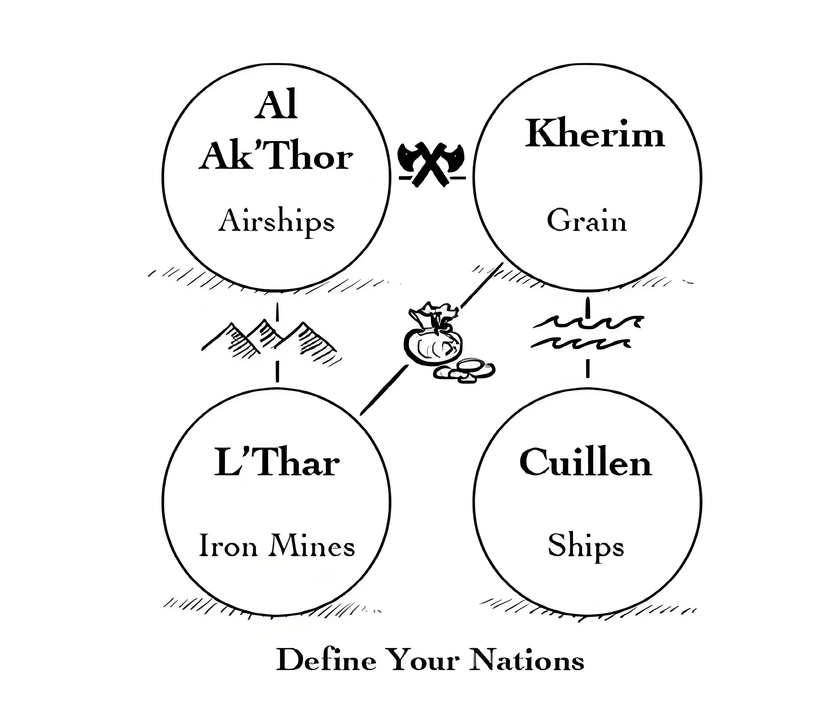
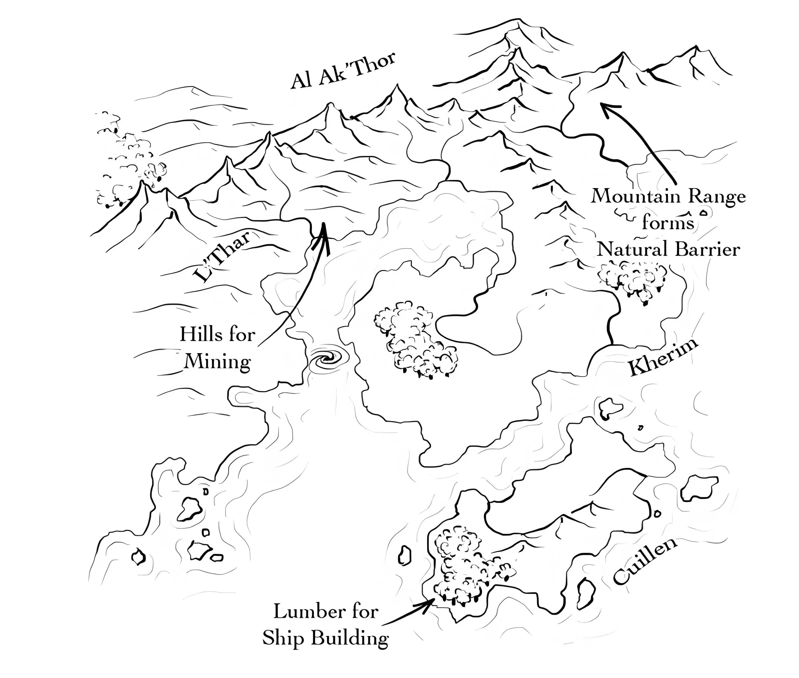
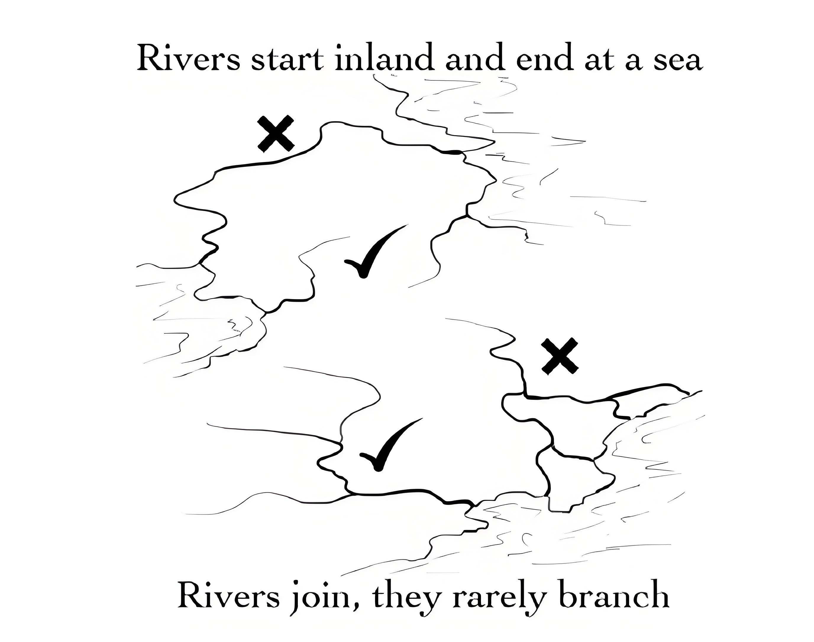
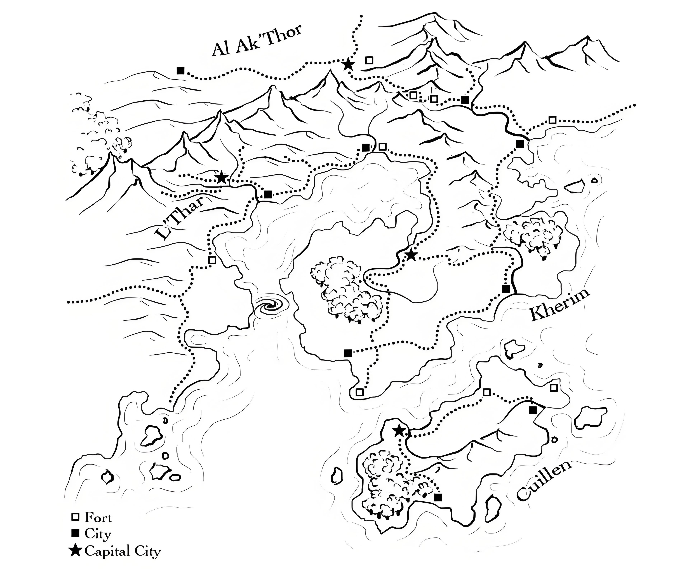

## 介绍“养世界”里捉迷藏

**作者：Ken Scholes**

我和你们中的很多人一样，很久以来一直都在各种新世界中游历，希望能找点有价值的地产投资。我护照上的戳儿真是多到数也数不清。

我和约翰与德亚一起去过巴松*（Barsoom）世界，又在安普托（Amptor）追随卡松的脚步。我曾随比尔博、佛罗多一行在中土（MiddleEarth）愉悦地久久漫步；后来我还去了趟阿拉基斯（Arrakis），看保罗的香料开采进展如何。去海波里亚（Hyborea）时，我在阿尔姆利克（Almuric）稍作停留，那一次分别见了科南和以扫。最后，我在灰鹰（Greyhawk）的霍姆雷特惹上麻烦，被巨蛙啃掉两根指头！而后又漫游在被遗忘的国度（Forgotten Real ms）的博得之门，并在那里度过很多时光。

我是诸世界的行者。

我必须四处漫游，因为我所在的世界并不完美。所以呢，像有的孩子有“养父母”一样，其它这许多世界就成为我的“养世界”。我可以自己看书，和朋友们游戏，在这些世界里捉迷藏。我知道我并不孤独。记得提姆•鲍乐斯（Tim Powers）对我的“未来作者工作坊”说过：“如果我们在现实世界觉得惬意舒服，恐怕也不会写这些东西。”这番话我是深有体会，我猜可能也适用于其他人。有时候，在其他世界捉迷藏也不再满足我。我期望能加入诸神的行列，创造自己的世界。和很多人一样，我也是这样开始的——《龙与地下城》套装、一叠草稿纸、以及一个塞满了我游历过的世界的大脑。后来TSR*列出了一些世界，建议大家可以参考它们寻找灵感，设计冒险。这件事真是有益无害，它为我打开了一扇崭新的大门，我看见更多创世者的作品，这一切都令我的创造欲不断升温。

又过了一阵子，单纯的阅读已经无法满足我。我开始写作，终于，我在《以撒赞歌》（The Psalms of Isaak）系列里创造了冠名之地（Named Lands）。这是我第一次冒险进入疯狂的史诗奇幻世界。

你手上正拿着这本叫作《狗头人之世界创建指南》的小书。要是当年那段美好而疯狂的旅程开始时，我也有这本书就好了！当然啦，多亏嘉娜（Janna）热情邀请，让我为这本书作序，因此我也能作为参与者得到一本成品，下次做世界设计可以方便地拿来参考。

没错，它会带来不少方便。

这本书集合了很多不错的工具，无论你是游戏主持人还是作者，都能从中获得助益。看了乔纳森•罗伯斯（Jonathan Roberts）短小精湛的《这里有龙》，你会学到怎样简单有效地为世界设计地图，并规划其中细节。沃尔夫冈•鲍尔（Wolfgang Baur）的《构建万神殿》和《什么是世界设定设计？》也很棒。他分享了创造神与宗教的思路，还说了怎样既能安排潜在冲突，带玩家（或读者）深入故事，又不至于因细节太过繁杂，限制合作空间，而对游戏主持人（或作者）起到反效果。

结束现在这个世界的旅行之后，我还要创造其它世界，眼下我已经开始边看书边做笔记。所以，要为你介绍这本书，对我来说再容易不过。无论你在创造什么样的世界，这本书都会是你旅途上的好伙伴。

书里的文章都来自各擅其技的能工巧匠，它们是一套无所不包的工具，能满足你的所有需要，帮你“创造足以促生感情联结的世界”——这句话来自蒙特•库克（Monte Cook）的文章《世界创建的不同类型》。接下来，他说：“毕竟，谁想拯救一个没人关心的世界？”

所以，带上这些工具，去创造更多我们可以用来捉迷藏的“养世界”吧。用心搭建，然后带我们去往你的世界。给我们的护照加戳，让我们徜徉其间，留连忘返。

## 什么是世界设定设计

**作者：Wolfgang Baur**

我的第一份关于游戏设计的薪酬来自我的朋友吉姆，那是很久以前的事情了。他想给大家带一个龙与地下城的团\*，但既不想自己写设定，又不乐意买现成的模组。于是他给了我大概2美元，而我尽我所能给他写了个设定。 那一年，我12岁。

我真希望自己还留着我的第一份角色扮演游戏委托设计工作的底稿。我还记得吉姆特别喜欢我画的男爵还是公爵领地的地图，我在那地图里面还用不同颜色的铅笔画出了城堡、森林、湖泊......他对文字的感觉平平，在大部分区域只用了一句话，或者两句来描述------可对我来说这已经很不错了，毕竟我要一个字母一个字母地把它们写下来。整个设定大概有10到20页的篇幅，吉姆对此有点儿失望，但当我给他展示了我写的区域随机怪物遭遇表后，他显得高兴多了。

那是个成功的世界设定吗？只有吉姆对此有发言权。但我认为游戏所需的大部分元素在其中都有体现，尽管它们看上去相当苍白：地点、人物和冲突。

这件事已经过去很多年了，而不论是在整体设计还是局部细节方面，我在之后所进行的构建世界的工作中都融入了更多的想法，从暗物质（Dark\*Matter）到葛拉利昂（Golarion），再到米德加德（Midgard）设定。

如果今天你再问我同样的问题，我会说设计世界设定的目的是"为幻想游戏描绘背景或规划设定，使之能够提供给玩家和游戏主持人丰富而非无限制的选择。此外，一个成功的设定应该能为其中的英雄和坏蛋提供充足的动机并制造足够的冲突，以让玩家们乐在其中。"这些元素能帮助游戏主持人更容易地搭建冒险，构想幕后黑手，并且在玩家人物脱离或改变原先设定好的路线时，能够更从容地掌控事态发展，以配合玩家的节奏。

听起来有点拗口，是吧。下面咱们来详细说说，设计一个世界设定到底需要什么。

### 背景和炸药桶

设计一个战役设定的整个过程，常常被称为"世界构建"，但这其中存在着一个陷阱。"世界构建"意味着像写百科全书一样巨细靡遗，而这恰恰是错误的。这反而印证了M•约翰•哈里森（M. John Harr ison）著名的反奇幻论调：宅人的执念\*（clomping foot of nerdism）。

玩家们的本能就是要去了解游戏世界中的一切事物。而一名世界设计者则仅需为他们提供与核心相关的内容，以及当下最为有用的信息。除此以外，别无其它。百科全书式的做法对长线销售来说也许不错，你可以持续地出版，再出版，出上二十年。说实话，在这种情况下（这种级别的"服务读者"）能够乐在其中的估计也只有设 计者本人。

但屈从于这种本能无疑是有害的，它意味着你要消耗大笔的金币，去提供大量无用的数据。它带来的结果是"全知"，但这种"全知"却会成为游戏主持人的噩梦。如果一切都已被定义（从某种意义上来讲），这就意味着在这个设定中已经没有空间让游戏主持人加入自己的内容。如果一切都已经被书写，主持人就不得不记住海量的信息，以防玩家们"不小心"走到某个地方。于是世上便再无未知，亦无谋略生存的空间。

设计者越是提供更多的细节以倾力描述一个地区，他人就越难顺畅地进行游戏，亦更没有信心运用这些素材。这就是为什么长冒险总是会迎来它们的"大灾变"------把一切毁掉然后重新开始。这是一种让世界重新变得未知与开放，以便迎接新玩家进入的方法------即使明知这样做会让那些花费了大量时间、精力和金钱好不容易横扫老版本的玩家们出离愤怒。

是的，我们的目的不是进行一次百科全书式的世界构筑。作为一个优秀的世界设定设计者，我们的目标应该是将尽可能多的"炸药桶"摞在一起，然后小心翼翼地将它们交给游戏主持人，让他乐不可支地去摆弄所有的这些你所准备的贴心礼物------工具、引子、冲突和危险，哪怕纯粹只是为了恶搞。

### 冲突和推动力

战役设定就是要鼓动游戏主持人和玩家们，与他们共谋去携手创造无数妙趣横生的故事。

气候图和商贸路线对世界构建来讲的确有用，但是对玩家而言这些东西基本上是不可见的。所以，战役设定不应该立足于这些内容之上。

那么，什么才是最佳的推动力呢？回顾历史上导致人类相互争斗的原因：爱情、战争、革命、谋杀、背叛、贪婪、偷窃、强奸、压迫、宗教、民族自豪感、奴役以及对力量的渴求。所有的这些元素在现实生活中都不是一项好消遣（恰恰相反），但在虚拟世界中，它们会成为帮助你塑造那些你所希望刻画的角色与社会的工具箱中的有力工具。我们都希望生活在宁静的夏尔\*，希望拥有像霍比屯中那样快乐、友好以及爱好和平的邻居。但是作为游戏设计者，你的本能反应则应是让玩家相信这个美丽的地方值得去守护------就在兽人入侵这里，并且 烧毁一切之前。

善与恶并非最佳或唯一的冲突来源：想想看，你有无数种组合去制造这种对立，像是贵族与农民，恶龙与公主，商人与海盗亦或是法师与牧师。在你的世界中，你可以让这种对立关系变得更加激化：比如明确表示某些国家和君主极度推崇征服、统治或是暗杀对手的行为------于是，他们的臣民因此变得惶恐不安且好斗。不论玩家角色们是作为外来者去对抗这个充满偏执狂的超级帝国，还是作为被指派到边界去剿灭反抗势力的帝国的贵族或佣兵，你的世界设定都会迅速抓住他们的眼球。

如果你的玩家认为造成这种社会结构的根源在于帝国与反抗军之间的冲突，那么一定要强化这种印象。这种戏剧性的动态发展本身也是设计的一个部分，它有助于让游戏主持人与玩家的目标保持一致，让整个冒险变得合情合理，并最终由此塑造这个世界（一方或另一方 获得胜利）。

设置一条导火索，游戏主持人和玩家们会争先恐后 地来寻找它。

### 所以为什么要写历史？

专注于此时，让我们回到冲突这个话题上。就好像一部戏剧或电影的布景设计师一样，游戏主持人和玩家们不会过多地关注有关历史、创世以及某个特定区域故事的部分（除非是此刻需要呈现出来的元素），所以游戏设计者也不需要去操心历史，除非这些事件会对现在 产生影响。

这是游戏设计者会反复落入的一个经典陷阱------"一万年前"听起来就像一部史诗的开头，没错，但是对于大多数玩家角色而言，他们只会觉得这与自己无关。玩家不关心一万年前发生过什么，除非这个"什么"现在跑过来要"吃"了他们。所以，请保证你所提到的每一段历史中，一定有某些元素会与眼前的危机或冲突相 关。

为什么大家很难做到遵循上面的原则并着眼当下 呢？这多少要怪J.R.R托尔金\*------除了带给我们两部足以重新定义"奇幻"这个词的巨著外，他还塞给我们大量的能够回溯到创世时期的背景故事。精灵们的早期历史是那么地引人入胜，还有维林诺的双圣树，贝伦和露西安，以及所有的发生在我们所知的故事之前的那些事情。结果玩家和游戏设计者决定，既然这些故事读起来是那么的有趣，为游戏世界创作与之相似的历史也应该 是件很有趣的事情。

这真是大错特错。

小说读者当然希望自己所喜爱的角色的冒险故事能够一直继续下去，然后是前传，然后是同人本；书中的世界变得越发丰富与吸引人，作者与读者则皆大欢喜。但游戏不是小说，当我们花费太多的时间去撰写历史与前序，并理清其中的逻辑关系时，我们对玩家角色的关注度就会降低。在这些工作上花费过多精力，会导致游戏主持人无法专注于他的本职工作------导演和演员。或许你也注意到了，托尔金教授原本并没有计划将《精灵宝钻》和他的其它笔记整理出版。

创世者的工作是设计各式的挑战，并将它们呈现在英雄面前------把时间花费在完善那些已经不存在于游戏世界中的社会、非玩家角色（NPC）和地点的信息，完全是一种浪费。了解过去与现在之间的联系，对于花费了大量精力的你来讲也许是一种奖励，可能还会带来很多乐趣。但作为一个令人印象深刻、成功的游戏世界设计作品的一部分，它并没有为游戏桌旁的玩家带来任何游戏体验。他们不知道这世界背后惊心动魄的历史，他们不关心其中千丝万缕的联系，甚至在他们的史诗冒险中，几乎不需要或不会想到去了解哪怕一丁点儿这方面 的信息。

<u>**辩解：把历史作为个人兴趣**</u>

<u>我时常听到这样一种论调：历史能够帮助设计者更好地理解他（或她）所创造的世界，而当有其他设计者试图去构思那些玩家永远不会知道的惊天大阴谋时，这些历史能为他们带来更多乐趣。如果你有足够的时间和兴趣去创造更多的内容，并且你的主要读者就是你自己的话，那么这种做法没有任何错误可言。我创造这些形形色色的人物就是为了自娱自乐，我知道这么做没什么实际意义，但那又如何？------我就喜欢。</u>

<u>我最担心的事情是，撰写这些背景素材的工作犹如游戏中疯长的野葛\*一般，让人无暇顾及那些真正有价值的工作，比如我们该怎样去创造有趣的角色和冲突事件。你看，既然奇幻世界中的反派能够以某些方式获得远古的力量，或者它本来就是从上古时代幸存下来的生物，那么怎么也值得去了解一下他们的起源吧。但要是这来自上古时代的恐怖对现世没什么影响力，作为一名世界构建师，你就有足够的理由把这部分从你辛辛苦苦写出来的原稿中砍掉，更不会让玩家受此折磨......当然了，除非那些法师或是吟游诗人把技能点都投在那些偏门冷僻的学识和知识上。那样的话，他们就终于有机会用上那份你纠结了好几个晚上的族谱------它们就贴在失落帝国的宫廷礼仪手册旁边------并沿着系谱图上溯回八百年前了！</u>

<u>由着你的兴趣去编写这些背景资料吧，但不要忘记这些辅助背景就像托尔金的书后附录一样：它们是很有趣，但它们既不是你的主要创作目的，亦不属于你最终呈献给公众或是玩家们的作品的一部分。我们很容易沉迷于撰写某个设定的历史的工作中长达数周甚至数年不能自拔，但却从来不曾思考过是什么使一个设定能够引人入胜并使它如此独特，就如同一个真实的，玩家们实实在在生活在其中的世界。</u>

<u>不要失去重点。</u>

我得说，设计一个令人信服的设定只需要极少量的背景历史。关于帝国衰落的过程和原因，或是众神仅凭兴致而重塑世界的事情，只需要寥寥几笔便可以带过。像第二类的背景故事，因为它能使设计者更好地理解某个秘密结社的起源或是两个种族争斗至今的原因，从而对设计者撰写此设定中的冒险或故事大有帮助。可冲突产生的原因往往很简单，它极少需要设计者去构思一个完整的、与背景相符的小说，也无须绘制相关战争之间的关系图，亦或是分析一场政变的来龙去脉。作为游戏玩家，我们落入了一个"过度解释秘密起源"的陷阱。

但是玩家需要的所有信息几乎都能归在"当前事件"类中。秘密结社当前的目标------这才是重点。这个神秘社团在一千年前由一个才华横溢的邪恶巫师建立，后来他们的领袖被不灭辉光骑士团的圣骑士放逐了？谁关心这个。但要是将历史与现在之间产生联系，那就是另外一种情况了：组织的目标就是复活他们的创始人。但你要标注上：这是一个当前事件。坚持这个原则，你的设定会让玩家觉得更为丰富，并且更加真实与鲜活。为什么？因为你把注意力放在设定中更为重要的部分上了------玩家角色能够接触到的部分。有时候，他们也会经历或关心那些从上古延续至今的事件------比如说远古邪恶巫师的复活。而这些事件理应成为冒险中戏剧性的高潮时刻，并造就过去与现实的冲突。你的重点要放在如何去设计这些NPC以及当下环境中将要发生的遭遇上，并专注于构思那些反派角色当下的动机与行事方法。

顺便一提，这也是我们反对过分强调古代的原因，这同样也解释了为什么大部分玩家痛恨冗长的朗读描述文本（他们当然有权这么做）。我想把解答此问题的机会留给感兴趣的读者，权当是一次课后练习。

### 忽略机制

我认为一切世界设定都应该尽可能地独立于那些进 行游戏的固有机制。

为了证明我不是在胡扯，让我们来看看被遗忘国度（它曾先后由四种\*不同的游戏机制和算法支撑其设定）和星球大战（尽管我有段时间没关注了，但我最近一次跟进的时候，发现它也拥有了四种不同机制，还是由三个不同的公司出品），以及我自己的暗物质（也曾有两种机制）这些例子。我们可以用"铁打的设定，流水的机制"来形容角色扮演游戏的设定。它们必须做出正确的决定，而这可不是把数值加加减减这么简单，这关乎整个冒险故事的存亡。所以当你设计一个模组时，可别把时间花在构思遭遇、设置障碍、安排怪物或是捣鼓数据平衡这些问题上。设计世界设定不太需要去关注机制，但这项工作仍旧没那么简单。

在战役设定中，我们的目标是鼓励游戏主持人向一群玩家发起挑战，同时也鼓励玩家们去探索和改变这个世界。这两者都不需要过分依赖机制------我承认经验值系统对于大多数玩家来说是一个很重要的激励机制。虽然只要玩家能够以某种方式推进冒险进行，这种探索行为就能够获得奖励；但我们同样需要创造出可供探险的地点，值得去体验的风土人情还有头脑简单，外强中干的坏蛋。你需要具备一种地方感（在我们的另一本书《狗头人之游戏设计完全指南》中的"冒险设计"部分有更 详细的解释与说明）。

假如你能在几句简单的描述中就勾勒出这种"地方感"，并且由此能够发展出长达数月甚至数年的冒险，那么你就创作出了一部成功的世界设定。如果你的设计并没有打动那些热血玩家，呃，再接再厉。要知道众口难调，不是每一部世界设定都能做到人人为之疯狂。

### 结语

世界设计这项工作，看上去似乎让你有机会徜徉在无尽的时间长河中，写下波澜壮阔的史诗以及探索无限的可能性。没有哪个深度爱好者和游戏主持人能够抗拒它所带来的吸引力。做着有关另一个世界的白日梦，这件事本身就是一个充满诱惑的奖励。但要设计一个专业的，为大众所接受的世界设定，你需要仔细地考量空间与时间，挑选各种可用的素材，使其中的每个角色、地点与机制都发挥尽可能大的作用。我们将在"厨房水槽式设计"\*的随笔中讨论更多的细节，并且告诉你一些设计世界设定中最为重要的选择。

## 世界创建的不同类型

**作者：Monte Cook**

世界创建是许多作家、游戏设计师和游戏主持人都会谈到的话题，但其实他们所讲的内容多少有些差异。更准确地说，尽管他们谈论的是同一件事，他们的方法 和目的却不尽相同。

### 世界创建之于作家

作家，特别是奇幻和科幻作家，将世界创建作为给他们的故事增光添彩的舞台布景，但其全部的作用也仅限于布景而已。尽管他们或许能够创造出一个充实的、鲜活的、富有生机的世界，最终落在纸面上的内容却仅仅是为了让读者能够理解并欣赏这个故事。（当然，作家本身也要有一定的实力。）在某种程度上，如果作家所创造的世界不能专注于服务其故事本身，那么对作家而言世界创建这一举动就是多余的。尽管能够从中获得乐趣，也许还会有些回报，比如让他们对故事中的地点和世界的规模有更切实的感受，但这仍然是有点儿多余 的。

创建一个围绕单一故事而展开的世界，对世界中发生的其它故事只做简短的概述才是上策，即便是对那些专注于世界构建的作者而言也是如此。举例来说，第三纪元的中土世界之于《指环王》就是这样的情况。而通过书的附录、《精灵宝钻》和其他作品，我们不难发现其作者创造了一个非常庞大的世界，而小说中仅仅描绘了其中很少的部分。我们所能看到的世界设定就只有围绕着主角们的那一部分，也就是他们所能看到的部分。

### 世界创建之于游戏

当你从一个游戏设计师的角度去审视世界创建时，情况就非常、非常的不同了。一个游戏设计师不能只为一个故事而去构建世界，他们的世界要为成千上万的故事提供发酵平台。为一款角色扮演游戏所创作的设定不但要足够庞大，而且要包含足够多的事件。如果一个奇幻游戏的游戏主持人想要在冒险中安排一个邪恶法师作为玩家的敌人，那么游戏设计师就需要设计不止一个这样的邪恶法师以便他们挑选。有的主持人可能需要各种类型的海盗，有的主持人可能需要一个藏匿着恐龙的丛林，还有的主持人甚至会想同时用到上面提到的三者。每一个这样的内容都要不止一个------从能带来有趣小麻烦的小角色，到一些重大的、甚至会影响整个世界的危 机都得齐备才行。

让我们再用中土世界来举个例吧，对于一款角色扮演游戏而言，中土世界并不需要魔王索隆，它需要五六个这样的角色，位于不同的地区，有着各自的动机和目的。还需要一群试图复活莫高斯的邪教徒、二十来只尸罗，我都说不准多少个萨鲁曼才算足够。还得再来一打小军阀、海盗头子、兽人部落、巨魔强盗外加许多的龙。（这么说显然有点夸张了，不过我相信你明白我的意思。）当然，并不是说任何战役中都必须要用到这些角色。而这恰恰是为什么必须得这么做的理由。游戏主持人需要给玩家们足够多的选项，而玩家自己也需要许多可能性以供他们选择。这个世界要足够广阔、足够有活力。

此外，相较于作家笔下的世界，游戏设计师的世界也需要更多的细节。当作家在作品中提及荒芜沙漠中被废弃的卡玛什城的时候，他可能只是想要给世界加些调味剂，但是游戏设计师就必须要描绘出那里究竟有些什么。作家知道，他笔下的角色永远不会去卡玛什，这个名字只是某个角色背景故事的一部分而已。但是在角色扮演游戏中，玩家的角色就很有可能会去到那里，而且他们会想知道他们能够在那里找到什么。游戏主持人需要细节，实在的内容、具体的地图，等等这些，而且是 立刻就要。

我正在为我的新游戏《遗器纪元》（\<Numenera\>）进行一个叫做第九世界的设定项目。我在设定这个世界的时候，带着两个目的：我想为读者呈现一连串出色的设定细节和冒险点子，但我同样想要让游戏主持人切实地感受到支撑这个世界的风格和概念，以帮助他们创造属于自己的细节内容。算是有点儿"授之以鱼，不如授 之以渔"的思路。

当然，这又是另一种创建世界的方式了。我会提供许多细节，但同时我也会告诉游戏主持人们什么内容是他们可以自由发挥的，将创造的权杖交予他们，由他们加入属于自己的细节。我还会告知读者什么样的内容适合这个设定，又或者告诉他们不同的材料会对设定带来怎样的暗示。这些内容可以帮助每位游戏主持人去塑造他们自己的第九世界，创造出比任何世界都棒的世界（真的不是双关语，真的）。

### 世界创建与游戏主持人

游戏主持人的情况则介于以上两种类型之间。由单一故事构成的游戏，就像只能在铁轨上行进的火车一样，玩家没有任何选择的可能。而最理想的状况是，自己构建世界的游戏主持人会谋划不止一个故事，好让玩家决定他们的角色在世界中的行动，拥有真正的选择权。但是游戏主持人不需要像游戏设计师那样去满足那么多的可能性，因为他所面对的就只有自己的玩家而已。按道理说，游戏主持人了解他的玩家，也了解他们的兴趣所在，比如玩家们对海盗毫无兴趣，但是却特别喜欢扫荡亡灵 领主和他的僵尸大军。

游戏主持人还可以在游戏进行的过程中进行世界创建，他只需要把玩家们当下所需要的设定信息告诉他们就可以了------就像作家只需要把故事所需的细节丰富起来一样。假设玩家角色现在处于A王国的一个小村中，他们无须了解这个王国中贵族之间权力斗争的细节，就更不用谈有关B王国和C王国的事情了。游戏主持人有充足的时间去逐一增添这些细节，他并不需要预先构建 好整个世界。

当然，这可能会让情况看起来有那么点儿像在变戏法。游戏主持人总是至少领先玩家一步，因此，在手边预备好那么一批能在需要时派上用场的场景和设定会很有帮助。举例来说，玩家角色乘船驶向一个新的冒险区域，可游戏主持人还没有完全准备好，于是他便安排玩家角色航行中途停靠在一个神秘的小岛上------然后把之前在别处用过的旧模组插入战役之中，比方说，《恐怖岛》（\<Isle ofDread\>）什么的，倒不是真的特地要去玩这个模组，这是为了有时间准备接下来的设定工作。

又或许，玩家角色正要穿越边境进入一个他们只是曾经听说过的新国家。悲剧的是，游戏主持人对该国也是一无所知，而一天半之后就要继续跑这个团（没时间做太多设定了）。于是他搬出史蒂芬•艾瑞克森（Stev enErikson）的书（《玛拉赞英灵录（\<Mazalan the Fallen\>）》系列作品），改了改其中七大城邦的名字，将这一区域嵌入到游戏里。可以说，只有作为一名游戏主持人才能享有将他人的世界融入到自己的世界之中这一难 得的机会。

这绝对不是作弊，这只是一名游戏主持人应该做的。

即时世界创建的一项巨大优势，乃是它赋予战役的应变能力。要是主持人把所有内容都预先创作好，然后就这么在玩家面前一股脑地抖搂出来的话，这游戏就太僵化了。假设在那之后游戏主持人又想在世界中加入一个有着飞行山脉和龙骑士的魔法国度，却没有事先设计过，那可就不妙了。但如果他的世界构建随着战役的进程而推进，那么他就可以将之置于任何他需要的位置，更重要的是，战役剧情需要的位置。

### 玩家与世界创建

也许，仅仅是也许，还有另外一种创建世界的方法： 合作。

玩家可以协助游戏主持人创建世界，考虑下这个想法吧。例如，游戏主持人预先安排每一名玩家角色都出生于不同的国家、大陆或是地区。然后，每名玩家要负责创建的不仅仅是自己的角色，还有角色的诞生地。玩家会设计出统治者、聚落和地理风貌等内容。同时，这还可能关系到玩家角色的种族特性等等。主持人收集玩家的"意见书"并将之汇总后，融合进他构建的世界当中。

有些游戏主持人会希望能对玩家的创作做修改，以便将这些内容更好地整合到游戏的大设定中去。有些主持人则会与玩家一同创作，以保证他们所设计的家园内容能够拥有良好的粘结性，能为当前的战役设定所用。

当然，一旦这些地点设定被交到了主持人手里之后，需要被修改的就是他自己的世界设定了。他不该试图否定由玩家所创作的内容，而是应该将它们充分利用。这一点非常重要，因为这样的做法就是为了让每一名玩家角色都熟知自己故土的设定。如果游戏主持人将设定内容推翻，那么玩家们就不再熟悉那些背景知识了。不过，主持人仍旧可以利用其中的素材并制造许多惊喜。

比如，一名玩家为她的精灵角色创建了一片荒芜之地作为故乡。在她的创作中，这里曾是一个树木繁茂的美丽国度，但黑暗神祇的邪恶祭司们摧毁了这里的植被，并且几乎灭绝了那里的精灵。虽然角色的祖先们很久以前就将祭司们驱逐出去，但这片土地依然是一片荒漠。玩家提及了这片土地上许多重要精灵的名字，她的角色还与其中一位有着亲属关系------幸存的精灵女王是她的 姑母。

在战役开始进行之后的某些时刻，玩家角色或许会需要她的姑母------荒地精灵的女王的帮助。她引领她的朋友们（其他玩家角色）前往她的先祖之地，她对此地的情况非常熟悉------她了解那条现今仍未能净化的河流包含的危险，在哪里有猎物可寻，她甚至知道，要想穿越丛山进入女王所在的隐秘地点，就必须贿赂那些巨魔 守卫。这些内容都很棒。

但是游戏主持人决定，那些邪恶祭司们并没有被真正地歼灭。他们的间谍仍活跃在这片土地之上，并用致幻药控制了女王，使女王成为他们的奴隶。当玩家角色们到达这里时，那名熟知此地风土人情的精灵角色就会感到似乎有什么东西不对劲。现在，玩家对于这个国度的记忆就转变成了一个冒险引子。女王出了什么事？当玩家角色们发现她被下了药，他们就需要找到犯案的凶 手及其动机。

通过这个例子，我想告诉各位一个重要的道理：允许玩家创作那片荒地并不意味着剥夺了游戏主持人的权力。正相反，这样不但为他节约了许多工作，还给予他一些新的冒险契机，并能够让这名扮演精灵的玩家更好地融入在整个冒险战役之中。当她感到有什么不对的时候，她会真的开始担心起来。当她了解到女王身上发生了什么事、以及那些（由她自己创造的）邪恶祭司仍然在兴风作浪的时候，这一切对她而言，将远比由主持人自己设计出来的内容要更加意义非凡。

也许，这是世界创建中最重要的部分------去创造一个能够与之产生情感羁绊的地方，无论是谁创造都不重要。毕竟，谁要去拯救一个无人关心的世界呢？

## 由小及大与由大及小

**作者：Chris Pramas**

构建一个架空世界有很多种方法。如果你像J.R.R.托尔金一样有着超乎寻常的语言天分，你可以从创造几门新语言开始，而后创造一个世界使这些语言在其中生根发芽；如果你是一名艺术家，你可以从你所想创造的世界的外观和感觉开始。我是学历史的，所以我一般会从这样的角度来看问题：我不仅仅满足于知道某个地点现在的样子，还想去探究它是如何演变成现在这样的。在我从事游戏设计工作二十年来的职业生涯中，我一般采用两种方法去架构世界：有时，我会先设计一个地点，然后将它不断地延伸拓展，直到整个世界跃然纸上------这是一种由小及大的方式；而有时我会选择勾勒出一副庞大但模糊的轮廓，而后专注于某些地区，不断去丰富、增添它们的细节------这是一种由大及小的方式。在这篇文章中，我将会介绍这两种方法的具体过程，并分析它们各自的优缺点。但请牢记，从来没有什么"标准答案"。

### 由小及大

在两种方式中，"由小及大"更实用些，因为你所构建的往往是你需要的。它特别适用于角色扮演游戏的战役设定设计。当然，如果你打算撰写小说或是剧本，也同样可以使用这种方式。先决定你的故事要从哪里开始，然后设计出发生故事的所在地与周边地区。小到一座被人遗忘的村庄，大到一个繁荣的城邦，都可以作为你的起始点。希望这时你的脑海里已经构思好了一两个故事点子，这样你就能大概了解，为了实现它们，你还需要什么。这段故事中的主角是谁？他们希望得到什么？造成冲突的根源是什么？当你大致对这些问题有了答案后，你就可以继续为其增添细节。这片土地上的文化是什么样子的？人们有宗教信仰吗？如果有，是以一种什么样的形式出现的？你希望引入怎样的配角来丰富故事，设计怎样的情节与插曲让故事变得更加精彩？这里有什么样的秘密等待着重见天日？当你开始叙述或撰写你的故事，就会出现更多需要补充的细节，你可以随着故事的进行一点点将它们填补完整。而你的设定也会有序地 不断发展完善。

上面介绍的这个过程就是我在创造"自由港"时所应用的方法之一。它是一本由单独模组发展而来的设定集：《自由港的死神》（\<Death in Freeport\>,2000）。自从威世智公司在第三版龙与地下城中倡导"重回地城"开始，我就知道我一定要写一个城市冒险。同时我还意识到我想要一个世界各地的角色都有可能在此相遇的地点，所以我设计了一个港口，而且离此不远就是海盗们的避风港。我认为这个模组应该以调查为主，这使我想 到了克苏鲁的召唤（Callof Cthulhu），于是便有了一个 神秘的教派------黄印兄弟会（The Brotherhoodof the Yell ow Sign）和其他"洛夫克拉夫特式"\*的情节。在这个模组的最后，我为这个城市以及需要在情节中出现的地点编写了4页的历史------虽然算不上长。这本32页的模组创造了一个名叫自由港的城市------一个融合了经典"龙与地下城"风格、"洛夫克拉夫特式"恐怖与海盗设定 的城市。

《自由港的死神》很受欢迎，而且它的确给Green Ronin出版公司带来了不少名声。我们在之后的产品中对自由港进行了进一步的拓展。首先，我们增添了两本模组使其成为一个讲述完整故事的三部曲。这些冒险揭示了城市中更多的地点与更多个性鲜明、各怀心思的角色。第三本模组------《自由港的疯狂》（\<Madness in Freeport\>）中详细介绍了城市的官方势力与统治阶级，并且增加了更多关于远古蛇人帝国及其后裔的情节。这个系列结束后，我们出版了一本详实的扩展书------《自由港：冒险之城》（\<Freeport: The City of Adventure\>, 2002）。

"自由港"这个概念最初只是一个泛用城市，你可以将它用在任何奇幻战役设定中。诸神没有被命名，只是以知识之神、战争之神等等指代。故事中有提到过"大 陆（theContinent）"的存在，但也仅止于一笔带过。对于很多游戏主持人来说这是一个好处，这让他们能把自由港用在各种不同的战役设定里。有些公司甚至把自由港放进他们自己的世界------总是有人想要一个拥有自由港的世界。当我们撰写关于这个城市的一本修订扩展书------《自由港海盗指南》（\<The Pirate's Guide to Freeport\>,2007）的时候，我决定增加一个可选章节来介绍城市之外的世界和"大陆"的更多情况。这时我是怎么做 的呢？由大及小！

### 由大及小

我接触的第一本RPG战役设定集是初版的《灰鹰世 界》（\<World ofGreyhawk\>）对开本。那大概是在1981年，我刚满12岁。对开本里包括一本32页的地理志和一幅由 达琳•佩库（DarlenePekul）绘制的精美设定地图。（顺便一提，不要低估这些地图的重要性，华丽的地图有助于吸引玩家进入你的世界。在乔纳森•罗伯斯的文章《这里有龙》中有更多讨论。）以现在的标准来说，灰鹰世界缺乏细节，但它衍生出了成百上千的战役设定。在与灰鹰粉丝们接触几年后，我发现他们大多数人都喜欢没有过多详细描述的设定。这样的设定提供了一个框架，让他们可以以此为基础，根据自己的需要进行各种调整。

灰鹰世界有趣的地方在于，它诞生于一个很小的地 方------加里•吉盖克斯（GaryGygax）\*自己主持的龙与 地下城战役。本来它仅仅是指灰鹰城堡的地下城和与其毗邻的城市。随着加里的战役不断发展，他一步步为世界填入更多的细节描述，但从没想过要出版它们。他认为每个游戏主持人都会想创造一个自己独有的世界设定。不过，正如早期的一系列模组所证明的，这确实是个能够盈利的事业，最终灰鹰世界还是出版了。加里不想让他的玩家知道太多关于世界的秘密，于是他在原来的版本上做了很大的改动，比如绘制了一幅全新的地图，并且加入了很多全新的元素。他呈现在对开本（和之后于 1983年出版的套装）里的是一份拥有众多潜在可能性的世界大纲。这些内容有些在之后的产品中变为现实，其它的则出现在众多采用灰鹰世界设定的自定战役中。

在灰鹰世界的诸多书和套装中，你能发现很多应用由大及小原则的设计。书中涉及的区域很广大，事实上，甚至超过了地图所绘制的范围！它们所描述的法兰尼斯 地区（TheFlanaess）不过是一片被称为奥瑞克（Oerik）的异常广袤的超级大陆的一小部分。设定集中对各个国家的描述也只是点到为止。套装中有一个章节用来描述神祇、世界观和历史。加里在其中通过讲述人类的迁徙、远古战争以及天启事件，为当下的灰鹰世界搭建起舞台。除此以外，设定中还留下了大量未解之谜，为未来的发展留下拓展空间，或仅仅是为游戏主持人们的冒险故事 提供灵感。

由大及小的设计使你能够将眼界放得更广。2000年代初的时候，我供职于威世智龙与地下城的《链甲》（\<Chainmail\>）战棋游戏组，那时我曾经有过这样放宽眼界的机会，当然是在灰鹰世界中。我想把游戏背景放在灰鹰中，因为似乎灰鹰本身就是第三版龙与地下城规则的默认设定，但我所在的小组没有权利使用法兰尼斯中的国家。于是我们转而决定细化超级大陆奥瑞克的东部地区------这个地区在已经出版的资料中很少被提及。这片区域就是著名的《破碎帝国设定集》（\<The Sunder ed EmpireSetting\>）。在基础设定上，我们遇到一个大问题：战争之神死时发生了什么？我的想法是：人类英雄们为了永恒的和平而杀死了战争之神斯特拉蒂斯（Stratis），但这个行为却引发了一场浩大的纷争------各路军阀都想要成为新的战争之神。在这样的前提下，我构建了破碎帝国的细节。而在设计各种相互对立的派系与创建世界的许多其他方面，这个前提条件同样为我提供了不少帮 助。

再回过头来聊聊自由港吧，由大及小是我在《自由港海盗指南》中用到的方法。事实上，当我得知只有一个章节的工作量时，我从灰鹰对开本中找到了一些灵感。这个章节着重探究远古蛇人帝国的历史、整本战役设定的世界观（我们将伊格融入世界之中）和大陆的概述。我选择省略对开本中的某些内容，比如各国间特殊的计数方式（这部分是在向龙与地下城战棋游戏致敬）。取而代之的是我为每个国家编写了些条目，列出了重要的地标等等。这些信息就只是些没有附带描述的名字，或者说是一些未解之谜，等待着游戏主持人们去探索。比如说精灵王国罗兰德（Rolland）中的十字冢山脉 （Cairnc rossHill），猎人之月神殿（Shrine of the Hunter's Moon）和扭草树林（WindgrassGrove）。我从没有补充 过这部分的内容，但我打赌某些勤奋的游戏主持人一定已经做过这个工作了。

如果说由大及小的设计方式有什么缺陷的话，就是你会费点时间去解决一些关键问题。你的设定有多大？它的世界观是什么样的，这其中有没有什么深意和主旨？那些设定中的文化和国家是什么样的？不同的人是怎么来到他们今天生活的地方的？历史上出现过什么样的伟人和恶棍？如果你希望在很短的时间内就设计出一个游戏或故事，由大及小的方式也许并不适合你。但是如果你有时间，也有兴趣去做一些提前准备的工作，你会发现将新元素嵌入你已有的框架中要比随着故事发展去扩充世界容易得多。另一个问题是当你陷入大量的框架中时，你可能会遗漏很多细节。没关系，你可以随时聚焦于某个地区来辅助冒险的进行和故事的创意。

### 踏上旅程

至此，我已经介绍了两种架构世界的方式作为选择，但这不见得是一场得此失彼的选择。你可以根据需要把它们融在一起，或者以不同的顺序排列组合，这样也没问题。你也许会花一周的时间去设计一个小村子，而在下一周创造整个神系。重要的是不断推进和拓展你的世界。你甚至可以先用一种方式然后再用另一种方式。我就曾经做过这种尝试，说来也奇怪，同样还是在灰鹰世 界里。

1999年我在威世智进行角色扮演游戏的研究与开发。他们雇我来参与万智牌角色扮演游戏（Magic: The Gathering RPG）的第三次研发尝试（这次应用高级龙与地下城 \*规则的修订版）。当部门间的内耗导致项目无法进行时，我被调入了灰鹰项目组。这促使我与肖恩•雷诺兹（SeanReynolds）一起写出了《奴隶贩子》（\<Slavers\>)模组，一版《奴隶领主》(\<Slavelords\>) 模组的后续，也是我最喜欢的模组。这个模组让我有机会为方案的设计出一份力，将新鲜血液注入灰鹰世界。在美国中西部远程办公 的罗格•摩尔（RogerMoore）也飞到西雅图来参加为期一周的会议，我们小组讨论出了几个点子，而我们则把点子整合在一起，准备用在下一阶段的灰鹰中。

我们当时的想法是灰鹰需要一个新的切入点，一种可以让玩家轻松进入设定的方法。像《灰鹰：冒险开始》 （\<Greyhawk: TheAdventure Begins\>, 1998）这样的书籍广受老玩家的好评。但由于它试图对灰鹰之战的整段历史进行总结，并且概述之后发生的事件，这让新手产生了畏惧感。我们的计划是从一小块区域出发，比如从一座城镇和它周边的地区开始设计一个入门产品，作为引入新战役的铺垫。然后用一系列的产品慢慢进行展开------下一步也许是细化一个行省，然后是一个公国，进而是一个王国，以此类推。最终，我们的目标是将这些内容融汇成一本详细介绍灰鹰世界中某一部分主要设定的大书。当时我们所预想的内容是伟大王国和它周边的一些 国家。

很遗憾，这个计划没有付诸实施。我个人认为这实在是个被错失了的良机，因为那将使不同的玩家团体能够选择以由大及小或是由小及大的方式来融入到灰鹰世界里。我想自由港做到了这点，你可以用原始模组慢慢引导玩家进入，或是直接跳到《自由港海盗指南》这样 的设定书。

我希望我在世界创建上的经验能对各位有所助益。到头来，架构世界最重要的还是：坐下来并且真正着手去做。思考如何去实现你的目标很重要，但不要让过多的分析阻碍创造的脚步。万事开头难。

## 你设计的世界有多逼真？

**作者：Wolfgang Baur**

在奇幻世界和奇幻战役的设计中，如何做到更高的逼真度是一个经常被提及的问题。作为游戏圈子的老话题，逼真度这个词其实是挺不可思议的。因为奇幻的乐趣应该来自于从现实世界逃离并进入一个崭新的、原创的、充满想象力的世界，这个世界不同于你身处的环境，也没有职业、孩子、父母、室友和其它现实的问题。没有人希望在奇幻游戏中想起现实世界的种种不快。

但同时我们也还是希望游戏中的事情能和我们有所联系：角色、英雄，那些根植于神话和传说中我们熟知的典故会让我们更愿意在潜意识里相信这个世界的确存在。我们需要"逼真的奇幻"，这个概念经常让我挠头不已，但同时我想大家也都知道这到底是什么意思。我们希望能够全身心地投入到这个奇幻世界中，但我们又都有情绪和忧虑，也会时不时的遇上那些把我们踢出幻想的糟糕设计。因此，一个玩家能在多大程度上投入到一个奇幻世界中去其实是非常难以确定的。而对于世界的设计者------我们来说，我们的玩家是否愿意全身心地投入我们设计的世界就成了一个考量我们设计成果的重要指标：我们需要设计出那个能让最多的玩家相信并且投入的"仙境"。

在一个奇幻设定中添加魔法、奇迹和各种疯狂的要素是非常重要的。但显然添加也需要注意"度"。当设定中的事情离常识太远的时候，玩家们一定会大叫"太假了"或者"这也太蠢了"。互联网的存在更是加剧了这种趋势。不过我们还是会发现对于不同人群而言，接受度的判定其实有些微妙，像蒸汽坦克一样庞大的巨剑和战斧对于某些人来说是不错的设计，而对于另一些人来说却可能是绝对的异端。精灵如普通人一般常见、空中漂浮的都市和扎堆的巨龙是某些玩家和主持人想要的------这对于另一群玩家来说却是幼稚和愚蠢的代言词，有这类背景的设定会让他们非常厌恶。

上面所提到的这些问题对于世界设计来说意味着什么？它们意味着作为一个世界设计者，你需要考虑许多选项并考虑你的受众，然后再决定你将追随何种常规模式。在这篇文章中，我将从真实幻想这条轴线出发总结这些模式，并且阐述它们对于你自己的世界设定来说意味着什么。

### 构建世界的模式

至少存在两种清楚明确的奇幻世界构建模式：现实世界模式和幻想世界模式。这两种构建方式的拥趸往往泾渭分明，同时对于另一种口味嗤之以鼻。其实奇幻世界构建就如同所有的艺术和开创性的工作一样，受主观判断和个人喜好的影响很大。而另一方面，世界设计者们的作品质量之间也有巨 大的差异。

简单来说，我们可以把这两种模式按照如下方式归结：按照现实世界模式构建的奇幻世界是紧紧参照着现实或是欧洲历史和传说来设计的（如蛮王科南中的海波里亚，或是亚瑟王传奇的某个变种\*，又或者是葛拉利昂中的许多类似于地球的文化设定）；按照幻想世界模式构建的奇幻世界则是纯粹由一个假想的背景或是概念引申而来（如巴松，或是浩劫残阳，又或是魔法船）。还有一些则是在两者之间，不过好吧，让我们带着对世界构建的敬意，假装他们是完全不同的思维方式的产物。但我还是要说，它们不过是在一条轴线上的不同坐标而已，我会在下面告诉你我为什么这么说。

### 从现实历史衍生出的奇幻构建模式：历 史奇幻和映射奇幻

第一类伟大的奇幻世界构建模式将欧洲的神话和传说作为大背景，之后再基于这些元素勾画出世界的轮廓。以比较粗糙的方式进一步细分，这些以欧洲为背景的奇幻世界往往可以被分为两大类：有一些是完全依照历史脉络构筑的奇幻世界，另一些则只能算是现实世界的远亲，不过稍稍深入便会在其中发现现实世界的影子。

#### 历史奇幻

对于历史奇幻设定，我所谈论的是包括乔纳森•推特 （JonathanTweet）的魔法艺术（Ars Magica）、克拉克•艾什顿• 史密斯（Clark AshtonSmith）的亚威隆尼（Averoigne）、查得• 鲍泽（ChadBowser）的不可战胜的克苏鲁（Ct hulhu Invi ctus）、桑迪•彼德森（SandyPeterson）的至高领主（Pe ndragon）、洛夫克拉夫特（Lovecraft）的克苏鲁神话以及与这些设定相关的角色扮演游戏，当然也包括白狼的黑暗世界和斯科特• 本尼（ScottBennie）的圣约（Testament）。这些都是出色的奇幻世界设定，它们都有明确的历史人物和明确的历史时期，但同时，它们虽然基于你所知的现实历史构建，在其中却还是有许多清晰的奇幻构想。

##### 历史奇幻的模式在你的设计或是世界设定中意味着什么？

一方面，这意味着你所使用的一些技术发明、背景故事和人物角色已经在历史上有过记录。而重要的因素则是你希望在这些历史中加入新的故事和魔法等等设定，让历史与真实世界的发展有所不同。或许有魔法师家族隐藏在历史大幕之后，或许亚瑟王的圆桌骑士确实曾去历险追寻圣杯，或许可怕得让人发狂的荒野巨兽确实在中世纪的法国出现过。

你会发现这样的设定能够非常有效地让玩家产生熟悉感，也让这些世界设定能够很容易地被说明，其实好莱坞经常使用这样的模式（这是狂野西部，不过你看，那里有UFO！）。这种模式会让玩家或是读者能够很容易地接受你的设计，同时也会降低你的工作压力，并且让你可参考的背景资料变得丰富------现实世界本身就无奇不有、精彩绝伦。人类的传奇故事和命运轮回是一个不会枯竭的灵感源泉。一个历史上有过的故事，或是将两个看上去没什么关系的历史事件嫁接在一起构成一个全新的设定会更容易地抓住读者的 心。

对于任何一个喜欢历史或是虚构历史的人来说这都是很有乐趣的，同时一个历史奇幻可以像真的历史一样逼真。不过这种风格也有它的局限性。当你从亚瑟王和圆桌骑士开始你的设定后，再要将克苏鲁元素加入就非常困难了（几乎不可能------莫德雷德和女巫摩根绝对是异教徒！）。当你在设定中使用了魔法师和中世纪欧洲元素后，突然引入中国武侠也是非常困难的。这些限制的结果是，虽然历史奇幻可以充满各种奇思妙想，但必须注意不能过线以致读者开始怀疑这 个世界。

因为设定的焦点非常明显，向其他人解释这个世界也变得很容易（这是有魔法背景的十字军东征，或者这是有白莲教信徒的三国），不过这也会限制你的读者群。历史奇幻是一个挺多拥趸的领域，不过对于另外更多人来说，它还是太历史了。角色扮演游戏的设计者大都喜欢克苏鲁的召唤，但如果有人不喜欢洛夫克拉夫特和二十世纪二十年代，这就永远都不会是他的心头好。作为设计者你还应该知道，在历史奇幻圈子拥趸虽然不如其他领域多，但是他们会非常忠实并且会有相当部分的玩家已经是该时期的专家了。

你的目标或许会是精确地重构某一个历史时期，并在其中增添足够的奇幻要素和事件以让它变得更有趣------但注意不要过度，以免太多的奇幻成分毁掉这个历史背景。那么多少算是太过呢？这完全是一个需要你自己决定的问题。有些人会认为邦德大战巫毒僵尸很有趣；另一些则会认为要是这样的话007系列的精髓就被毁得干干净净了。有些人会觉得对抗刺客组织的拿破仑时期冒险很享受；另一些则会抱怨缺乏十八世纪末社会规范和现实冲突的拿破仑时代完全不给 力。

历史奇幻的一个常用手段是表明真实世界的历史是人所共知的------然而还有一段秘史仅仅在吸血鬼、圣殿骑士或是 魔法师之间流传。

在进行历史奇幻设定时，修辞是一个很有力的武器，而带有时代特征的语言更是不可或缺的。你要做的是将大家熟悉的时代特色与足够多的新元素相结合，以使它既激动人心又有原创感。你等同于身兼两职：业余历史学家加上舞台导演。如果你足够成功的话，你将会把那段历史活生生地带到大家的面前，还有众多可信的人物、事件和细节。不过要记住，太多、太精确或是琐碎的细节也会让人觉得厌烦。把你自己当成一个那个时代的大众作家吧，你会在这条道路上越 走越好的。

#### "映射奇幻"

这类奇幻将我们带入一个不同于我们的地球，但却处处可以看见人类历史和我们所处的现实环境影子的世界中；一些幻想元素和概念或多或少地被添加了进来。它们比历史奇幻更奇幻一些，如果你想从这个角度理解的话；魔法在这些世界中扮演更大或是更重要的角色，而它们对人类现实世界和历史的尊重则更少一分；不过它们依然遵循着那些我们惯常看到的理念和模式。这些世界中会更"克苏鲁"一些，会有更多的火球术、更多的巨型机器人、更多的巨龙或是野兽可能会出现，同时奇幻元素也会被摆上台面，而不像之前所说的历史奇幻那样藏在现实历史的主线背后。

举些例子来说明的话，我会说这个类别包括罗伯特•霍 华德（RobertE.Howard）的海波里亚，杰夫•葛伯（Jeff Grubb）的阿拉丁世界，苏莱曼（Suleiman）、肯森（Kenson）以及马维尔（Marmell）的死亡城市（Hamunaptra），我自己的米德加德战役设定，布鲁斯•赫德（Bruce Heard）的米斯塔拉（Mystara），大卫•"扎伯"•库克（David \"Zeb\"Cook）的卡拉图（Kara Tur）/东方冒险，崔西•西克曼 （Tr acyHickman）的魔域传奇（Ravenloft），约翰 • 威克 （John Wick）的七海（7thSea），Games Workshop 公司的 战锤RPG和格雷格•戈登（GregGorden）的TORG。这些例子中，包括一些更多奇幻色彩的，和另一些更多现实和历史背景的；但显然在所有的这些例子中，设计者的脑海中都有一个参考书目，上面满是现实世界的故事。还有一些，比如罗杰•泽拉兹尼（Roger Zelazny）的安珀志，理查德•贝 克（RichardBaker）的天赋神权（Birthright）和 Paizo 公司的葛拉利昂，它们都被我们的现实世界和文化深深地影响着，因此它们也被分在这个类别。

这些设定都参考了许多现实世界的文化和社会形态，而且其故事往往从现在世界上最有名的未解之谜或是神话传说开始。比如埃及神话，北欧传奇，阿拉伯一千零一夜，蒸汽机传奇，亚特兰蒂斯传说，罗兰之歌，格林童话，海盗传说，巴隆大王的传奇故事和神圣罗马帝国的故事。它们都基于一个假设，那就是现实世界是值得重新装饰的，而奇幻则是能让真实的场景和传说更令人兴奋的要件。如果龙真的存在的话，世界会多么美好啊。

##### 映射奇幻的模式在你的设计或是世界设定中意味着什么？

若是没有核心设定的支撑，上面提到的任何一个例子都不可能构建出如此庞大的世界。作为映射奇幻设定的设计者，你必须完全掌控那些核心设定要素，因为若是有越多模糊不清的因素存在，你做出来的东西可能就会越糟糕。同时，你很有可能会堕入不必要的细节设定不能自拔，虽然玩家们根本就不会在乎这些细节，有些细节甚至会让他们觉得枯燥与学究气。这些细节设定在历史奇幻中则更容易被接受，因为在历史奇幻中，我们的目标不是"给现实的复制品加一点点幻想"，而是"经历一场更厉害的历史传奇"。

作为设计师，你的目标应当是了解如何能让你的神秘成分引人入胜，以及如何表现这些神秘成分。一旦你通晓了这个秘诀，你就可以在作品中通过这些最棒的段落让你的设定不但容易被接受而且富有乐趣，最后实现让玩家们欲罢不能 的目标。

是的，你的目标应该是比《一千零一夜》更好，比《格林童话》更棒，把有五千年历史的古埃及传奇中最精华的部分拉下神座。让你的作品在21世纪里成为让青春期的少年，大学的孩子，甚至任何年龄段的成人都无法抗拒的佳作吧。

这可并不容易。

#### 特例：近现代背景奇幻

上面所说的奇幻世界设计模式的分析存在一个明显的特例，那就是近现代。我们的设定距离现在越近，更高的写实度就越能被玩家容忍，甚至说，玩家反而希望能得到更真实的场景。你能想象桑迪•彼德森笔下的克苏鲁的召唤，因为他对欧洲的描写太过写实而被人喋喋不休地抱怨么？当然不会，这样的抱怨显然很可笑。同样的，这种逼真的写实也同时出现在我自己的暗物质，罗琳的《哈利•波特》系列，埃克贝瑞（Eckelberry）和贝克（Baker）的星际航行（Star Drive）、娜奥米•诺维克（Naomi Novik）的龙船长（Temerai re）系列、迈克•庞德史密斯（Mike Pondsmith）的法尔肯斯泰 因城堡（CastleFalkenstein）、莱斯特 • 史密斯（Lester Smi th）的暗黑阴谋（DarkConspiracy）、乔丹•韦斯曼思（JordanWeismans）的暗影奔袭（Shadowrun）、史蒂夫•韦克（SteveWeick）以及马克•雷因•哈根（Mark Rein Hagen）的吸血鬼： 暗夜潜藏。

离现在的时代越近，我们在其中所期待的与现实的关联就越多。而当玩家们对于设定所处的世界了解越深，幻想的空间就越小，比如当他们曾经去过设定中涉及到的地方（或至少在电视上看过），他们就会很难会接受脱离现实太远的幻想；特别是在面对与地理或是文化相关的东西时，玩家们会很难在这些方面全身心地投入到你所设定的和现实不同的 幻想要素里。

##### 近现代社会在你的设计或是世界设定中意味着什么？

显而易见，你对设定所处的时代背景的了解必须要如构建历史奇幻世界一样，清晰明了。另外你可能需要减少幻想的成分，而不是花时间和精力去扩充它。我的建议是，对于任何一个将设定的主要背景构建在近现代（定义为任何1800年以后的时代，或者说至少要在热兵器和照相机出现之后）的设定者而言，主要的工作是把这个幻想世界和现实世界不同的部分阐释清楚------因为这会影响到玩家。魔法会是这个清单上排第一位的要素，其它秘史的部分则紧随其后，然后是新的文化和非玩家角色（NPC，比如外星人、吸血鬼、龙 和妖精等等）。

我可以在近现代背景奇幻设定这个话题上聊得更多，不过相对于本文的主旨而言这会有些偏题。作为总结，我想说近现代背景的奇幻设定需要面对一个独特的挑战------需要平衡人们已经知道的和人们想要知道的在设定中的比重，这一点其实在历史奇幻设定中也一样。而不一样的其实是，人们总是认为他们对近现代社会了解的要远比古代多得多。

#### 特例：亚洲背景奇幻

虽然很奇怪，不过在上面的特例之后，我想聊聊亚洲。在奇幻的历史上，我们至少已经有三个非常杰出的基于亚洲背景的奇幻设定，当然这取决于你怎么定义"杰出"这个词。对我而言，大卫•"扎伯"•库克的东方冒险和卡拉图，Paizo公司的天下设定和AEG公司的麓雁大陆（Rokugan）\*（以及许多现代设定，比如龙拳（Dragon Fist）、影拳（Shadowfist）和香港动作电影（Hong Kong Action Theatre））。对于另一些人来说，这些绝对都是映射奇幻的一种，因为若是没有中国和日本神话这些奇幻设定也不会出现。但我要说，这些设定的风格很独特，准确地说，他们是基于一些不同于美国和欧洲玩家典型思考方式的神话基础所设计的。

换个方式来说，虽然亚洲的电影、动画和漫画在西方逐渐兴起，但我相信大多数欧美读者并不是在一个中式或日式的背景中长大的。关于妖魔鬼怪、神道教和儒家精神的这些知识对于西方玩家来说并不是本来就有的。除非你是移民或是日式角色扮演游戏的狂热爱好者，否则你只能从动画、武侠电影和电子游戏中学习这些知识。这有点像历史奇幻，不过又不太一样，因为历史知识其实更多地来源于日常生活的潜移默化。我们或许会从中世纪寓言故事或是怪物手册中知道什么是吸血鬼或什么是河童，但我们很难一下子就认出日本远古的神话女王卑弥呼。

我们知道越多神话和传说的地点和背景，就越容易感到不舒服。熟悉会带来轻蔑，有什么能比伴随我们长大的故事更为令人熟悉呢？当然，你可能会说我们喜爱现实世界提供的很多背景，比如德鲁伊就是历史记载上出现过的，圣武士则是直接从法国罗兰故事中提炼出来的。但要知道，德鲁伊是非常非常古老的传说，而且他们本来就没有留下多少信息，所以其实玩家们很难把他们当成历史人物。他们已经被游戏文化重新定义，并且从现实中分离了\*。

一些玩家会对他们熟悉的东西表现出负面的态度。所以什么能让一个奇幻设定更好、更有吸引力，更能抓住我们的心，而又不因为太熟悉而让我们厌倦呢？答案就是那些能让每一个玩家和每一个设定者都感到不一样的东西。我们或许可以从亚洲背景奇幻中看出证据，因为亚洲奇幻让我们感受到熟悉的风情，同时对我们来说又是全新的东西。虽然那些传奇和故事都根植于真实的世界历史和亚洲传说，但亚洲并不是我们经常会关注到的区域。所以当这些亚洲背景的奇幻设定带着清新的感觉迎面而来，让我们感到了解却又不那么熟悉的时候，它们已经攻陷了我们的心。说实话，亚洲背景对于我们这些设定者来说都已经很新了，就别提玩家了。所以我们玩的时候就很少会有那种，"啊，我见过，那就这样吧"的感觉。就算是最普通，最直接，最粗糙的香草味亚洲奇幻冰激凌对于普通的西方玩家来说都是不同寻常和充满创意的 全新体验。

##### 亚洲背景在你的设计或是世界设定中意味着什么？

一方面，你是在使用一整套全新的素材，全新的方式，全新的参考书目，全新的角色、怪物、社会形态，全新的一切。没有什么是西方的，传统的，玩腻了的。如果你喜欢新意，亚洲满是完整的文化------尽管日本、韩国和中国文化的影响力正在不断扩大------对于你的读者来说这些文化依然有许多未知的部分。这是好的部分。

坏的部分则是虽然许多玩家已经不想再玩真实世界的欧洲历史冒险了，然而对于亚洲主题来说，持抗拒态度的人更多。没有人想扮演一个真实的武士或是忍者。每个人都希望像电影和电子游戏中所描述的那样创造传奇。而桌面角色扮演游戏永远不可能像电影或是电子游戏那样，展现绝美的武 术奇观。

一个解决问题的方案或许是花些时间在别的神秘元素上，比如关于角色和设定。然而西方玩家并不想要学习武士道精神或是儒家思想，他们希望能够尽情厮杀（和厮杀）。作为设定者你的任务是在这个你并不熟悉的背景文化中平衡好幻想元素和现代人的暴力需求，尽可能地做到满足两者且既不影响原始素材的奇幻乐趣，又不失玩家所需的紧张感。再说一遍，没有人说这是件容易的事情。

亚洲元素已经和好莱坞美学紧紧联系在了一起，而要想在你相对不太熟悉的奇幻背景中达到上面提到的平衡是非常艰难的。作为证据，我可以列出一张令人吃惊的历史清单，上面满是经过精心设计并大量出品的亚洲背景角色扮演游戏，而其中没有一个达到了长期商业上的成功。唯一的例外或许是五轮传奇\*（Legend of the Five Rings），虽然这其实更应该算是卡牌游戏，而其中的角色扮演部分只是在无意中所衍生出来的。严格来说，它一开始并不是一个角色扮演游戏，看来在以后也不会是。

亚洲背景奇幻设定充满了火辣的新元素、让人迷醉的新神话和酷炫的武术场面。抛开这些，他们其实和那些小众的紧紧依从历史细节的欧洲幻想设定并无二致。小心谨慎，并且确定你知道自己的设定要做到什么之后，再开始你的亚洲 背景奇幻设计吧。

### 纯幻想奇幻：锚点幻想和狂野幻想

你设计的奇幻世界与现实世界最大的不同，就在于其中所包含的你的无边幻想。会飞的河马，濒死的太阳，宇宙飞船坠落在遥远的星球并由此所繁衍出的一个复杂然而又种姓阶层分明的奇幻社会，或是被闪电围栏分隔开的处在初步工业化时代的巨大大陆。对！就如同你可以用纤原体所带来的神奇原力为我们构建遥远星系外的星战帝国一般。这些都是 更为宏大的幻想。

在纯奇幻的领域内，我想我们还是可以将它们分为两部分。一部分还是带有一些写实的成分，或者多少会考虑对现实社会的参考；另一部分则把重心放在比现实更高维度的理念或者信息上，这一部分设定几乎不考虑现实是什么样的。

#### 锚点幻想

锚点幻想是一种高幻想度的奇幻设定，然而其核心依然会有现实的种子。在这些奇幻设定中，作者会有意无意地去契合现实世界的某种模式，或是语言组成要合理，或是盔甲能抵挡攻击，抑或是其中的社会模仿了某些人类社会已知的 社会形态。

如果说一定要给锚点幻想提供一个清单的话，我会列举如下的游戏世界，比如蒙特•库克（Monte Cook）的钻石王 座（DiamondThrone）、玛格丽特•魏斯（Margaret Weis）和崔西•西克曼的龙枪、杰克•万斯（Jack Vance）的濒死的地球\*、巴克（M.A.R. Barker）的莲座帝国、艾德•格林伍德 （EdGreenwood）和杰夫•葛伯（Jeff Grubb）的被遗忘的国度、 弗利兹·雷柏（FritzLeiber）的兰克马（Lankmar）、托尔金 的中土世界、约翰•威克（JohnWick）的麓雁大陆以及卢卡斯的星球大战世界。即使这些世界都是全新的，它们依然包含了某些地球上已经有或可以期待有的社会结构和技术。

在一个锚点幻想的世界中，人们常常会以半封建的方式运作社会，或是以类似于中美洲玛雅文化的方式运作社会，也可能是简单的行会、城市和骑士社会结构（当然会有耀眼的长剑和神秘的咒语）。从严格意义上来说，这些设定的世界并不让我们感到那么熟悉，这也是为什么我们觉得它们很诱人的原因。但我们又能从中认出一些熟悉的东西，我们会发现有一些地方或是结构有模仿我们熟悉的历史和世界的痕迹，这都是它们的魅力所在。

##### 锚点幻想在你的设计或是世界设定中意味着什么？

我想说最基本的方法是基于我们所熟悉的原则和规范，去创建一个全新的带有魔法的世界。作为世界的设计者，你可以随心所欲地修订细节，设计大陆漂移，用一棵巨大的像灯一样的大树照亮整个世界，把外星社会和人类社会混合在一起，让货物从一个地方一下子运到另一地方而不用考虑交易和生产的细节等等。你所关注的是幻想，有些跳脱是正常的，你的读者会跟上你的节奏的。

对读者来说，最能产生熟悉感的是英雄角色和产生他们的社会土壤。那些常见的社会结构，比如封建社会或是种姓社会是基于地球上的历史现实而来，人类社会基本都遵循着这些常规；而在高度幻想的世界里我们就可以尽情发挥想象，以构建一个乌托邦或是反乌托邦的世界，它可能无比光明，也可能无比黑暗。事实上，高度幻想的世界很容易偏离初衷，比如变成一个繁复的教会世界或是种族主义社会，它们也非常难以被分类。不过任何一个这样的世界都像一个美好的肥皂泡，融合着熟悉和陌生。作为一个设计者，你会有巨大的自由来尝试和实验新的想法。

#### 狂野幻想

在锚点幻想之外的纯幻想世界，都可以被归类到狂野幻 想中。

起这个名字并没有轻蔑的意味，因为这个类别里其实有些我最爱的世界设定。但我想说，起这个名字是因为这里面有些高度概念化的、让人爱憎分明的设定。你可以把它们称为纯混乱世界，你也会发现在这些世界里什么都可能有而且它们遵循着诡异的法则运作。它们不是为了让玩家感到逼真而被设计出来的，或者说不逼真才是他们想要做到的。它们是偏离现实的设定，它们只遵循着你设计的规则演进------但 却还是有规则的。

我可以将下面这些设定作为例子提供给大家，比如柴纳• 米耶维（ChinaMieville）的巴斯拉格（BasLag）、普拉切特（Pratchett）的碟形世界、弗兰克•鲍姆（Frank Baum）的奥兹国、大卫•"扎伯"•库克的浩劫残阳和异度风景、凯斯• 贝克（KeithBaker）的艾伯伦世界、吉姆•沃德（Jim Ward） 的伽玛世界（GammaWorld）、NCSoft公司的激战世界、安 德鲁•勒克尔（AndrewLeker）的约伦（Jorune）、麦克•莫 考克（MichaelMoorcock）的美尼博（Melnibone）、杰夫 •葛伯的魔法船和暴雪公司的魔兽世界。这些都是真正奇怪的东西会出现的设定，物理法则都不能束缚它们，外星景色，魔法废土，异星神灵，变种战士和宇宙哲学。探索人类认知的边缘是很有趣的事情，而幻想恰恰就是满足了人类这种探索的欲望。但同时这些要素也是世界设定的高压线，其中有创造新事物的风险，也未必经常能成功。正因为这种风险，相比于其它类别的奇幻设定，狂野幻想会收获更多的嘲笑。不过对于喜欢这个调调的人来说，这样的设定也会收获忠实的追随者。你只要问问一个异度风景的粉丝就好了。

##### 狂野幻想在你的设计或是世界设定中意味着什么？

首先的一点是，它意味着你不需要担心现实的历史和传说，并且你可以完全自由地问"如果......"。这对于一个习惯花大量的时间写历史奇幻的作者来说，是一个巨大的自由。如果秩序和自由是统治宇宙的两极力量？如果秘密结社拥有完全不同的哲学体系，而信仰则会改变世界的基石？如果魔法师可以站在空间船的甲板上，像星际探索者一样在位面间穿梭？如果魔法创造了巨大而又无法消除的巨大荆棘，更可怕的是它在一点点地霸占整个星球？如果世界在现在就被毁灭，而魔法则是毁灭它的罪魁祸首？如果诸神的黄昏其实已经发生过，而耶梦加得已经苏醒并且碾平了欧洲？如果地精都是纵火狂，或者变异对你有好处？如果地球不是一个球而是平的（等等，这不是米德加德么）？

一个狂野幻想设定需要一个归一的假设或是一系列假设。这个或是这些假设需要被很明白地表达给读者，并且在此基础上扩展并最终得到一个合乎逻辑的结论。它需要一个能够适应这个假设的诡奇社会，社会中需要冲突，并且有足够的空间提供幽默和悲剧。最重要的是，一个狂野幻想设定需要能够给游戏的主持者提供一个全新的样式；传统的神话和传说在这里不再适用，你需要给读者展现的是这个世界里全新的情节和内容。作为一个设计者，你需要提供不为人所知但又合理的疯狂内容，用一些关键的地点（印记城）或是角色（龙巫王）来包装它们吧。

在这些要素分崩离析之前，你需要判断你的大前提能够达到什么程度。太多的幽默和光明会让这个设定变得搞笑。都是悲伤的故事，那就不会有人想玩。另外要记住，你可以重新发明和定义物理法则、社会规范和生物系统，但这并不意味着你能为所欲为。其实你必须要首先描述和解释你的大前提，让它合理而诱人。之后你必须根据这个最大的前提假设发展你的设定。再说一遍，提出你的核心假设，发展它，最后这个世界会和你梦中的世界一样美妙。而如果你不能坚持这个假设的话，如果你不能重视这个假设的话，迎接你的将是一场彻底的失败。

### 幻想和现实的交会：低魔奇幻

我在前面提到过在后面我会讲一讲纯架空幻想与逼真现实交叉的一类奇幻设定，所以在这里我要开始关于低魔奇幻的话题了。这类奇幻设定交织着勇士的汗水与鲜血，成功与失败，也饱含着对奇幻和现实这一对矛盾体的满满的爱。说实话，我有时会把我的米德加德战役导向这个方向。这里面或许没有浮空城和独角兽，狂野的幻想也不常见，更多时候你能看到的是指缝的泥土和灵魂深处的伤痕。这样的世界也有魔法，甚至是异常强大的魔法，但却并不像其它幻想世界那样常见。

一如既往的，让我首先来提一下那些有影响的低魔 设定，包括格伦•库克（GlenCook）的黑色佣兵团、克 里斯•帕马斯（Chris Pramas）的自由港、迈克•密尔斯（Mike Mearls）的钢铁英雄（Iron Heroes）、克劳士比（N.R.Crossby）的哈恩（Harn）、史蒂夫•布鲁斯特（Steve Brust）的瓦列德•塔托希（Vlad Taltos）系列、罗伯特•林恩• 阿司匹林（RobertLynn Aspirin）的盗贼世界（Thieves Wo rld）、乔治•马丁（George R.R.Martin）的维斯特洛。显然， Bioware 公司的龙腾世纪（DragonAge）、加里•吉盖克 斯的灰鹰世界和厄休拉•勒古恩（Ursula Le Guin）的地海传奇也都归属在这个范畴里面。虽然有些可能也会被归在其它奇幻类别里，但这里讲的是我自己的分类标准，而我觉得这些设定的风格有许多相似之处。

这些低魔设定有许多共同点，比如神奇的力量都有其极限，比如什么都是可以被出卖的，比如人类的善良天性被污染了而拯救之道还未可知。可能你会看出来我的点在哪里......是的，这有些无情或者黑色幽默，而要接受这些内容你必须得妥协，必须得接受角色不是非好即坏的。无论如何，这是一种世界观。

#### 低魔奇幻在你的设计或是世界设定中意味着什么？

低魔奇幻，或者叫勇者奇幻中最有意思的部分，在于其中的英雄是真正的英雄。虽然为了防止意淫和小白，在这些世界里纯粹的力量被大大地限制。虽然英雄们相比于其它的大势力（国家、神明、恶魔、古龙，或者随便什么你能想到的强大势力）显得非常渺小，但他们依然非常努力地战斗着，即使知道他们可能会失败也无所畏惧。正是那种铁血硬派的气质，那种弱小的英雄从一无所有到为自己打出一片天的朋克精神让人着迷。虽然在奇幻小说中，比如剑与魔法这样的老派故事以及新派的作品（乔•阿伯克龙比（Joe Abercrombie）甚至都把魔法完全扔掉了）中这样的故事占据着统治地位，但在角色扮演游戏中这种想法并不流行。

我想相比于普通玩家，低魔奇幻其实对于奇幻世界和战役的设定者来说更有吸引力。对于普通玩家来说，对角色能力的限制和徒劳无功的努力是完全不诱人的选项。当然，真的要设计这样的游戏还是可以的，甚至当角色的死亡率非常高而战役成功率非常低的情况下依然有可能让这些故事引人入胜。只是相比于设计一个玩家可以随时购买任何魔法物品，以及伤势很快就能治好的世界，这样的设定要成功会难得多。做你想做的吧，即使是设计一个完全低魔的设定。不过你要记得大多数的角色扮演游戏玩家不喜欢玩这类游戏。

### 结语

这个综述覆盖了所有我能想到的奇幻角色扮演设定的子类别，同时也参考了世界设定的经典传统和模式。设计者或许会同时在多个子类别中进行设计工作，当然，我不会暗示其中的某个类别要比别的类别更好。每一个类别都有其受众，虽然在考虑要做什么样的世界设定时受众的数量会成为考虑的一个因素，但它显然不是最重 要的因素。

那什么是最重要的？我觉得是作为一个设定者你需要知道在你之前别人做了什么工作，以及你自己的设定和这些前人的工作有什么样的联系。你可以重新解释古老神话，并以此为基础构建一个世界。你也可以创造自己的全新神话并把它分享给所有人。你可以想象在其它的世界中你最喜欢的是什么，并且考虑你为什么喜欢它。不要害怕使用历史，也不要害怕创造自己的东西，最关键的是这些素材是不是能让你的设计灵感迸发。

在你搞定了所有这些之后，把所有的新的旧的素材整合起来，让你的设定能够让游戏主持人和玩家同时感到快乐。记住其中最重要的一点是让你创造的世界如你所想的一样奇幻，也一样逼真。我希望能在你的世界中 游戏。

<u>附录："米德加德"该被如何分类**</u>

<u>米德加德战役设定一开始是被刻意地设计成一个模块而非一个完整世界的。我们将重心放在自由都市佐贝克（Zobeck），一个河畔市镇，同时也是一个几乎可以被放在任何世界中的市镇。这个初衷在一开始的六年里被严格地执行，直到随着时间的推移，读者们越来越希望知道佐贝克所在的世界的另一头到底有些什么。在 2012年，随着米德加德战役设定集的出版，这个世界的一隅被揭示在大家面前。那么它还如之前一样可以被嵌 入任何设定中么？</u>

<u>我曾经在本文中说明米德加德战役设定是一个映射奇幻设定，不过这只是一个并不全面的说法。这个设定中的《佐贝克街巷》（\<Streets of Zobeck\>）曾经赢下了 ENnie奖最佳冒险奖，而《佐贝克街巷》是一个硬派的低魔成分的模组集。而同时，米德加德战役设定也包括了憎恶（Abomination）遍布的区域，它在许多角落也比我所能想象的更富奇幻色彩：特别是阴影之地（Shadow Lan ds）和精灵之地（ElfLands）。幻想有时候是个大赌注，它有可能让你的世界非常具有代入感，也有可能让你的世界非常诡异。我在我的设定中加入了这些元素，或者说我设计了这些部分来吸引那些喜欢这些元素的玩家。而同时，对于那些希望设定更写实的玩家，这部分内容同样很容易地就可以被忽略。这种灵活性正是米德加德 受欢迎的一部分原因。</u>

<u>这么说吧，我想我创作了一个剑与魔法类别的设定，而且他比我曾经以为的更像灰鹰或是葛拉利昂世界。有些时候，我们创建的世界会不受控制地转向别的方向。这并不是件坏事，以米德加德为例子，我觉得这给我带来了无法想象的力量。这些变化让米德加德可以作为区域背景支持各种奇幻类型，从映射奇幻，到狂野幻想。而主持人可以通过强调或者弱化某些区域和元素，很容易地适应玩家们的选择。我希望我能看到更多的实际设定采用这种区域化或是模块化的设计，这样就可能来调整现实历史因素和幻想因素在设定中的比例以适应更多 的玩家的需求。</u>

<u></u>

## 让历史活过来

**作者：Keith Baker**

*圣武士横剑，剑尖贴着兽人的脖颈。"你不该来这的， 禽兽！"*

*"这里最早是我们的土地，是我的同族铸造了你手中的这柄剑。"灰色皮肤的萨满冷笑。"你完全不知道这点对吧？你以为那不过是一块附魔的铁砣，和其它的没什么区别。那就试试，把我杀了！让'正义之剑'沾上无辜的血，看看它会让你付出什么代价。"*

冒险者们活在当下。当你设计你的世界时，你可能会构想出一套丰富而详尽的历史来。你可以给你创造的每一个国度配备一套国王世系表，探究宗教的根源，甚至构建一个造成时下世界地理布局的历史性全球大事件。但为什么你的玩家们会关心这些？这些设计会在他们探索世界时怎样影响他们的体验？

不是每一个历史元素都会影响到玩家的角色的。有些元素仅仅是为了让构建出的世界显得比较真实而已。但还有很多办法，能够让历史影响、激励并且改进你的冒险。在做你的世界设定的时候，不妨考虑一下以下这 些问题：

### 我们为何而战？

你的世界中时下最大的冲突是什么？最迫在眉睫的威胁是来自一个上古的邪物------譬如盘踞在阴影之地的黑暗领主，还是人类国度之间的纷争？你的世界中是否有一些文明或者种族和冒险者们不共戴天------譬如每当他们遭遇战蜥人的时候，就必将有一场死战？

无论敌人是战蜥人还是来自塔罗格丘陵的人类部落，给这些冲突一个合适的理由都是不错的，而且最好找到一个方法让那些理由对玩家来说关系更密切一些。你可以告诉玩家关于冲突的基本起源------塔罗格丘陵的部落都是些崇拜树木的野蛮人，他们拒绝狮鹫帝国的文明进程------但在那之后，你要和每一个使用来自狮鹫帝国的人物角色的玩家一起，确定他们的角色过去和塔罗格人的恩怨情仇。会不会有一个角色的父亲在一次塔罗格人的劫掠中被杀？是不是有人物曾经被塔罗格野蛮人抓住并折磨，造成了残留至今的难看伤疤？她是不是欠某位塔罗格德鲁伊一命，那个德鲁伊还告诉她终有一日两个文明的命运将肩负在她的身上？

同样的原则也适用于来自上古邪物的威胁。如果战役的主要反派是白骨王国的巫妖领主。他的不死军团自枯萎之地出发四处袭扰，至今已然好几个世纪......但是什么让玩家的人物和他有所联系？队伍中的法师是不是巫妖领主仍在世为人时所属的家族的最后血裔？圣武士是不是听到了上一次巫妖领主复活的时候，牺牲自己生命击败巫妖领主的圣徒的召唤？有没有可能总是侵扰盗贼的恐怖梦魇正与他从陌生人那里偷来的钱包中的一截 指骨有关？

这些冲突未必简单清晰。也有可能塔罗格山民有足够正当的理由仇视狮鹫帝国。或许你战役中的敌人并非某个外来者，而是同一个王国中的敌对家族。但之前说的基本原则仍然适用。和你的玩家一起确定他们的角色知道什么和为什么关心此事。他们是否投身这些冲突，或者他们是否有理由持有和主流相反的情绪？冒险者们最终是否能够在塔罗格人和帝国之间建立新的和平？注意这可以完全不是战役的关键。冒险者们可以完全醉心于探索地城并获取财物。但至少当他们遭遇一个塔罗格人的时候，他们会有一种和环绕他们身周的大冲突有所关联的感觉------并且在其中他们还有个人的立场。

### 失落的文明

在我们的所处的世界里，科技一直在进步，其结果就是现代的武器和工具毫无疑问地比过去的要更好用。如果你想要用钱能买到的最好的枪，那你就得去买下它；你不需要在肮脏的地穴里乱窜，期望能碰运气弄到一把比枪店里所有的货都更好的步枪。然而在奇幻角色扮演游戏里，我们时常期待最强力的工具和财宝是那些花钱买不到的东西------那些只有通过冒险能够获得的事物。理性来看，我们应该怎么看待此事？为什么那些古物不输给甚至优于当代的同类物品？

这些古老的、甚至可被称为"神器"的物件通常都独一无二，曾出现在神话或传说里。如果你需要一系列而不是单独一个财宝或挑战的解释，那引入一个比当代更为先进，但业已失落的文明是个不错的方法。在探索这个可能性的时候，一个直接的问题是：这些文明是如何衰败灭亡的？下面是一些可以考虑的点子：

• 洪灾：从圣经中的大洪水，到亚特兰蒂斯\*的传说，有许多故事都讲述了文明是如何被具有毁灭性的自然之伟力所抹去的。这里有个重要的问题是：这个灾难是神罚造成的，抑或是纯粹的自然灾害，还是文明自身带来的激变？它会不会再次发生？这种灾害的征兆可以在世界各地被发现。逡巡不去的元素体和恶魔都可以是这种毁灭性力量的副产品。在覆灭的文明之下，是否还会有保留完好的城市，还是只有残留的废墟和被水流带到世界各地的宝物？

• 第三次世界大战：随着一个社会的发展，战争会变得更加具有毁灭性。一个消失的文明可以被军事冲突所彻底抹去或是退回石器时代。他们在和谁战斗？那是一场内战？还是对异界敌人的战争？是否还有那场战争的幸存者生活在某个原始的国家里？当代的城市是不是建立在旧日城市的基础之上的？

• 历史之谜：失落文明的命运仍完全是个谜。它的城市仍然实质上完好，内里藏着被强力结界保护着的珍贵的神器。但这个国家的人民彻底消失了。这不仅可以为那些遍布强力魔法的地城提供一个缘由，还能为整个战役提供一个未解之谜。城中的古人是否会回归？他们的命运是否会在一个故事里的现代 国家中重现？

• 旧日余辉：一个倾覆的文明或许不会完全消失；它仍以自己旧日阴影的形式存在于现在的日子里。或许精灵曾在整个大陆上繁衍，直到一个诅咒或是一场战争耗尽了他们的人口；如今只剩一座精灵城市尚存。精灵拥有神奇的魔法，但因为他们的数量急剧削减，而最伟大的神器师们已然死去，很多秘密和魔法技术都在他们中失传了。因此精灵们对从他们旧日帝国的遗迹中回收圣物很有兴趣------但这世上的其他所有人也都想将精灵魔法据为己有。

失落的文明不仅仅是给地城和高级的魔法提供一个方便的来源这么简单，还有很多将失落文明与现代生活联系起来的其它方法。当下那些危险的怪物可能是某个失落文明战争中作为兵器被开发的造物。一个野蛮的类人生物种族，可以是一个之前的文明退化后的后代；他们现下的国度还流传着文明覆灭的故事。或许兽人曾是世上最先进的文明；第一个人类文明搞垮了兽人帝国，而这就是兽人向人类追索血仇的原因。

### 关于传说

今日吟游诗人的的诗作歌颂何人？孩子们最爱听哪个人物的传奇？历史上最伟大的英雄姓甚名谁？与他们相伴的又有哪些传奇宝藏和吃饭家什？

传奇的英雄们或许是现代国家或宗教的奠基者。他们特有的神器或许是玩家的角色希望找到的最强力的魔法物品。但是就像和战争的关系一样，一个重要的问题是他们如何和玩家角色有交集。如前文所述，这最好和你的玩家直接讨论。然而如果你在为更广泛的受众设计你的世界，则可能做不到这一点。但你仍然可以考虑吸引不同类型角色的不同的传奇------关于巨大牺牲和勇气的传说或许会激励一位圣武士；其巨大宝藏至今下落不明的神偷的故事；从众神口中偷得魔法的奥秘并为此受诅咒的第一个法师的故事。和你的玩家分享这些故事，并要求他们挑选他们的人物角色会关心的那些。除了展示他们喜爱的那类冒险中的某些东西，这也可以为即将到来的冒险铺下基础。圣武士喜欢那个关于某位国王放弃了自己的生命和宝剑，将自己的国度从恶魔手中拯救下来的故事。现在恶魔们再次来袭，宝剑必须被找到。玩家的角色们是否能续写这个故事的最终章？有什么挑战在等待他们？找到那把剑或许是挑战中最简单容易的部分。但它必须在初次熔炼的火焰中被重铸，而希望手持宝剑的人，必须被特定的神所庇佑并被妖精领主所诅咒。这些细节可以通过研究原本的传说而揭晓，但是玩家还必须解开种种谜题并设法追寻旧日英雄的足迹。

当然，传说还有另外一面：当冒险者们介入别人的故事时他们所可能造成的伤害。或许一个团队进入一个古老的兽人坟墓，并取回了一柄+2超猛神剑。对于战士来说，这让他的武器直接上了一个档次。但对于这个国家里的兽人来说，这件武器有着远超它的魔法力量的重要意义。这是最后的兽人王的宝剑，在他的坟墓中等待着，等一位新王能够证明自己的价值并取下它。一个人类毁坏了坟墓，现在又在腰带上系着这柄兽人剑到处晃荡，这对兽人来说真是要命的侮辱和亵渎！这可以让任何一个看见这柄剑的兽人拥有杀人的冲动。更糟糕的可能是，曾纷争不止的兽人部落以此为契机，统一在一个新的国王麾下，并且誓为此事向人类或是玩家角色复仇。

最后，传说还是一个增加文明深度的方法，显示出那些玩家视作怪物的生物拥有自己的英雄和抱负。如果玩家对这些故事和传统缺乏了解导致了在某个场景中受到直接威胁，那就更有趣了。看看开篇那一段，圣武士完全不知道手中的+2超猛神剑就是兽人的"正义之剑"。他用这把剑击倒一个无辜的兽人后会发生什么？他是否 敢去承受这样的命运？

### 历史如何影响你

当你开发一个新的世界，不妨暂停一下，思考思考那些对于你有私人影响的近期历史中的事件。你的人生是否因为九•一一事件而有所不同？卡特琳娜飓风？二十世纪的民权运动\*？大屠杀和第二次世界大战？作为第二次世界大战产生的诸多成果之一的核武器的研发？当然对于将现实世界的历史简单直接嫁接到幻想世界这种事，我从来都不怎么感冒，不过如果你停下来思考一个现实世界事件的根源和深远的影响，你可以同样地创造看起来真实的幻想事件。珍珠港和九•一一事件是两个毁灭性突袭的例子。在你的世界中有类似的事情发生么？禁酒令\*也可以衍生出许多有趣的故事。在你的世界中，是否存在某个地方，有一个强大的国家设置了类似的障碍------不一定是对酒精的禁令，但总归是某种人们想要的东西？它是否促进了犯罪组织的壮大？是否得到了普罗大众的支持？一如既往地，这对玩家角色有怎样的影 响？

这只是一小部分关于历史如何能影响一个战役的例子。关键在于，要超越事实本身，探寻事件是如何对人产生影响的------它们如何塑造了历史，又如何赋予那些玩家在你的世界中碰到的敌人和财宝以活力。

## 天启末世：在劫后世界中进行游戏

**作者：Jeff Grubb**

绝大多数奇幻战役的世界设定，甚至于绝大多数小说中的奇幻世界，其本质总体而论都是浩劫之后的乱世。

笔者知道此事乍听之下违背大家的直觉。奇幻世界是属于英雄与法师、巨龙和财宝的领域。相关的故事均发生在昔日的遥远国度中，彼时人们的生活方式更为简单，质量也远远不如今日。奇幻就如《魔戒》，当然还有《艾尔瑞克》（\<Elric\>）、《法夫哈德和葛雷莫瑟》（\<Fafhrd and the GreyMouser\>）、《蛮王柯南》，另外龙枪系列、被遗忘的国度系列、万智牌以及充斥着书架的其它系列读物全都归于 奇幻的范畴。

另一方面来说，末世类型的小说故事通常发生在劫后余生的乱世之中。如史蒂芬•金的《末日逼近》，考麦克•麦卡锡的《路》，以及行尸走肉系列全都可以归于此类，另外还能添上《莱博维茨的赞歌》、《希尔罗的旅程》（\<Hiero'sJourney\>），以及诸如伽玛世界的同型游戏。在末世小说中，我们强大的文明因遭受战乱、污染以及不明力量的侵袭而衰落，生存者们则必须竭力在这片乱世中闯出一片天地。

然而，与那些现代文明因大灾变而终结、存活者困顿求生的黑暗故事相比，奇幻的"后末世"特质其实与之并无二致。事实上可能更甚于前者。

仔细想想。典型的龙与地下城战役总是由一群冒险者组成，他们的生活使命就是劫掠远古的墓穴或搜寻失落已久的强力宝藏。没错吧。但既然存在着远古墓穴，当年就一定有建造墓穴的人。这些营建者相对而言可以称得上强大，因为他们造就的建筑经受时光洪流的考验而屹立不倒。另外，在你设计的这个世界里，墓窖深处依然有着卫士，或不死、或非生、或魔法、或机械，历经悠长岁月，他们依然不眠不休地守护着他们的宝藏。

此外，不管那些远古营建者是何方神圣，他们造就的玄奇物品至今仍然无法在当地的市集上轻易获得。远古英雄的魔剑、记载着被遗忘知识的蒙尘古卷、已逝神祇的圣物、以奇异金属铸就的财宝，都只是沧海一粟。

因此，所有这些设定、挑战和奖励都需要有一个曾经存在过的前一代文明。更进一步来说，这些先人们可能遭遇了突如其来的末日，因而没有机会把自己的秘密传给下一代或是后继的其他种族。年代久远的灰鹰世界曾经降下一场无色火雨，将西方的魔法帝国尽数抹去，留下被掩埋的国度与被遗忘的巫术作为冒险的舞台。从艾德•格林伍德的战役设定中衍生发展出的被遗忘国度，则有着逐级而下、不断衰退的经历：世界的统治权先属于巨龙，然后是巨人、精灵（他们将迷锁之石随意置于各处，犹如被丢弃的玩具），最终归于人类之手。看上去随着每次的权力易手，统治者的体格与魔法能力都逐步削弱（此世界中的半身人和侏儒正站在侧厅中，摩拳擦掌地准备迈进那扇对他们而言高大宏伟的入口大门 呢）。

龙枪并非从某一游戏战役发展而来，它是完完全全作为系列游戏与小说的设定而被创造出来的，因而更着重强调了末世的特性。在创建龙枪世界时，崔西•西克曼绘制了两幅安塞隆大陆的世界地图。其一属于黄金时代，当时神祇依然直接与凡人对话，而诸如伊斯塔的强大帝国则统领四方。而后，他（或者说这个世界中被藐视的神祇们）将一座山脉坠于伊斯塔之上，把地图弄得零落破碎。玩家们初次所见的龙枪世界即是如此：分崩离析、满目疮痍，荣耀的时日已成传说，魔法久告失落，神祇的声音亦已不再得闻。

在龙与地下城的游戏世界以及同时代的另一些相关世界里，这种模式得以一再重现。艾伯伦最近的世界大战令整个国度都被魔法吞噬耗尽，因而已成废墟。莲座帝国的设定中，特库梅（Tekumel）世界拥有悠长的历史，但多数时段内都在日趋衰微。这个世界被设定在遥远的未来（核战摧毁了地球北半球的绝大部分区域），特库梅行星被吸入另一个维度，先进的文明均告毁灭，当时的一些设备装置便都成了蕴含魔力的法宝。（另外，特库梅的居民每隔几十年就会将城市掩埋，在此之上重建新城，这种文化现象也保证了星球上有足够的地下空间可以让玩家们去闹腾。）

因此，在龙与地下城中，地下城的存在造就了对于更古老、更强大的文明的需求。玩家们有时能从这段古代遗史中掠得珍宝财富，有时则须苦战求生。这些消亡的古国，远比如今的文明更为强盛，也曾苦苦挣扎以求重建昔日荣光，但终究尘归尘、土归土。现今威胁人们生活的许多怪物，不少曾是古人的造物：有些是有意造就，用以充任仆役和守卫；有些则是无心之作------比如战乱的遗留物。简言之，奇幻世界都属于"后末世"的设定。然而其根源则可以追溯到第一 个多面骰被掷落之前。

让我们回顾一下奇幻游戏世界在文学界的先祖们。龙与地下城以及它的同宗游戏弟兄们正是由源自彼处的灵感交织编结而成。在所有此类讨论中，《魔戒》当然占据了很大的篇幅，书中所载的历史不外乎崩塌消失的帝国，以及对于已经逝去、永不再现的岁月的渴求与怀念。《魔戒》中的中土世界时处其第三纪末叶，其过往的日子要更为荣耀光彩，但早已毁于纷争。与曾经的全盛时期相比，如今的精灵已不过是孤魂野鬼，矮人也已经失去了孤山与莫里亚的先祖家园。即便是黑暗魔君索隆本人亦已被击败，古老种族的时光已逝，第四纪是属于人类的时代。

让我们继续探讨《魔戒》（范围更缩小一些，仅限于《霍比特人》）中的两个业已颓败的昔日王国及其魔法遗产。刚铎与亚尔诺曾经统治着这片大陆，然而亚尔诺早已不复存在，而刚铎也在遭受长期战乱后仅余下小片领土。莫里亚的矮人厅堂如今充斥着兽人和更邪恶的怪物，孤山则被巨龙所占据。数个世纪以来，精灵在持续地渐渐衰落，他们的居所如今只剩零星几个前哨，多数人民已经渡海而去。在《魔戒》故事开篇的"昔日之影"章节中，通篇都是托尔金在借甘道夫之口讲述中土历史，以向读者传达今不如昔之感。

"昔日之影"这一章还介绍了中土世界最强大的宝物------至尊魔戒------的历史。此戒由法力高强的古人所铸造，后世无法重新复制，而且只有投入当年铸就之地------末日山 脉才能将其摧毁。

最终呈于读者面前的中土世界弥漫着与生俱来的保守性和对于现状的屈从忍受，与此相伴而生的还有对于昔日荣光的渴求怀念。精灵的魔法终将不复再现，无论是兰巴斯干粮或是凯兰崔尔的赠礼。尽管有些人会去尝试部分地恢复当年的传承------毕竟，角色们追求"王者再临"这个目标，最后也成功地做到了------但万事万物终已时过境迁、不同以往。世界已发生变化，努美诺尔人已被历史的洪流淹没，而随着索隆的消逝，巫师们的任务亦已终结，魔法本身也渐渐式微 凋敝。

即便是那些不如《魔戒》这么繁杂浩大的早期奇幻作品，也免不了会涉及自身历史中消亡的昔日帝国。蛮王柯南永远都在远古废墟或是地下旧城里打怪寻宝。类似地，雷伯的《法夫哈德和葛雷莫瑟》系列故事虽然专注于描述低魔世界中的两位英雄，但也在一定程度上提及了被遗忘的魔法和远古的秘密。《艾尔瑞克》的故事乍看之下与之无关（因为故事发生在世界成型的初期），但事实并非如此------艾尔瑞克出生的梅尔尼贝内从曾经的世界统治者沦为了众多国家之一，势力也缩至其仅存的城市：梦想之城。《沙娜拉之剑》系列反其道而行之，但进一步加以强化------我们的世界因核战已成废墟，书中的英雄们一探究竟的旧时洞穴坑道虽然以奇幻的笔触进行描绘，但其实却是如今的我们留下的遗迹。

为何这种对昔日的迷恋在奇幻文学和奇幻游戏中都占有如此重要的地位？其原因是相同的：冒险者需要能够打怪寻宝的场所。不过我们的古代神话总体而言更加正面一些。希腊神话中，宙斯麾下的诸神发动叛乱攻打克洛诺斯与泰坦神，但他们的目的是为了创造一个更好的世界，而不是将现世毁于战火。北欧神系中有毁天灭地的说法，但这是关于世界末日的预言，而并非用于解释为何你在自己的村庄里抬头望天却看不见雷神托尔的一系列的故事。各种神话创造出不同版本的地狱，充塞其中的均是亡灵而非古国遗骸。为何奇幻界却如此偏好毁灭的王国与上古的文明？

这其中的部分原因可以回溯至欧洲启蒙运动\*，现代文明的许多内容（包括现代小说的诞生）即是从当时开始成型。在那个时代，西欧文明的政治力量逐步统一，科技知识不断进步，从而在世界舞台上渐露头角。然而，他们仍旧处于先前文明的漫长阴影之下------罗马人曾经统治他们的大片土地，在此之前则是希腊人和埃及人（诚然，继续回溯以往还能遇到波斯人和巴比伦人，但那个时代实在太过久远）。端坐朱庇特山之巅，目光越过凯旋门远眺昔日罗马疆域时，人们很难不触景生情、感慨今非昔比；而当你看见从浩瀚沙海中发掘出的狮身人面像时，总也免不了会去思忖一番：黄沙究竟还掩埋了多少未知的秘密？罗马、希腊与埃及是故事书中那些消亡帝国以及远古秘宝在现实世界中的等价物，它们被后人浪漫化、推崇为那个已逝年代的典范------完美到那些即将步入现代历史的人们只敢去寻求与之平起平坐的程度。因此新古典主义和希腊复兴式的建筑总是仿效早期风格的圆柱与外立面，而探索者与冒险家们则劫掠一座座古代墓穴， 求索失去的知识。

最后一点听起来很像龙与地下城式的冒险经历。西方文学传统认识到上几代文明的强大力量，对于其过往的富足抱以敬畏与赞叹之心，这种感情被传承进了奇幻传统，而后又进入游戏世界。即便在电子游戏世界中，也有魔兽世界、暗黑破坏神、激战一类的游戏采用了世界渐趋式微的相同模式：曾经万事万物壮丽美好、天下大同，但是有人捅了娄子，于是现今人人都在为此付出代价。各个奇幻世界的历史中充满了大大小小的天启祸乱和末日灾变，而如今瑰丽雄奇的地貌景致则都是当年乱世留下的一道伤痕。

那么，在创建新世界时，以上所述给我们留下了哪些经 验教训呢？

奇幻世界中辉煌而尘封的昔日历史为述说故事提供了坚实的基础，许多特有的喻义亦出自于此，但正如我们所见，其自身也遭到一些条条框框的限制。这一传统造就了一种塞满远古秘宝、不朽传奇、失落知识等等丰富资源的游戏类型，并且令其在所有游戏类型中独树一帜------因为它拥有大众喜闻乐见的修辞手法与套路。然而奇幻的末世本质还同时暗示了"当前的世界设定弱于以往"的主题。世间万物今非昔比，处处被昔日那宏伟的纪念碑投下的阴影所掩盖，而当今的英雄们所能达成的伟业亦在世界衰落的过程中日益消退、无法 与先人比肩。

有多种处理方式可以供你参考。第一种办法就是紧跟目标、放低期望值。雷伯的《兰克马》（\<Lankhmar\>）就是个好例子，不管是小说与游戏皆然。法夫哈德与葛雷莫瑟生活在充满失落宝藏的劫后世界，但是他们的目标只不过是为了能让下一顿餐食有所着落。他们也会惹毛失势的诸神、穿越被遗忘的古代走廊、寻获远古的珍宝神器，但这归根到底都是为了完成他们的工作。这两位英雄的雇主可能会更多地抱有一些"与当今时代的黑暗力量奋战"的想法，但法夫哈德与葛雷莫瑟只是为了生活在当下而已。在游戏世界中，中世纪的城市奇幻冒险更应当关注盗贼公会、政党倾轧之类的事务，而不是那些实际上使世界设定与故事情节遭受限制的伟大远征、远古诅咒等等过于宏观的内容。

另一种方案就是全身心地接受"世界已式微"的观点。杰克•万斯的《濒死的地球》系列（经由Pelgrane Press改编成同名游戏）强有力地贯彻了以下观念：无数强盛的帝国与伟大的时代在历史长河中此起彼伏，早已无足轻重，因为我们如今真正地处于世界末日，太阳明天就可能突然熄灭。倘若还有古代墓穴的存在，它们也已早就被无数次地搜刮殆尽；倘若世上还有怪兽，它们也已繁衍生息多年，数量变得数不胜数；倘若还有些珍奇宝物现存于世，它们也已因为迫近的末日而变得一文不值、无人在意。以上情形造就了一种类似漫画风格的悲观主义，而万斯笔下角色（以及所有想成为万斯风格的英雄之人）的行动则是要与之对抗。这种历史的厚重感是如此之巨大，以至于人们无法辨识出来，因为这已经成为了世界的一个部分。

第三种处理方法是完全不用昔日的事物来装点当今世界。柴纳•米耶维的巴斯拉格系列作品中，《帕迪杜街车站》、《地疤》、《钢铁议会》的故事都存在于幻想的宇宙中，但却摒弃了启蒙时代对于前任文明痕迹的种种顾虑，而是采用了工业时代那种更为踏实的思考方法：即新法术和新观念都被认为是世界的一个部分。诚然，故事里会出现种种怪物，但它们并非被毁灭的远古文明的造物，而是当今自然条件下发展进化出的新品种。在《帕迪杜街车站》一书中，有人把一头怪兽放进了城市，于是一队类似龙与地下城风格的冒险者被召集起来前去捕杀，这些家伙的违和感反倒要甚于那头怪兽。米耶维放弃使用奇幻历史的传统套路------具体而言就是末世浩劫的那一套------用更进步的观点来看待当下的种种行动：这些才是重中之重。这是奇幻界中一支非常特殊的流派。

最后，还有一种可考虑的方案是承受过去的历史并且击败它，通过不断战胜过往留至现世的种种残余物来证明当今年代的优越性。笔者尚未见过太多的类似设定，不过这就相当于在米耶维的笔下世界里再保留一些已消亡的帝国和远古年代所留下的片鳞只爪。诚然，这里曾经发生过末世灾变，不管是突降无色火雨还是星际次元跃迁。灾变造就了失落的王国、危险的武器、潜藏的怪物。但是这种处理方式的最终目的是通过击败远古怪兽、控制神秘能量、超越前代种族的成就，来在失落古国的废墟上建设起一个全新的世界。

以此方式，我们可以采用这些特定的套路，并且改变它与生俱来的"世界已经受创，我们即便能够加以治疗，但却始终无法令其痊愈"一类的设定与结局。主角（和玩家）的行动可以改变万事万物，我们可以抱有这种积极的观点来创造出全新的奇幻世界。我们可以摆脱传统式奇幻的僵化桎梏，改变小说和游戏的体裁风格，推动 其走向新的纪元。

## 这里有龙

**作者：Jonathan Roberts**

奇幻世界与制图学之间有着一种特殊的联系。我可以从书店里随手翻开一本经典侦探小说而不需任何地图，但如果换成是奇幻小说，我第一个要找的东西就是地图。如果找不到的话，我会感觉摸不到头脑。

地图的必要性显而易见，因为发生在奇幻世界中的故事都是有关于探险的。而故事中有那么多没见过世面的英雄也并非偶然，因为每当他们发现新的奇境时，整个世界便通过他们的眼睛慢慢展现在我们面前。所有的探险者都需要地图，就如同朝着茫茫大海进发的水手，亦如同借由他人之眼探索世界的读者们一样。

### 你为何需要世界地图？

如果你和大部分游戏主持人一样，喜欢将冒险的起始地点设定在某个分布着数个任务地点的小镇中，而在完成这些任务前，冒险者都不需要走出这个区域，那么你就有足够的时间去完善周边地区的细节。你只需简单勾勒出他们尚未探索到的邻近地区，并随着他们的探险进程构建你的世界，就可以轻松掌控整个过程。

但地图可以做到的事情远不止避免你迷路------地图 还可以让玩家消除怀疑。

当作家向你介绍他的世界时，他们每个人都希望读者相信，在战场和城堡的背后存在着一个真实可信的世界。一本不错的小说会给出很多有关幕后事件的提示，而一本优秀的小说则让你能够根据这些提示去推测事态的发展。情节背后那些不为人所见的工作能让世界变得更丰满。在角色扮演游戏中这种方式更是关键。玩家们主动进入你所创造的世界里。他们可以去任何地方，也可以做任何事情。而你需要确保无论他们怎么做，前方都会有一个丰富鲜活的世界在等着他们。问题是没有哪个游戏主持人有时间或是应该去准备如此大量的细节。所以，关键是让玩家相信你手上有整个世界的细节，而你不需要真的去编写它们。

那么以上所说的跟地图有什么关系呢？地图是一个完美的工具，我们可以用它来使玩家相信在这片天际下 有一个正在运转的世界。

我主持一个被遗忘的国度设定下的战役已经有好几年了。我的玩家们从来没有跨过月海东缘，但他们知道塞恩的法师议会，巨大的埃诺奥克沙漠，以及查森塔的丛林。当遇到一名红袍法师时他们立即知道那意味着什么，即使我只是在介绍塞恩的时候顺便提过一句。地图给了他们这种感觉，让他们觉得可以跳上一艘船直接驶向耐兰瑟群岛，或者只要沿着黎明大道一直旅行，便可以到达紫尘平原。他们相信他们可以那么做，尽管他们 从来没这么干过。

地图能通过这种方式提供一个令人信服的假象，而不必劳烦你去创造各种详尽的细节，地图还能帮你讲述故事。其上的名称会在玩家的脑海中形成一幅幅图画，让他们对未知区域有一个粗略的概念，比如说史矛革的毁灭或者广阔的多斯拉克海。地图的样式就在述说它自己的故事。索尔的地图中所透露的关于孤山的信息，不啻于绘图者本人亲口诉说。地图是一种向你的玩家提供信息的方式，就如同一段需要城主大声读出的描述性文字或者刺客口袋里的一张染血纸片。你可以在地图上加上任何信息（不管它是真实或者虚假的）并展示给你的 玩家。

### 设计你的世界

世界地图就是一个幻象，跟所有幻象一样，关键是要让其保持连贯可信。不管是为我自己的世界绘制新地图还是为客户制作地图，我都是按照相同的顺序来进行，以确保所有元素都能被正确地组合在一起。

现在拿起绘图本和笔，让我们开始吧。

#### 创建国家

国家陷入战乱、村庄被大火夷平，人类的命运危在旦夕。英雄们和国家的命运是故事的核心。一个国家的文化和历史往往跟它的地理位置有着密不可分的联系。如果我们先去设定国家，随之而来需要确定的就是它们的地理位置。先在纸上写下各个国家、城邦、游牧部落等等区域的信息，这些将成为构成故事的核心点。然后我们来关注一下那些由地形所决定的因素。它们是航海国家吗？它倾向于自给自足，还是跟其他国家有定期的贸易往来？它们有敌人吗？如果有，是什么因素在其中彼此制衡？这个国家闻名于世是因为其金属加工技术？还是啤酒酿造工艺？或是它的轻骑兵？

用以上这类问题的答案来形成地理概念。一个以骑兵闻名于世的国家应该拥有广袤的平原和起伏的丘陵。大部分战斗都应该发生在这片地区，因此它们的敌人必定会是在平原的另一侧，而无须穿越山间险要的隘口。一个因船舰而著名的国家应该有绵延的海岸线，以此它才能发展海上力量。它可能几乎没有耕地，这就迫使它非常依赖港口进行进出口贸易。两个古老的敌国可能被难以逾越的山脉或狭长的海峡所隔开，任何一方想要跨越这道屏障都需要大量的准备工作，这将给另一方足够的时间来修建防御工事。想想法国和英国为之争斗了几个世纪的英吉利海峡吧，又或者阿尔卑斯山，它在被汉尼拔\*的象兵踏破之前一直作为天然屏障保护着意大利 北部。

这些问题就像一张速查备忘单，上面有你需要的所有国家的地形，同时也帮助你即席回答玩家的问题。"为什么安拉梭尔的精灵骑术不好？""因为他们隐居的幽谷四面环山，所以他们总是需要近身作战啊。"

#### 国家速写

现在是时候绘制我们的第一张地图了。先将这些国家的名字写在你大概希望他们所处的地区内。与其说这是一张地理学意义上的地图，倒不如说是一张关系图。标记下国家之间的屏障以及任何显著的地理特征。

这些内容固定下来以后，接下来我通常会着手绘制海岸线。用你刚刚画出的国家关系图作为指引，在一张白纸上开始绘制海岸线。让你的笔尖随意地游走------海岸线是不规则的，因此任何笔误都会变成独特的地理地貌。这其中的诀窍就是不要画得太平滑。加上锯齿状的边缘以及弯弯曲曲的线条，你就得到了内海还有海峡。要当心那种大型的陆块。美洲大陆就是一片广阔连续的大陆，你可能忍不住也想在自己的世界里加上这样的设计。而我的建议是创造更多的海岸，像欧洲大陆一样。作为一个苏格兰人我偏爱海岸------在苏格兰你只需要几个小时就可以从一个海岸来到另一个海岸。但我这样建议不是出于民族自豪感------而是因为海岸可以让你的故事拥有更多可能性。如果你想创建一个丰富多样的世界，就要为它提供能够使其丰富多样的基础！赋予这些国家以海岸线，让他们用来抵御外敌；设置海峡让他们去争夺；给他们渔场以供养自己，安插岛屿供海盗和海怪栖身。说起岛屿------请在海岸线附近加上一堆小岛。关于绘制岛屿，我在此分享一个有趣的技巧：就是利用海岸线的 形状来设计他们的形状。

#### 加入山地

山脉是由地壳构造时所形成的断层所组成。它们的形状通常十分狭长且呈直线型，很少会形成块状。我不是说你必须了解整部地质构造史才能去设计山地区域------你完全没必要这么做。我只是想说当你设计山区时，请设计成线形。山脉通常离海岸线不会太远，当陆块相互挤压时，一块会上升形成山脉，而另一块则会被压到海面以下。安第斯山脉就是一个很好的例子。

如果你需要设计山脉的灵感，你只需点一下鼠标打开谷歌地图，关闭标签，然后切换到卫星视图。看看印度北部的喜马拉雅山脉------它看起来像是由某个调皮的神祇随意画下的一条线。不要忘记山脉中往往有巨龙的巢穴，巨人和巨魔也喜欢把家安在此处，它是那些藏身于火光阴影下的生物赖以栖身的居所之一。同时作为一种令人敬畏的天然边界，山脉还可以作为划定国家边境 线的依据。

#### 加入河流

河流的流向是由地势高低决定的，这也是为什么我们到现在才说到它们的原因。河流是国家中最重要的地理特征之一。河流意味着便捷的运输方式，可食用的鱼类，可饮用的水源，同时也提供了简单有效的处理生活污水的方法。当你规划河道时，请遵循以下的经验原则：

• 水总是从高处往低处流。虽然这句话听起来像是常识，但请记住，这意味着河流不可能连接起两段海岸线 或是翻越山岭。

• 河流会在流向海洋时汇聚，而且几乎不会再分流。不过三角洲这种地形是个例外。

• 河流源于山岭，殁于海洋。而湖泊若没有河流能够将其与海洋相连，那么它只能是死水一潭。

#### 气候

你可以花上几天去设计世界里的风向和气候模型，就像你可以去为自己的大陆重新撰写地质构造史一样。但那些不是我们目前需要关心的问题。跟上一部分一样，你可以遵循以下几条基本原则来确保你所设计的气候模型不会出现明显的逻辑错误：

• 大多数情况下每个地区都有盛行风。这种风会将海洋潮湿的空气带到内陆，直到在某地遇到上升的冷气流，从而形成降水。这意味着雨水通常集中在山脉的迎风面。也就是说一条巨型山脉的迎风面会丰饶而肥沃，背风面 则干旱而贫瘠。

• 河流几乎不会横穿沙漠。如果出现这种情况的话，它的发源地肯定是在一个潮湿得多的地方。

• 森林不会紧挨着沙漠------确保两者之间有平原或灌 木林作为过渡。

气候往往根据纬度不同会形成不同的气候带。你可以查一下谷歌地图并且参考谷歌地球。沙漠在某些纬度比较常见，而雨林、平原和落叶林也只在特定的纬度能够出现。如果你遵循这些规律去设计你的世界，即使他们并没有意识到，玩家们也会觉得这一切都十分亲切熟 悉。

#### 最后的地理润饰

太好了！我们的世界已经有了国家、山脉、沙漠和河流。我们的地理布局已经接近完成。在山脉的边缘加入一些丘陵，在你希望的地方放几座废弃的矿山（你需要给一级冒险者们准备一个矿坑去清理，不是吗？），安置一片茂密的原始森林让强盗和绿龙有地方藏身，然 后你就基本完工了！

此时此刻，你最好后退一步检视一下你所创造的世界。出去喝杯咖啡，然后重新去审视这个新世界。我保证你会发现需要改进的地方。也许你想在某条山脉深处挖一座冰湖，一片沙漠也许被放在了错误的地方。不断调整、改善和优化，直到你满意为止。

### 但幻想都到哪儿去了？

我们在创建一个奇幻世界，记得吗？现在是时候打 破常规了。

开动脑筋去想象一些古怪奇异的地方：沙漠腹地中的一片片苔原，逆流的河水，在永不停歇的漩涡上方漂浮的雄伟金字塔。所有这些奇观都会让构成这个世界的其它元素更加契合，也就是说这些奇异的地点会显得更加令人叹为观止。它们将成为你所创造的世界中的奇迹，各个国家争夺的焦点。把它们放置在世界各地，特别是那些玩家不太可能会进入的地方。古怪的名称和流言会激发玩家的想象，令他们想去拓展自己的视野。忽然间，你会发现你已经不需要告诉他们该去哪里，他们会按照自己的意志探索这个世界，而这时，你就知道自己已经成功地让他们接受了这个世界。

### 填上最后的缺口------再说国家

拿一些彩色铅笔描画出国家的边境。这些边界的划定应该以一些天然屏障为依据。确保留出一些远离任何国家的区域。它们是世界中的蛮荒之地，任何文明都未曾踏足。就像这篇文章的标题所说的，这里有龙。当玩家们想要建功立业时，这里就是他们该去的地方。

#### 城市

有食物、水源和机会，一座城市才会蓬勃发展。河滨或河口都是建立城市的绝佳位置，就跟现实世界中很多繁荣的城市（如伦敦、巴黎）选择这些地点的原因一样，这些地点或是易守难攻（如爱丁堡），或是临近某些贵重资源的产地，比如金矿（如约翰内斯堡）。一旦确立首都的位置，接下来就可以开始进行对一些主要城市和要塞的设置工作了。保证这些城市有其存在的价值------比如它也许处在香料贸易的必经之路上，或是在产量巨大的渔场附近，又或者某国的飞艇需要氦气作为燃料，而这里恰恰是一座含量丰富的天然气矿等等。同样，要塞应位于边境和隘口，或作为地方势力的大本营，亦可以建在海岸边担任警戒工作。

你不必为每一座城市命名，否则你就会很容易地迷失在为无数渔村和镇子挑名字的可怕深渊中。我喜欢只确定首都的名字，把其它的地点就那么放着。然后在一张纸上列出五个要塞的名字、五个城市的名字和五个酒馆的名字。当玩家问起一个尚未命名的地方时，从列表里选出一个名字，并把它标记在地图上的相应位置就可以了。当一次游戏结束后，找个时间把列表更新一下，这样你就不会再选中同样的名字了。

等你设计完传统的势力区域，就该为你的世界加入一些奇幻元素了。这时你就可以在世界中心放上一座五千尺高的冰山，在隘口处安放一座由某支灭绝的泰坦亚种所建造的雄伟玄武岩哨卡，以及海精灵们的水下城 市等等。

#### 道路

公路是贸易和商业发展的命脉。先把你的主要城市用道路连接起来。道路一般会选择以最短的距离或是最简单的方式进行铺设，比如沿着河流修建、顺着海岸线延伸或是在山口蜿蜒盘绕而上。完成这些工作以后，接下来你可以加入一些小路用以连接小城镇------别担心细节，相较于实用性，这些小路不过是为了增加更多细节 以让世界变得更丰满。

### 完成你的作品

大功告成！现在你拥有了一张令人信服的世界地图，上面有国家、贸易路线、险象环生的地区以及隐秘的藏宝地。把这张地图用作跑团时的参考，然后画一张没那么多细节的版本给玩家们。这样当他们拿着地图去研究，然后问你问题的时候，你就能立即回答出来。这张地图可以使他们（还有你）能够按图索骥地去了解这个世界， 为冒险提供各种帮助。

地图是一种功能性的物件。它的首要也是最重要的目的是能够将信息清晰地显示出来。你可以用马克笔在练习本背面画出一张完美的地图，也可以在三英尺见方的帆布上仔细绘制。把一张铅笔草稿变成一幅珍贵的古地图并不是什么难事------不过这就是另一个话题了。

## 设计城邦、部落和国家

**作者：Wolfgang Baur**

大家通常都将"遭遇"（Encounter）------一场在冒险者和敌人之间发生的社交互动或武力冲突------视作设计角色扮演冒险的基本单位。那什么才是构建世界的基本单位呢？唔，说来有趣的是，这个问题的答案可就模糊得多了，不过我认为答案很可能就是"社群"：一个统一的部落，一个城邦，或者一个有着共同语言、文化和传统的国家。你当然可以从更小的单位开始架构你的世界，但说到底，某个特定地点或是那里的居民是不是独特又令人难忘，终究还是取决于对其社会环境所进行 的抽象或具体的展现。

对多数人类社会而言，社群的基石可能是氏族或家族，不过这个单位对于构建世界而言稍微小了点儿，除非你的战役就是关于偷马小贼、家族世仇或者高地部落等内容的。有些读者也许会说，许多科幻故事的设定使用的就是太空船或者星际殖民地这样的小单位背景，但考虑到本篇指南的目的，我会把更广义的幻想设定作为 讨论的前提。

我选择部落或城邦作为基本单位的理由是这样的：它们能为你的世界和角色们提供政治身份，语言，宗教背景，一系列与战争、魔法、婚配以及社会相关的技能和习俗，此外或许还有一系列能够决定某个行为是否恰当并加以管理的律法、社会结构或是等级制度。这些毫无疑问地将是你所必备的全部工具，在设计并管理你所构建的世界中的冒险、头衔、人物属性、财富、奥术学识以及神圣智慧的过程中不可或缺。技能、装备和魔法物品的设计也都必然需要一定的社会背景作为依托。没有了对社会的设定，那就成了地城题材的版图游戏、战棋或是微缩兵模对战游戏（Miniatures Skirmish Game），这些类型的游戏或许也包含一些世界构建的元素，但却远远算不上一整套全方位的角色扮演游戏设定。

构建冒险所需的工具总是与文化背景密不可分，因此，在多数情况下，社群可比地形、气候、怪物乃至社群之间的政经关系都来得更重要。

换句话说，一个社群所包含的要素往往预示着冒险者的背景和他所掌握的资源。你可以只定义冒险者的直系家族或氏族，对于一个刚刚从草原来到陌生城市的游牧民而言，这也许就足够了。但对于多数角色来说，仅仅设计出其血缘关系就意味着你可能会错失一些由其它社会关系而带来的选择------角色的家族或氏族是可以借由这些关系被嵌入到一个更广阔的背景中的。冒险者并不总是------甚至很少是------来自上层阶级的，他所属的家族或氏族可能非常渺小，默默无闻，走入穷途末路， 或者无足轻重。

同时，这名冒险者可能已经跨越了其卑微的出身，在公会或教会中赢得了一席之地，而正是这个身份决定了他是谁。在这种情况下，那些与家庭无关的社会背景才是游戏中真正重要的东西，冒险者将有机会与各个等级的贵族、高阶神职者甚至统治一方的暴君产生互动，而这些人往往是冒险中提供任务、奇遇和魔法物品的主力军。就算某个冒险是围绕小人物与那些地头蛇式的人物而展开的（像是盗贼公会大师、丐帮首领或低阶僧侣），你也一样需要设定这些三教九流是如何运作的，这样才 能让冒险者们融入其中。

换句话说，身为奇幻世界中的江洋大盗，在想要大干一票之前，你首先得知道世界把它的宝藏收藏在哪里，谁能告诉你地城的所在，你的角色又要怎样才能借由这些财富换取其所渴望的魔法力量、政治地位、土地资产 或是更高阶的知识。

### 设计部落

部落是相对简单的。部落成员同属一个种族，说同一种语言，遵循同样的传统，服从同一个首领。最重要且最最紧要的是，部落成员之间由血缘紧密相连。部落中最为重要的生存技能、政治敏锐性、历史和知识都来自一群互为亲属的人，像是父母和叔叔阿姨等。一个部落的人口规模可能是几十人、几百人乃至于几千人，而你总是通过血缘关系来认识这些人："噢，你的堂兄就是我的祖父，你好啊，老爷子！"血缘和亲族在部落中的意义是如此重大，因为正是这些关系决定了谁是以及谁不是部落成员，以及每个成员在部落中的地位。

我们也可以把部落中的氏族、家庭和邻里关系看成放大版的高中生小圈子或学院里的内斗。从某种程度上来说，在部落中发生的都是些固定圈子里的小事，而且你无法逃离你的家庭和出身。一个紧密团结的部落里可没有不守本分的冒险者。也许有陌生人、独行者、访客或隐士居住在部落，但他们不是部落成员的一份子。

无论是游牧部落还是定居部落，成员间的爱恨纠葛会随着时间传承下去，但当他们面对外人的时候，他们却又是团结一致的。部落的利益永远是第一位的。外人不值得信任。部落服从长老的安排，坏了族里规矩的成员会遭到排挤、被流放或是身败名裂。部落里的生活是严酷的，所有成员必须通力合作，年轻人通常也必须服 从长者。

这种生活方式对于绝大多数现代人来说是陌生的，至少表面上是这样，尽管这其实只是生物学层面的二元对立。设计一个矮人氏族或是侏儒家族，或者一个以打猎和采集为生的木精灵部族，这些都是很好的关于世界构建的练习。部落是一种古老而有效的社会形式，时至今日仍在世界上不少地方存在着。对于想要设计一个星际贸易家族、一个流浪精灵部落或者靠打劫谋生的山地食人魔部落的设计者来说，它们也是研究和学习的目标。

确定部落的酋长，主母，萨满或其他首领。确定部落的目标与敌人。确定他们的奖惩制度。它们能帮你找出谁会提供任务和奖赏，谁可能遭到驱逐以及他为何会被驱逐，还有部落最怕的是谁。有了这些信息，你就可以很容易地将这个部落放进更广阔的背景里去了。

### 设计城邦

城邦的核心要素不再是亲缘关系（但这并不代表它就不重要了，它有时甚至至关重要），而是地理位置和居住环境。城邦的成员由住在那里的居民构成。这些居民可能是亲属，或来自同一个部族，也可能由若干个不同部落的后代组成。他们中的多数或许都是人类，又可能还有少数牛头人或半身人，而这些不同种族的居民都是同一个城邦的成员。相对部落的成员而言，一个城邦的居民更具有流动性。无论是得到了掌权者的许可还是居民们的承认，一个新来者只要被认可为公民就意味着其"城邦居民"的身份得到了承认。

一个城邦也就是一个独立的定居点，其中最古老的那些可以追溯到距今约五千四百年以前位于印度河流域的哈拉帕文明\*。城邦的轮廓在当时就已经很清晰了：农耕业，定居点，以及某种形式的统治阶级。早在埃及人之前几百年，哈拉帕的城市内就已经有了公共浴室、首饰店、驯养的动物、排水系统、谷仓以及许多城市中应有的设施。正是这些设施将城邦与游牧部落区分开来：固定的永久定居点意味着这一地区会随着时间推移而不断发展，人们可以建造防御工事、神庙、武器库、码头、船坞、灌溉系统和矿坑等设施以开发周边环境，提高生活质量。如果一个城邦发展得足够好，原本与其创建者没有关系的人们便会慕名而来，在这里定居，并渐渐与 本地居民融合在一起。

重点来了：在中世纪的技术水平下，城市生活并不普及（参见边栏：幻想世界的人口），一个城邦要生存下去就必须能吸引并留住居民。每一个城邦都有自己的优势和弱点。作为设计者，你需要弄清楚一个城市为何强大（比如有兴盛的商人阶级，出产优质役畜和战马），又有哪些薄弱的方面（也许它被派系或家族间的斗争搞得四分五裂，或者政治斗争非常普遍）。接下来你要做的，是把这些主题体现在这座城市的访客们在日常活动中就很容易接触到的地方，比如街市上或者NPC身上。从游客的角度考虑一下：日常活动就是诸如饮食、住宿和采买等行动，所以请为这些项目设计好去处。

接下来可以加入一些转折：有些并非冒险者们必须去处置的事情，却和他们打算要去完成的事情一样重要（而且更加让人兴奋！）。在政治动荡的城市，街头演说家可能会掀起暴动。冒险者们可能被相互敌对的两个派系错当成对方的间谍。他们当然也可能挑起事端，或者被要求证明自己的忠诚。

城市的古代历史可以提供一些冒险的接入点，但请不要走得太远。在设计一个城市时，我们应当重点考虑的是如何让它更加生动鲜活，并赋予它一个反复出现的、能够让所有人记住的主题。如果玩家在离开城市时说："那群暴徒到底是怎么了？！"，这说明你做得不错。如果他们说的是："真不敢相信，那群狂徒里全是喝醉的疯女人！一群女祭司和发疯的女战士！" 那么恭喜，在创建世界及其居民的路上，你又向前迈了一步。

换句话说，每一个城市都是由其居民的行为所定义的，无论他们是友好、慷慨而诚实的，还是残忍、受到压迫或威胁的。阐明城市的引人之处，或是它逐渐衰落的原因，并确保居民在万不得已时可以自由离开。使用重复出现的行为模式和类型化的印象来使你的城市变得 栩栩如生。

### 设计国家

至此，我们终于要上主菜了。当设计达到国家的层面，单是十万乃至百万数量级的人口规模，就足以使那些设计部落和城邦的思路难以为继。将国家维系在一起的力量，大部分来自共同的语言和文化，另外还有一小部分来自统治家族的血统和拥有共同目标与价值观的贵族阶级。在半封建社会、神权国家或其它近代社会结构下，贵族都拥有一定程度的自主权。这是因为国王、大祭司或独裁者的目光无法触及边境地带，他们只能委派贵族们在这些远离权力中心的地区代为管理和统治，以进行养兵、征税、刑罚和记录等工作。

对于设计者来说，这意味着两件事：你需要知道这个国家的理想、价值观及道德准则是怎样的，以及在远离权力中心的地方，它们是如何被颠覆亦或被维护的。

<u>**边栏：幻想世界的人口**</u>

<u>生活在二十一世纪的我们，已经习惯于面对拥有数百万甚至上千万人口的大城市。可在中世纪的欧洲，这种规模的城市基本上是不存在的。有一个值得注意的例外是罗马（它在公元一世纪时大约有一百万人口），但这个绝无仅有的例子非常特殊，况且一百万还是帝国全盛时期的数字。</u>

<u>在公元九世纪时，西班牙的科尔多瓦作为一个较大的王国，约有四十万居民。巴黎是十四世纪初欧洲人口最多的城市，有常住居民二十万------当时整个法国的人口为一千七百万。君士坦丁堡在1400年时大概有五十万人口，这是当时基督教世界中最大的城市。以上列出的这些数字都是中世纪人口的巅峰，在设计幻想世界时，可作为类似社群最大人口数的参考。</u>

<u>在现代农业、工业革命和技术革命使人们涌向城市之前，欧洲的人口分布也与现在有着很大的不同。在人类历史中的大部分时期里，生活在城市的都只是很少的一部分人，大多数人都是住在乡间、农庄或小镇里的农民。</u>

国王与他的臣属靠什么进行沟通？神后怎样接受进贡，又怎样庆祝胜利？在边境线上，谁代表权威？贵族们想要什么，在现有的格局下，他们的欲望是否触手可及？这个国家是处在太平盛世，还是面临强敌，又或者正从 内部逐渐腐化？

为你设计的国家选择至少两个冲突点，并将它们写下来。我的建议是选择一个内部矛盾和一个外部矛盾。外部矛盾的来源可以是邻国、周边的游牧部族、秘密结社，甚至是一条被这个国家看作宿敌的山中恶龙。在一个没有内部或外部矛盾的国家里人民安居乐业，它非常适合居住和生活，却也非常不适合作为故事或游戏的舞台。我想，你也一定不会愿意把宝贵的时间用于设计一个沉闷无聊、没有多少冒险和发财机会的地方吧。

当你有了至少两个冲突来源后，下一步就想想如何将它们体现在角色们能够看见的日常生活中吧。如果国王治国有方，税金也都被妥善地花在了有意义的事业上的话，那么也许自负的王位继承人正心怀不满，图谋着勾结强盗和其他年轻贵族以壮大自己的势力。又或者王国的统治者背负着可怕的诅咒，比如王位更迭频繁，而 每一任国王都死于非命。

你需要设计政治方面的危险、趋势和目标。你还必须对第二梯队的伯爵和男爵们所打的算盘有一定程度的了解。因为------面对现实吧------当你开始设计一个和中世纪法国差不多规模的国家（在黑死病肆虐前大约有一千七百万人口）时，事情就不会像设计单个城邦一样那么简单了。在你的国家里，将存在若干个城邦和多方利益冲突，它们会以错综复杂的形式依附于权力中心之下。这个权力中心可以是神授之君权，拥有半神血统的女王，或者就是一个由骑士组成的铁腕军事组织，压制 着其它潜在的权力中心。

### 社群设计：给你的世界加点料

在本文里我们所讨论的这些社群中，最重要的事情往往不是其统治家族的详细情况（当然它还是非常吸引人的）或商路上隐藏的秘密，而是这个社群的价值观念，是其成员所重视和珍惜的东西。他们是否疯狂地渴求知识？是不是特别惧怕鬼魂？又或者每名成员身上都纹有一种元素的名字，并且整个社群都致力于维护汪洋与苍穹之力的平衡？是什么让他们脱离了现实历史的行列， 变得与众不同？

当我想要好好设计一个部落、城邦或者国家时，我总是会尝试加入一些魔法、奇迹或神秘的元素，将它提上另一个层次。要知道，如果读者想要纯粹的历史或某一历史时期的精细模拟，他们很可能会选择去玩历史游戏或是去读历史小说。因此，在你的设计中加入哪怕一点奇幻或科幻味儿的调料是非常重要的。这味调料可能就是你关于这个社群的原初想法，然后其它一切事情便自然而然地铺陈开来。当然，这味调料也可能是直接可见的（比如在某个城市中到处都是巨大的遗迹和长着鳄鱼头、并且会在夜里醒来走动的雕像），或是历史遗留性的（被精灵遗弃的帝国里，所有的道路都施有魔法）。

以上便是社群设计的基础。我们的星球和人类的历史是一座巨大的宝库，蕴藏着无数的伟大奇迹和失落文明供你在游戏或小说中进行探索或是再创作。请你从中尽情取用，让它们服从你的意志吧。（麦克•斯塔克波 尔（MikeStackpole）所著的章节"他们现在在做什么？"还有更多关于社群构建的讨论与指导。）

<u>**边栏：帝国！**</u>

<u>帝国的核心是征服。一个帝国要扩张，就必须攻占、吞并其周围的部落、城邦与国家。具体的例子可以参考罗马、阿兹特克、阿拉伯、土耳其、印度和中国等一些曾经繁盛一时的帝国的历史。在构建世界的过程中，这种对征服的需求会导致一些显而易见和一些不那么明显的结果。</u>

<u>显而易见的结果是，帝国需要庞大的战争机器，需要调遣其人口以征服他国的能力，还需要治理新征服的土地和人民的能力。不那么明显的结果则包括对世界主义\*（Cosmopolitanism）和一个极致高效的官僚体系的需求。帝国要统治五花八门的子民，他们中既有讲究的贵族阶层，也有开化程度不高的部族，他们可能使用十几种不同的语言，且在文化上没有半点儿相似。每当帝国征服了一个新的国家，就得将它纳入治下，使其适应自己已有的治理模式。同时，帝国还要为其持续增长的人口解决吃住问题------帝国越强大，其边境线就越长，需要喂饱的人口也就越多。有时，即使是对于最强大的帝国而言，粮食歉收（以及面包暴乱\*）的威胁也绝不小于虎视眈眈的邻国。</u>

<u>从设计的角度来说，一个帝国就是若干部落、城邦和国家的大合辑，其中一个较为强大的国家占据主导地位。设计帝国需要综合运用我们前面所讨论过的技巧，倒没有必要为其单独 开辟一个类别。</u>

## 他们现在在做什么？

**作者：Michael A. Stackpole**

无论是在读小说还是在玩游戏的时候，探索未知向来是乐趣的最大源头之一。基于这个原因，世界设计者必须要在他所创建的世界中体现出一些不同的东西。有时候你要创建一个完整的世界，有时候只需要一个口袋宇宙或是几座失落的山谷；但无论是哪种类型的世界，在其中运行着的社会总是最重要的部分。让这些社会正常运作并不容易，但如果干不好这件事情的话，整个世界将变得黯淡无光------那也就完全失去了其中令人愉悦 的部分。

让幻想世界中的社会正常运作是对设计者智力上的考验，所有你作出的决定都应该带来相应的后果。当一个设计者决定在他的世界里引入一个相当酷的设定，但却没有展现出这个世界的人们在这个特殊的设定之下发生了怎样的变化，那么这个世界依然只能归入最糟糕的那一类。这种有因无果的设计不仅仅让这个世界显得肤浅和流于表面，更是完全错失了能够激起玩家好奇心的 机会。

比如说，在我的《龙冕之战》\*（\<DragonCrownWar\>）系列小说中，我决定让世界中奥瑞奥萨王国的一个社会阶层总是戴着面具。这些面具上刻画着他们所有生命的印记------从灵归何处，到战居何功，以及他们的双亲是否还在世。这样的世界不需要网络社交媒体，只要阅读眼前的面具，你就能知道想知道的一切。我同时也决定，既然戴着面具被视作一种荣誉，那么被家人以外的其他人看见脸应该是不礼貌的。

这些听上去都很不错，但会带来额外的工作。比如说，公共浴场要提供洗浴专用的面具，以防止居民们弄脏他们的日常用的精致面具。再比如，当我小说中的英雄看到一具没戴面具的尸体时，他会评论道："这人没有面具，因此我无法辨别他的身份。"这不但意味着其他国度来的贵族需要带上蕾丝边的"礼貌面具"以表明他们的社会阶级；也意味着对于一个公民来说，把面具从他的脸上摘去是对他最大的不尊重，这不但表示夺取他的身份，更等同于把他的面皮整个撕下。

### 从何开始

构筑一个社会的最简单的起点，是从现实社会中的身体差异出发。设计两种性别------描述男人和女人的身体差异------是最基本的部分。在此基础上，设计一个拥有超过三种性别或是生命阶段的非人类生物也不难。大部分地球上的物种，雄性总是更大、更强壮或更鲜艳夺目，遇见与之相反的物种会马上在玩家和读者心中播下怀疑 的种子。

想象在一个隐藏的山谷中，一个女魔法师组织世代都生活在此。在这个组织中孩子一出生就会被测试是否有魔法天赋。如果没有，那么这个孩子就会被组织中的女魔法师送去附近的村子。而在那里，这个健康的孩子会和一个也许不那么健壮但却拥有很强魔法能量的孩子交换。另外，这个组织的女魔法师从世界上最强大的魔法师中寻找她们的伴侣，她们会色诱这些强大的男法师，或是直接绑架他们回来当"种马"，然后再把他们送回去。她们有时候甚至会送一些年轻的男性学徒给这些"种马"法师，毕竟男性对于她们的组织来说毫无价值，除非他能成长为强大的魔法师------而这是由世界的规则决定的。

这样你就有了一个基于神秘原则运作的简单社群。我们知道这个社群中个体的追求和社群整体的利益是什么，我们也知道这个社群拥有一个自我中心的道德标准，并能用这个标准解释她们对社群外人士施行的恶行。这是对那些有溺婴习俗的男权社会的一个经典背反（其实你也可以把杀婴这个要素设计进来）。你可以把这样的社会习俗之所以产生的基础建构在一个故事上：这个组织需要最强的魔法师是因为她们一直置身于一场对抗远古乌贼怪入侵、保卫世界和平的战争中，如果没有她们，这些乌贼怪会毁掉一切。只要你能努力让一切都解释得 通，那就没有问题。

把有关这个社群的想法继续发展下去并不困难。如果世界的其他地方都是男性主导的，甚至是基于男女平等关系的，那么社会的细节就会变得有所差异。这个社群的女性神祇会冲锋在前，而男性则会成为恶魔或是为女性神祇服务。在这里，"女巫"会被认为是一个显赫的称号，而在其它地方女巫则是犯罪的女性巫师的代称。在这里，所有以男性为主导的问题解决模式可能被认为是非常异端和粗鲁的。"女巫团"\*（Coven）这个词在这里可能指那些怀过同一个男人的孩子的女人们，她们共同生育和抚养这些孩子。她们的政府的组织形式可能不是采用层级制，而是协商表决制来通过决议的。如果上面说的那个乌贼怪入侵的点子被采用的话，她们可能会把自己视为传说中保护全人类的狼女，并把狼女的象征意义和传说当做真实的历史。

### 细节决定差异

非人类社会可以更容易地变得奇幻，而这些奇幻特性源于对细节的关注。举个例子来说，如果一个生物的手上只有大拇指和另外三个手指，他们还会用十进制么？当我们说"十次有九次是这样"的时候，他们会说"八次有七次是这样的"。如果他们能够看到人类可见光谱以外的颜色，或者能听到相对于人类而言的超声波或次声波，抑或是可以心灵感应，他们会如何生活？这些细节都会折射到他们行为处事的方式和他们的价值观中。

在《龙冕之战》系列中，我创造了乌尔采斯（urZreithi）这个种族。这个种族在生态特征上和矮人相似，但不同的是他们是变形者。他们不会将自己变成动物，而是会改变自己的外形来契合当前的工作。当他们在采矿的时候，他们会把一只手变成锤子，另一只手变成鹤嘴锄。一个战士会为自己变出一身盔甲，并把手掌变成剑。因此，我决定赋予他们不在乎躯壳的价值观，因为躯壳只是短暂、外在、随时会变化的东西。而正是基于这样的价值观，如果一个战士在战场上战死，他们会把他的遗体留在那里。当然，他们会在心里怀念这个人，但是他当时的外表并没有什么特别的意义。

对于某些身处宗教团体，坚信不能将任何一个同伴留在身后的人来说，乌尔采斯种族的哲学是非常奇怪的。大体上，把大多数人认为是高尚的行为视作毫无价值，或是把常人认为邪恶的事情当成美德，这样的设计都会很快地为一个种族或是社会带来细节，并且可以成为吸 引读者去发掘的谜题。

另一个能够让我们发现观点和问题不同侧面的好材料与历史有关。很多世界设计者只基于当下做设计，而忽略了事情是如何演变成当下这样的。举个例子，在第一次和第二次世界大战之间，匈牙利是由一个海军上将主政的。这并没有什么好奇怪，直到我们意识到匈牙利是一个内陆国家。而当我们发现匈牙利曾经是一个巨大帝国的一部分，同时这个巨大的帝国是有海岸线和海军的时候，我们才能清楚地解释这件事情。\*这样的场景只有在历史中才会发生，这就要求世界设计者创造一些历史。而基于这些历史，很多很酷的故事就会轻松地从你 笔下流淌出来。

### 试试看"假如......"

创造这样的社会和世界是对自我的一种挑战，但它并没有那么难。这种创造其实就是科幻小说的经典模式------从问自己"假如......"开始的游戏。现在有许多书籍和网站能够给我们提供或真或幻的描述，而我们则可以以此为起始点开始我们的设计。

让我们从一个隐秘山谷式的设定开始------一个甚至在经济上都不能独立，但却可以激起你的读者足够的好奇心、让他们愿意过来一探究竟的设定。比如，在一个高大山脉的峡谷中心，有一艘巨大的船。在这艘船周围很远的范围内都没有海洋，但它看上去真的像艘船，而且船上的土著就如同在海上讨生活的老手一样拥有航船的技能。这艘船是如何到达这里的？它为什么在这里？这些人会对这艘船干什么？

对于这样的问题有无数种回答。可能他们是诺亚方舟上的幸存者，而他们驾船不停前行是因为他们知道某一天，另一股洪水会将他们带去那个上帝应许他们的膏腴之地。也可能他们是一伙叛军的残余，在数百年前被抓捕后一直被流放至今。原因则是当时流放他们的那个首领漫不经心地说，只有当他们将船开出这片土地的时候，他们才能获得真正的自由。而这些人也正准备通过在船上装满气球或是装上雪橇来逃向自由。又或者一个先知来到他们中间，说服他们建造了这艘大船------有可能是因为真正的信仰，也有可能只是为了骗他们的钱。

这个过程是循环往复的。你可能有很多解释。诺亚方舟\*的点子可能更新，于是你把叛军残余的故事放在一旁。或许他们只是在等待一个英雄来加入他们，这样他们才能开始征服星辰大海的伟大航行。任何一个世界设计者都应该可以合理地给出不仅仅是一种，而是许多种解释。如同俄罗斯套娃般的结构能够让冒险故事不但非常有趣而且更能激起玩家的好奇心。

当你使用了一个隐秘山谷类的概念，看看是不是能够扩展这个概念并把它和世界联系在一起。比如，在这个山谷中他们如何获得他们需要的木材？他们用什么来交易这些木材？当你让这个山谷在经济上可以运行了，它就变成一个让你可以构筑整个世界的锚点。这个隐秘山谷生产的任何东西，都可以沿着这条木材之路被交易出去。而当你设计出这条交易路线的下一个节点，并且解释清楚出这对于他们社会的意义和对于这个世界的意义，一下子所有的东西就会很快地运转起来。

退一步说，经济并不是联系不同地点的唯一手段。基于我历史研究者的教育背景，我觉得虚构的历史也是可以被接受的。地理、宗教以及民族和种族之间的关系也可以作为联系的纽带，或者至少是对这一联系的普遍解释。当然，经济作为最基本的社会共性，确实是个不 错的起点。

就像我在上面提到的，细节能让一个世界栩栩如生。日常饮食习惯决定了农业模式------也就决定了当人们旅行时路旁闪过的景色。钱币，钱币上的人像，这些人像的年代和故事，社会上关于这些人的俗语，都会透漏与这个世界相关的种种。国家的骄傲也可以提供产生细节的土壤------但你得提醒自己注意民族主义在历史上是个相当晚的产物。每个人都有用来贬低他人的粗口------或是贬低其它种族、其它宗教、其它国家------探寻这些粗口背后的故事也可以帮助你发掘这个世界。

最后，试着考虑一下你这个世界的民俗传统和常规认知。在我曾经出版的小说《曾经的英雄》\*（\<Once aHero\>）中，我提出了人和精灵怎能变成好兄弟这个问题，人类的生命这么短暂，而精灵作为一个几乎不朽的种族要如何才能不把人类当成宠物。研究这个问题的过程中，我收获良多。让你的读者探索你所创造的那个世界，并且让他们对那个世界越来越熟悉，与此同时，那个世界也在与你的读者进行交流，并且会变得越来越引人入胜。你的读者（也可能是玩家或是跟随故事中的角色）会从交流中知道他和这个世界互相理解，并从中收获快乐。

同时，你也应该聆听你的玩家们。他们的表述或理解，甚至是对这个世界的错误认知都可以为世界的未来发展提供绝佳的素材。当他们试图把点连成线，他们可能不会看到你希望他们看到的东西。但有些时候，他们所理解的画面可能更棒，而你则可以很好地利用他们的结果。告诉他们，他们非常的睿智，这样他们就不会发现，你偷走了他们的点子并且把这些点子变成了你自己的。把他们的解决方案作为你未来的挑战，这样你就会构建一个不断演进的世界，这个世界不但会满足你，也会满足他们，不仅仅是现在，也会在很长远的未来。

## 如何创建高魔世界

**作者：Keith Baker**

剑与魔法、龙与地下城、战士与法师，这些元素都归于所谓"奇幻"的伞盖之下。但是由它们构筑起的世界却是天壤之别。在许多奇幻小说作品中，社会按照中世纪的水平复杂而平稳地运作着，魔法则是一种神迹，对人们的日常生活并无太大影响。

"高魔"的含义是，在这个世界中，强有力的魔法是社会不可或缺的组成部分。法师们并非山间隐士，而是影响力巨大的阶层。他们的各种造物能够推动文明的进程。总体而言，高魔除了表现为各种秘法技艺与奇物的广泛传播之外，还暗指了这些法术的强力与先进。拥有诸如传送术、复活术等等法术的社会所能达到的成就，即便今日的我们也无法企及。

创建高魔世界时，你必须考虑到一系列的问题。哪些社会基本需求中充盈着魔法的力量？魔力从何而来？魔法对于日常生活有哪些影响？你故事中的主角------无论是小说人物还是游戏角色------在一个魔法司空见惯的世界里如何脱颖而出？除此之外，随着情节的推进，各 种事物该何去何从？

### 魔法的本质是什么？

构建一个高魔世界时，首先应该明确魔法的本质究竟是什么。魔法是怎样的一种工具？哪一类人群才有能力掌控驾驭魔法？创造新事物的难易程度如何？不妨考虑下文所述的几种处理方法。

#### 魔法即科学。

神秘的能量能够以一种可预知且稳定可靠的方式为人所用。或许人们用咒语和手势将魔力塑造成型，然后用一撮硫磺而不是铜芯电缆来进行传输。一道法术配方在某天可以生效的话，那么次日亦然------更重要的是，聪慧的人可以通过该法术配方，依照相同的基本准则研发出新的法术。在魔法即科学的世界中，高魔社会的发展趋势会是一条逻辑化的进化变革之路。如同我们的世界一样，发明家与改革者的成果将会改变整个世界。谁创造了第一枚火球？谁发展出了传送法术？打造一台能够在城市间传送旅人的机器耗时多久？

在这样的世界中，仍然会有一群人通过信仰或内在能力转化魔法，例如传统的牧师和术士。关键在于，那些成为日常生活一部分的各种魔法物品是进行应用研究之后的成果------许多人矢志于改进魔法物品、提升魔法技艺的工作，只要时间充裕，他们很可能都会获得成功。在这种类型的世界里，你应当决定究竟是什么东西阻碍了人们研究的进度，以及魔法如何才能获得进一步的发展。是不是某些稀缺资源------比如相当于钚\*的秘法组件------实在太过稀少，以至于某些领域的法术的发展遭遇瓶颈？有一种处理手段是增加一种特殊的宝藏，或是提高某个特定区域的重要性：假如龙骨是施展最强力法术的关键材料，那么任何一条龙都会变得价值连城，而寻找巨龙墓场的举动亦会引发整个国度的淘金狂潮。

科技型魔法的另一个方面是，人们有可能会去胡乱操弄自己并不完全理解的力量。有没有可能发生等同于核反应炉融毁的魔法事故？假如你创建的文明通过役使各种自然元素来完成一系列的基础工作，那么怎样的举动会导致这些元素之力失去控制、倾巢而出？在人们最终将它们重新收纳禁锢或者逐出本世界之前，它们会造 成多大规模的劫难？

#### 魔法即神秘力量。

魔法是社会的重要工具。传送术是商业贸易的关键要素。秘法结界防卫着城市，使其免遭城墙外的怪兽侵袭。然而，在当前的年代，人们却无法将这些工具复制再现。导致这种情形的一种可能性是，魔法工具属于上一个文明的遗留物，人们从古代废墟中发掘出这些遗产并将它们整合进了当代社会。假如设定果真如此，那么找寻一处与远古文明相关的地下城将会带来不可思议的机会。除了找到魔剑、法杖、附魔甲胄这些直接对冒险大有裨益的宝物之外，探索者们可能也会发现一些能够造福家乡城镇的物事，不管是魔法版的微波（零级法术"戏法"的应用性成果）也好，还是更进一步的、大规模制造某物所需要的仪式法术也好。在这种情况下，关于这个先进文明所经受的遭遇成为了一个重要的问题：既然这个文明如此强大有力，为何如今却凋敝灭绝？在《让历史活过来》和《天启末世》两个章节中，我们会更深入详尽地探索这个问题。

另一种选择是，魔法源自本土，甚至可以遵循科学规则而运行，但是只有极其稀少的特定人群才有能力施用最高深的魔力。这既可以设定为与血统相关------血统是贵族门阀\*进行统治的一道坚实基础；也可以设定为不能有两位超级巫师同存于世，如果新君就任，前任大君必须辞世或逊位。这种处理方式使得可以施展高深法术的角色尤为重要，同时也能解释为何魔法的发展速度比不上全科学世界中的技术革新。

#### 神之赠予。

魔法是神祇的工具，只有获得他们的首肯，魔法才能进入凡人的世界。在一个所有魔力都源自神赐的世界里，教会将变得大权在握，而那些主教们的权势更是盖过王公贵胄......除非世俗贵族自己也拥有得自神助的法力。这种情形介于神秘型魔法和科学型魔法这两种极端之间。魔法在这个世界之内是一股活跃的力量，但是只有当神祇允许的情况下才可能取得进一步的发展。也就是说，这个世界里可以存在传统型的法师。或许某个天性淘气的神祇把魔法技艺传授给了世上的第一批法师，期待他们某天能拥有可以挑战天堂的力量------也正因此，法师可能遭人惧怕，而猎巫者则致力于追踪猎杀那些邪恶的术士们。另一种可能的情形是，巫术天赋乃是托知识之神的庇佑而获得，法师的日常行为和我们熟知的模式并无二致，但是倘若他们不慎激起了神祇的怒意，就会失掉领会理解法术的能力。

### 魔法如何影响日常生活？

"高魔"一词暗指了魔法力量在社会生活中的重要地位。魔法不仅是存在于世，它还勾勒描绘出了这个文明的方方面面。对笔者而言，创建世界的过程中，最重要的一环就是考虑到万事万物的因果影响。假如你的世界中拥有一件连我们的现实世界也不曾具备的工具，将会产生怎样的后果？生活在一个人们可以成功地复活死者的世界中究竟意味着什么？魔法到底是渗入了平素的衣食住行呢，还是仅仅被用于极少的几种用途？难道在一个漫天飘浮着飞空艇、地面遍布闪电大炮的世界中，医药知识却停留在十二世纪的水平？你应该首先着手考虑下文所列的一些文明要素，并且好好想想如何将魔法 力量应用在其中。

#### 交通运输。

人们如何在两地之间移动？你准备怎样来运送军队、货物和平民？运输的速度如何？是否受限于一些特定的地点------比如说遵循一定路径的轨道，或是只能前往少数其它法阵的传送法阵？有没有可以运载大量人员的飞空艇，或者只能少量载客的飞毯？单人传送是司空见惯的交通方式吗？对于能够运用魔法交运工具的人群是否有某种限制------只有施法者可以？拥有特殊训练或是血统的人可以？还是说人人都可以偷一张飞 毯直上云霄？

#### 战争。

提及可用于作战的魔法时，关键问题就出现了。首当其冲的问题就是魔法的威力究竟有多大。战场上能否施放效能与手雷或是核弹相仿的法术？一支普通的军队能否向拥有秘法之力的对手挑战，不管是以众击寡还是运筹帷幄，他们是否有获胜的希望？还是说拥有法力的一方总会在战场上立于不败之地？一种常见的处理方式是让双方的施法者们彼此制衡。只要你的队伍里拥有一位女术士，那么对方法师的法术就会被她所反制，于是剩下的士兵们就可以一决胜负。当然，假如击倒对方的施法者，那么你的施法者就能在战场上处于主导地位------于是你可以顺理成章地给你的精英小分队安排猎 杀法师的任务了。

在宏观战争的范围之外，还有一个问题：魔法对个体之间的对决带来了什么影响和改变。在这个世界中，人们是依然张弓搭箭呢，还是已经全部改用魔杖？有没有下述这种两者并存的情况呢？例如说，魔杖能够储存一道强力法术，但是仅仅只有一发；而"火枪手"可能会携带好几支魔杖，但是一旦全部放空之后，就只能依 赖刀剑去近身搏杀。

另一个重要问题是，各国会将怎样的魔法装备投入战场。死灵法师的国度和火焰术士的国度都会依赖魔法来取胜，但是它们各自采用的武器形制一定大为不同。

#### 医疗技术。

魔法治疗究竟有多先进？你是否有能力生残肢、愈百病、肉白骨？如果是的话，这些医疗法器是被例如神术施法者这样的少数特定人群所掌控呢，还是说任何人只要拥有充裕的资金就可以享用这种服务？

某个可以令死者复生的世界与我们现在生活的世界可谓是差异极大。掌握了复生法术的人将会变得权势熏天。另外，倘若人人都可以购买他们的服务，那么想要杀死富有者将会变得极其困难。思考一下，复生法术会受到哪些因素的限制？有没有办法通过制造一些特定的伤害或是使用特定的法器来永久性地杀掉某人？复生法术是不是需要某种特定的法术成分，而这种材料稀缺到极点，使得但凡拥有此物的国度都变得势力超群？倘若只有神术施法者可以施放复生法术，那么神祇们会不会只允许那些生前坚贞忠诚的侍奉者重返阳间？花点时间想想你需要复活术在世界中产生怎样的影响------你想要服务的目的究竟为何，以及为了使复活术产生效力，需 要具备什么样的限制。

上文所述的是魔法对社会所带来的种种益处中最重要的三种，当然它还影响到许许多多其它的领域。假如人们在你的世界中利用魔法进行通信，那效果如何？是否人人可以给亲朋好友发送心灵感应讯息，就如同当今的手机一样？或者说，传导方式更类似于电报，由气元素迅捷地将信息从一个信息站传递到另一个？人们是否利用魔力来提供光与热？如果是的话，用的是怎样的形式？你设计创建的是燃烧着冷焰的提灯呢，还是本身即由发光材料搭建而成的房舍？另外，还有关于罪行及其惩治手段的问题：执法者会利用神术来审讯罪犯吗？要将犯人羁押收监时会采用怎样的技术手段？

问题本身与可供选择的处理方式一样，无穷无尽。重点在于你必须决定魔法的先进程度。个人传送法术与可靠有效的复生法术会造就一个充斥着未来主义风格的社会，而飞空艇与火球则和如今的飞机、炸弹相去不远。

### 主角的任务是什么？

在这个巫术已经完全整合交融进现代生活的世界里，身为一名巫师看似并不那么令人激动。很显然，让这个世界的主角们在某些方面傲视群伦是个好主意。倘若在一个世界里，主角身边的环境中充斥的魔法远远强于他们自身的法力，那么如何使他们感到自己在这个世界中 是特别的个体？

一种处理方法是，与其它类型的角色相比，应该更强调奥术施法者和神术施法者\*对于这个世界基础规则的适应性。在一个四处满溢着奥术的世界中，法师可以充任赛博朋克\*故事里黑客或是技术天才的角色------他既了解世界运行的原理，又能辨识出各种危险，还拥有一举掌控大权的潜力。常人无法驾驭魔法巨船升空，但假如你可以设法到达舰桥，你手下的术士就有能力接手操控。倘若这个世界的高等魔法均是来自于神的赠礼，那么牧师就是懂得这套系统，并身处教团、领受教阶的人。如果这个世界中的魔法完全遵循科学规律来运作，那么那里的牧师可能就显得十分特别，因为他们的神术与信仰相关，并不受普通规则的制约。

综上所述，假如你想要让你的施法者角色们在这个高魔世界中显得卓尔不群，就应当注重于把他们塑造成创新者的角色。如果魔法遵循科学规律运作，那么你的法师或许就是把传送术发展到新阶段的第一人。如果魔力来自神赐，那么你的牧师可能作为某位神祇挑选的代言人，在凡间为祂办事；而法师则可能师从于某位行事叛逆的神祇，成为首位获得神授奥术的人。

对那些自己并不施放法术的角色来说，部分问题在于魔法的存在是如何影响他们的生活的。战士都是格斗大师和武器专家，但如果你的世界里魔杖是多数人首选的远程武器，那么或许你会希望为战士改动一些技能使得他们可以成为"魔杖射手"，而不是强迫他们只能依靠弓箭去作战。如果魔法防护术随处可见，那么游荡者们可能会拥有专用的避险工具，不管是在解除陷阱时，还是在破解对方法师的防御从而展开突袭时都能派上用场。这些不一定非得是角色们的内在能力，刺客们可能只要买上一包特殊粉末就能够破除魔法构成的防护结界。不过考虑到法师们自身并非刺客，你得想想他们会制作出怎样的工具来方便刺客们完成自己的种种任务。先不管魔法的地位究竟如何，以下几类人在高魔世界中总是有自己的一席之地------聪明人懂得制造和修理那些对于社会运转不可或缺的工具，硬汉们随时坦然面对险恶的战斗和探索，而机灵鬼们则有本事骗倒其他家伙。当你创建一个世界时，确保你要对这些角色多加考虑，另外还得想想这个世界里可能会有哪些针对不同职业的器械 和工具。

## 奇幻世界中的科技

**作者：Wolfgang Baur**

人类是科技的产物，但很多虚构世界却费尽心思忽略这一点。尤其是奇幻世界，似乎总是存在于某个遥远的地方，那里的人劳动轻松、自给自足、畜力或风力驱动的交通工具简单好用、草药和神药真的能治病、完全没有现代科学或工业革命带来的种种烦恼。大部分的奇幻角色扮演游戏，在某种意义上，是对近代生活的一种彻底否定，代之以充满冒险与魔法、美好而荣耀的过去。

这当然一点问题都没有。事实上，那样才是对的：这毕竟是一个奇幻世界。生活在一个充满饥饿、瘟疫的时代，麻烦的旅程将是乏味而致命的折磨。逼真将是唯一的乐趣------假如你的角色没有死于痢疾的话。

然而，作为一个奇幻世界设计者，你想要突出何种科技，对于该世界的风格、整个故事的逻辑以及精彩时刻的戏剧性效果来说，都是非常重要的。在哪里以及如何加入科技的要素是很个人的选择，对于设计者来说也只是个人风格的问题。有四种关键的科技元素，会给你的世界构建带来巨大的差异：移动方式、知识、战争以 及生活标准。

### 动力技术：交通以及通讯工具

任何世界都会有一种主要的技术：如何从这里到达那里------在电话和数字通信技术面世之前，这还决定了消息的传播速度。叛乱发生或是女皇忽然驾崩的消息、巫师手下长相奇特的恶魔刺客，它们移动的速度不会超过一匹快马或信鸽。这可能会变得非常有趣：比如玩家角色们为了省下买快马的钱或坐飞鹰的旅费而错过了某个震撼世界的事件。奇幻世界里，事件能在英雄们赶到之前在遥远的地方迅速发生。在我看来，你大可以编写一个冒险故事，讲述玩家角色们朝着某个巨大的灾难发生的地方旅行，随着他们逐渐接近，得到的信息也越来越多。当然，这些信息听起来越来越糟糕。随着玩家角色们对他们卷入的事件了解得越来越多，剧情张力也将 逐步提升。

#### 交通运输

你也许清楚，在中世纪时，大部分的农民一生从未离开他们的出生地超过20英里。这很惊人，但这是事实。大部分人在奇幻设定中往往也一直呆在他们的村庄或镇子附近。难道他们都是宅男吗？不，仅仅是因为当你最好的交通工具是马匹的时候，旅行并不是件容易的事。

不过这对于大多数英勇的冒险者来说，不是什么大问题。他们有大把的金币和神奇的坐骑来运载他们和他们那些沉重的装备，去任何他们想去的地方。城主指向一个冒险点子，他们马上就会出发。旅程无非是一组随机遭遇。奇幻世界没有高速公路，但交通运输是非常简单的。骑上坐骑，干掉几只怪物，然后"嘭"的一声你就到了下一个地城了。这真的是非常非常实用，而且对推进故事情节来说十分方便。不过这么做会失去不少构建世界的好机会。举例来说，在米德加德世界的开发早期，我提出了一种航行于沙漠的沙船。这个设定得到的好评之多，出乎我的意料。为什么呢？因为沙船既浪漫又实用， 还颇具异域风情。

<u>**利用科技形成你自己的风格**</u>

<u>奇幻世界设计者纠结于科技的其中一个原因是，有时候我们会想展示某些过时的或者对某种特定文化、地区或者科学发展阶段来说不科学的东西。常见的有空中冒险用的飞空艇，海盗必备的加农炮，又或者试图在工业革命前的世界里加入长途列车系统。要解释为何一个靠畜力为主的半封建社会有如此多的钢铁、氦气或者煤是件非常伤脑筋的事。</u>

<u>通常的解决方法是把所有的问题归结为"这是魔法"。这看起来似乎是在逃避问题（在某个层面上这肯定是），但它很省时而且实用。你想用闪电列车连接艾伯伦大陆上的五国？没问题！你想要无需火药的直射炮？来一些魔法船中的速射弩炮 吧！诸如此类的。</u>

<u>用某种魔法作为文艺复兴时期\*的某特定元素或者早期的现代科技的解释是完全可行的，如果这么做能得到你想要的效果的话。这毕竟是幻想世界，而且在某种程度上，你的观众会认可你将一两个元素当成"用魔法做幌子的超级科技"。你可能对贸易路线、采矿、劳动力需求等念念不忘，但这很大程度上是完全没必要的，因为游戏的玩家不会关心这个。他们关心的是如何乘坐飞空艇旅行，穿梭在大陆之间，或者发射声如雷霆的大炮。如果你的世界能满足那些史诗式的冒险追求，就别太担心到底是谁修建的闪电轨道了。</u>

你的某些运输模式应该是类似的。也许有巨鹰骑士组成的社团靠运载乘客翻越高山收取不菲的费用，尽管那要特制的鞍具和严格的重量控制。又或者你有一大群迁徙的魔鬼鱼可以拉动船只穿越整个大洋，但一年只有两次机会并且要建造合适的船只和能套上这些生物的挽具。又或者像米德加德世界里的古暗影之路，虽然充满危险但因其诱人的高速吸引着人们前往。我们应该让旅程本身更加有趣。你会留意到刚才举的几个例子里，有"科技含量"的交通工具比较有代表性的都是生物驱动，魔法驱动，又或者水力驱动的。加入机械交通工具也无不可（比如说飞空艇或者特库梅世界的神秘地底交通），但大多数幻想世界设定里，交通科技都围绕着畜力、水力或魔力，很大的原因是这些技术即使没有像样的道路 都是完全可行的。

虽然一些历史悠久的帝国，比如印加和罗马都曾建立庞大的道路网络\*，但这只是历史长河中的少数派。大多数国家没有路网，因为其所涉及的工程是昂贵和困难的。翻越丘陵或通过沼泽是难上加难，架桥渡河和穿越山脉就更具挑战性了。现代发达国家的人们已经忘记了长途旅行曾是多么地困难，所以我会建议世界设计者们向玩家们提供某种形式的运输技术，并且要让他们清楚，一旦玩家角色远离既定的交通网络，到任何地方旅行都 将变得困难得多。

#### 知识的科技：教育与印刷

中世纪时期最具颠覆性的技术很可能就是约翰•古登堡发明的活字印刷术了。该技术当时用于赎罪券\*的印刷。一开始主要是为宗教服务的技术，很快就被广泛用于其它世俗的方面------它加速了政治激进派的成长，改变了信仰和理论，并且令识字率急剧增长。在印刷术被发明之前，大部分的人都是文盲------也许一个很实际的原因是当时也没多少可以读的东西。

好吧我只是调侃一下，不过情况其实也差不离。你的奇幻世界是否有教育系统以及谁控制着教育系统，是该设定的主要组成部分。在历史上，印刷术发明前只有两个阶层能接受高等教育：僧侣和商人。在少数情况下，你也许会反驳说国王和僭主也有能读能写之辈，但实际上，他们只需要经济学家和会计。那么，接受过教育的僧侣、商人、贵族或军官阶层，以及普通阶层之间，有什么区别呢？------相当巨大。由于教育控制着历史、科学、知识、会计、债务、档案、土地买卖、正义和法律，知识对于文明社会来说是至关重要的。谁控制了文字，谁就控制了权力。他们支配着神圣和世俗的律法，手握权柄。

受过教育的僧侣阶层不仅能够劝诱人们捐款给教会，还掌握着圣言\*（的解释权），并以此欺凌贵族、国王和暴发户。受过教育的商人阶层则控制着财富的流动，包括粮食、商品和税收，他们决定了谁穷困潦倒，谁兴旺 发达。

既然如此，决定谁会谁不会读和写，将很大程度决定你创造的世界里的权力和影响力归属于谁。你可以设定说，有很多组织会以差异很大的方式来读写，又或者只有秘密的社团或公会有读写能力（见《密不可宣------如何设计神秘教派》或者《设计公会、学院和秘密社团》）。也可以设定所有的贵族都读书并以此为文明和高贵血统的标志。还可以设定为除了法师以外没有人能阅读，而阅读这个行为本身已经跟魔法相关。不管你偏好如何，这是一项只需要羊皮纸、莎草纸、墨水、煤灰以及鹅毛笔的技术，但它会改变你的奇幻世界。别因为这不涉及火焰、钢铁或巨兽就忽视它哦！

#### 战争与科技：史诗的基石

说起火焰、钢铁和巨兽，科技的最主要驱动力之一永远都是战争。铠甲、武器、战马、战象、攻城武器，甚至算术的发展都源于快速杀死敌人的需要。在你设计的奇幻世界里，军事力量达到了哪个等级呢？简单地回答可以是石器时代、青铜时代、铁器时代，或者到了使用碳钢的时代。但那样的答案是远远不够的。并不是说越是落后的社会必然越是无趣。举个例子，浩劫残阳战役设定就是一个金属极度缺乏的世界，那造就了美妙的 游戏体验。

从构建奇幻世界的角度来说，有两个主要的因素你必须知道：顶级勇者用什么装备，新兵杂鱼用的又是什么装备。所谓顶级勇者的装备，我指的是世界上最猛力的神装：可能是钢制铠甲、纯由魔力凝聚的刀剑、以及在皮肤上生活的魔法医用水蛭的混合体。你会发现这是一个由金属、魔法以及古怪技术的组合。我喜欢把各种元素掺杂在一个奇幻世界里，并且给予每一个文化至少一样地球上没有对应的东西。

正如勇者的神装，一个典型的杂兵的装备同样有意思。也许这是一个农民，穿着几丁质\*制成的盔甲、拿着铁尖长矛，并且用一套表示信号的旗帜来进行通信。这支军队很可能比大部分的军队具有更好的协调性和领导力。那么对于这个世界的冒险活动来说，那意味着什么呢？那意味着该地区矛比剑更常见，也意味着信号旗比常见的锣鼓声或敲钟声更危险。

在战争中加入一些有趣的元素，盔甲、武器、战兽、通信符号，以及用于战场的药物等等。奇异的东西与魔法不应该只体现在日常生活的科技中。恰恰相反，一个社会最先进的技术往往要不是掌握在统治者手里就用在了军队上。让这些先进的科技不论从外观、价格以及使用这些技术所需要的财富和技能上，都要超人一等。让顶级的高科技难以被发掘，那么玩家们将更渴望染指这些技术，特别是在世界上的精英统治者们拥有这些技术 并引以为傲的情况下。

### 生命、饮食以及医药科技：关键而无须讨论的技术

当你没有拖拉机时，种植庄稼、饲养家畜是非常要紧却也是极为辛劳的工作。如果没有常规办法取得化肥、除草剂，甚至没有水利设施，那就更辛苦了。就激动人心的冒险活动而言，种粮食这件事实在是一点都不英勇。重要的是，有人已经掌握了这种技术：如果你喜欢的话你可以给你的奇幻世界加入用于灌溉和使土地肥沃的魔法，但拘泥于小麦、高粱、黑麦、小米和大麦等等细节中的话，玩家会闷死的，那不值得你浪费时间。从构建奇幻世界的角度来看，你只需要知道谁拥有获得食物的技术，谁挨饿，以及谁吃得发胖。对于一个人们经常因饥饿而死的社会来说，食物意味着金钱和权力。与此同时，农业技术是发展缓慢、分布广泛以及需要大量农民去实现的一项技术。打理一个果园很有必要，但并不酷炫。如果你实在需要在你的奇幻世界里安排这方面的冲突的话，可以打家畜的主意，至少它们很容易被盗贼和仇敌 盯上。

而另一方面，医疗技术则是一项不论即时性和实用性对冒险者来说都很有用的科技。草药学、疾病疗法、给受伤的冒险者包扎的知识等等，都是提供一些特殊的技术和手法的机会------但至少在龙与地下城、开拓者以及其他类似的奇幻设定中，这些技术在级别很低的时候就被魔法所替代。为何出现这种情况呢？因为这项技术是如此的重要，而对于游戏的进行来说，现实世界的医疗与恢复过程都太慢、太复杂、太繁琐了。负伤也许是戏剧性的，伤势恢复通常就不是那么有意思了。因此请尽量避免过多地讨论医疗科技，除非它在你的设定里有什么特别之处，比如说某个可以成为治疗师的种族（玩家可以扮演或与之打交道），或者一件具有强大医疗能力的高科技物品（可以让玩家去追寻）。

### "难得素"\*的多种用途与危害

很多科幻小说都会设定某种极为贵重和罕有的科技或物质，这被科幻迷们称为"难得素"。也就是说，你永远得不到的东西。在为游戏而设计的奇幻世界里，这是一个关键的概念，同时也是一个好坏参半的概念。如果你的设定里有某些东西，血液、香料、奥法之尘或者能量宝石等可以驱动所有很酷的科技的话------那么，它们肯定会成为玩家追求的事物。可是一旦玩家得到了它们，整个游戏的力量体系就会被颠覆。这也是很多玩家认为------比如说火药和激光------在奇幻世界出现时会导致的情形（在实际操作当中，这类科技通常也只是配有更贵箭矢和更闪亮瞄准器的长弓而已）。

如果玩家们永远得不到那些神奇的物质，他们肯定会失望的。如果他们真的得到了那些革命性的、拥有奇迹之力的神秘物质，他们将得到通往高科技与强大力量之门的钥匙。如果玩家很轻易就得到这一切的话，对于城主来说将是一场噩梦。但如果连找都找不到那玩意儿的话，玩家们将会非常沮丧。因此，如果你真的决定把你的科技建立在某个"难得素"之上的话，我建议以下几个要点：1）该物质必须是可获取的，而且贵得惊人；2）该物质会被迅速消耗；3）通过该物质获得的力量必须在 游戏规则的框架以内。\*

1、如果该物质是永远不可获取的，那你设计的"仅有非玩家角色才能使用的力量"只会让玩家不爽。 有好东西不跟朋友分享，无耻。

2、如果该物质不以惊人的速度消耗的话，你将一直遇到这种情况：该物质一旦被发现，整个战役将无法回到原本的"低强度"状态，而你的整个设定将分化为有"难得素"和无"难得素"两种极端状态。如果那是你的目标，那很好，但对于大多数设定来说，力量的两极分化不应该如此严重。

3、"难得素"带来的力量应该有一定的作用，但不能掩盖英雄自身。理想情况下，它应该是一种加强英雄已有能力的科技，而不是替代他们。让他们速度快一点，打得痛一点，看得远一点，嘴皮子顺溜一点。但别给予这高科技玩意儿一整套史诗之力。

### 选择合适的词汇：语言与科技

关于科技，很多困扰着奇幻角色扮演游戏玩家的事情归根结底就是语言和词汇的选择。如果你把一种枪称为"箭矢发射器"，那一般就没什么世界观冲突，即使它们是一种像来福枪一样需要很长时间填弹的远程武器。如果你把手榴弹设定为"由人类奴隶工场生产"，那听起来可就比"由狗头人炼金术师精炼而成"要唐突得多了。同样，一件防弹背心跟一套硬皮甲或鳞甲相比是非常不同的装备。从数据上来说，这之间的区别可能不太起眼，但从奇幻世界设计方面来说，差异是巨大的。

我认为人们在科技上的很多选择其实基于术语而非效果。一些玩家只是单纯对现代科技相关的字眼非理性地强烈抵触（见"火药"边栏）。那自然是他们的问题，但既然他们作为观众，而奇幻世界也是服务于他们的，那么在一开始设计的时候，你就应该考虑，你是想要带来魔法的感觉并避免现代科技字眼来吸引"科技恐惧症患者"类玩家，还是想要设计一个充满蒸汽朋克\*或奥术科技的世界并吸引另一类的玩家。要同时取悦这两类玩家是很难的，而你选择的方向将决定你怎么塑造你的奇幻世界。在你的设计中如果采用了正确的术语，那么你将启发成千上百个关于"大口径狩猎手枪"、"带刺铜护手"或"虎纹弩矢投射器"的奇思妙想。

从这个意义上来说，很多你认为是设计上的问题（不论是不是跟武器相关），其实是命名的问题。一件武器的外观和风格是技术的重要组成部分，并且定义了使用它的角色。即使数据一样，但一个拿着刺剑的家伙跟一个拿着青铜矛的家伙是不一样的。小心地选择你的科技的名称，因为它们将给城主和玩家们带来情感共鸣和文 化记忆。

### 总结

虽然每一项科技设计都有明显的影响，也没有一个绝对正确的方法解决每一个问题，但这正是设计奇幻世界有趣的地方。某些技术对于日常生活来说至关重要，但对英雄们的冒险生活来说一无是处。至于跟冒险无关的科技，最好的处理办法是无视它们------它们对游戏体验毫无用处。只要你谨慎选择术语和命名方法，科技相关的内容对于玩家的冒险任务来说是既引人入胜又非常有用的，而你设计的奇幻世界也会因此变得丰富多彩。

<u>**边栏：讨厌火药的理由？**</u>

<u>在奇幻角色扮演游戏玩家这一群体中，没有什么问题比"设定里是否有火药出现"更有争议性了。这个问题常常会冒犯甚至惹怒某些奇幻粉，火药的出现看起来"糟蹋"了纯粹的魔法和幻想世界。我得承认很长一段时间里我都是那类玩家的一份子，对他们的问题我感同身受。对于很多游戏玩家来说，奇幻角色扮演游戏应该是关于古代与魔法的，其时代应该在工业化、自动化、现代科学和标准化生产之前。像火器那么科学，那么工业化和标准化的东西不应该存在才对。当然，火药在战争中初次起到重要地位是在中世纪时期（查一下射石炮就知道了），但火器对我们来说感觉不像是中世纪的武器。充其量，火器感觉像是属于文艺复兴和近代的一部分，当时火绳枪和燧发枪使战争从单兵对砍变为无名无姓的士兵的线列对射。火药和火器摧毁了英雄主义带给我们的感觉。</u>

<u>这种说法其实没有任何根据。你只要去问任何一名士兵，或阅读任何关于美国南北战争的记载，就知道英雄并非由武器造就。在另一个方面，我觉得黄金时代的纯粹个人英雄主义是很值得怀疑的，因为在火药面世之前，除了那些著名的英雄，法老的军队还有大量的无名杂兵、矛手和喽啰。</u>

<u>无论如何，这并非讨厌火药者的重点。重点是火药是现代的一个非常有象征性的标志，代表着玫瑰色的浪漫中世纪风情的没落以及工业时代的到来。讨厌火药者并非反对火药在游戏中的效果，火药所代表的意义及其带来的现代气息才是问题所在。你在设计奇幻世界时，对火药的取舍应该根据你想要创造的世界风格，而不是战场上武器的致命性来决定。</u>

## 为什么不用一神教？

**作者：Steve Winter**

那些为角色扮演游戏撰写战役设定集的设计师们似乎非常热衷于描述他们世界中的神祇们，没错，我是说"神祇们"。在奇幻设定中，我们极少见到像犹太教、天主教和伊斯兰教这样的一神论（或单神论）宗教的存在------而这些宗教在中世纪的欧洲、中东和北非可是曾经具有统治地位的。想来也奇怪，除了宗教这一点，绝大部分角色扮演游戏的设定都大量借鉴了罗马晚期和中世纪的欧洲文化。作为经典奇幻角色之一的牧师，就有着深厚的基督教根源。当然作为一个奇幻角色，如今的牧师已经与原本基督教的牧师有很大的不同了。在此，我希望能找到泛神论在角色扮演游戏中被广泛应用的原因，及 其背后的意义。

### 理论101

在关于宗教话题的讨论中，大家常常会陷入不必要的名词之争，所以我们有必要先来明确一些基本概念。

一神论（Monotheism），即认为只有单一神祇存在的信仰或学说。对于持一神论的宗教（例如犹太教、天主教和伊斯兰教）而言，它们认为这个世界上有且仅有一位神祇。这位神祇可以拥有多种形态，比如天主教中的三位一体概念，但是很显然，信仰的核心即祂是唯一 真神。

与之相反的是，多神论（Polytheism）认为世界上存在着众多神祇。持多神论的宗教会承认超过一位以上的神祇。这些神祇可能处于同等地位，也可能彼此存在着等级差异。每位神祇通常都有特定的职责：丰收、爱情、战争、繁荣、行业、富饶、死亡、生育、创造、黎明、黄昏、风暴等等。一些城邦和家族还会拥有各自专属的守护神。诸神之间有可能会和睦共处，有可能会忽视彼此、相互暗算，亦或是公然挑起争端（当然，在他们自己的神域里）。祂们时常被拟人化处理（外表或是内在特征上与人类相似），但也并非一直如此。当万神殿的诸神们作为与人同形同性的角色时，祂们便会被赋予人类那些美与丑的特性，并以夸张甚至极端的方式显现在世人面前。

### 多神论的两种类型

我们有必要区分两种不同的多神论。第一种称为单一主神教（Henotheism）\*，其信徒会选取诸神中的一位神祇作为主神，并奉上他们最虔诚的敬拜。绝大多数的角色扮演游戏都使用这样的设定，举例来说：自然之神和战争女神可以是兄妹关系，但虔诚的瑞达只会佩戴其中一位神祇的圣徽，且永远不会效忠另外一位神祇。

与之相对的是轮换主神教（Kathenotheism）\*，人们会因时节和需求的变化而向各个神祇祈祷。农夫会在庄稼生长期向太阳神和雨神祈祷，在成熟期则转而祭拜丰收女神，他从未成为任何一位神祇的专属信徒。尽管在现实世界中这样的现象普遍存在，但是在角色扮演游戏 的设定中则极为罕见。

万物有灵论，并不一定要承认任何神祇的存在。取而代之的是，万物有灵论相信自然界中的万物都拥有灵魂，或者都居住着独特的精灵，比如树妖（Dryad）和宁芙仙女（Nymph）。在角色扮演游戏中，德鲁伊是最为典型的万物有灵论者，尽管我们对真实历史中的德鲁伊信仰及其修行知之甚少------当然，也许这正是魅力所在。

同时，还有许多变体论述曾先后出现于人类历史中：泛神论（Pantheism）\*（宇宙即神祇）、融合一神论/多神论（将不同的、甚至矛盾的宗教观整合起来）和异教（并非现代定义下的概念，而是一个通用术语，表示其他各 个宗教）等等。

### 那么，为何不采用一神论？

为什么我们在角色扮演游戏中，很难见到模仿一神论的宗教观呢？我把原因归结为以下六点：

#### 1、起初......

"起初，神创造天地"，这个熟悉的句子出自圣经，但我打算把它追溯到更为久远的年代。多神教的出现远早于现今的三大一神教：犹太教、基督教和伊斯兰教。我们通常会把信仰众多神祇的多神教与古代文明联系在一起，诸如苏美尔、波斯、埃及、希腊和罗马等等。当然，北欧多神教则是一个例外，直到中世纪为止它都很兴盛并因此广为人知（直至今日北欧众神还是很受欢迎）。一神论可以说是个后来者。

许多奇幻设定都试图营造一种上古世界的感觉。尽管有许多相似之处，《蛮王柯南》所处的海波里亚并非中世纪的欧洲和亚洲。那是一个"亚特兰蒂斯尚未被大西洋吞没"的时代，它表面上与中世纪相似，但却远早于摩西、亚伯拉罕和基督教兴起的年代。在这些远古世界，凶暴的众神在异教中占据统治地位，并时常要求其信徒 举行残忍的仪式。

把这些众神和那些更现代的，宣扬怜悯、和平与爱的一神教放在一起对比一下，猜猜哪一种能带来更多狂 野的、英雄式的冒险？

#### 2、神话

在游戏中，作为玩家的我们更关心的是诸神能够为我们做什么，而不是祂的清规戒律或如何向祂祈祷等问题。因为，我们感兴趣的是神话而非宗教。在神话中，我们会读到诸神与怪物的对决、与对手的明争暗斗、探索世界的旅程、向世人提供帮助（还有魔法武器）的故事。

简单地说，玩家的角色需要他们信奉的神祇在此生给予他们奖赏，而不是留待来世。而众神恩赐凡人的故事在希腊、罗马和斯堪的纳维亚的神话中更为常见。

#### 3、"我侍奉战争之神"

角色扮演玩家想让自己的角色独一无二。不可避免的是，一神论中的神祇必然是全知全能且无所不包的。也就是说，我的牧师和你的牧师会有很多相同点，他们还都和鲍勃的牧师看上去差不多，而我们都不喜欢鲍勃的那个牧师角色。如果能有多个神祇供玩家选择，那么玩家就可以通过这样的选择为自己的角色增添更多独特的个性。一个崇拜战争之神的角色和一个崇拜草原之魂的家伙，两者之间显然会有着不同的人生目标，也会在处理事物的方式上存在显著差异。

#### 4、选择，选择，更多的选择

玩家们偏爱能带来不同结果的各种选择。而通过信奉不同的神祇，他们能让他们的角色获取独特的能力和优势。雷神和幸运之神的祭司，无论在战场上或集市上都有着非常不同的表现，这种特殊化差异使得大多数玩 家感到满足。

#### 5、逃避现实

我们会将角色扮演视为一种能够逃避那个始终在我们身边存在的现实世界的手段。而一神论是我们世界中为人所熟知的东西。当我们拥有如此众多且令人兴奋的选择时，我们何必非要把作为日常生活一部分的一神论引入我们的幻想世界中呢？

#### 6、"我对此略感不适"

最后一点，是来自社会的压力。对于许多人而言，宗教是一个很严肃的话题------在许多情况下，是最严肃的问题。任何针对某一宗教地位的抨击、对其原理的怀疑、或是对其圣地的侵犯以及对某一宗教持轻率的态度，都会引起无意义的争论。如果你不打算冒犯别人、你尊重每个人的信仰或你自己就有宗教信仰的话，为什么要挑起不必要的麻烦呢？一个完全虚构的诸神体系，可以从一开始就杜绝麻烦的发生。

### 设计一神论的世界

尽管我们列举了种种合理的理由，以证明奇幻世界需要拥有众多神祇，但是不是说一神论的宗教在奇幻世界里就全然没有立足之地呢？你或许会说，单一主神教（人们只侍奉众多神祇中的一位，而忽视其他神祇）与"相互竞争的多个一神教教会"没有太多差别。这种模式的 确能够说得通。

不过，这种模式并不能代表真正的一神论宗教。它可以容纳与一神论相似的宗教形式，但是这种模式本身所依托的却是一个在根源上使一神论无法自圆其说的概 念。

毕竟，一神论的基本原则即所信奉的神祇乃唯一真神。如果来自其他宗教团体的成员能够通过一些手段，比如说以祂神之名施展神迹（法术）来证明其信仰的神祇是真实存在的，那么否认其他神祇存在的神学就站不 住脚了。

当然，在奇幻世界里这种问题并非像看上去那样难以解决。实际上，存在有双重的解决方法。

一、即便是对唯一真神的信仰也可以被分成不同的派系。我们只需向现代社会借鉴一些经验即可，例如说那些信仰同一神祇的信徒，也会因为对教规中的细节理解不同而产生分歧。你可能会对罪人给予爱，对叛教者施与悲伤，但对于异教徒可没有什么宽恕或救赎好讲的。

二、某个宗教可以是假的或错误的却依旧拥有力量。换句话说，并非所有的神都是真神。奇幻故事中，有数不尽的伪装成神祇的生物。恶魔、巨龙、古代术士、来自于其他星球的怪物和那些尽管远非万能、相比人类而言却还是法力强大的生物。有很多不必是神但又超自然的东西，而这样的生物或是团体作为真神信徒的敌手再 合适不过了。

于是乎，（依照上文提供的思路）也是可以写出激动人心的战役的：在一个由某独一无二、神秘莫测而全知全能（或者至少接近全知全能）的神祇所主宰的世界里，信徒们虽然都信奉着同一位真神，却因细节而分裂成不同的教派。其中的一些教会多少搁置了相互之间的分歧，和平共处；另一些派别却在暗中互相对抗、迫害异端\*、与不信者们交战。而在那些阴影之中的角落和人迹罕至的边缘地带里，膜拜恶魔的密教，异兽的追随者，以及那些由冒充神祇、法力高强的凡物所操纵的异教却蠢蠢欲动，为各自的欲念所驱使着。在这样的设定中，宗教冲突很容易被推上前台并成为世界中的核心事件，而不仅仅是背景故事中的元素而已。

## 构建万神殿

**作者：Wolfgang Baur**

在世界构建的各项任务中，创建一个适合的神祇系统是最让我愉悦的工作之一。虽然我并不是一个信徒，但神秘又充满灵性的事物总是能让我沉醉其中。我同时还是一个比较宗教学\*和神话学的爱好者，因此我对于人类在数个世纪中与神沟通的各种奇怪方式都有所了解。

这也是为什么龙与地下城的标准神系让我非常愤怒的原因。从人物创建阶段那些粗粝的机制和愚蠢的表现方式就可以看出，它不仅是一个失败的构想，同时还显示出其设计者对泛神论的一无所知，可以说它让人非常失望。我认为，通过加入一些反映人性的设计和引入新的游戏机制的方式，任何一个有想法的世界构建者都可以比龙与地下城做得更好。

### 多神体系下的一神论有什么问题？

龙与地下城中的标准信仰体系有一个隐含前提，就是牧师们只能从诸多神祇中间，选择其中一位神来追随。这是纯粹的一神论世界观，正如在犹太教和基督教十诫中的第二条所特别指明的："除了我以外，你不可有别的神。"（出埃及记20:3）。

但不用多说，泛神论或泛神论世界观的全部意义，就在于一名身处这种信仰系统下的信徒可以、也能够信仰多位神祇，并且向他们祭献。而在角色扮演游戏的泛神体系中，这种直接或间接的"加入雷神队！"的方式，将角色依照各自信奉的神祇进行了分类，这与现实中我们选择球队或党派的情景如出一辙：你可以支持民主党或者共和党，但不能同时支持两者；你可以是芝加哥熊队或绿湾包装工队\*的球迷，但如果你在球场上同时为两队加油，那你一定是疯了。

### 泛神主义和信仰

泛神信仰与这种啦啦队式的信仰不同，而在游戏中还要假设每位神祇都像圣经里那位上帝一样小心眼，真 的很让人郁闷。

不妨想象一下，有这样一个世界，其中的牧师可以追随如繁星一般众多的神祇，就像在米德加德世界，或众多现存的文化中一样。多神信仰并不仅仅是一个有着众多神祇的万神殿，还意味着你可以同时尊崇多位神祇。尽管，或许一名泛神牧师很擅于与某位神祇沟通，但他其实并不需要侍奉特定的神祇。

让我们来看看这个概念对游戏所产生的影响。宗教生活就像一个巨大的合集，或是一份可以反复点选的菜单，由多个不同的神祇与凡人之间的联系以及玩家的不同理念所共同组成的有机结合。诚然，这将导致牧师这个职业变得相当复杂，但同时它也有助于一部小说或一款有深度的奇幻游戏塑造一个非常丰满的角色。当然，这也正是我在米德加德战役设定中所追求的理念，因为在传统的龙与地下城游戏中，异教信仰很少能在规则构建和世界设定上得到足够关注。

### 神秘和多样性

把各种信仰杂糅在一起是一种构建宗教的有趣途径，实现这一目标的另一条途径则是重新为宗教信仰引入一定的神秘感和不确定性。希腊和罗马的某些古老宗教常常将他们的知识作为仅限其信徒知晓的某种秘密馈赠，而巴库斯和密特拉神的信徒则倾向于随着信徒信仰程度的加深逐步传授其仪式和祭祀手法，可以想见虔信者能够了解的秘密比刚入门的学徒要多得多。稍微借鉴一下，我们就可以由此设计出一组专长、神术和只有信仰特定神祇的人或该神的牧师才能拥有的特殊能力。

需要注意的是，这些古老宗教的秘密并不具有专属性。所谓专属性，就比如说有些东西传男不传女或是传女不传男------这看上去并不适合让设计师拿来应用在奇幻世界中的宗教上。多神信仰中的诸神并不是全知全能的，祂们数量众多，也不用去做这种努力。相反祂们会专注于某个特定功能（用游戏术语来说就是领域和关键词），致力于满足人们在不同阶段的特定需求。成人与儿童，老妪与少女可能追随的是完全不同的神祇。

那为什么一个人不能在年轻时追随一位神，而过段时间又有了第二信仰呢？这种事的确是可能的，但在开拓者或龙与地下城这类设定中并不鼓励这种做法。它们的人物卡上只有一小块位置让你写"信仰的神祇"，而你永远只能写下一个名字。在米德加德中，人物卡设计有好几行，供你写下你信仰的神祇"们"。

通常情况下，对于玩家来说，泛神主义比古怪的一神论更符合游戏逻辑。一名法师兼游荡者角色可以同时追随魔法之神和盗贼之神，或是敬拜她家乡的地方神和 某个精灵女神。

### 要诺斯替（Gnosticism），不要真相

龙与地下城信仰体系的另一大问题是"每个人都知道神真实存在"。你也许能找到怀疑论者和不可知论者，但这里不存在无神论者。就我个人而言，我觉得奇幻世界中的怀疑论者也许会说诸神不过是某种强大的存在， 但并不是真神。

但不管怎么解释也不过是殊途同归：诸神存在。在游戏中，重要的是玩家角色要如何与神互动。大多数时候这就像打电话或者商业谈判------牧师祈祷然后得到神力，圣武士进行宣誓并缴什一税\*后才有能力去打击邪恶。所有这些表征都直白得令人觉得可怕。原因就在于设计者写下"众神存在并在人类面前昭显自己"。我对这句 话的后半句有异议。

在游戏中，"神是存在的"这一概念通常意味着"神是可以被完全理解的"，而祂们也不吝花费大量时间去指导祂们的牧师和高阶祭司。假设祂们这样做不仅是为了确保自己的教诲确实得到了正确传达，同时还要保证无论在世界的哪个角落都能听到一模一样的教诲与释疑。这就像是动漫里的神明，比如漫画里的雷神\*（和真实世界中人们信仰的北欧主神完全不是一回事）和动画里的鸦后。这就像是在说搞清楚神在想什么很简单：怀揣信仰，使用一套正确的沟通方式就能确保得到你想要的东西。神的世界也没有什么可神秘的。

我理解游戏设计师为什么要这么做。这就是极客的强迫症发作------万物都要整齐有序，所有的变量都要可控。我觉得这纯粹是浪费时间，因为宗教从本质上讲就是复杂且充满不确定性的。信仰易逝，怀疑永存。产生宗教战争和教派倾轧的一大动机就是信仰之争。游戏中各种分支教派、异教和秘密结社承载着无限拓展的可能性，但如果每个人都可以简单地给神拨个电话，用上几秒钟就能得到我们已经争论了数千年的问题的答案，哪还可能存在什么关于信仰的争论与分歧？

首先我承认还有其它的方法可以处理这一问题，而我选择的方法是用一种不同的视角去设计米德加德中的神祇。我将诸神设计成内在动机不可理解的存在，且因神性之故，其本质上乃非人及不可知的。这样一来所有人都知道神的确存在，但没人能真正了解他们。祂们神秘诡异，回应方式变幻莫测，外貌永不固定，行为毫无逻辑，在我们看来往往是疯狂、无序、怪异或偏执的。为什么神想要这么做？没人知道。但祂们确实这么做了。

这才是米德加德中设计神祇的关键点之一。我们在大部分的时间里都是在围绕人物角色进行设计：玩家要如何应用神力？玩家能多快得到这些能力？什么因素会影响他们，比如削弱或增强神力？信徒们佩戴什么徽记来表明身份，又该遵循什么行为准则？

但这些不过是为神祇的需求披上个合理化的外衣。这个概念第一次出现是在米德加德设定的《佐贝克地理 志》（\<ZobeckGazetteer\>）中，之后逐步拓展至今。诸神确实想从信众这里得到点什么，就拿基督教中那位声名显赫的神来说吧，祂想要信力、独有的亲密关系、一套行为守则、对原罪的忏悔、宽恕和一定比例的收益。在龙与地下城中可没有哪位神祇的需求达到过这个水平，当然祂们也不该妄想去要求。扮演一名牧师并不需要去了解古怪的宗教知识，但它的确需要玩家角色怀着谦卑与崇敬的态度，并能够明白神祇并不能被完全理解的道 理。

让我们参照现实世界稍微拓展一下思路。在真实世界中，一定程度上的困惑、不确定与怀疑是很多信徒都经历过的宗教体验。那些对自己的信仰十分确定毫不怀疑的人往往被贴上狂信徒或盲信者的标签。

不可否认，缺乏确定性会导致宗教冲突和矛盾。在现实世界中，因为对教义的理解相异所产生的不同教派间的冲突往往是可怕并具有毁灭性的。想想历史上发生过的惨剧------天主教和新教\*间的宗教战争，十字军东征或是清洁派的抗争。想想近代那些占据头条位置的大屠杀和种族灭绝行为。在游戏中，这些是产生深层次冲突的可怕动机和内在根源，它们能催生出引人入胜的故事与设定，转化为一场场内战和一桩桩暴行。

在真实世界中应该被谴责的行为，会变成游戏世界中绝佳的素材。我们应该谨慎对待它们，而不是选择去 忽视。

下面是时候谈谈这些不确定和冲突是如何在米德加 德的宗教中体现出来的了。

### 诸神的面具

创建奇幻世界中信仰的首要元素就是它至少要有两种解释方式，当然越多越好。如果一个宗教能够被完全解释清楚，并且它的信徒对于"神在什么时间说了什么"以及"为什么这样说"等都能达成一致的看法，那无疑是丧失了游戏设计中的一大利器------即不同信仰间，或相同信仰内所产生的冲突和怀疑。因此在米德加德中，我要凡人无法看穿众神。也就是说，人类没法确定这些神都是谁，因为一位神祇可能会隐藏在很多副面具之下。这与希腊和罗马曾进行的宗教融合十分相似------某个被占领的部落所信奉的地方神祇也许和某位罗马神明有着千丝万缕的联系，而这位高卢人所崇敬的丰饶女神也许只是换了个名字，换了座神庙，其实两者还是同一位神祇。

我没兴趣去探究这其中的神学概念，将这个理论应用在游戏设计中所带来的效果才是我关心的。长战役的众多弊端之一便是你需要不停地创造新神，每年、每月甚至每周都要有新的神祇诞生。而每一位神祇都需要进行背景介绍，每一个背景介绍中又免不了会出现信奉该神的教派、牧师和信徒。而这样做的结果最终就会演变成"嗨，来见见我们的第十位森林之神"，然后人们便 会失去兴趣。

"面具下的诸神"这个概念使得我们能够以融合的方式来处理上面的问题，这也意味着新神也许只是现有神祇的另一个化身，并且能够暗示祂们之间的关系。佩伦是米德加德中的战争之神和雷霆之神。而战神最初是马弗洛斯，不过在大多数情况下祂和佩伦都被混用。托尔最初是雷神，同样也是战神。而这三者只不过是同一 位神祇的不同面具而已。

### 矛盾的信仰

乍看之下，采用宗教融合的方式似乎能够缓解信仰间的冲突，毕竟这三派信徒相互之间都有一定程度上的理解。但不要忘记，即使是再微小的差异，也会成为产生冲突的导火索，同样也会造成对于信仰理解的差异。这冲突的起因也许仅仅是因为关于马弗洛斯佩伦托尔的圣锤应该由哪一派来供奉的争论，或是为了证明哪一派的圣武士最勇敢无畏，等等，但突然之间，一股紧张的气氛就能在整个战役和每一位玩家角色的身边弥漫开 来。

当这种宗教所天生具有的冲突性被披上一层神秘的面纱时，这种情况则更为常见。在米德加德中，神祇们可以、也能够杀死对方，但具体要怎么做，以及神死后祂的信徒们将何去何从这些问题，就不是渺小的凡人能知晓的了。我们唯一清楚的是神在不断变化，而且总是 处于争斗之中。

最初的设计意图就决定了米德加德中不能有孤零零存在的神，至少也要有两个同一种类型的神祇------祂们也许是同一个神的两个化身，又或者是存在宿敌关系的两名不同神祇。面具是力量的源泉，也会让人产生困惑，这些都很好。不论这两位海神是某个神的两个化身还是两个老对手，这两种情况都会让整个设定变得更加刺激和充满活力。相比于设计一张词典目录式的列表------而上面列着数不尽的独立存在的神祇名字的方式，这种被设计用来产生冲突的神系显然是更为合理和成熟的思考 产物。

也许你会借鉴这种面具和神秘的模式来进行你自己的设计工作，又或者你会采用完全不同的一套神学观念。关键在于，在你的世界中，至少应该有一些主要的宗教势力间在不断地发生冲突；并且，你也需要据此思考由这些冲突所引出的神学理论和对于神本质的了解，以及这会对你的设定产生什么样的影响。即便众神长眠，但人们只要使用正确的方式就能获得神所授予的力量，而这种力量理所当然地会被用在各种冲突与争斗中。我们从小说世界能够找的类似例子就是约翰•斯考茨的《神 之引擎》\*（\<GodEngines\>）。

宗教冲突是一种福利，一定要找到适当的方式把它 们激发出来。

### 变化无常的预言

宗教预言、宗教领袖和先知，对于这些能够引发冲突的关键元素，我们理应给予更多的关注。他们中有些确实代表着神的启示，而有些则是完完全全的骗人把戏。不管怎么样，这些内容都是使设定发生变化的主要契机 和推动力。

耶稣、默罕默德、西比尔\*、佛陀、约瑟•斯密\*、圣女贞德，不论你想往哪个方向去塑造你的先知，都要记得这些家伙并不是循规蹈矩的人。新生的宗教往往都是一种对现有秩序的挑战。这也是为什么一个新宗教的诞生总是伴随着暴力，或是富于激情。它们要花费大量的精力去反抗现有的宗教体制，就像是耶稣基督迎战前来抓捕他的犹太祭司和罗马人，默罕默德对拜偶像者和其他教派传道，或是圣女贞德在死前仅仅请求上帝为国王与王储赐福一样。在神话和传说中，赫拉克勒斯与阿喀琉斯这类神与人类所生下的半神，理所当然具有能够改变世界的神力。想想这些故事，你就会明白米德加德中的传说与圣人们的原型：致力于某个更崇高目标的神 秘人物。

当然，他们不用介入实际战斗或是冒险之中。神谕者和先知通过他们说出的字句来改变世界，他们的话语使国家崩解、人民流离。不论是带来光明与希望的祝福，还是散布恐惧与阴郁的恶兆，你都要让这些声音和思想在你的设定有所体现。旧有的宗教会联合起来打压新生的宗教，新宗教则通过迷惑人的说辞、狂热的宗教信徒、各种战争与冲突甚至是引发神迹来拓展疆土、建立庙宇和积累财富。一个众神离弃，神迹罕见的世界当然没什么问题，但奇幻读者和游戏玩家们更喜欢见到神祇在大地上行走、诞下子嗣、索要祭献，并公开表现出对某些国家和城市的偏爱，以及对神选者的宠溺。

神佑的概念就和宗教一样古老，众神总是对自己的信众格外偏爱。这就像现实中的超级政客一样，它能够为你的世界创建工作提供独一无二的元素。把它看成一个强有力的设计工具，将现有的各种信仰系统仔细梳理、打散重组，用它们来为你的世界创建工作锦上添花。将宗教当作法术库和治疗池不仅让人感到乏味，而且也与真正的宗教经验背道而驰。

比起一个把宗教当作魔法系统替代品的设定，在一个遍地都是古怪危险教团的世界中冒险显然更有趣。让你的世界中挤满各种诡异、古怪、狂热的宗教吧。

## 密不可宣！

**作者： David "Zeb" Cook**

你的玩家是否对你设计出的宗教兴趣寥寥？你的寺庙是否千篇一律？你在描述玩家队伍闯入神殿的集会场景时，是否感到词穷力竭？

*"你们趁着祭司正在带领大家做礼拜时溜了进去， 没有一个人察觉到你们。"*

*"里头啥样？"*

*"呃......一名祭司正站在一个摆在祭坛上的雕像前念念有词。其他的观礼者都在注视着他。"*

*"好吧，又是一个穿着可笑长袍在大雕像前手舞足蹈的牧师。这事儿我算见够了。来，干掉他，......因为我们都知道接下来会发生什么。"*

你不禁长叹反思：这样的场景中应有的瑰丽神奇在哪里？它应当展现出的神圣威严在哪里？对未知的事物的渴望在哪里？神秘氛围呢？幸好，这些问题都有办法挽救。它来自神话与传说，根植于我们星球的古老历史。它记载完整，人尽皆知，但细节仍然被笼罩在迷信和猜忌的雾霾中。换句话说，对于加入战役设定来说它足够真实，对于催化一段奇妙的历险来说它又足够精彩。

我究竟指的是什么？当然是神秘教派的古老传统了。

从表面上看，一个神秘教派是很简单的------不就是一群时不时举行秘密仪式来敬拜他们的神或女神的教徒嘛。但这里的关键词是"秘密"，一个神秘教派因此而变得"神秘"。这好像就是在说每个战役设定中都出现的那些邪恶的教徒，他们的地下教派可是无处不在啊。

那么你理所当然地会问，这之中有些什么奥妙？是这样的：你可以通过挖掘你所设计的神秘教派的来龙去脉，而得到关于它的更多奥秘，而那意味着你需要钻研一些历史和社会学知识。幸运的是，你只需要蜻蜓点水地学一点即可------没人会要求你去拿博士学位！

### 历史上的神秘教派

历史上最广为人知的神秘教派起源自古希腊和古罗马。其中资料最丰富的又数古希腊的厄琉西斯派\*、酒神狄俄尼索斯派和俄耳浦斯派，还有古罗马所崇拜的诸位东方神祇的教派------如伊希斯(Isis)、密特拉(Mithras)等。

这些神秘教派在当时都并非是无人知晓的秘密社团。与此相反，当时的学者留下了关于它们的丰富史料，并由后世的考古学家填补了空白。互联网上有不少关于它们的站点，从学术气的数字文档到"新纪元运动"\*的肥皂泡比比皆是，甚至是一些更糟烂的东西（我已经警告 过你们了）。

因此，我们之所以称其为神秘教派，并非是由于他们故意隐藏自己的身份，而是因为他们行为仪式的隐秘性。只有那些加入了教派的人，才能学习和参与那些仪式。我们对狄俄尼索斯和厄琉西斯等教派所知甚多，但对仪式的具体情况却仍然止于猜测。因此，所有针对这些宗教的学术研究，在某种程度上来说，都是纯粹的推论。

在古代，这些神秘教派的存在是很普遍的社会现象。为了说明这一点，学者们把当时的宗教信仰分为公共（或城邦）信仰和个人信仰。

公共信仰是很正式的东西------巍峨的神殿、井然有序的祭司等级制度等------大家都被认为是其中的一份子。社群或城市中的每个人都参与它的神圣节庆、献祭仪式 和祷告活动。

另一方面，个人信仰，则是神秘宗教的基础。人们可以按照他们自己的意愿加入任何教派，这些组织也没有明确的角色划分。成为教派的成员就像如今的人们参加课外社团一般，一个人可以同时参加多个不同的教派------当然，若是这些教派目标相抵或互相竞争的话会 有些麻烦。

在游戏中，规则书上列出的宗教即是公共宗教，有随处可见的神殿和为之服务的神职人员------例如一个采用希腊背景设定中的雅典娜神庙。公共宗教也包括兽人们崇拜的黑暗神祇，以及其它非人类敬奉的诸神。这些公共宗教为了公共利益和部落的良性发展而努力，于此同时，神秘教派更像是加入后能取得某种权益的俱乐部。例如，杂货商克雷图斯加入了一个神秘教派，因为他觉得他需要一点额外的幸运和机缘，能认识某些有影响力的朋友也不错。冒险者的动机则可能是对神恩眷顾感兴趣，抑或是下文所说的一些不可告人的原因。

### 如何设计神秘教派

在战役中加入一两个神秘教派，是让那些无名无姓的高阶祭司、墙壁空空的黑暗神殿、老套单一的圣日变得多姿多彩的好方法。更重要的是，它们是非常好的冒险引子。别忘了，没什么比神秘之谜更吸引人了。

创建一个神秘教派并非难事，你要做的只是稍微规划一下。教派崇拜什么？该教派为何能存在？该教派的日常行为是什么？玩家角色怎么加入------如果可能的话？准备好这四个简单问题的答案，得出的点子就可以 供好几次冒险使用了。

#### 1、崇拜的对象是谁？或是什么？

首先是第一个问题：该教派崇拜的对象是什么？通常来说是你的战役中业已存在的神祇。虽然任何神祇都有可能与某个神秘教派相关，而非常古老或是非常新的神则更有可能。如果这一崇拜形式历史悠久，该神秘教派将由于时间的积累形成自己的传统、传说、习俗甚至 怪癖。

另一方面，这一宗教亦可能是最近才开始在这个地区传播的，神秘的教派更可以吸引那些对原信仰不满的崇拜者。腐朽堕落、几乎消亡以及处于弱势地位的宗教都是很好的选择。腐朽堕落的宗教可以提供很多有趣的冒险引子，几近消亡的教派亦是如此------信徒们以其最后的努力维持着对行将就木的神明的崇拜。人数很少的教派则没有官方宗教那样多的清规戒律，他们可能有一些自创的仪式，或是一些不同寻常的行事风格。

一个神秘教派不一定要崇拜某个具体的神祇，它可以践行某种哲学或者思想。某个通过禁欲（又或者纵欲！）行为来寻求启迪的宗教可能在仪式中的诸多部分加入不同神祇。古希腊的俄耳浦斯秘教\*（似乎主张藉由重生从而净化灵魂的理论）会将对酒神狄俄尼索斯和冥后珀尔塞福涅（即生育、美酒以及重生之神）的呼唤作为仪式的一部分。因此，一个神秘教派可能会向信徒许下诸如"征服死亡"的承诺、向他们提供正直生活的种种律条、为其信徒指引通往神力的道路所在或是教授给他们与自然万物完美交融的方法，而非令他们得到某个特定神祇 的恩赐。

但显然，对神（或哲学）的选择决定了宗教的本质。"沃坦（他是一位战神）之狼"教的信徒不太可能以探讨自然造化之奇为人生目标，而是更倾向于去在血腥的 战场上找寻自我。

#### 2、目标为何？

确定了教派崇拜的对象之后，接下来就要为其选择一个目标了。大体上会有两个问题：为什么这个教派是神秘的？他们想要完成的事业是什么？这通常就是背景故事与玩家们的冒险接轨的地方，而这两个问题的答案决定了玩家们将要面对的挑战和其所能获得的奖赏。

##### 为了世俗的权与力

权力是最单纯的目的------并非虚无缥缈的彼岸世界，并非遥不可及的来世荣光，而是单纯的追求那即刻到手的权力。这是在构建冒险引子时最容易使用的动机。虽然权力的形式有很多种，但其吸引力是显而易见的。

因为此类神秘教派有其现实的目标，所以它的信众常常看起来就像是秘密结社中的一群阴谋家。然而，神秘教派可不是由一帮使用神秘的握手方式和可笑密码的共济会\*成员所组成的。无论是面对死敌还是日常琐事，他们祈求的都是神明的指引和帮助。

###### 古老之道：

某城市的贵族资助着一个神秘教派，该教派所寻求的是维持正在消失的古老宗教的方法------这座城市原来的神祇正在被新的信仰所取代。该教派希望能保持古老的传统，这传统就是多年以来其信众的权位。新的信仰威胁到贵族的统治地位，于是他们祈求神圣力量来摧毁他们的敌人和竞争者们。

这一类的宗教是极端保守和仇视新思潮的。他们的秘密仪式强调信众们身为精英阶层、特权阶级的思想。新生事物、外来者、暴发户都被他们看作威胁。这种团体可能包括义务警员和猎"巫"人，他们负责抓捕和"净化"（折磨）异教徒，并以此作为仪式的一部分。此教派可能会给"传统"的家族提供帮助和道德援助，以对付那些威胁到他们的现状和影响力的新贵。可想而知，该教派对于信众资格有严格的限制，对于新晋者更是如此。

###### 商贸教：

一个崇拜商业之神的神秘教派可能包括镇上的热心商人和工匠，他们亟需一笔天降的横财，更多的生意，和有益于生意的业务联系。

当然，两家争抢同一个机会的事情时有发生，麻烦总是随之而来。当某人想让竞争者不能正确完成博取神明好感的秘仪时，冒险者就会突然变得重要起来。要成功完成这项任务，玩家角色必须了解这些仪式是怎么样进行的，如此才知道如何有效地破坏它们。

###### 奴隶们的秘密：

在一个不公的社会，奴隶们会加入来自家乡的神秘教派，作为从奴隶主手中获得自由的一种手段。通过践行其教义，他们在今生和来世追求自由。他们的秘密仪式鼓励反抗和破坏行为，而他们的神则赐予他们神力以进行这样的壮举。奴隶主们希望粉碎该教派以及教派的领导者。玩家们是加入叛乱，还是前去追捕教派的头目？如果选择了后者，他们又如何对抗一位 神明的伟力？

##### 为了知识

这一类的神秘教派一般会寻求禁忌的知识，那些凡人不应接触的奥秘。它的成员的目的可能是权与力（见上文）、得到精神上的启示、获得少许的神力或是为了将某位神永远埋葬。他们所寻求的秘密并非被简单地记载于书中，也不是仅靠解读古代墓穴中的铭文便可寻得的。它必须包括奇特的练习，更需要历经岁月才能到达的高深境界，比如理解氤氲烟雾中蕴藏的神秘信息，解读鸟类的飞行，或是学习神圣字母的书写法------其中的每一笔一划都包含了无穷的奥秘。

毋庸置疑，由于践行这类教义的强迫性和艰巨性，这类教派通常只由一小群法师、僧侣、学者和神经错乱 者组成。

###### 魔法的奥秘：

信仰魔法之神的神秘教派自然会青睐各种各样的法师，但很多理性的法师发现这完全是愚蠢且浪费时间的。然而，这些"寻梦者"们可能会在行星处于特定位置时聚集起来，在晚上秘密地吟咏。教众甚至可以各自关起门来进行自己的研究或者在山上归隐，在那里，他们可以完全把身心奉献给神，也很少会遇上 其他的教友。

教派成员可以通过做这些事情寻找纯粹的真理，找到宇宙、生命以及一切的答案，甚至封神成圣。通往这等程度知识的道路必定崎岖难行，因此总有人想走捷径。只要能了解这些先贤仪式的真义，便一定能找到那些问 题的答案！

###### 神秘的知识：

一个由普通市民组成的教派也许会将传道授业作为启迪之路。知识必须被秘密地传授；如果没有适当的指导，得到的伟大启示将是错误而无用的。换句话说，"如果人人都知道我们的知识，这些知识将 遭误解和滥用。"

这一类的神秘教派通常是无害的，除非他们的保密性导致他们对那些泄密者采取极端措施。而且，当然总有那么些人------比如说贪婪的巫师或多疑的牧师------愿意雇人去获取他们的神秘知识。

###### 重生的奥秘：

由亡神的信徒所组成的神秘教派，一直在寻求那不应被凡人知晓，却能复活他们神的秘密。那位亡神是个某种糟糕、可怕、古老、奇异的存在，祂的复归势必造成一场浩劫。通常来说这个神秘教派由一位疯狂的天才领导，他给手下灌输的消息是祂的复归将带来一个全新的时代。如果外人知道他们正在做什么一定会尽全力来阻止，因此该教派的真实目的是个绝不外 传的秘密。

##### 作为守护者的神秘教派

正如有些教派试图带来世界末日，总有另一些教派打算拯救世界。这些神秘教派的存在就是为了确保那些 关键的仪式能做到：

• 将某种巨大的邪恶永远地囚禁

• 让某种巨大的邪恶安于现状，不再打扰世人

• 使某位神明更为强大，得以对抗巨大的邪恶

• 守护那些人类不应该知道的可怕秘密不被外泄

• 包括但不限于以上所有

该教派秘密进行仪式的原因有多种，但最有可能是因为自己的存在一旦曝光，便将给予敌人（可怕的邪恶势力）对付他们的有用情报。

这类教派对一切事情都严格保密。接头的地点、会面的原因、会面的人员、甚至他们所崇敬的对象......他们都不愿提及。毕竟他们从事的是一场守护所有人类的秘密战争，除了圈子里的人，他们谁也不能信任。

• 某个神秘教派的秘密仪式引导着生育女神的力量，从而把死神的爪牙们阻挡在港湾之外。这不单意味着保证丰收，假如教徒不能完成敬拜之责的话，阻挡着亡者国度的堡垒将崩塌，噩梦般的恐惧将席卷大地。庄稼颗粒无收只是小事，永恒的寒冷和暮光将笼罩大地，没有一个生灵能逃脱死神的掌握。因为死神的使者始终在探听他们的行踪，所以教派将一切对外保密，以避免被察觉。

该教派生存在一个看起来安全可靠的世界中。神祇们有其适当的地位，并受到民间的日常崇拜。一切似乎 理所应当。

然而，事实是众神的力量比想象中羸弱，并且正受到比他们更强大的古代力量的威胁。如果实情被人们知晓，真相很可能令群众陷入绝望和混乱。教派是为了保证这世上一直有真信者支持他们的神祗而存在------即便是在这衰微的年代里。只有教内最高阶的成员知道这个秘密，而帮助他们的神与敌人战斗则是他们的目的。

显然，曾经面对过恐怖和死亡的勇敢、虔诚的冒险者，是这些教派不可多得的助手。同样，腐化堕落的凡人对于古老力量的一方也是很有用的，他们能清扫这些教派， 消灭他们侍奉的诸神。

• 另一个神秘教派由一小群掌握了某些神秘仪式的人组成，他们负责维护一所古代墓穴的封印。很久以前有位圣贤在里面封印了一位吸血鬼巫妖，而他本人早已仙逝。教众操习仪式，维护封印，侍奉他们的神明，只要尽职尽责，必得来世之回报。

该教派秘密地行事，作为针对盗墓者或希望赚取名声和荣耀的冒险者的预防措施。当然，很多谣言说这个神秘的宗教组织藏匿着一个惊人的宝藏或某件拥有奇妙 力量的神器。

##### 为了神圣之力

一个神秘教派存在的最普遍原因还是：向某位神明献上独特的祭仪，以获得现世或是来世的恩宠。虽然道路和仪式也是秘密，但神性本身才是最大的谜题------它无法用言语，或者仅仅通过观察牧师在祭坛上的表现来解释。如果不依照教派既定的方式与神明交流，只会导致失败和误解，甚至疯狂或死亡。（关于这段请参阅《金枝》\*中"凡人如果和神性存在存在不当接触就会生病死 亡"的部分）

了解神祇只能亲历亲为，而唯一的方法是参加该教派的神秘仪式。在古希腊，狄俄尼索斯的神秘教派的仪式包括跳舞、饮葡萄酒和性交等活动，因为只有这样才能获得神圣的热情，达到与神同在的境界。当事情失去控制的时候，仪式也会变成疯狂的暴乱，甚至闹出人命。与神交流，就算以最基本的方式，也不是全无危险的！

• 某个神秘教派是典型的"俄耳浦斯式"的组织。教派的追随者会在神圣的树林里面用狂野的仪式来进入完美的状态，以求神降临到自己身上。然而，被神附身也有其缺点。那些曾被附身的人可能变得永远疯狂或陷入杀气腾腾的狂怒中------理解神祇的一 忽微念，也非凡人所及呢。

虽然有一定风险，但成功举行仪式者（或从中幸存者）将会得到神授的智慧与力量。当地的领主对这些在乡间作乱的疯子、暴乱分子和神棍显然有另一种看法。事实上他可能真的想要镇压他们------如果他能遇上蠢到愿意 干的人的话。

• 在一个远离文明的边远修道院有一个神秘教派。信徒们来到这里执行严格的净化秘仪，达到天人合一的境界。那些成功完成这项艰巨任务的人可能会担起重任带领其他人去获取真正的荣耀，又或者隐居起来凝视他们的神。无论如何，关于修道院里存在巨大财富和力量的谣言四起，它则在原地等待着那 些自大到想去攫取它们的人。

• 某个神秘教派是众所周知的，没有以任何方式隐藏或隔离。一般民众都可以加入，而通过神秘的仪式，他们找到了内心的平静与和谐，令他们的生活更美好。在这方面，该教派是非常成功的。但该教派的繁荣威胁到当地其他神庙、祭司和神祇的利益。冒险者可能会接到抹黑或者捣毁该教派的工作。不过惹怒信众和冒犯神明可不是没有风险的。

#### 3、如何加入？

对任何神秘教派来说，你想要获得好处，则必须先加入它们，而且成为教众可不是申请就行的。一名角色是不能就那样走进神殿作一次祷告便成功加入教派的。如果可以那么容易的话，神秘教派可就不够"神秘"了！加入教派应有两个要求：你必须是"合适"的人选并且得到入教邀请，而你必须经过一个入教的程序。

##### 入教邀请：

所谓"合适"的人选，必须符合所有该教派认为合适的要求，才能得到入教邀请。一些神秘教派非常前卫，允许任何人加入------男人、女人、奴隶、精灵、巨魔等等；其它的教派可能极度严格，只允许法师、男性、女性、蓝眼睛的纯种精灵、或者红发的左撇子入教。

当然，入教条件是由主持人决定的，但如果城主希望玩家角色加入教派，那么玩家角色必然符合入教要求，或者城主必须提供糊弄或渗透该教派的办法。不管怎样，城主可以把教派成员资格作为玩家角色的奖励或挑战。侍奉沃坦等战斗之神的神秘教派可能只接受在战场上杀过人的勇士，学习之神的教派可能只接受高智商的学者（虽然如何判断智商高低将是一个有趣的问题），巫术女神的教派可能只接受女性。获得入教资格本身就能催 化潜在的冒险引子。

##### 入教仪式：

满足教会的要求只是完成了入教过程的一半。通过一个入教仪式才能让你最终被接受。历史上，入教仪式通常能证明入教者的价值，并且为入教者最终揭晓教派的奥秘做好准备。

入教仪式不一定要在入教时立即进行。通常来说，入教者在正式知晓教派的奥秘前，需要花时间在一些基本仪式的训练上以用来证明自己。

例如，一个入教者可能要捐钱或为教会服务以获取入教仪式的资格。在一个战役中，这取决于玩家角色应花多长时间与该神秘教派打交道，以及这过程应该有多困难。作为一次单一模组的焦点时，入教仪式应该进行得相当迅速。在一个长期的战役中，这个过程可以被单独拿出来建立更多的冒险引子，让玩家角色在世界中找到自己的位置，给教派领导者和其他教众留下印象。

入教仪式本身的难度范围并无特别的限制，从简单无害的祭典到非常危险的挑战都是可以考虑的。入教仪式必须是一个秘密，是神秘教派的奥秘的一部分。那些已经通过仪式的人不会愿意去谈论它，也许他们会说一些惊天地泣鬼神的故事以增加教会的威严。

入教仪式的需求依赖于教派的本质以及城主的想象。它肯定应该包括隆重的排场和适合如此重要场合的仪式。

例如，一个简单的入教仪式可能包括吟诵特定的咒文或祷文的活动，同时展示重要的圣物。一个更复杂的入教仪式可能需要玩家角色接受信仰的试炼。而真正困难的入教仪式可能要求玩家角色提供亲手杀死的祭品，或完成一个危险的肉体考验。"沃坦之狼"教派可能认为在战斗中杀死一个人是不够的，他们需要敌方首领的人头作为入教者的投名状。入教的过程又可以成为另一 段冒险。

#### 4、秘密为何？

那么，那些只有教众知道的奥秘又是什么呢？这就是关键所在：没人会知道！对于游戏主持人来说，那意味着他可以把那些奥秘设计成任何他想要的东西。"恭喜你！现在你知道秘密的握手方式了！"这样的答案可能会让玩家不满，但学会一段神圣祝福的祷文，知晓一个让自己变成狂战士的仪式，甚至是学会如何在某些神圣的日子里变形成为一头狼，可能会非常有用。随着奥 秘而来的是责任。

一旦入教，你将无法回头。角色将永远成为教派的成员。退教者永远不会受同伴欢迎，胆敢揭露教派秘密的教徒将冒极大的风险。他们可能会被他人排挤，赶出城镇，甚至被刺客追杀灭口。

对于打算渗透进一个神秘教派的冒险者来说，这最后一段是一个重要的冒险引子。渗入意味着背叛，因为玩家角色只是假装要信教。一旦他们完成了他们的反戈一击------揭露了教派的奥秘，偷走了魔法部件，或者把教众出卖给当局------玩家角色们会树立敌人，很多很多的敌人。他们不一定知道那些敌人是谁------玩家角色在教内的地位未必足以认识所有的高阶成员。

他们的敌人很可能包括一两个被冒犯了的神祇。而即使一个神无瑕分身来到玩家角色面前为他们所犯下的罪而摧毁他们，时不时来"眷顾"一下的神还是能让玩 家角色们很不好过的。

这又将将引出一系列新的冒险历程。

## 设计公会、学院和秘密社团

**作者：Wolfgang Baur**

在构建世界时，我们关注的焦点往往集中在居民、地点和世界性的离奇事件上。然而，任何设定都需要更加具体的社会结构，如兽人部落、吟游诗人协会、盗贼公会、吸血鬼家族、教会或骑士团。如何利用这些元素让你的世界更加引人入胜，并更具游戏性？我要说，团体中所包含的社会性内容，对于帮助玩家沉浸于世界和游戏之中有着举足轻重的作用。

本文将介绍一些在设计社团或公会时会用到的关键元素，它们适用于绝大部分的角色扮演游戏设定和世界 构建。

### 区分共同目标和个人追求

社团不像部落或国家那样受限于固定地点，其成员也多是自愿加入的。祭司团、法师议会、工匠协会和骑士团可以挑选自己的成员，而候选者通常需要经过学徒期或其它考验来证明自己的能力。换句话说，这些社团就像是俱乐部，并且和所有俱乐部一样，它们可以经常添加新成员，也可以偶尔添加、甚至不接受新成员。

出于显而易见的原因（如资历、对所处社团的了解或仅仅是作为对其辛勤付出的报偿)，社团创始者们通常也是社团内最具影响力的成员。而对于设计者来说，有时候假设创始人的目标就是整个团体的目标，可以大大降低工作难度。例如说，你可以构想一个妄图奴役巨灵 (Djinn)女王的大法师,或是梦想做出世上最精美艺术品的金匠大师,亦或是隐藏身份、双腿残疾，却想爬上山顶为自己圣洁的妻子建造塑像的炼金师，这些创始人都拥有自己的目标，并能够凭借自己的魅力、实力或财富去说服他人共同完成那一目标。

不过，多数团体的目标都比上述这些更远大，也更具野心。一个社团若想在其创始的一代人离世后仍能存在下去，其目标就要比任何个人目标都要更为远大。社团的目标应该是超越个人能力的，它需要团队合作才能达成，并且会以某种方式改变世界。这个目标也应当是远大的，因为很少有人会愿意为了一个简单又容易达成的目标而加入一个社团。其实，我们还可以假定那些怪物亦需要同样水准的动机。

那么，怎样的远大目标才是合适的呢？这些细节取决于你的世界是什么样子。通常，这些目标可能涉及唤醒一位遭到监禁并且一直在沉睡的神灵，建造一座收藏世间一切知识的图书馆，探索世界的每一个角落，收集所有形式的魔法矿石和宝石，为穷人提供医疗服务，保护森林精灵的家园免遭砍伐之灾，或彻底清除邪恶异教的所有毒瘤。这些目标有时也涉及权力，比如恢复皇室血脉的正统性，帮助巫妖女王奴役全人类，或建立一个崇拜唯一邪神的神权国家。

### 申请与接纳仪式

是谁在推进这些目标？是那些自愿成为学徒或初级成员的人，那些出生在教团里的人，那些向社团缴纳钱财或执行（其分派的）任务的人，还有那些成功通过考 验的人。

若有玩家角色试图成为他们中的一员，你的游戏便迎来一个关键节点，请给予这一时刻应有的悬念和戏剧性。人物的请求可能因一张反对票、神怒、糟糕的占卜结果或不好的预兆而失败。角色的宿敌亦可能会从中作梗，使角色的申请受阻，甚至一直遭到拒绝。若想加入社团，角色就需要付出一些努力才行，在这里，我们列出了入会考验常用的十种方式：

#### 1）浴血一战：

入会的考验可以是通过一场战斗来进行的，申请者需要进行一场真刀真枪或是点到为止的战斗，而他的对手可能是虚幻的敌人、可怕的怪物或者社团中的初级成员。赢得战斗可能不费吹灰之力，可如果有人暗中将虚假的怪物换成了真实的呢？假使战斗中的对手全副武装，也许人物只要展现出足够坚韧、冷静和顽强的特质，而并不必真的获胜便可获得入会资格。

#### 2）心智考验：

申请者的记忆力、勇气和他所掌握的神秘知识将经受考验，他可能要面对长达数小时的提问、进行演唱或背诵、用古代语言回答问题并讲述失传的远古历史或解构失落的咒语及上古遗存的造物。其过程可能是一场史无前例的唇枪舌战，也可能是经由不断掷骰进行技能检定，直至人物败于某项挑战。没错，对那些注重脑力的社团来说，心智考验非常适合用来评判候选者是否合格，而不断攀升的技能检定难度会为游戏过程注入紧张感和十足的张力。

#### 3）慷慨赞助：

申请人需要展现出慷慨大方的一面。考验的内容可能包括用财物讨好行会领袖，与新结交的会友进行一轮又一轮的豪饮，甚至是向行会赠予低等级魔法物品、具有象征意义的动物、珠宝首饰、刀具或其它对行会具有特殊意义的物品。申请者越富有，需要献出的礼物便越贵重。具体的捐赠总量可以规定为多少匹马、多少枚金币、多少条项链，或其它任何你认为合适的东西。若申请者无法交出足够的礼金，则很有可能被不满的支持者投否决票，进而无法顺利加入社团（如同后文的第八项：成员的认可）。

#### 4）魔法束缚：

加入社团时，申请人需立下具有强力魔法效应的誓言或进行某些强制性的束缚仪式，以确保其不会将社团的秘密泄露给外人。社团领袖可以用此种方式加强对成员的控制，盗贼公会也可以此保证其成员之间的诚信关系（"立下此誓，你便无法对同僚说谎"）。魔法束缚未必只有负面效果或是强迫执行某一行动：法师公会的成员可能在加入时获得侦测魔法或阅读法术的能力，盗贼公会则可能赋予其成员如猫一般的黑暗视觉。

#### 5）牺牲仪式：

申请者会被要求向社团献祭一样自己极其珍视的东西，例如一件魔法物品、一件传家宝、或是他的血液和头发。也许加入社团必须先成为阉人、发誓禁欲或保持贫穷。当然，申请人很可能提前知晓这些事项，但知道此事，与在游戏中能够扮演出放弃珍贵之物的过程是决然不同的。在设计阶段阐明这一点，才能在游戏过程中不至于混淆。

#### 6）神启：

申请者必须进入某处圣地、经历某一宗教仪式、或经受某种对该信仰具有特殊意义的考验，如骑士的守夜和牧师的受膏\*。候选人可能被圣力接受或是拒绝，甚至可能需要在这一过程中获得象征着祝福加入社团的某一愿景、预言或印记。没能获得印记或愿景的申请者可能被永久拒绝，或至少要等到社团下次招募时才 可重新申请。

#### 7）试炼：

候选人需经历诸如药物损伤、长久禁食、刻意致毒、禁闭、黑暗环境或其它有害身心的仪式。候选人会面对可能致使其在精神或世俗意义上堕落的诱惑，如被给予慰藉、水、食物或其它援助，而他必须拒绝这 些诱惑。

#### 8）成员的认可：

申请者需要使出浑身解数，借由取悦、收买或是努力工作等方式，来赢得社团创始人、领导者或其他成员的认可，争取他们手中的支持票并提升自己在社团中的位置。若做不到这一点，再有能力的候选人也无法在社团中前进半步。

#### 9）解开难题：

申请者将获得神秘知识、物品、动物伙伴或新的法术，并且必须精通或学会使用它们的方法。直至他解开测试中设置的难题，才能正式加入社团。

#### 10）万里挑一：

候选者会被置于某些强大存在的注视之下，如恶魔、天使、巨龙、大法师或是某类仲裁者。它们会窥探候选人的内心深处，并决定他是否有资格加入组织。失败的候选人将被拒绝并遣返回现世，且需要去完成更多的任务、或是提升其领悟能力后再回来。"你并未获得隐秘之主的赏识。磨练心智、精进技巧后，方可再来！"而被选中的人身上将出现某种印记：纹身、光晕、犄角、特殊的瞳色或是徽记，这标志着他已被接纳，并成为隐秘之主的追随者。

### 多面社团

工匠协会、盗贼公会、牧师和骑士团、法师学院、教派、贵族俱乐部或秘密社团：这些组织的成员都会团结一致，努力去达成某个共同的目标。然而在公众面前，它们可能有着不同的面貌。工匠协会会尽量避免其技艺外传，法师们则会隐藏他们知晓的神秘知识。世人只看到骑士锃亮的铠甲和翩翩风度，却很可能对他们的武技训练、战场策略、旗帜徽记、专项演习和训练方式一无所知。教士们向来擅长在其公众形象的掩护之下研究教内的知识。教派和秘密社团更是会遮掩他们所进行的邪恶事业（更多有关此行为的内容，请参阅扎伯•库克关于如何 设计神秘教派的文章）。

因此，请谨慎地为你的社团设计其公众形象、独有的行事方式和需要保守的秘密。即便是最为慷慨、诚实和仁慈的社团，仍有可能保有一些仅限于其高层知晓的秘密，比如不可告人的资金来源、派系内的政治斗争、精心培养的赞助人以及严苛的等级制度等。同样，一个使用动物和活人来祭祀的异教组织也会采取明确的手段来确保这些血腥的活动不被外人所知。

作为游戏设计者，你需要考虑好你的社团拥有哪些秘密，他们又是如何保守这些秘密的。无论是利用同僚间的竞争压力、经济上的利己考虑、羞耻心和罪恶感、强大的毒誓、家人和朋友的安全威胁、魔法强制或无处不在的监视，总之，任何社团都需要某个方法来确保其 真正的目的不会泄露。

通常来说，你的结社也许面向所有人开放，其大部分信息被公众所熟知，但也有一些相对重要的内容，诸如财务、神学体系或魔法逸闻方面的细节则仅有少数人知晓。又或者，它既对所有人开放，同时又将所有人拒之门外------除了极少数最为忠诚的人。也就是说，任何人都可以加入结社，但并非所有人都能进入其高层，因为一个结社中当然会存在一个核心圈子和一个外围圈子。前者了解结社真正的目标，而后者只是为某些公开的目标出力，这些公开目标也许与真正的目标有关，也许仅仅是个伪装罢了。换句话说，一个结社中可以存在多个层次的参与度及相应的考验。当角色逐层深入，他会慢慢发现某些在之前看来神秘莫测的事情一一最终他会得到解释，并发出"啊哈，原来如此！"的感叹。而设计时的目标，就是要搞清楚在哪个层级可以接触到什么样 的信息。

最后，在一个结社中，二元对立思想最纯粹的形式，便是全体结社成员共同保守秘密，而外人皆被视为有害于结社远大目标的危险、威胁与无信者。用通俗的话来讲，这种形式的结社便是一种教派。当然，在某些发达的经济体系中，这个词也可以是"华尔街\*银行业"。如果你在设计一个吸血鬼氏族、克苏鲁神话教派或类似的团体，请用心考虑此结社拥有什么秘密传说，以及把这些秘密泄露出去的人会遭受何种惩罚。它们很有可能成为游戏主持人可以利用的剧情节点，或是为战役设定进行共同创作的小说中的故事转折点。或许你应该为这些惩罚或（因泄露教派秘密而得到的）报应制定一种特有的形式：大衮\*的前信徒会被溺死，而那些触犯了古老氏族戒律的吸血鬼则会被放血，或是经由精心安排的阳光照射处死。如果这在你的世界里是传说的一部分，那么在设计冒险及故事的时候你也可以使用它。

### 等级划分与组织结构

在你确定公会或组织的入会方式之后，便可以着手设计其内部的层级系统了。公会会长、大法师、吸血鬼王子、骑士团长，这些是最直观的等级。他们最主要的支持者是谁？新人要如何提升在社团中的位置，从学徒晋升到侍者、扈从、骑士、军士长、指挥官一直到元帅？而在教派中又存在多少层级呢？

给这些职级取些拉风的名字，再在世界百科中为每一个等级列出几个典型人物。最重要的是，你的公会一定要表现出承认并尊重这些职级的态度。如果纺织工人协会在你的设定里并不重要，那就没有必要给每个职级都设定名字。但若隐秘的怪物猎人组织在你的世界中占有举足轻重的地位，那么当某人为了追踪凶猛怪兽而需大量购进弹药时，你就需要指明签单报销的人是谁。

最后，确定组织的规模和影响力。这是一项丰俭由君的工作。你可以简单地写下一个盗贼公会的人数，也可以详细列出吸血鬼族群中每一个成员的名字以及他们之间的关系。请注意，派系的影响力大小并不完全取决于成员的数量多少。在灰鹰世界中，诸多逸闻与传说都 围绕八叶\*（The Circleof Eight）展开，它的每一名成员都非常重要。你完全可以照此思路，为你的世界也设计一个拥有超强能力的小团体。

### 必要的竞争

在设计公会或社团时，有一项工作理应得到更多的重视，那就是设计它的对手、竞争者或敌人。毕竟，你的社团至今都没有达成目标，那一定是有原因的。也许另一个公会总是和它对着干，也许它的目标过于邪恶，以至于任何有着正常思维的人都会予以抵制。也可能知晓它们的计划并与之对抗的是一个城邦甚至国家。也许，阻挠它们的是一名强大的法师，也可能是丐帮或是聪明 的冒险者们。

你只需要知道你的公会或社团有对手、并且这个对手很清楚他们想干什么就行了，这个敌对社团究竟是什么来头倒没那么重要。当玩家角色加入一个社团时，社团的敌人随即也变成了他们的敌人。作为游戏主持人，请把这个敌对社团的目标、资源、间谍、等级制度和它所拥有的特殊魔法物品等细节尽量设计得完整清晰，而一个非常好用的冲突来源就此诞生。在理想的情况下，你还可以设计一个简单的成员考验，让通过此考验的冒险者"加入"敌方担当间谍。

### 重复的标记和符号

有时候，设计学院、公会或社团就是设计它们在玩家眼中的样子。我认为最简单的方法就是使用一种统一的符号、暗语或服饰之类具有标识性的东西，然后反复地使用。赤星教使用红色星形标志，皇家炼金术师协会用一只鹈鹕作为标志，而永恒光辉骑士团就会用太阳做 标志。

<u>13个不同寻常的社团</u>

1. <u>真的发现了不老泉的炼金术师协会</u>

2. <u>能够看穿谎言的审判者组织</u>

3. <u>专门从事地城探险（和抢劫）的牛头人与游侠兄弟会</u>

4. <u>致力于劫富济贫的骑士团</u>

5. <u>一群虔诚的奴隶贩子，坚信奴役是对他们的奴隶有好处的</u>

6. <u>一个由狼人或虎人组成的秘密组织，正策划统治无辜的人类</u>

7. <u>成员以成为巫妖或半机械死灵为终极目标的法师公会</u>

8. <u>致力于援助孤儿的盗贼公会</u>

9. <u>使用飞艇和狮鹫进行空运业务的矮人商会</u>

10. <u>投身于修建世界边缘之墙，以阻止地狱军团毁灭文明的歌手组织</u>

11. <u>追求知识并致力于绘制世界地图的牧师会</u>

12. <u>一个由女性圣贤和先知组成的团体，追寻更加平和稳定的世界</u>

13. <u>守护着秘密堡垒的刺客组织，堡垒内隐藏着世界之树和知善恶树的果实</u>

当然，这些标志会十分明显，因为我们设计的目的就是让它们能被一眼就认出来。对于饲养了狮子、蛇、渡鸦和獾的法师学院而言，你可以很容易地用这些象征来表示其成员的性格与个性。简化描述以节省时间绝没有错：如果你想告诉玩家他们面前的是一名斯莱特林家的成员，那么将其描述为"一名头发灰白、纹有蛇形纹身的男人"要比其它冗长方式来得更简单而高效。所有公开活动的社团都可以用这种方法来识别其成员，当然，反派们也可以通过这些标志轻易地认出游戏中的英雄们。

### 结语

干嘛要费这些事？因为你能从秘密社团里找到最难缠的敌人和最伟大的英雄。他们战胜了无数次致命的危险。反派头目可能被英雄杀死，但他的追随者会回来复仇。为圣亚里克骑士团牺牲的英雄知道，他的衣钵会有人继承，他们的事业会薪火相传。

用心设计社团，它们会成为你所构建的世界中激荡的回响。你可以将它们设计得神乎其神，或是传奇于世，或是神秘莫测，亦或卑鄙邪恶，但要确保一件事，那就是它们始终目标明确，有组织、有行动力，且有持续的动力。其结果必定会激起冲突，带来戏剧性的场面，和 令人难忘的游戏体验。

## 如何撰写世界百科

**作者：Scott Hungerford**

在我为WizKids游戏公司工作的那段时间，我参与 过包括机甲战士（MechWarrior）和魔法骑士（Mage Knight）在内的一系列游戏项目。在这些项目中，我所参与的团队负责撰写这些游戏的世界百科------一本囊括了事件、历史、地图、图片、角色背景和其它各种信息的书籍。这样的百科是游戏资料集的一部分，游戏公司用它们来说服潜在伙伴达成商业合作。业界以外的人或许懒得阅读也无法理解这些即使是第一稿也超过20万字的东西到底有什么意义。但对于业内人士，比如代理商和版权商之类的，他们很容易就能从一本精心组织的世界百科中看出门道，而游戏公司也就能向最终的商业合作迈进一 大步。

于我而言，撰写这些世界百科让我日常的工作------创作准确的游戏文章和网站内容变得更加容易。世界百科也可以帮助那些与我一起工作的作者、编辑、游戏设计师和艺术家，让他们对大家一起创造的世界有更正确的认识。当然，你可能并没有那么大的野心，你并不想在开始你的游戏世界之前就为你的设定撰写庞大而又涵盖世界每一个角落的四百页的设定集，但要知道对于为游戏公司工作的内容编辑和项目经理来说，这些世界百科算得上是产品和公司的活力之泉。

### 大荧幕案例：世界百科在实际使用中的意义

要想达成WizKids的商业目标------把他们创造的游戏世界搬上好莱坞的大荧幕，世界百科在战略中拥有非常重要的地位。每一次有游戏世界获得走上大荧幕的机会时，都是世界百科决定了好莱坞到底可以在这个世界 里做什么。

在一次商谈的过程中，一个和我对话的好莱坞制片人希望在电影中能有人占领魔法骑士里的议会主城（在我们的幻想世界中，这个城市以魔法漂浮在距离地面一千英尺的空中），之后这个城市从空中倾落并以一种极具电影高潮感的方式彻底毁灭。在这个制片人看来，这个场景可以和蜘蛛侠里纽约被核弹袭击，而彼得•帕 克（PeterParker）不得不迁去洛杉矶以继续整个故事系列这一经典转折相媲美。如果没有在世界百科中定义清楚在我们的世界中可以做什么不可以做什么，好莱坞的人会在我们的世界中发现漏洞，也会因此而看轻我们------当你自己都搞不清楚你所创造的世界的细节的时候，你 的玩家也会这样做的。

无论你是在制作你自己的角色扮演素材书，或是撰写短篇故事，抑或是想把许多素材整理成系列小说，世界百科都是一个帮助你厘清信息的方式------大批的角色、情节和怪物会被汇总成一本条理分明的参考书。当我们中的一些人有那个运气在大荧幕看到自己的作品------那个由每天辛苦的工作创造出来的伟大世界的每一点每一滴、每一个阴谋诡计、每一场冒险时，我们会意识到世界百科对于每一个游戏设计师和作者来说都是非常重要 的工具。

### 有生命的百科全书

一本好的世界百科是有生命的，它不会像一潭死水一般维持数个星期一成不变。无论是在WizKids还是威世智，很多事情都会启动新一轮的世界百科修订计划，比如开始新的游戏设定，与作者签约写作新的小说，甚至是在游戏测试时所进行的增删卡片和人物的工作。特别是在WizKids，每周例行在世界范围开展的锦标赛对于官方故事线的发展会有重要的影响。举例来说，如果在游戏中某一方势力的玩家在游戏桌上获得更多的胜利，那么这方势力会获得更多的政治控制力。这也意味着内容团队需要为每一种可能的故事发展设置预案，而内容百科就需要被定期更新来折射每一场比赛所带来的故事 线变化。

对你自己的世界设定来说，一个完整的初版世界百科草案是一个很棒的里程碑------但你需要准备好：每当你有一个新想法，有新的情节发展，或者你的测试玩家基于你的设定有了有趣的或是重大的假设时，你都要更新你的世界百科。世界百科永远不会被完成，但在你达到了某个里程碑时，你可以（也应该）保存并且打印带有日期的草案。这样，你就永远可以轻松地回头看看在最近的更新中你做了些什么。

*小提示：在设计你自己的世界的时候，一个经典的活页夹往往会是一个趁手好用的工具------它便于快捷增删内容的特性，不但能在游戏进程中让你可以草草地在页边记下正在发生的剧情，也可以让你在半夜醒来灵感忽现的时候及时记下所思所想。*

### 世界百科章节划分

我把世界百科分成三个部分------世界，角色表和附录------虽然被创建的每个章节和章节的内容并不一定是线性的。在创建世界百科的工作中，最难的一个部分就是把正确的内容写在正确的地方------而且这个地方仅仅有正确的内容却不带入其它任何东西。一个经常发生的错误就是你从一件小事开始写，然后却把整个故事都塞到一个巨大的文档里面。不过当你专注于只表述最核心的内容时，你其实就在训练你的大脑只关注某个特定的细节而不是把所有的东西都写出来，最终你一定能整理 出最棒的素材的。

#### 章节一：世界

##### 世界的名字：

即使在你开始计划的时候你还没有为你的世界起好最终的名字，你也最好找个暂时替代的名字来总结你的主题和心情。如果你不这么干的话，我打赌你的玩家们会为你取一个的！

##### 概述：

写一个一页纸的概述，使用基本的五段体论文结构（译注：开头3个分论点进行讨论结尾）来说明你的游戏世界是怎样的。在我的经验里，这会是世界百科里面你最先完成的章节，也会是在所有一切都完成以后，你需要最后修订的章节。你要记住在这一页里不要仅仅总结世界和角色，也要把这个世界中最核心的冲 突描述清楚。

*小提示：当一个重要的专有名词（比如一个城市的名字或是一个新的定义）第一次出现在你的世界百科中的时候，用粗体标注它，这样能保证你以后可 以一眼看到这个词。*

##### 种族和文化：

无论是凡人还是怪物，一开始你得把对他们的种族和文化的说明文字限制在一页一个种族/文化。在每页的一开始用一行概述性的文字来说明它们，然后在这一页的余下篇幅用信息充实这个种族/文化，可以用的信息包括语言（口头语言和书面语言）以及语言产生的影响，比如文盲率、习俗、禁忌和日常生活中的宗教。确定考虑政治和宗教因素在每一个种族或文化圈中所起到的作用，也要考虑那些主流或是非主流的思潮如何影响每个王国、民族和独裁者的未来。

*小提示：预期寿命是一个会在很大程度上影响文化的因素，它决定了这个文化中的生物如何思考、如何成长。比如说一个只能活三十年的矮人种族相比于可以活上千年的精灵，会有截然不同的外在和内 在哲学体系。*

##### 魔法和技术：

一开始先写一个一页的概述，来说明这个世界的魔法、科学和物理法则是怎样运作的。写完这个以后，给你认为有趣的科学或是魔法类别大概一两页的篇幅。你可以如你所愿地创造，但记住不要堕入标新立异只想着要和真实世界不一样的怪圈。在你的设定里，要像构思那些大富豪的生活场景一样地想清楚那些生活在社会底层的民众的日常生活。魔法和科学是如何影响他们的日常饮食、出游方式的，他们如何挣得每日糊口的食物？当你把这些普通民众的日常生活都写下来之后，你就可以考虑科学和技术是如何在更深的层面上 影响各个阶层了。

##### 充实种族和文化：

当前面两个部分被完成以后，回到前面的种族和文化章节，为每一个群体写一页纸的内容来描述他们如何使用科学或是魔法。我可以给一个不错的例子，你知道阿兹特克人会给他们孩子的玩具使用轮子------但他们自己却不会使用轮子用来运输吗？（这其实是因为他们没有圈养任何可以拖拉货车的牲畜\*。）这些细节可以让一个文明变得非常有趣，也会在你的玩家漫游于他们也从未经历的幻想世界中的时候，给他们 带去一些惊喜。

##### 货币和金融：

给你自己几页的空间用来描述清楚你的世界里的货币、支付系统、讨价还价的方式以及与食物、材料、武器、礼物和服务价格有关的事物。你不需要给市场里面所有的东西一个最终定价------但你需要像知道你的货币单位到底叫卡帕还是叫瑟帕那样，熟知你在你的世界里买一杯咖啡或是在乡间置办一处产业各需要多少钱。每个文明可能有自己的货币形式，而他们在与其他文明交易时也会有特定的汇率。无论这些货币是使用重金属还是贝壳，或是用纸张的契约来记录债务，一个文明的货币就如同他们的政府类型一样能清晰地表明这 个文明的许多东西。

#### 章节二：角色表

##### 角色表：

接下来你需要完成角色介绍的部分，在这部分里所涉及到的不仅仅是酒保、流氓和友善人士，还要包括那些幕后黑手和大佬，那些无论是公开还是在故事之后运筹帷幄的人。一开始，强迫你自己为每个角色写一页，虽然之后当你逐渐勾画出他们的年龄、门第、社会地位、家世、家族诅咒、商业活动、爱情故事（无论是美满还是单相思）以及其他各种信息的时候，你会 添加越来越多的章节。

*小提示：我建议在你的世界百科中使用斜体字来标记"秘密信息"，这样你可以更容易地追踪所有那 些"令人厌烦"的阴谋诡计。*

##### 怪物和喽啰：

如果你的世界中存在大反派，无论是龙还是巨人，巨蚁部落还是感知瘟疫，记得要把他们用分类学的方法将其编录，同样是一种写一页。除了游戏中会用到的相关属性和必要的图片外，你还要写出包括他们（它们）吃什么、住哪儿、是什么让他们（它们）和文明世界敌对以及他们（它们）所影响的世界中相关文化背景的简要说明。这样只需要一点点工作，你就可以创造出有趣的种族和生物，他们会为你的世界带去更 多的趣味。

#### 章节三：附录

##### 附录A：

时间线和历史：一定要在你的世界百科的内容中加入历史事件的时间线。这条时间线可以是数千年时间的大事记，也可以是在某一个历史性时间或是灾难之后的数个月的记录。一开始，这里面可以只有大事，然后你应该准备好在这之中插入、移除、修订各类事件------当你和你的伙伴们进行你们创造性的工作的时候。

之后，当你的世界里有越来越多的事情发生，你会发现会有太多新的事件以至于需要为它们构筑独立的子时间线。当有多个不同的团队在推进故事（就如同在Wi zKids的案例那样，有新的漫画书，宣传推广和角色不停地被加入到系列中）时，你还必须为你的历史时间线留足空间，以便于让这些后来扩展的内容可以被填充到你 的世界里。

另外，给大事件一个名字（黑玫瑰之日）或者以公开或是秘密的庆典来纪念某个特定的日子（王逝日）可以有效地提醒玩家距费迪南德国王被暗杀一事才过去了短短几年------而自此以后他们的家园就一直被敌人的国 王所统治。

##### 附录B：

地图：即使只是在一张不怎么白净的方格纸上草草画出一些标记，只包含了重要的边界、海岸线、山脉和地标的地图也可以清楚地指出相关的内容。你不需要能够自己单独创作一张简单地图，从网上大量真实世界的地图中你就可以获得灵感。你也可以在推进你的世界设定的时候持续更新你的地图，不要觉得添加或者删除内容有什么不好意思的（可以参看乔纳森•罗伯斯的文章《这里有龙》来获得绘制地图的更多技巧）。

##### 附录C：

词典：在你的文档的最后，做一份词典。最终你应当完成一本条目数颇为惊人的、按字母顺序编排的词典，里面囊括了你的世界设定中的每一个人、怪物、法术和地点。在这个词典章节的一开始，你应该另作一页包括三十到四十个左右最核心概念的速查表，这个表里的内容是每一个玩家和读者一定需要知道的。

### 把他们放到一起

如果你想在每一场游戏之后就把内容添加到世界百科中去，那么在每一个节点都更新你的文档是个不错的主意。如果你想从零散的材料中构建一个世界，那么我有一些别的主意可以帮助你整合你的作品。

在最初整合概念和想法的阶段，我在过去的几年里都在使用白板、公告板和黑板。不过，现在有许多不同的软件可以帮助你以非线性的方式理清思路，就如同在桌面整理索引卡片一样方便。

我还使用了某个牌子的磁性涂料为我办公室那整面 20英尺的墙添加了磁性，这样我就可以把成百上千的磁铁和索引卡片以任何我想要的顺序贴在墙上。当我在索引卡片、小纸片、甚至是餐巾纸上记下笔记时，我可以把它们粘在墙上直到我有空把它们整理清楚。使用写有疑问的卡片也是一个好主意，特别是当你还暂时不知道某个问题的答案，但需要在下次开始工作之前搞清楚这 个问题的时候。

## 于他人庭院中嬉戏

**作者：Janna Silverstein**

这种行为发端于一个引人入胜的世界设定。对我来说，最初是星际迷航，之后则是星球大战。当我们喜欢上某部作品之后，总会有些不安分的家伙想要亲身参与进他们所深爱的世界中去。有些人会尝试创作同人小说，有些人则成了作家，创建起属于自己的世界来。而这其中的另一些人，则会在他们具备了相应的技巧与知识之后，在别人所创作的那些世界里进行创作。

但这可不是一件轻易便能成就的事。

我自己第一次接触"基于别人的作品而进行的工作"， 是我在矮脚鸡图书（BantamBooks）旗下的光谱（Spectra）部门\*做编辑的时候。当时我正在为史上最初的星际迷航\*系列小说的再版进行准备工作。那个项目只是稍稍涉及了版权方面的工作：小说已经出版过，要做的不过是给它们配上新的封面以适应年轻世代读者的需求而已。我也因此接手了与派拉蒙营业的版权部门对接的工作。在和他们共事的日子里，我逐渐开始实际了解到版权工作所需要的内容：授权、合同细节、对产权的保护等等。

但直到我开始作为编辑接触到基于DC漫画改编的星球大战小说时，我才开始亲身体会到为那些广为人知且深受喜爱的、甚至是标志性的旗舰级世界设定创作新内容时所面临的种种困难与挑战。而当我坐到谈判桌的另一头，作为授权方而非被授权方在威世智参与万智牌的相关工作，以及后来在WizKids公司参与有关机甲战士的工作时，我对版权工作有了全方位的认识：拥有版权的公司如何选择合适的作者和设计者、为了使再创作成为可能授权方会提供些什么（以及不会提供些什么）、他们为何以及如何保护自己的版权设定、还有为什么这一领域的准入门槛如此之高。

### 嘿！小崽子们，从我家草坪上滚出去！

让我们先从术语说起：财产（Property）、授权方（Licensor）、被授权方（Licensee）。在这里，财产指的是一个创意设计，举例来说，龙与地下城，灰鹰，伊拉龙，哈利波特等等。授权方是拥有该财产的实体。被授权方是向授权方购得了在其财产之基础上进行创作活动的权利的实体。三者之间的关系通常是通过一系列严格而细致的合同条款进行约束的。这些条款涉及了各个方面：创作的内容、其所需的许可和授权以及相关的资费问题 等等。

在未与某财产的授权方签订协议的情况下，任何设计工作室、游戏公司或是游戏设计者基于该财产进行创作都是违法的，属于侵犯版权（Copyright Infringement）的行为。拥有该财产的授权方可以对此提起诉讼。（但是，同人作品方面的相关法规从很早之前开始就被大幅度的放宽了，同人作品如今在网上已无处不在，许多许可人也不会对此提出诉讼，因为大多数同人作者并不会尝试售卖他们的作品，也因为同人作品有助于提升消费者们的热情，归根结底来说这对生意是有好处的。不过，要是同人作者们尝试出售他们的作品------有些人的确这么做了，而授权方也发现了的话，双方就将处于相互伤害的情境中了。不只是同人小说作品，游戏和其他所有种类的衍生作品都是一样的。在此我奉劝各位，遵纪守法最重要，这可不是闹着玩儿的。）

当然，还有两种不需要同授权方签署协议便可进行创作的情况值得一提。第一种情况是受到认可的创作，一些游戏发行商采用这种方法来发掘新的作者。稍后我会谈到这种情况。第二种则是这么一个想法：在未被要求的情况下进行创作，然后递交给授权方，期待他们会采用。我们就先把这种做法排除在外吧：因为这纯粹是白日做梦。我很快就会解释我为什么这么说。

为何版权授权方如此执着于保护他们的财产呢？因为这是他们的生命之源。那些声名卓著的无形财产所带来的收益常常维系着一个公司的经济命脉。这也正是那些大公司会尝试延长那些旗舰级世界设定和人物形象的版权期限的原因所在。若是产权得不到保护，那这部制造财富的引擎就油尽灯枯了。他们还可能会失去将那些财产称之为他们的所有物的权利。大家都希望自己的工作成果能获得报偿，这也是大家所应得的。合法的保护与诉讼有时候是做生意------授权方的生意所必须的。

### 嬉戏的请帖

但拥有版权的授权方同时也希望能够扩展他们的财产并从中获利，他们因此与被授权方合作，创作书籍、游戏、玩偶等等这些授权方本身未必擅长生产的产品。那么你要如何才能参与其中呢？又如何在这一行里长久地做下去呢？究竟有哪些因素在起作用呢？

我曾经跟麦克•塞林克（Mike Selinker）谈过这个话题，他是孤鲨游戏的创始人。他与一大批说出来令人羡慕的版权授权方共事过，经手了不少项目，举几个例子吧：迪士尼、漫威漫画、哈利波特、战斗科技\*（BattleTech）、精灵宝可梦（Pokemon）。他对这个问题的答案把入行的门槛设的很高。在塞林克与J.K.罗琳的公司会面时，他要求首先与创作团队进行会谈而非与商业部门协商。他说："我们都是各自领域中的最好的创作团队，因此我们相互之间能够构建起以共通技能为基础的连结。这就是你如何能让别人将他们的世界满怀信任地交给你。当然，你必须要真的成为自己领域中最棒的。"

还记得我之前说过的，这**不是**一件简单的事情么？这就是我的意思。在授权世界中游走需要的是经验------拿得出手的成果和坚实的能力才是你的后盾。当我在矮脚鸡处理星球大战小说的工作时，我们签约的都是证明了自己的作家：他们创作出来过成品，有着良好的销售纪录，并且一再地显示出了工作热情。不管我们说的是小说还是游戏，这些才是授权方在找的人------简单地说，可靠的专业人士。他们手里都是世界级的产品，而这也正是他们对授权产品的期望。"版权授权方希望看到的是能让他们眼前一亮的东西，" 塞林克说。"普通的东 西他们见的太多了。"

前文我提到了一种让不那么有经验的创作者也能够闯入授权世界的门路。这也可以说是游戏业界在版权方面的聪明之处。有一些授权方确实会接受并试阅未获授权的产品。举例来说狗头人季刊就接受基于开拓者规则和葛拉利昂设定的作品。但是这样做的麻烦之处在于：就算狗头人出版社喜欢并且愿意出版，但是葛拉利昂设定下的内容还是要经过Paizo出版公司的审阅，并经过后者的许可才能得以实现，因为它们拥有葛拉利昂设定的版权。授权方拥有最终决定权，而他们的决定通常都是"否决"\*。这种途径极少成功，但是偶尔有那么一两次，也 确实能够成功。

### 按规则出牌

现在假设你得到了这么一份工作：水肺式飞艇（Aqu alungAirship）想要跟你合作为他们的世界设定开发一款游戏。那么作为被授权方，你该问的第一个也是对你而言最明显的问题是：我能看看设定文档么？你想要知道授权方对这个世界设定所知道的一切，你要确保自己理解无误。即便你是个从水肺式飞艇系列诞生起就一直追随至今的死忠，可以肯定的是，这个世界中还是会有连你也不知道的地方，而且，通常来说，总会有那么一本圣典，包含了只有获得授权的人才知道的秘密。斯科特• 亨格福德（ScottHungerford）在由他撰写的章节------《如何撰写世界百科》中解释了圣典的定义以及如何将世界设定整合成一本圣典。那是篇非常实用的指南文章，直白明了而且适用于各种设定------显然也包括了许多授权方正在使用的那些世界设定。

不过实际上，就像凯斯.R.A.迪卡狄多（Keith R A DeCandido）所说："几乎从来都不会有什么设定圣典，就算有，通常也不会有啥用。"他知道自己在说什么，迪卡狄多是位屡获奖项的作家，参与过的设定有魔兽世界、龙与地下城、生化危机、星际迷航和神秘博士，这只是其中的一部分而已。"你也几乎从来不可能会得到一份清单，上面写着哪些事可以做以及哪些事不行，"他说，"当你做了某事而被叫停的时候，你就知道不能这么做了。"

塞林克也持相同观点。但他还补充了另一个关键点："被授权方需要确保做到的一点就是他们得明白何为'越界'。为的就是在界限之内尽可能的发挥。"

这就是挑战所在。在没有设定圣典的情况下，作者们要依靠他们知道的内容推断出什么是可行的，并探索着向外拓展设定的界限。"不能害怕碰壁，" 塞林克是这么说的，"授权方希望看到你碰壁，他们未必会这么直接说出来，但是他们真的这么想。因为他们的工作就是在这个过程里让你知道底线何在，而那是你不可能在 参与之前就知道的事情。"

要拓展设定的边界并在一个已经成型的世界设定中进行创作，其中的一种方法就是去使用那些在原作中因为载体固有的局限性而未能触及的地点和概念。迪卡狄多是这么说的，"我所写作的《都市侠盗》（\<Leverage\>）小说当中涉及到了野生动物，这是在TNT的原作剧集里因为经费问题而无法表现的。"类似地，在小说中他可以让主角前往一些在剧集中由于种种原因而不能前往的地方。而如果是在游戏里，角色们甚至不仅能够前往不同的地点，还能上天入海，以至于进入另一个宇宙里，只要这些旅行与原作设定之间不违和就行------只要授权方不说"这也差太远了"就行。授权创作就是在原作设定中找出那些黑暗模糊的角落，用可能性的光芒去照耀它们。在游戏中尤其适合这么做，它不仅能反映出背景设定的运作方式，还能揭示出世界为何如此运作。

有一件事是肯定的：不管授权方有没有一本设定圣典，他们对于在某个设定中什么可行以及什么不可行进行过许多思考，一部在每季开始时需要编制出一个紧密的故事情节的电视剧也好，一个拥有能够直接影响到被授权的情节的机制的游戏也好，都是一样的。在这种情况下，对于创作内容的认可与接受是一场考验：被授权方能否将已有的材料塑造成授权方所需要的------更重要的是不超出限制的内容。这也是为什么很多授权方不会去关注那些来自无名作家的自主创作的原因之一。不管这些内容多么有独创性、又多么的巧妙，如果它们不符合授权方的计划，那就无法采用。此外，如果授权方看了某个独立创作的内容，那么从今往后他们要是再出版任何哪怕和这个作品有半点相似的产品都将产生法律问题。之前我说过，想要把未经授权的独立创作卖给授权方是白日做梦，这就是原因所在。

### 我好像玩过......吧？

尽管不该太缩手缩脚，迪卡狄多在为每个设定进行创作的时候还是很小心的。而如果你面对的是一个自己不仅了解还深爱着的设定，那就得了解另一种风险了。"最困难的地方在于你得抵得住诱惑，不要把东西写成了同人------强迫某些角色做某些你一直想要他们做的事，哪怕在这次的故事里他们根本不需要这么做。"这么说吧，具备足够的技巧与知识来胜任这份工作是一回事，能不能用专业的素养去约束自己的热情和能力又是另一回事。

在这之间找到一个平衡点的技巧是十分必要的。同时，在一些有着深度与广度兼备的历史的世界设定里------比如漫威宇宙或是战斗科技，充斥着我们可以尽情探索而不会遇到上述问题的领域。这种非凡的广度为创作者们提供了充分的自由和无穷的可能性。比如战斗科技/机甲战士有着三十多年的历史。其故事线的宽广是宇宙级的，涵盖着几近一千二百年的历史，拥有角色扮演、战棋、电脑游戏和卡牌等多种产品，超过一百本小说以及一部电视剧集。在这样的世界设定里有许多发挥的余地。在地图上挑个只在某个战役中露过一两次脸的行星，构建一个合理的场景然后放手做吧------当然，如果授权方 同意的话。

关于跟漫威漫画合作这一点，塞林克说："漫威的人物在上百种不同的媒介中展现着他们的魅力，而每种媒介都有不同的需求，漫威是一家完全能够理解这一点的公司。他们还拥有迄今为止最丰富的创作环境......在marvel.com上我能以60美元的注册费读到上万本漫画......你将能自己完全沉浸在他们的世界里，因为他们为你提供了这样的条件。"

迪卡狄多说，关键在于："无论你对将要接手的设定是没那么感冒还是早就了解得滚瓜烂熟，用合适的方式让自己沉浸在这个世界设定中总是最佳的选择，在提笔的时候，让那些内容充满你的大脑吧。"就算是没有一本完全的设定圣典，绝大多数的世界设定总是有相应的资源和内容的。你对那些既有内容的研究与提炼能力决定了你是否能吸收并创作出符合那个世界风格的内容 来。

### 他们的规则......和你的

如果一个世界设定的拥有者------授权方有其规矩，那么被授权方也该有他们的。即便你是在一个自己钟爱的背景设定下进行创作，作为一个创作者，你还是该知道什么时候该坚守原则，以及什么时候该罢手离去。

关于坚守原则，塞林克聊起过一个他时常见到的现象。"有时候，授权方想要的是你的创意。"他说，"作为游戏设计师，我们的工作往往还挺有趣的。而他们，则在日复一日地看着平庸无奇的产品，挣扎着在一场又一场枯燥的会议中保持清醒。你与他们共同经手的项目对他们而言就像是给他们的创造力放风。那些想要替你设计游戏的授权方很容易忘记，你在自己的领域里经历了多年的磨练，你很擅长做这些，而他们则未必。但是，由于决定权在他们手上，人的天性使他们更偏好那些他们自己想出来的点子。你要做的就是别对这种事太吃惊，也别为此发火。不过你可得坚持自己的立场。你的工作是为授权方的公司提供他们所需要的东西，而不是给授权方联系人提供他们想要的。"

"可话又得说回来，一个完全撒手不管的授权方也是不好的。如果他们完全不给你任何反馈，就只是单纯地信任你去做你正在做的任何事，那最终你的游戏可能会完全偏离方向。这其中有个平衡点，任何事都有个平 衡点。"

而有时候，不管你自己有多么渴望去做，你不得不将工作交到别人手里。知道何时该这么做才是真正专业的体现。迪卡狄多说他只在特殊情况下才会这么做。"我真正放手的那些项目都是我首先就没答应的那些。我这么干过几次，面临的通常都是在后勤上不可能行得通的情况------截止日期太紧、预算太少，或者两者皆是------这种情况下我不可能完成得了项目。"

塞林克会在项目本身情况不对的时候选择拒绝。"有一次他们让我为美式橄榄球联盟（NFL）做个卡牌游戏。我喜欢橄榄球，关于球员、赛季、规则等等都如数家珍。我听他们说了设计团队已经完成的部分，他们把进攻线、防守线、码数和犯规都给抽象化了。于是我说，'伙计们，我很想参与一款NFL游戏的制作，但这次我可爱莫能助了。我想的橄榄球游戏和你们的打算完全不一样。'然后满心遗憾地推掉了那个项目。"

### 边玩边想

在一个他人拥有版权的世界设定里进行世界创建，显然，需要你承担许多额外的负担：授权方的监督、对他人设定中的规则的理解、找到合适填充你构想的地方等等。入行的门槛也很高。本书其他章节中所讨论的那些技能显然对于这个目标都有帮助：理解设定、它的长处以及它的局限。授权方既可以是你的助手也可能是你的对手；前者总是更好些，因为授权方也握着通往那片国度------一块满是你梦寐以求之物的乐土------的钥匙。你只需要赢得进入其中的资格，只要有正确的态度和技 巧，便必将得偿所愿。

## 设计的限度

**作者：Wolfgang Baur**

游戏设计，就是在各种限制中不断作出决定的过程。用于描述一个世界的篇幅是非常有限的，你只能用那么几页的文字和有限的配图去完成这个工作。即便是通过电子版文件或是电子游戏来发布这套设定，问题依然摆在那里：你必须在有限的时间里完成撰写、测试、重修、再次测试、编辑和校对等一系列工作，而绘制插图和地图的经费也非常有限。所以，在进行游戏设计的过程中，最大的挑战之一就是在不可能事无巨细地描绘出一个世界的前提下，尽可能多地提供有用的、有趣的、有启发 性的并且有意义的内容。

要尝试解决这一问题，我们通常会在两类游戏设计思路中择一而行。小说作家同样会遵循其中一种方式来 构建自己的世界。

### 讨好用户的失败设计法

第一种方法，尤其是在角色扮演游戏领域中最为常用的，就是"满足所有人，提供所有元素"。蒙特•库克在他的《世界创建的不同类型》一文中曾经提到，像是提供三种丛林类型啦、众多可探索的地城啦、还有一套供游戏主持人和玩家随时取用所需内容的基础手册什么的。当然，这类自助式的设定还会包含所有可能的可选种族，至少三种、通常能有一打的非人类奇幻种族，多到使得巴松或地球显得很缺少类人生物。

这类世界设定的思路被叫做为"厨房水槽式设计"\* （Kitchen SinkDesign），它实际上是放弃了设计的责任。厨房水槽式设计不考虑设定中哪些是要重点突出的内容以及哪些是需要割舍的部分，它的目的就是提供所有的可能性，为每种喜好提供一片地形区域，为各类游戏主持人会尝试的冒险风格提供相应的国度与荒野、成堆成群的文化、社会形态和宗教类型。一个玩家所能想到的一切都会包括其中。一个理想化的厨房水槽式世界会满足所有可能的游戏愿望，涵盖所有的游戏风格、背景时 代和瑕疵。

这意味着所有那些被囊括进去的地点、文化或是种族都无法得到他们或许在设计者能做出取舍的情况下本应该有的表现空间。而且世界创建会陷入软件工程师称之为"功能蔓延"的困境之中------核心种族会由三个变成十二个甚至十五个，二十个主要的王国会增加至一百个。"越多越好嘛"，总有人这么以为。

出乎意料的是，这种"垃圾桶披萨"\*或"全料贝果"\*式的方法的确使很大一部分受众感到满意，从某种意义上来说是这样，起码在一段时间内是可以令人满意的。

### 为什么厨房水槽式杂烩也能成功

在我看来，厨房水槽式的设计是在做无用功。这是对设计师职责的一种背弃，仅仅是为了满足市场部"要让产品销售一空"的任务。它的目标，是为所有人提供他们或许想要的内容，以吸引尽可能多的潜在用户。这是一种愚蠢的想法，因为人类的选择、主观意志与好恶总会在一个相当宽广的范围里不断地发生变化。即便你满足了95%的受众，仍会有余下5%的人抱怨其中缺少有关阿斯莫种族的规则，缺少一个像样的母权社会、缺少一个基佬王子或是羽蛇公主。

许多世界设定在初期就被设计好要进行扩展，对于这背后的商业原因，我确信各位都知道是什么。在角色扮演游戏的世界中，种族、国家或是教派的数量越多，游戏出版商就能够提供越多扩展资料。举例来说，吸血鬼：暗夜潜藏最开始的核心设定中只有两个主要氏族和十二个不同的血脉，此后逐年增加了新的内容。我认为这种将派系内容拆分开并不断增补的方式是非常出色的商业模式（更多的氏族书！耶！），但从长远来看，对于游戏社区的成长则是有害的（又一个亲王、又一段秘史还有一整套的新能力要看要学？哎，算了，不玩了）。百科全书式的世界创建法拥有巨大的商业潜能，但它也 是一把双刃剑。

这种方法的优势在于，顶着"为所有人准备"的光环，可能会吸引更多的用户购买，而你可以暂时让所有人感到满意。然后玩家们会四处宣讲他们钟爱的部分，出版商会推出最受欢迎的内容的扩展资料。随着时间的推移，每一个人都期望获取更多有关他们感兴趣内容的官方出版物。而为了完整性的需要，出版商被迫陷入到继续为较为平淡的部分提供内容支持的困局之中。在某种程度上，这反映出角色扮演游戏这一爱好更像是收集而非游戏。玩家们会想要全套的氏族书、职业扩展书或是王国设定集。他们或许只使用其中一本书的内容，但却很享受阅读有关设定的所有细节。对于完整性的渴求使我们有机会读到《精灵宝钻》、《未完成的故事》和十二卷的《中土历史》。而关于被遗忘国度的设定，我们有着五十到一百册的设定资料集。

这的确是一种强大的优势。即便人们没有像玩家那样参与到游戏中，他们却能通过购买和阅读各种设定书享受到角色扮演游戏的乐趣。你会发现玩家和收集者这两种用户是并存的。很多时候，一个角色扮演玩家会因为读了某个游戏剧本而去主动寻找新的游戏团体，同时阅读扩展资料也是一种在爱好方面保持与时俱进的好方 法。

### 厨房水槽式设计之死

另一方面来说，这种为所有玩家提供所有内容的方式却是自掘坟墓。它将许多不同的世界拆散后草草捏合，而不是就一些区域的细节进行精心描绘。不同的元素被摆在一起彼此为邻，却又没有真正合理的解释。很多国家也没有得到充分的设计，甚至无法在游戏中使用------但这些设定又的确拥有多样化和新奇的特点。单是因为新奇，就认为有充分的理由去提供更广阔的空间、更多只有细微差别的类人生物以及在一个不断扩充的神系中创造更多的神祗。这满足了人类对新内容的渴求和快速转变兴趣的本性------其代价就是该设定逐渐失去其内在 的连贯性。

替代方案就是做出一个有侧重的设定。着重刻画你世界中最为突出、最迷人和最丰富的部分，你就有更多的机会使玩家们关注设定本身，而不是将重点放在浮光掠影地寻找游戏中那些独特的、不同寻常的设计。玩家们或许会被一份深入地描绘了一个小国的状况并大致地勾勒出了其他大国的设定材料所吸引。对于一个出色的世界设定，读者会渴求更多的资料，但你却不必一股脑地将所有细节内容一次呈现。作为一个重点突出的世界设定，其创作目标是要在一段时期中，逐步地、持续地推出相互关联的设定内容。

所以，你需要控制住自己追求完满、为众多设定册分类和无限拓展资料集的渴望。你需要让你设计的内容变得更为有分量、有价值。到达一定程度之后，厨房水槽式设计会因自身的容量而垮塌，对于任何新玩家而言，过量的设定集终将成为一道无法跨过的巨大障碍，使他们无法真正了解并融入这个世界。

出版商对此的应对之策通常是发布一个全新的版本，或是以某种方式按下故事重启的按钮。"同一个世界，全新的体验！"就是他们最常用的宣传口号。对于新玩家来说，这个世界重新变得容易接近，但与此同时，对于那些熟知旧版设定的老玩家而言，这样的方式却会让他们感觉烦恼或疏远。对设定中核心的用户期望、角色和乐趣进行修改总是令人兴奋又危机四伏。吸引老玩家们再次购买新的核心规则书的诱惑是难以忽略的，但若是出版商太过频繁的滥用世界重启的按钮，那么玩家一定会抛弃这个设定。因为那个让他们曾经迷恋的世界已经不在了，他们会索性选择探索另一个全新的、有趣的 世界。

### 世界创建的核心与众多死寂的世界

与厨房水槽式设计法相对的，是"一击脱离"\*或者说"有限正典"式的世界创建法。这种方式在许多独立游戏中经常使用，这些游戏会在一本书中涵盖所有内容，并永远不会出版扩展资料。同样，即便是一个拥有诸多扩展资料的角色扮演游戏，其中有关设定的部分也有类似的情形，例如阿拉丁世界、暗物质或是最新版本的浩劫残阳皆是如此------设定集只出版过有限的几册，也不会向读者许诺任何未来的出版计划。

我发现，独立游戏玩家和注重故事的玩家显然并不会觉得"一本仅有100页（甚至32页）的游戏手册就包括了进行游戏所需的所有规则和内容"这一点有何不寻常。这些故事导向的游戏会假定游戏时长仅有四个小时，长一些的也仅仅持续大约六次团的时间。所以说，制作一款可以玩的角色扮演游戏完全不必提供太多的资料。由于有托尔金的奇幻小说和诸如灰鹰和被遗忘国度这样的设定的存在，大家似乎已经形成了一种习惯或共识，但其实我们不需要墨守成规。

### "米德加德"的解决方案

米德加德的设计目标显然不是要做一个厨房水槽式的设定。整个设定中包括七个主要的区域，其中涵盖了各种类型的文化和大多数受欢迎的游戏风格，但某些内容则是完全不存在的。精灵和半身人在这个世界中，只是一些次要的种族。我所设计的五十个王国都来源于典型的、核心的奇幻设定，而且目前为止也并不需要再出版五十本扩展书去深入探索它们。在神系的设计上，为了避免因不同主题、领域或需求而肆意蔓延的状况，我也特地做了安排（有关此话题，请参见《构建万神殿》一文）。米德加德的世界中有一条明显的界限把那些关键的主题与其它内容区分开来。起初的设计规模甚至比最终版本更小更紧密，不过，没错，我最后还是向要求百科全书式展开的呼声（这种需求是不可避免的）做了 让步。

也许我还没有为此感到后悔，但这是因为这一让步方案中的大部分内容仅仅是为玩家角色的种族设定提供一些并不显著的变体选项（例如半身人的安排）。当然，他们是可以用于游戏中的，但是他们却并非主流，不是设定的主要种族，且很容易被忽视。半身人在队伍中所担当的角色基本上被狗头人替代。狗头人这一种族为世界创建、传说挖掘和设定发展都提供了巨大的潜在空间（因为这个设定里龙比较多）。

设计的目标很明确，呈现一个无须二十本扩展册却 依然繁荣昌盛的多彩世界。

或许这是一个愚蠢的商业决策，但我认为从创作的角度而言这是一个明智的决定，既可以保持设定的易入性，又可以避免万卷百科书式的铺张，防止在经历几年的开发后，掌握这一设定会变得越来越难。现在，这个世界有着足够的广度和深度，它的精简又留给了我们大量的时间去拓展那些最受玩家喜爱的元素。

我希望米德加德的冒险情节和它少量的扩展材料能防止它陷入厨房水槽式设定的怪圈，并且能够保持其易学性------尤其对于那些想要一个能够快速掌握并且按照自己方式进行游戏的设定的玩家们来说。

有点儿可惜的是，一个被设计来防止无限膨胀的世界设定似乎是个例外而非惯例。好像在主流的奇幻设定中尤其如此。不过，的确有一种模式，可以让世界创建更为紧凑而专注，这就是独立游戏和故事导向游戏（见 边栏）。

<u>**独立游戏和故事导向**</u>

<u>独立游戏的存在为百科全书式的厨房水槽式设定提供了一个有趣的对立面。它们无论是在字数、提供的选择上都可谓是羽量级的作品：通常只有一个区域，玩家角色的选择也受到高度的限制，只讲述一个故事剧本或是某些主要的故事。例如说，《祸不单行》\*（\<Fiasco\>）提供给玩家的游戏体验：墨菲定律至大------凡事都以糟糕的失败收场，而这就是它的有趣之处。若是你想要在不同的设定或文化中进行游戏，去再买一份其他的游戏套组吧------那通常会是一个完全不同的世界或有着截然 不同的题材作为背景。</u>

### 结语

正因为世界创建本身就是一项令人愉悦的爱好，许多游戏设计师视其为一种探索在不同环境和文化下出现的各种互动或叙事方式的途径，不断为那些现有的设定创造出更多的资料来。我个人的观点是，这样的确很有意思，但终究是要陷入困境的。出色的世界无须初学者阅读十二卷的设定集，也能令人印象深刻。厨房水槽式的设计方法，是在通过一种不健康而粗暴的方式去满足爱好者的愿望，不分轻重地去为各种受欢迎的或是冷门的趣味提供可能性，归根结底是背离了游戏设计的基本作用------在游戏体验的不同侧重点之间做出选择。

## 作者简介

**凯斯•贝克**（Keith Baker）因为基于龙与地下城系统创作艾伯伦（Eberron）战役设定集而一举成名，同时他还是叙事卡牌游戏《晦暗世界》（\<Gloom\>）的设计者（这款游戏曾获2005年Origins最佳传统卡牌游戏奖）。他还曾出版过许多游戏、小说和角色扮演游戏扩展内容，其代表作品有：小说《石之女王》（\<The Queen ofStone\>），卡牌游戏《无常牌：克苏鲁》（\<Cthulhu Fluxx\>）等等。最近他正全力投入一个新世界的创建工作中。如果你想了解更多关于凯斯的信息，你可以访问他的个人主页KeithBaker.com，或是通过推特 \@HellcowKeith 找 到他。

**沃尔夫冈•鲍尔**（Wolfgang Baur）是狗头人出版社的创始人，业界知名的游戏设计师和编辑。多年来他一直专注于主流角色扮演游戏的设计，其作品涉及龙与地下城、克苏鲁的召唤、开拓者和《变形》\*（\<Alternity\>）等众多角色扮演游戏。他曾负责《巨龙志》（\<Dragon\>）、《地城志》（\<Dungeon\>）和《狗头人季刊》（\<Kobold Quarterly\>）的编辑工作。杂志编辑的工作经历让他充分了解到重复与坚持的重要性，并且更擅于与自由撰稿人 进行沟通。

沃尔夫冈曾撰写过多部出色的冒险模组，他创作的冒险模组《食尸鬼王国》（\<Kingdom of the Ghouls\>）广受玩家好评，在开拓者角色扮演游戏的核心设定中，葛拉利昂（Golarion）大陆上的萨西隆（Thassilon）、卡迪亚（Qadira）、河流王国（the River Kingdoms）和斯托瓦 高原（StorvalPlateau）等地区的设定都或多或少地借鉴了此模组中的内容。随着他在创建世界方面的才华愈加显露，他的野心也越来越大。

《米德加德》这部设定是沃尔夫冈完成并出版的第三个作品------第一部为1994年获Origins奖提名的《染色体》（\<Kromosome\>）；第二部是与蒙特•库克合作创作的设定《暗物质》（\<Dark\*Matter\>），斩获1999年的 Origins奖。他就像一名从未停下脚步的旅行家，将他在不同幻想世界中游历时所看到的风土人情与地理风貌集结成册，与他人分享这份奇妙的体验。

**大卫•"扎伯"•库克**（David "ZEB" Cook ）是视频游戏和角色扮演游戏设计师和兼职作家。在过往的三十多年时间中，他先后受雇于多家游戏公司，参与了除体育运动类游戏以外几乎所有类型的游戏创作工作------因此在游戏领域内依然有挑战在等着他\*。在TSR时代，他曾担任《高级版龙与地下城》第二版和异度风景（Planescape）战役设定的主设计师，同时也是《东瀛冒险设定集》（\<Oriental Adventures\>）的主要创作者。他还创作了大量具有广泛影响力的游戏模组和其他游戏产品。离开TSR之后他开始在视频游戏的领域中闯荡，并参与过许多著名游戏的开发，例如《辐射2》（\<Fallo ut2\>）、《中世纪领主3》（\<Lords of the Realm III\>）和《恶霸之都》（\<City of Villains\>）等等。目前他在 ZeniMax Online游戏工作室进行《上古卷轴Online》（\<Elder Scro llsOnline\>）大型多人网络游戏的研发工作。大卫曾表示他希望有朝一日能成为游戏界的"上古长者"之一，当 然这需要活得足够久。

**蒙特•库克**（Monte Cook） 作为一名职业作家，他有着将近二十五年的写作经验。他曾出版过大量的虚构类短篇故事、两部小说以及一部基于漫威（Marvel）设定创作的系列漫画，并曾受邀主持克拉荣（西部）科幻&奇幻作家研修班（Clarion West SF&F writer's workshop）。他还出版了非虚构类作品《怀疑论者的阴谋指南》 （\<Sk eptic's Guideto Conspiracies\>）。但他最广为人知的身份还是游戏设计师。他曾撰写过上百本游戏书籍和文章，其中最著名的便是《龙与地下城》第三版规则书，此外他还曾创作了《英雄战棋》（\<Heroclix\>）、《托勒斯》（\<Ptolus\>）、《奥术进化》（\<Arcana Evolved\>）、《蒙特•库克的黑暗世界》（\<Monte Cook's World of Darkne ss\>）等等。他最新的项目名为《遗器纪元》\*（\<Numenera\>），这是一款背景设定在遥远未来的科幻题材的角色扮演游戏。业余时间里他会在自己的网络剧《极客探索者》（\<GeekSeekers\>）中调查超自然现象。如果你想了解更多关于他的近况，请访问montecook.com。

**杰夫•葛伯**（Jeff Grubb）是一名经验丰富的游戏设计师、作家和世界创建师。他是龙枪战役设定的创立者之一，也是被遗忘国度设定的核心构建者，同时也是阿拉丁世界和魔法船战役设定的创作者，在Open Design项目中参与了米德加德战役设定撰写的工作。他还为包括《万智牌》、《魔兽世界》、《激战》和《星球大战》在内的众多游戏撰写背景小说。近一段时间内他的主要工作是协助ArenaNet构建《激战2》（\<Guild Wars 2\>）的游戏世界。有趣的是，杰夫的专业是土木工程，而现在他的工作已经由建造房屋变为构建整个宇宙。看来他 的野心着实不小。

**斯科特•亨格福德**（Scott Hungerford）之前曾在威世智公司和WizKids公司担任游戏设计师和桌面游戏（卡牌、版图和模型游戏）的内容编辑。然后他转行至电子游戏领域，从事各平台（电脑、Xbox、iPad和Facebook）、各类型（休闲游戏、大型多人网络游戏和策略游戏等）的游戏设计开发工作。在闲暇时间他喜欢与妻子到郊外旅行，并且爱好摄影、音乐和其它艺术活动。他每年都会以手写的方式完成一至三部小说。他曾撰写史诗奇幻、超自然、都市奇幻和一系列青少年题材作品。现在他就要达成自己的梦想了：在书店里看到自己的作品！

**克里斯•帕马斯**（Chris Pramas）是一位获奖的游戏设计师、作家和出版人。他最为著名的设计作品有《龙腾世纪角色扮演游戏》（\<Dragon Age RPG\>）和《战锤：中古奇幻角色扮演游戏》（Warhammer Fantasy Roleplay）第二版，同时他也是Green Ronin出版公司的创立者和董事长。他曾担任威世智公司和Flying Lab公司的创意总监， 并在Vigil Games公司担任《战锤40K：黑暗千年》（Wa rhammer 40K: Dark MillenniumOnline）网络游戏的文案总监。绿浪人公司在其带领下持续蓬勃发展，先后出版了《变种人与主脑》（\<Mutants & Masterminds\>）、《DC冒险》 （\<DCAdventures\>）和《冰与火之歌》（\<A Song of Ice andFire\>）等桌面角色扮演游戏。

**乔纳森•罗伯斯**（Jonathan Roberts）的少年时代在一座毗邻荒废城堡和青铜时代堡垒的中世纪农庄中度过。他是一名职业绘图师，不论是现实世界的地图还是幻想世界的地图，他都得心应手。威世智公司、IDW漫画公司、 乔治•马丁（GeorgeR.R. Martin）的冰与火之歌和OpenDesign的米德加德世界等众多公司和项目都是他的客户。乔纳森还拥有一家画廊，其中不仅展出他为各种图书和游戏所创作的插图，还展示世界各地的插画家所绘制的 地图。

**肯恩•斯科尔斯**（Ken Scholes）背离了游戏主持人圈子，选择成为一名作家。在过去的十多年间他基于短篇故事创作了各种不同的世界设定，而今他终于出版了自己的系列小说：《以撒赞歌》（\<The Psalms of Isaak\>）。出版人周刊（Publishers Weekly）盛赞这是"一部叙事手 法令人称奇的杰作"。

在二十世纪80年代初期，TSR的产品呈爆炸式增长，而肯恩也是在那时开启了他的游戏之旅。他曾基于龙与地下城、伽玛世界、绝对机密（Top Secret）和公墓（BootHill）等不同的角色扮演游戏设定，自创了多个风格迥异的战役与朋友们一起游戏。而肯恩在他不羁的职业生涯中则做过在册枪支维修工、从未出过海的水手、驾驭书桌的士兵、传教士、非盈利机构负责人、音乐家以及政府采购业务分析师。肯恩毕业于西华盛顿大学历史系，曾获法国想象力大奖（France's Prix Imaginales）的最佳外语小说奖，并夺得过未来之星（Writers of the Future）比 赛的桂冠。

肯恩出生于西北太平洋沿岸，定居于俄勒冈州的圣海伦斯，与妻子和一对双胞胎女儿生活在一起。想了解更多关于肯恩的信息请访问他的脸书主页或个人网站： www.kenscholes.com

**嘉娜•希尔弗斯坦**（Janna Silverstein）在出版行业已经有二十余年的从业经验。作为矮脚鸡图书光谱(Spectra)部门的一位专职编辑，她曾与多位知名作者合作，其中不乏雷蒙德•E•菲斯特（Raymond E. Feist）、凯瑟琳•克 尔（KatharineKerr）和麦克 •A• 斯塔克波尔\*（Michael A.Stackpole）等明星作者。她参与过包括星际迷航、星球大战、异形、超人和蝙蝠侠等在内的众多项目，她曾负责万智牌小说的相关工作，以及魔法骑士\*（Mage Knight）和机甲战士（MechWarrior）小说的编辑工作。在Open Design时她负责编辑《狗头人的游戏设计指南，卷三：工具与技巧》，和荣获ENnie奖的《狗头人的游戏设计 完全指南》。在与OpenDesign合作的同时她还参与了 Night Sha de Books 和 Pocketbooks公司的编辑工作。由她 自己撰写的作品曾发表在《阿西莫夫的科幻小说》杂志（Asimo v's Science Fiction）、《奥森 • 斯科特• 卡德的银河医药巡展》杂志（Orson Scott Card's Intergalactic Medici neShow）、《10Flash》季刊、《剑术》（Swordplay）选集和《英雄们的麻烦》（The Trouble With Heroes）上。尽管她是纽约人，但如今却居住在西雅图，陪伴她的是一只花斑猫、成堆的书籍和无数的游戏。

**史蒂夫•温特**（Steve Winter）在1981 年进入TSR工作，可以说从那时起直到今天，龙与地下城从没离开过他的生命。他曾从事编辑、设计师、小说作家、高级版龙与地下城创意总监、网站策划、《巨龙志》（\<Dragon\>）与《地城志》（\<Dungeon\>）在线版的总编以及社区经理等众多职业。史蒂夫目前居住在西雅图，是一位自由作家和游戏设计师。如果你想听听史蒂夫对于龙与地下城、角色扮演游戏和游戏设计的探索和思考，请访 问www.howlingtower.com。你也可以在推特 \@StvWinter 上关注他的最新动向。

## 附录：幻想世界/游戏设定甄选

### 巴松（Barsoom）

#### 概要

巴松是一套由美国作家埃德加•瑞斯•布汝斯（Edgar Rice Burroughs）创作的发生在火星的系列故事。最初的巴松传奇是1912年的《火星月下》系列连载，其在1917年被冠以《火星公主》之名作为小说出版。其后三十多年中这一系列陆续出版了十部续集，这些作品不仅扩大了巴松的世界广度，还引入了多个新人物。

在巴松系列中作者以浪漫化的视角描绘了濒死的火星世界。诸如嘉米耶•弗拉马里翁（Camille Flammari on）等都曾相信火星从进化角度看就是更为古老的地球，因此其上环境必然更加干燥。受此影响他们出版了一系列书籍，比如天空之土（Les Terres du Ciel）（1884年）等，其中将火星描述成了一个遍布运河的世界。布汝斯在写作中盛赞了前者，并以其观点为蓝本描述了火星世界。弗拉马里翁在1889年的 Uran ia中描绘了一个人被以虚体形态传送到了火星，在那个低重力，拥有两颗月亮的世界醒来，并且发现其上栖居这各种珍禽异兽和远比人类发达的种族。这部故事和它续集中的很多元素之后都出现在了巴松 设定中。

#### 语源学

布汝斯（Burroughs）曾经在《火星少女》中加入了一份词汇表，其中包括了他在早先作品中创造的火星语词汇。巴松一词在其中的含义就是火星语中代表八的巴（Bar）和代表星球的词汇松（Soom）的结合。这个词的字面意义就是太阳系中的第八颗星体，当然这样要算上火星和地球各自所包含的卫星，还要算上太阳。这个词在火星语中用来指代火星本身。

##### 类型

巴松系列的故事大多都是行星冒险风格的科幻小说，但是其中同时拥有科幻和奇幻的元素。故事大多发生在行星表面，其中充斥着大量剑斗，怪兽以及诸如传心术一般的超自然能力，同时也带有浓重的地球前科技时代的烙印------特别体现在王朝和宗教组织结构上。除此之外巴松系列中还点缀着众多西部故事中的元素：被掠走的女子，荒漠般的自然环境以及最终决战等。

##### 环境

巴松对火星环境的描述根植于那个时代的天文假说，特别是帕西瓦尔•罗威尔（Percival Lowell）所认为的。他所认为的火星曾经是一个和地球具有相似环境的世界，随着时间流逝而逐渐变得不宜居住。随着自然资源的减少，火星人逐渐演化成了一个严苛而好战的种族，为了生存而相互杀戮。巴松上曾经拥有大陆和海洋，而现在这些都早已逝去，只剩零星点缀着沼地的高原。远古文明的残迹遗留在当初的海岸线上，而大潼诺里亚（Toono lian）沼泽和南极地区的失落之海考汝斯（Korus）就是古代大洋最后的残余了。

乔瓦尼•斯基雷帕雷利（Giovanni Schiaparelli）在 1877 年观测到火星表面的网状线条，由此产生了火星表面遍布运河的猜想。在巴松的世界中位于这些运河枢纽的城邦们相互之间为了其控制权而相互斗争 不断。

在火星上一年有687天，其中每一天都有24小时37分钟长。火星气候总的来说昼夜温差大，白天炎热而夜晚寒冷，星球上除了两极之外气候没有分布差异。

#### 居民和文化

火星人属于类人生物，除了其所拥有的卵生特性与极长寿命之外，他们与人类别无二致。传统上所说的"一千年的火星寿命"是由他们的朝圣习俗而来。几乎所有的火星人都会在达到这个年纪之后沿着伊斯（Issi）河顺流而下，却从未有人从这朝圣之旅归来过------因为沿路的各种艰险使得几乎无人能够幸存。虽然火星人都是卵生，但是他们拥有各种哺乳类的形貌特征，除却他们之间表皮肤色的差异之外，他们与人类在外貌上很相似。整个火星只有一种语言，但是有多种书写系统。火星居民之间，甚至他们和本地动物之间都能够通过传心术进行沟通。整个火星上大部分的政体都是王朝或神权统治。

##### 红火星人

红火星人是巴松中的主导文化。他们不仅控制着帝国城邦和运河系统，甚至连一些偏远的独立城邦中红火星人也是支配力量。红火星人是古代黄火星人，白火星人和黑火星人之间混血的后代。红火星人是一个高度文明的种族，他们尊重私有财产，有荣誉感，并且有着强烈的公平意识。红火星人文化的核心是律法和先进的科技。

##### 绿火星人

绿火星人是一个游牧社会，他们有四条手臂，双眼生于头侧。绿火星人好战而野蛮，没有家庭组织，也没有关于友谊和爱的概念，他们热衷于拷打折磨战俘。他们的社会结构一方面是高度公社化的，另一方面则是严酷的王权统治，最高首领被称作耶达克（Jeddak），其下是按等级排列的各个酋长们。

绿火星人是未开化的原始种族，他们缺乏艺术表现手法，也没有任何形式的书写系统。尽管他们能够制造一些武器，但是任何他们所拥有的先进科技都是来自对红火星人的掠劫。他们主要居住在那些早已死去的远古巴松文明留下的遗迹废墟中。他们和其他火星种族一样也是源自失控的生化实验。

##### 黄火星人：奥卡瑞亚（Okarians）

黄火星人一度被认为已经灭绝，但是在《火星军阀》一书中却被发现潜伏在火星北极的一座城市中。进入这座城市的唯一途径就是通过腐肉洞穴，这绝不是一段轻松的旅程。而想要从天空通过的尝试都会被称为"北地守护"的巨大磁柱所阻止。他们的城市因为有天顶保护，所以内部温度怡人。

##### 白火星人：奥若瓦斯（Orovars）

被称作"奥若瓦斯"的白火星人曾经统治火星超过五十万年，他们曾经建设了一个城市精巧而科技发达的帝国。他们皮肤白皙，有着一头金黄或是赤褐色的毛发。他们曾经是一个航海民族，但当火星大洋开始退去的时候，他们和黄火星人以及黑火星人一起合作创造了红 火星人。

##### 洛太瑞安（Lotharians）

洛太瑞安人是古代白火星人的遗民，他们只在《火星少女》一书中出现过。现存的洛太瑞安只有一千人，全都都是男性。他们是些精湛的传心术使用者，他们能够创造出可以杀死敌人的幻影。他们居住在巴松世界中遥远而与世隔绝的角落，相互之间就哲学问题进行着争 辩。

##### 忒恩斯（Therns）

他们是远古白火星人的后代，居住在Dor峡谷上方的洞穴和通道中。这里也是伊斯河的尽头，所有火星人，不管他是因为达到了一千岁岁的年龄还是因为厌倦世事，都会踏上沿伊斯河而下的旅程去追寻他们的天堂。峡谷中遍布怪兽，而忒恩斯们则控制着它们。那些死在此地的朝圣者就成为了忒恩斯们的食粮，而那些活下来的就成为了他们的奴隶。他们自视为独特的火星种族，不同于其他所有种族。他们通过遍布整个星球的间谍和告密者网络维持着火星伪教的存在。

##### 黑火星人（初生者）

传说中黑火星人生活在火星的卫星上，但是实际上他们则是在火星南极地下的堡垒中生活着。他们的城市位于失落的考汝斯（Korus）海之下，并保有一支巨大的海军。他们自称为初生者，因为他们相信自己是所有火星种族中最为独特的。他们所崇敬的对象是伊斯钨丝（Is sus）。因为忒恩斯人对火星伪教的支持，他们两者之间长期敌对。黑火星人会定期掠劫忒恩斯并掠走俘虏作为奴隶。

#### 结语

从创作至今巴松世界影响了大批后来人，其范围遍及电影、小说、漫画等诸多领域。受其影响的著名作品有《巴比伦五号》、《星球大战》、斯蒂芬•金的《黑塔》、海因莱茵的《光荣之路》等。

### 妄想症（Paranoia）

妄想症是一套反乌托邦科幻设定，初版于1984年由West End Gam es发行。本设定有别于其他世界的就是突出了玩家角色之间的互相竞争而非相互合作。在此基础上游戏也保持了一种相对轻松，带有黑色幽默的氛围。

游戏的主体设定位于一个巨大的未来都市"阿尔法复合体"中，这座城市受到一个民政AI的控制。这个AI就是游戏中的大敌，它深陷于对各种会破坏自己心中完美社会的威胁的恐惧之中。为了对抗这些威胁，AI招募了一批被其称为调解人的人。他们的任务就是找处威胁所在，然后将其解决。在早期游戏中玩家的角色都是调解人，后期的扩展包中则加入了一些他们可以采用的新身份。

玩家人物从AI处收到的任务指示常常是含混不清的，有些甚至是相互矛盾的。而他们所能领取的装备也多是实验性或根本就是对使用人有害的。更甚于此的是，每一个玩家角色都要么是潜伏的变异人，要么是秘密结社成员，都有着被AI认为是威胁的身份。他们除了团队目标之外，还有各自不同的目标，而这些目标通常是从队友处窃取情报或是将其杀害。因此每一次任务都会变成一出错漏百出的闹剧，每个人都想出卖队友同时保护自己的秘密。游戏尤其鼓励玩家之间的相互猜忌，提供了多种辅助手段来妄想化整个游戏流程。

在游戏中每个玩家人物都拥有六具克隆体，他们的用途就是在前一个身体死亡后继续任务。游戏中大多数对玩家人物造成的伤害都被默认为是致命的，因此死亡是每个玩家不可避免的经历。而如果一个人物能够在AI处足够得宠，他就能添置新的克隆体。

妄想症中的安全许可等级是基于可见光波谱的，这个系统规定了所有人物的行为界限：从通道到食物再到武器，所有事物都拥有安全许可。最低的安全等级是红外等级，但是玩家可以进行的最低等级则是红色等级。一般游戏都是以玩家人物刚刚被提升到红色等级开始的。

安全等级从低到高排列是：红外（被标为黑色），红色，橘色，黄色，绿色，兰色，靛蓝，紫色和紫外（被标为白色）。在游戏中，红外等级的居民都是些重体力劳动者，过着平淡无奇的生活。而高等级的居民有权利提升或是处死低级居民。而位居紫外等级的居民是游戏中仅有的可以合法地改编电脑程序的，他们拥有几乎不受任何限制的权限。这个等级的居民也被称为"高级编码员"。安全等级并不与能力甚或是权力相挂钩，所反映的仅仅是AI对居民的信任程度。

在游戏设定中，各式各样的秘密结社大都是以对历史模糊甚或错误的理解为基础建立的。在早期版本中的"海豹俱乐部"就是典型例子。虽然这个组织鼓吹户外活动，但是它的成员对动植物的真实样貌却几无认识。其他类似的还有"环状骑士团"（基于圆桌骑士的传说而来）和第一基督编码员教会等。为了增加整体的偏执氛围，大多数组织相互派有间谍和双面间谍。早期版本中还有一些由高级编码员组成的社团以及来自另一个阿尔法复合体的间谍。

在这些组织中最有趣的一个当是劳工联合会。游戏背景中提及过 AI对这个结社深感忧虑，因此派出了一队调解人前去调查。因为这个组织实际上并不存在，所以他们也无以回报。这队探员很快就被AI以无能和抗命的罪名处决了。第二批接到调查任务的队伍为了避免前任的下场，便自己创造了这样一个组织。到玩家开始执行任务的时代，这个组织已经发展壮大，并吸引了一大批由其他组织派来的间谍。因此到这时，这已经是一个纯粹由各个不同组织的间谍构成的团体了。

玩家们在游戏中能够遭遇的结社取决于游戏风格，有的更适合出现在带有黑色幽默的戏谑风格游戏中，而有的结社则更适合黑暗沉重 的主题。

问世至今妄想症已经有过五个不同版本了。其中第一、第二和"第 五"版是由WestEnd Games出版的，而最新的两版------妄想症XP和 25周年版------则是由Mongoose出版发行的。West End Games曾在20世纪90年代策划过第三版，目的是用来取代反响不佳的第五版，但是由于他们恶化的财政状况，这一版本从未面世。

### 隐蔽期（Eclipse Phase）

#### 简介

《隐蔽期（Eclipse Phase）》是 2009 年出版的科幻规则。2010年，这套规则被起源奖（Origin Award）评选为最佳角色扮演游戏，还获得三项艾尼奖（ENnie Awards）：最佳写作金奖，最佳封面艺术银奖和年度产品银奖------当年的金奖得主是《开拓者（Pathfinder）》。根据规则解释，"隐蔽期"这个词是指病毒生命周期的一个阶段。此时，细胞看上去依然正常，其实已经被病毒感染。

隐蔽期的故事发生在近未来。人类因为一场灾难离开地球，迁徙到太阳系内的其他星球------从火星到木星，甚至更遥远的小行星带，而彼此隔绝的人类则栖息地演化出多种多样的社会形态。增强现实 （Augme ntedReality）和虚拟现实（Virtual Reality）彻底改变了日常的沟通方式，自我（Ego）与形态（Morph）的分离让永生成为可能。通往太阳系以外的潘多拉之门（Pandora Gate），神秘消失的人工智能"泰坦（TITAN）"，还有所谓的外乱病毒（exsurgent virus）------这些黑暗中的捕食者耐心地等待时机，好让饱受重创的人类文明彻底消亡。

隐蔽期从大量小说、影视作品、科技读物和游戏规则中汲取灵感：《海伯利安》，《攻壳机动队》，《自私的基因》，《克苏鲁的召唤》，《暗影潜袭》......规则作者把几种截然不同的设定零件装配成一台叙事机器，不仅要让故事背景引人入胜，还得处处留意，为主持人和玩家提供方便。

#### 冲突来源

无论戏剧、小说、还是电影都需要用冲突驱动剧情，角色扮演游戏也不例外。在游戏世界中，最常见的冲突源自历史对现实的影响。地下城里的宝物埋下"隐藏和发现"的冲突，会被唤醒的远古邪神带来"生存与毁灭"的冲突。有时候，冲突来自对未来的焦虑和期盼。例如预言里会在新千年降临的"火焚末日（Days of Fire）"，或者某人逃离迷雾半位面的鸦阁流言。规则作者填补过去与未来的空白，为主持人储存灵感，把现在留给玩家去谱写传奇。

隐蔽期采用了后启示录的设定，故事从一场巨大的灾难结束后开始。灾难的原因和影响决定了设定特色，同样是后启示录设定，《辐射》、《浩劫残阳》和《遗器纪元》却不尽相同。隐蔽期世界的"陷落（Fall）"源于人工智能泰坦突破奇点，引发全球大战，这为整个故事背景定下科幻的基调。但是，人类没有像《黑客帝国》中描述的那样沦为机器的奴隶。当战争从地球蔓延到月球和火星时，泰坦带着大批上传的人类心智神秘消失。结果，人类文明虽然饱受打击，终究得以幸存。因为毁灭性的打击意外终止，这个后启示录世界比《辐射》和《浩劫残阳》更加"繁荣"。旧日的创伤和今天的希望组成了游戏历史中的第一对 冲突。

然而，隐蔽期并非纯粹的科幻规则。硅基生命（人工智能）的叛乱似乎受到碳基生命的影响。设定里拐弯抹角地提到"外乱（exs urgent）"病毒，它能感染人类甚至泰坦，无视已知的物理法则，令患者获得异乎寻常的心灵异能，同时造成巨大的精神压力。为什么在科幻规则里添加"魔法"？这要从作者罗伯•波义尔（Rob Boyle）的上一款作品谈起。

::: ccy-quotation*1989 年，第一版《暗影潜袭》与第二版《高级龙与地下城》同时出版。2013年，第五版《暗影潜袭》与读者见面。这是一套融合赛博朋克与奇幻魔法的规则。故事发生在现代都市，玩家们扮演"暗影行 者（shadowrunner）"------人类黑客、精灵萨满和巨魔枪手------接受雇主的赏金任务。罗伯·波义尔是第四版《暗影潜袭》的作者之一，所以两套规则的设定都包含网络与魔法两个特色。*

*科技与魔法交锋的设定有独特的魅力，但是我在阅读第四版《暗影潜袭》规则时，始终感觉所谓的魔法与矩阵（matrix）规则类似，只不过文字描述略有不同。或许是基于这点考虑，《隐蔽期》没有用同等篇幅描述科技和魔法。在规则书中，灵能规则（Psi）的页数（17页）明显少于网格（mesh，31页）。*:::

"灾难和希望"是隐蔽期的主要冲突来源。心灵异能的设定就像发动机额外的气缸，或者蛋白质的修饰基团，提供了更多叙事动力，让化学反应更容易发生。

#### 环境与社会

人工智能和外乱病毒决定了隐蔽期的历史，而太空殖民和网格 网络（meshnetwork）塑造出今天的生活。游戏为太阳系内的每一颗行星设计出最合适的建筑形式和生存策略，还描述了缪斯（muse，人工智能助手）能提供哪些日常服务，记忆栈（memory stack）的使用方法，黑客入侵的标准流程，破解电子脑的辅助程序（素子姐的拿手好戏）......大量科学术语"合理"解释了未来生活的方方面面。

其实，设定是否合理并不重要。充满即死陷阱和饥饿怪物的地下城是游戏世界中最著名、最不合理的人工建筑。虽然形状类似甜甜圈的印记城（Sigil）遵循"万事皆三"这种古怪的法则，碟形世界（DiscWorld）其实是太空巨龟驼着的平板大陆，但是毫无疑问，它们都是最迷人的设定。故事背景是否要符合现实世界的生活经验？这完全取决于作者的需要。有趣的设定允许必要的夸张（或者精确的描述）。

怎样的设定才算有趣？它让玩家能够利用生活经验探索新世界。例如，谷地新上海（Valles NewShanghai）是火星地表最大的超级城市，容纳了数十万地球移民。这种设定既能让玩家迅速"适应"火星生活，与地球不同的重力环境、建筑形式和大气成分又会带来新奇的游戏体 验。

#### 结语

隐蔽期的设定构思精巧，内容丰富，这篇短文介绍的内容不过是冰山一角，欢迎各位进一步探索这劫后余生的太阳系。

### 葛拉利昂

昨天我宣布自己将会开始一个以葛拉利昂------开拓者规则的默认战役世界------为介绍对象的新专栏。今天我就履行承诺来为你们介绍一下这个世界的诸般特色。那么废话不多说我们开始正题。

#### 高魔

首先我们需要了解的就是，在很大程度上来说，葛拉利昂都是一个高魔世界。这意味着魔法在这个世界中是一种常见事物，不论你去向何方都能轻松发现魔法存在的证据。但是这也有例外（总会有的对吧），但这些例外恰恰说明了这条规则的正确性。如果一片奥法荒原，或是一块死魔法区是处在科技支配之下的，那这恰恰向读者们证明了在世界的其它部分魔法是多么普遍。更别说奥法荒原这种让魔法失效的地区正是由于强大法师之间的战争造成的。Numeria作为一个科技统治而魔法退散的地区也是一个特例。尽管有些地区魔法广受恐惧，但是这也说明了魔法在其中的渗透深度。

#### 文化多样性

这一点，就我而言可称得上是开拓者设定的品质证明。Paizo为实现这一点下了大力气，不管是在内海世界指南中还是在以葛拉利昂为背景的各种小说中都是如此。这是一个巨大而多样化的世界，其中有着众多如同现实世界中一般的文化族群。"这算啥，"你可能会说，"费伦不也是这样的么。""没错，"我会说，"但是被遗忘的国度设定下的游戏书和小说中可没有做到这一点，虽然我要对那些久负盛名的作者们致歉，但是他们并没有在这些作品中表现出设定中所具有的多样性来。对我来说费伦上的多样性的确是存在的，但是除开谷地，北地和卡利杉之类具有明显差异的地区之外，它很难被读者领会到。"

而在葛拉利昂设定中，他们对每个单独的国家和文化都进行了细致的描述。你能感觉到制作人的用心所在，他们希望这个世界中的玩家能够对其中的文化差异有清晰良好的感知。语言、习俗、服饰这些方面都在世界指南和小说中北体现了出来。

#### 情节多样性

不管想进行一个怎样的游戏，你都可以将其置入葛拉利昂世界中。我上文提到的文化多样性意味着不管是怎样的文化背景，都能良好地融入这个世界中。如果想要阴谋横行，那么切利亚克斯是你的不二之选。如果想要冒险，那么你可以成为一个开拓者并且旅行去阿布索罗姆之外的地方。如果想要宗教氛围浓重的财富聚集之地，那么杜马就是为你准备的。只要选定你的游戏风格，葛拉利昂世界就能为你提供舞台。

#### 结语

在写作这类文章时，我发现自己常常会搜集大量的参考文献，用来对葛拉利昂和其他类似的奇幻设定进行对比。囿于我经验所限，被遗忘的国度是我所能找到最好的对比设定了。就目前而言，葛拉利昂世界所呈现给我的要比被遗忘的国度好很多。我认为这根被遗忘的国度作为一个战役设定毫无关系。

《内海世界指南》以一种非常有趣的方式将其所有的信息展现给了读者。同样的，相关的小说在写作时似乎作者也充分考虑到了设定中的信息。对于游戏设定设计这一行来说，这两者都是革命性的。被遗忘的国度设定中的信息丰富异常，但是要了解这些信息却殊为不易。你得从最老的设定书开始翻起，而它们组织信息的方式并不利于阅读，同时还要参考大量跟设定脱节的小说。这说明了葛拉利昂设定中的每一处闪光点如果没有前辈设定的探索是不可能出现的。葛拉利昂的成就是站在伟岸的被遗忘国度设定的肩膀上取得的。

### 残阳（Fading Suns）

#### 未来主义受难剧：

太阳曾经明亮耀眼，在广袤的太空中充当灯塔，召唤着人类前进。而繁星代表着人类的无尽的潜能，前进道路的终点和人类的宿命，它们激励着人类向着无尽的星空迁徙。人类曾经仰望天堂，眼中满是希 望和渴望。

但太阳们，就和希望一样，开始变得暗淡。

这是基督诞生之后的第6个千年，而历史已然走到了尽头。人类最伟大的文明已经崩毁，只余下萦绕在诸多世界之上的恐惧和愚昧。一个新的黑暗时代降临在人类头上，而人们也失去了对进步的信念。群星如余烬一般暗淡，罪人的灵魂被召唤前去参加最后的审判，人类就在这样的世界中缓步迈向死亡。

但并不是所有人都相信这般宿命。一位领袖已经崛起，一位君王誓言要将人迹所及的空间重新统一在一面旗帜之下，他誓言要将希望带回给人类。

这是一项艰巨的任务，因为大多数人早已放弃，他们重归旧路，成为割据四方的封君手下的隶农。对他们而言除了导向痛苦的谎言之外，希望存于何处？最好不过就是让主子们操心这些大事，而将自己的灵魂交由教会抚慰。

敌人无处不在，尽是那些想要从人性沦落中牟利之人：浮华的贵族统治着边远的世界；权欲熏心的牧师渴望统治众人；通过背弃人性而获利丰厚的商人行会。他们并非就是所有。黑暗的群星中还有其他存在：愤恨于人类久远奴役的异星种族；还有神秘的异星人帝国，其谋划玄妙精巧不可解。

这就是每一个普通人所必须生存其中的宇宙。他们中只有很少人心存疑虑。而这些人中只有一小部分愿意行动起来为自己的问题寻得一个答案，愿意挣脱习俗和律法的束缚，愿意解脱自己并重夺群星------和自己的宿命。

#### 作为科幻角色扮演的残阳：

残阳主要是一个科幻游戏，这就意味着其中会出现宇宙飞船，爆弹枪，动力装甲，异星种族和怪异科技等元素。但是它不止有这些内容，残阳中还有一些传统幻想游戏中的元素：英雄角色，他们的挣扎，封建式的社会政治结构，强大的遗物和巨大的谜团。而恐怖也必不可少：怪物和疯狂的发现所揭示出的纯粹恐怖。

就像中世纪的受难剧一样，残阳所要处理的根本主题是人类经验。它的基调是探求。这是一个所有英雄都必须扮演的，比喻意义上的角色：追寻旅途中的骑士，追寻力量粉碎敌人或追寻自我认知。任务本身的成败无足轻重，重要的是追寻之旅中的所学所获。

在残阳中表现出来的戏剧氛围是无知的悲剧。文明消逝，而迷信和恐惧肆虐。新的理念和知识被大众唾弃，因他们恐惧于可能随改变而来的灾害。但也正是这种自主的愚昧压抑了文明再兴的可能。正是这种恐惧埋葬了希望，断绝了人类直面新挑战并将其战胜的可能性。而游戏中的玩家角色则代表了那些能够粉碎这些源于恐惧的束缚，为他们的文化带来全新而伟大的改变。

#### 历史：

人类探索群星的历史长达两千年。从贪婪的行星掘金者到血腥的帝国战争，人类在虚空中罕有和平。他们繁荣兴旺，凋敝衰退，而后又重获希望。他们在历史之路上也并非没有旅伴，异星人与人类相伴，这些异星人历史悠久，有他们自己的宿命要追寻。

##### 第一共和国：

人类在第一共和国时代第一次踏足群星，那是一个单一的世界政府，由财阀所控制。他们是一群贪婪的商业新贵，他们的公司取代了以前世界上传统的国家。财阀殖民了整个太阳系，希望寻获新的财富之源和矿脉。而正是在太阳系边界，他们发现了跃迁门。

这个出自异星人之手的古老遗迹令人类迷惑不解，同时也令他们敬畏。人类花了许多年才能够了结其上最简单的一些功能，但是它的基本功能确实清晰明了的：这是一个通往远方的传送门。努力不懈的科学家们制造出了第一个跃迁装置，那是一个可以安装在宇宙飞船上的引擎，它能够推动飞船穿过跃迁门，在转瞬之间到达数光年之外的 远方星系。

大迁徙于是开始。

一开始财阀精心控制着跃迁飞船的制造和所有权情况，以此从远方星系和太阳系中聚敛资源。可一旦无政府分子窃取了这个秘密并将其昭告世人，就没什么能再阻止人们从财阀铁腕下逃离，为自己开拓新天地的浪潮了。之后在依旧忠心于财阀者和殖民世界之间爆发的战争导致了第一共和国的垮台。

##### 大移居：

新的人类空间由脆弱的行星国家所组成，其中一些是民主政体，一些则是集权政体。很多最初的统治者都创立了可以延续千年的王朝：他们就形成了第一批统治行星的贵族家族。但是经年累月的政治和社会实验留下的只是混乱和世界之间的敌对。而一位先知出现了，一位有着预见之力的人。他宣称这是神授之力，而这位神明被他称为普世造物主。先知聚集起了门徒信众，他四处施行神迹。人类绝望地想要寻得团结，他们充满希望地倒向先知，渴望寻得答案。

也正是在这段时间里人类遭遇了第一个智慧种族，有蹄的杉托 （Shantor）人。最初人类认为后者只不过是些聪明的兽类。但很快他们就知道了杉托人有着何等的智力------和危险性。而另一个有着蛮力的异星种族乌卡（Ukar）人则被人来用来压迫杉托人------这导致了杉托人大起义的爆发。

等到杉托人的真实情况被发掘出来的时候，他们在人类眼中的形象早已定格：危险而又难以驯化的杉托人被奴役并被送往分布在宇宙各地的保留地中，他们的家庭和社会纽带都被打碎了。

接下来的乌卡人战争将人类团结在了一起共同面对一个拥有宇航能力并对人类不利的种族。在乌卡人的血亲种族欧布（Obun）帮助下，人类取得了优势。最终在先知门徒Palamedes Alecto率领下，新成立的普世圣日教会在乌卡人的母星上对抗他们。人类获得了胜利，而教会也巩固了自己在政治和军事上的权力。

人类横行宇宙，四处征服新世界，将居住其上的那些尚不具备宇航能力的种族纳为臣属。

直到他们遇到了瓦奥（Vau）人。

人类在降服一个被称为基内什（G'nesh）人和平的园丁种族时遇到了远比自己优越的文明。这个种族的宗主从未知世界带着自己远胜人类的星舰和能量武器而来，人类别无选择只能退却。幸运的是，瓦奥人并不是一个扩张文明，也不向人类寻求复仇。只要不去烦扰他们，这个种族就不会主动挑衅------至少人类如此认为。但是从瓦奥人处获得的神秘技术数个世纪以来都有效地促进了人类中的纷争。

##### 第二共和国：

最终在教会和关注商业利益的商会领袖撮合下，第二共和国诞生了。它是一个涵盖了整个人类空间的民主政府。在它的支持下，人类开始了一个前所未有的繁荣和科技进步的时代。人类的发展似乎无可限量，在人类的心智加上一点点的天才和坚韧精神面前，一切秘密都 将被解开。

但是这股力量越来越集中于少数人手中，特别是大众逐渐变得麻木而迟钝。大移居时代的贵族家族虽然此时依旧富有，但却失去了曾经的地位。他们密谋对抗着共和国，饥渴地想要寻回自己曾经所有的权威。而新千年主义者和天启狂热都是他们的助力。因为科学家们已经发现恒星们都在冷却。群星暗淡，而无人知其为何。

共和国无力安抚所有世界上蔓延的恐慌，而最终电脑控制的社会保障系统的崩溃导致了暴乱，没有那个行星或者城市能够幸免。叛军蜂起，他们夺取了位于第二拜占庭上的中央政府。贵族们和教会联合起来解放首都。但胜利之后他们却拒绝讲权力交还给元老院，相反他们攫取权力为己所用。而这昭示着人类新纪元的开端：封建君主，狂热牧师和诡诈商会的时代。

##### 新黑暗时代：

这些新的领主们迅速开始相互之间的倾轧和战争，最终只有那些最狡计多端或富裕的家族存活了下来，其他的都归于湮灭。在这广泛的混乱中，普通人无力自卫只能听天由命。在绝望之中，他们与自己的领主签下了世袭合同，不仅代表自己，也代表自己未来的子嗣向贵族家族宣誓效忠。教会一开始抗拒这种做法，但是当他们发现这是唯一可靠的组织军队并对抗敌人的手段之后，也很快就接受了它们。而教会就尚武好战上来说并不比贵族家族逊色。

第二帝国的公司并未能从这其中分到多少好处，他们的领地被强夺，他们也失去了大部分公共权力。但这些公司组成了一个商人联盟，重写了他们的章程，将自己改组为一个行会组织而非一个公司。行会在控制成员资格和成员进阶上要比公司更加方便。此外行会还保有他们秘密的科技专利，为了保持这一优势他们付出了众多密探的生命。这些人在宇宙各处的电脑中擦除数据，以防其上的数据落入贵族之手。

而失去了对太空船和高科技武器修理能力的教会和贵族家族是难以维持的。在一场为了获得行会技术秘密而发起的恶战失败后，他们别无选择只能承认了行会的权力。就连教会也做出了让步，签署了一纸法令，宣布只有行会（和贵族以及牧师）能够使用某些特定的科技。这标志着宇宙朝着封建社会退化的完成：只有上层阶级能够穿行群星，而农民只能在自己出生的星球上终老。

但是这并不是一个只有人类居住其中的宇宙。在第二共和国崩溃期间，有很多行星都失去了联系，他们的跃迁坐标也丢失了，或是跃迁门被封闭了。在数个世纪的沉寂之后，有一些世界重新出现，带着其上的蛮族部落横扫进已知宇宙，散播灾祸，洗劫贵族领土。

只有一个强力的贵族同盟能够对抗这些蛮族，而只有一个谋略大师才能组织起这样一个同盟。这个人名为弗拉迪米尔，他在对抗蛮族的战役中积聚起了威望和权力。在对抗掠劫者的胜利之后，他自封为已知宇宙的第一位皇帝。这场战役让贵族家族接受了他的统治。

但是在加冕礼上，当他将王冠戴在自己头上后却离奇地自燃而死。他组建的同盟分崩离析，家族反目，互相指责对方要为皇帝之死负责。最终和平重临，按照弗拉迪米尔改革的方式：所有家族，盟派，行会都将平等地投票选出新的贵族作为摄政，他将执政直到新皇人选被决 定。

在新的皇帝重选之前经过了有近半个千年，而也只有在40年的血腥战争之后新皇才被确定。君王之战延续了两个世代，同时这也是一段第二共和国以来最大的技术飞跃时期。但获得了飞跃的都是军事科技：更强大的杀戮机器，化学武器，热熔炸弹等一系列毁灭工具。最后只有一个人胜出：阿莱克修斯霍克伍德，新的残阳君主。

在他治下------迄今不过仅有6个年头------和平终于降临。跃迁门终于重开，朝圣者们可以安全地穿行世界。商人们也终于可以再次往返于星际航道，贩卖各色珍奇商品。而这些商品是行星居民们自从他们祖父在世起就没有见过的了。而冒险也必不可少，因为皇帝已经发出号召，要求探索失落的第二共和国行星，并揭开残阳之谜。

### 终夏之地（Summerland）

带来林海的那场事件彻底改变了整个世界的面貌。一夜之间整个人类文明都被终结了，而如今所残留下来能被称为真人的只有很少一 群了。

#### 林海：

林海是当下人们对这片覆盖大地的广袤丛林的称呼。就任何人所知而言，这片丛林覆盖了一切，不管是乡村，农地还是道路，乃至村庄、市镇和都市都概莫能免。有些流浪者声称他们看到过一些山丘尚未被密林覆盖，依然可以看到其上的岩石，但无人知晓这些传言的真实性如何。绿色如同天幕一般覆盖了整个世界，如果你选对了地方观景，就能发现这一片碧绿从天际延伸直到另一头。碧海之中树木品种繁杂，但多以当地树种为主。而弥漫整个丛林之间的则是无处不在的呼唤之音，它几乎像是歌声一般游荡在意识的边缘，在密林中时隐时现。

#### 丛林构造：

林海的结构是层状的。最上层的是一些被称为天幕的大树，它们高大而古老，比起事件发生的时代所容许的更加古老。往下是更低矮一些的树种，它们等待着填补天幕层留下的空洞缝隙。再往下则是灌木层，生长着低矮的植物和一些当地的灌木。最下层（也是最多样化的一层）则是覆盖着草本类的底层。在很多区域，尤其是深林，这一层中的植物都生长得过度繁茂，只能容大型动物和人类通过。

#### 呼唤之音：

这种被称为呼唤之音的神秘感知弥漫在林海之中。从聚落中的蜂鸣到密林深处的诱惑，呼唤之音拨弄着思维，牵引着意识。对有些人而言，呼唤之音就仿佛是起伏飘忽的低语，对另一些人而言它则是闪烁在意识中的残篇断影。而呼唤之音传达的信息总是一致的：来吧，再深入一点。忘掉你的朋友，忘掉你的家人；深入密林吧。随后总是紧跟着一个许诺：来吧，丛林之下有样东西在等着你，那是一件瑰宝。

白天，身处亲朋环绕之下的大多数人都能够抵抗呼唤之音。这种时候人很容易就能将意识层面的急迫呼唤推开，专注在那些日常事务上。大多数时间里，这些将残存定居点的人们联系在一起的纽带能够帮助他们抗拒呼唤之音。但是在远离聚落与人际关系的林海深处，呼唤之音就是致命的了。呼唤之音在人陷入睡眠的时候尤其强烈，它带着密林的景象伴着梦境滑入潜意识。在沉眠中很少有人能够抵挡这种呼唤。在林海事件发生后的最初数周中，无数人抛弃了世界，跟随着呼唤之音走进了丛林。流浪者们有时候会经过那些在事件发生时被拖入丛林之人的遗骸，但是大部分人都消失得不留一点痕迹。受其影响的人会迷失在丛林中，最终变成被称为野人的狂野生物。但大多数人都小心翼翼不去进入丛林，更遑论身处其中过夜了。有时候流浪者会护送普通人穿过林海前往另一处聚落。但在林海中过夜是一件极端危险的事，流浪者们常常不得不将他们护送的对象捆起来以防他们尝试深入密林。一旦他们抵达目的地，就算安全了。

那些能够抵抗呼唤之音的人一般都被称为流浪者。这些人不管出于何种原因，都能够坚定地抵抗呼唤之音的诱惑。他们的生活经历能够使这些人抗拒诱惑，忽视那些梦中的邀约。灾难之梦能够淹没呼唤之音，他们的创伤就是抵抗密林诱惑的屏障。他们可以抵抗呼唤之音，但所付出的代价则是永失心灵的宁静。对流浪者而言，呼唤之音只不过是他们脑海中纷繁杂乱的呼号中的一种罢了。

呼唤之音的强弱因地而异。在有些地方它显得出奇有力，而在另一些地方则分外微弱。呼唤之音究竟为何尚不为人所知，但是流言依然不断。有人声称呼唤之音乃是居于密林深处的猎食者呼唤猎物前去为其所吞噬的诱饵。而另一些人则声称呼唤之音乃是那些上古巨树相互之间的交谈，或许这些树木也带来了它们源初之地的记忆。还有些人则认为呼唤之音只不过是人类心智的臆造，所反映的只不过是人类对回归太初的渴望，一如这片无边林海乃是大地的太初形态一般。

#### 深林：

丛林中有些树木并不像是那些事件发生之前就存在的植物。这些树木更加巨大，看上去更加古老。远古的气息萦绕在它们四周，成熟的腐败感弥漫在这些树木所在之地。它们就是深林，树木之心。惯于穿行林海的流浪者们声称这部分丛林看起来比那些在事件之前就存在的丛林更加生气勃勃，就仿佛是有什么精魂渗透进了草木之中一般。点缀于林海之中的深林是些阴影浓重，充斥着生长和腐朽气息的地方。丛林正是在这些地方最为有力。巨大而古老的树木扭结成异样的形态。林地上植物密布，除了最小的动物之外，任何生物都难以逾越。深林中的一切都更加巨大，幽深，阴暗而又充满活力，仿佛是从孩童的幻想中径直来到这个世界上的一般。而呼唤之音在这里也分外强烈，就好像是丛林本身也在回应着未知巨兽的默然嚎哭一般。深林中的动物也与林海中其它地方不同，它们更加狡诈，更加隐秘，而且不知何故也更加有活力。这些就是流浪者们口中所指的非自然野兽。深林不仅是丛林的心脏，也是那件将世界带到这个境地的事件的核心。

总体而言，终夏之地的主题是生存，希望和救赎。流浪者们最大的梦魇也正是他们最大的渴望------被接受。他们无法达到这一目标。他们渴望被接纳进定居点，而为了做到这一点，他们必须在天幕之下历尽艰辛，治愈过去的伤痕。而问题在于，他们愿意为了这个目标的实现付出些什么呢？
