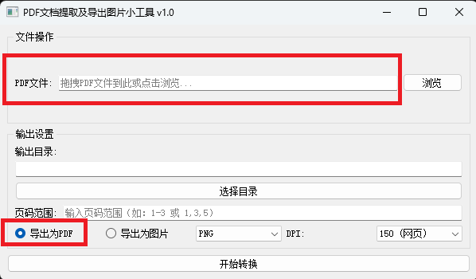
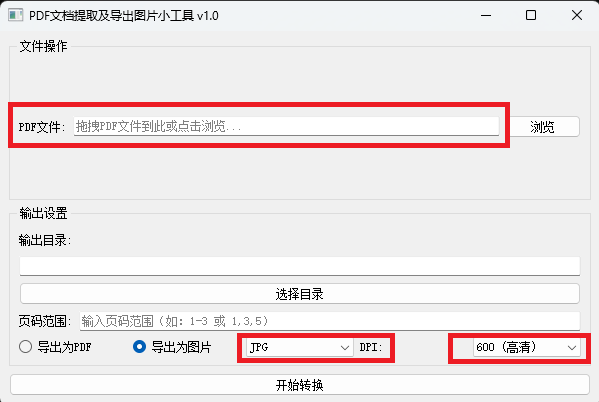
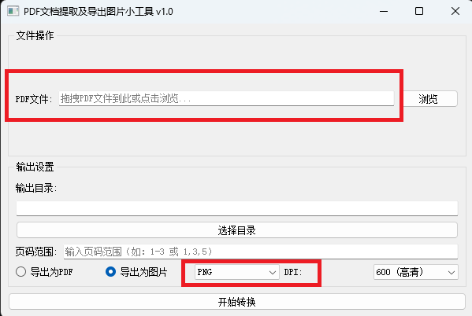

# 基于python，实现pdf文件的提取，导出为图片小工具实现

以下代码，仅限于个人研究学习使用，处理操作的PDF文件，仅限于个人拥有全部所有权的文件。请勿用于非法用途，若有非法使用，本人概不负责。


个人产生这个需求的情景：我想要将一个自己拥有的pdf文件，提取部分页面导出为pdf，和导出为图片，网上的大部分软件这个功能都需要收费。目前，打击盗版，尊重正版的风气越来越严格，处于尊重版权以及降低个人使用成本的思考，因此催生了这个需求。经过一番查找答案，使用AI，询问AI，最终得到了一个基本可用的如下代码，可以满足基本使用需求。仅限于个人研究学习使用，请勿用作非法用途。


## python安装：

去python官网，下载并安装python可执行程序。

## 依赖安装：

```python
pip install PyQt5 PyMuPDF
```

## 基本可用代码如下：

```python
import sys
import os
import fitz
from PyQt5.QtWidgets import (QApplication, QMainWindow, QFileDialog, QMessageBox,
                             QLabel, QLineEdit, QComboBox, QRadioButton, QPushButton,
                             QHBoxLayout, QVBoxLayout, QGroupBox, QWidget)
from PyQt5.QtCore import QThread, pyqtSignal, Qt
from PyQt5.QtGui import QDragEnterEvent, QDropEvent

class WorkerThread(QThread):
    finished = pyqtSignal(bool, str)
    error = pyqtSignal(str)

    def __init__(self, parent=None):
        super().__init__(parent)
        self.params = {
            'dpi': 300,
            'alpha': False,
            'colorspace': fitz.csRGB,
            'output_dir': ''  # 添加默认的输出目录
        }

    def set_params(self, file_path, output_dir, pages, export_pdf, img_format, dpi):
        self.params.update({
            'file_path': file_path,
            'output_dir': output_dir,
            'pages': self._parse_pages(pages),
            'export_pdf': export_pdf,
            'img_format': img_format.lower(),
            'dpi': dpi,
            'alpha': (img_format.lower() == 'png')
        })

    def _parse_pages(self, pages_str):
        pages = []
        for part in pages_str.replace('，', ',').split(','):
            part = part.strip()
            if not part:
                continue
            if '-' in part:
                start_end = part.split('-')
                if len(start_end) != 2:
                    raise ValueError("无效的页码范围格式")
                start = int(start_end[0])
                end = int(start_end[1])
                pages.extend(range(start, end+1))
            else:
                pages.append(int(part))
        return sorted(set(pages))

    def run(self):
        try:
            doc = fitz.open(self.params['file_path'])
            total_pages = doc.page_count
            
            valid_pages = [p-1 for p in self.params['pages'] if 0 < p <= total_pages]
            if not valid_pages:
                raise ValueError("所有页码均超出文档范围")

            if self.params['export_pdf']:
                self._export_pdf(doc, valid_pages)
            else:
                self._export_images(doc, valid_pages)
            
            doc.close()
            self.finished.emit(True, self.params['output_dir'])
        
        except Exception as e:
            self.error.emit(str(e))

    def _export_pdf(self, doc, pages):
        new_doc = fitz.open()
        for p in pages:
            new_doc.insert_pdf(doc, from_page=p, to_page=p)
        output_path = os.path.join(self.params['output_dir'], 'extracted.pdf')
        new_doc.save(output_path, garbage=3, deflate=True)
        new_doc.close()

    def _export_images(self, doc, pages):
        for idx, p in enumerate(pages):
            page = doc[p]
            # 修正抗锯齿参数名称
            pix = page.get_pixmap(
                dpi=self.params['dpi'],
                alpha=self.params['alpha'],
                colorspace=self.params['colorspace'],
                annots=True,
                # anti_aliasing=True  # 参数名改为下划线形式
            )
            output_path = os.path.join(
                self.params['output_dir'],
                f'page_{p+1}_dpi{self.params["dpi"]}.{self.params["img_format"]}'
            )
            if self.params['img_format'] == 'jpg':
                pix.save(output_path, jpg_quality=95)
            else:
                pix.save(output_path)

class PdfToolApp(QMainWindow):
    def __init__(self):
        super().__init__()
        self.init_ui()
        self.worker = WorkerThread()
        self._connect_signals()
        self.setAcceptDrops(True)

    def init_ui(self):
        self.setWindowTitle('PDF文档提取及导出图片小工具 v1.0')
        self.setGeometry(300, 300, 600, 320)
        
        # 文件选择组
        file_group = QGroupBox("文件操作")
        self.txt_file = QLineEdit()
        self.txt_file.setPlaceholderText("拖拽PDF文件到此或点击浏览...")
        btn_browse = QPushButton("浏览")
        btn_browse.clicked.connect(self._browse_file)
        
        # 输出设置组
        output_group = QGroupBox("输出设置")
        self.txt_output = QLineEdit()
        btn_output = QPushButton("选择目录")
        btn_output.clicked.connect(self._browse_dir)
        self.rad_pdf = QRadioButton("导出为PDF")
        self.rad_img = QRadioButton("导出为图片")
        self.rad_pdf.setChecked(True)
        self.cmb_format = QComboBox()
        self.cmb_format.addItems(['PNG', 'JPG'])
        self.cmb_dpi = QComboBox()
        self.cmb_dpi.addItems(['150 (网页)', '300 (印刷)', '600 (高清)'])
        self.txt_pages = QLineEdit()
        self.txt_pages.setPlaceholderText("输入页码范围（如：1-3 或 1,3,5）")

        # 布局
        file_layout = QHBoxLayout()
        file_layout.addWidget(QLabel("PDF文件:"))
        file_layout.addWidget(self.txt_file)
        file_layout.addWidget(btn_browse)
        file_group.setLayout(file_layout)

        output_layout = QVBoxLayout()
        output_layout.addWidget(QLabel("输出目录:"))
        output_layout.addWidget(self.txt_output)
        output_layout.addWidget(btn_output)
        
        pages_layout = QHBoxLayout()
        pages_layout.addWidget(QLabel("页码范围:"))
        pages_layout.addWidget(self.txt_pages)
        
        format_layout = QHBoxLayout()
        format_layout.addWidget(self.rad_pdf)
        format_layout.addWidget(self.rad_img)
        format_layout.addWidget(self.cmb_format)
        format_layout.addWidget(QLabel("DPI:"))
        format_layout.addWidget(self.cmb_dpi)
        
        output_group.setLayout(output_layout)
        output_layout.addLayout(pages_layout)
        output_layout.addLayout(format_layout)

        # 主布局
        main_layout = QVBoxLayout()
        main_layout.addWidget(file_group)
        main_layout.addWidget(output_group)
        
        central_widget = QWidget()
        central_widget.setLayout(main_layout)
        self.setCentralWidget(central_widget)

    def _connect_signals(self):
        # 确保初始状态下，如果选择了PDF导出，则禁用格式选择
        self.cmb_format.setEnabled(self.rad_img.isChecked())
        
        self.rad_pdf.toggled.connect(lambda: self.cmb_format.setEnabled(False))
        self.rad_img.toggled.connect(lambda: self.cmb_format.setEnabled(True))
        
        btn_execute = QPushButton("开始转换", self)
        btn_execute.clicked.connect(self._start_conversion)
        self.centralWidget().layout().addWidget(btn_execute)
        
        self.worker.finished.connect(self._on_finished)
        self.worker.error.connect(self._show_error)

    def dragEnterEvent(self, event: QDragEnterEvent):
        if event.mimeData().hasUrls():
            event.acceptProposedAction()

    def dropEvent(self, event: QDropEvent):
        for url in event.mimeData().urls():
            if url.isLocalFile() and url.fileName().lower().endswith('.pdf'):
                # 使用 os.path.normpath 统一路径分隔符
                self.txt_file.setText(os.path.normpath(url.toLocalFile()))
                break

    def _browse_file(self):
        path, _ = QFileDialog.getOpenFileName(self, "选择PDF文件", "", "PDF Files (*.pdf)")
        if path:
            self.txt_file.setText(path)

    def _browse_dir(self):
        path = QFileDialog.getExistingDirectory(self, "选择输出目录")
        if path:
            self.txt_output.setText(path)

    def _start_conversion(self):
        params = {
            'file_path': self.txt_file.text(),
            'output_dir': self.txt_output.text(),
            'pages': self.txt_pages.text() or "1-1",
            'export_pdf': self.rad_pdf.isChecked(),
            'img_format': self.cmb_format.currentText(),
            'dpi': int(self.cmb_dpi.currentText().split()[0])
        }
        
        if not os.path.exists(params['file_path']):
            QMessageBox.warning(self, "错误", "PDF文件路径无效")
            return
            
        if not os.path.exists(params['output_dir']):
            os.makedirs(params['output_dir'], exist_ok=True)

        try:
            _ = self.worker._parse_pages(params['pages'])
        except ValueError as e:
            QMessageBox.critical(self, "输入错误", f"页码格式错误：{str(e)}")
            return

        self.worker.set_params(**params)
        self.worker.start()

    def _on_finished(self, success, output_dir):
        QMessageBox.information(self, "完成", f"文件已保存至：\n{output_dir}")

    def _show_error(self, msg):
        QMessageBox.critical(self, "错误", f"处理失败：{msg}")

if __name__ == "__main__":
    app = QApplication(sys.argv)
    window = PdfToolApp()
    window.show()
    sys.exit(app.exec_())


```

## 执行测试：

将上述代码，保存为`pdf2image.py`文件。


将如下命令写入`start.bat`脚本文件，双击即可自动调用这个文件：

```powershell
chcp 65001

@echo off
cd /d "%~dp0"
python pdf2image.py
```

选择相应的pdf文件，选择相应的选项，并选择相应的页码（如2-6，选择第2至6页进行操作），如导出为pdf，或者导出为图片（PNG或者JPG），并选择图片的清晰度DPI（150,300,600），点击开始转换，即可生成相应的pdf或者图片。

## 相关示例如下：

PDF导出：



JPG图片导出：



PNG图片导出：


