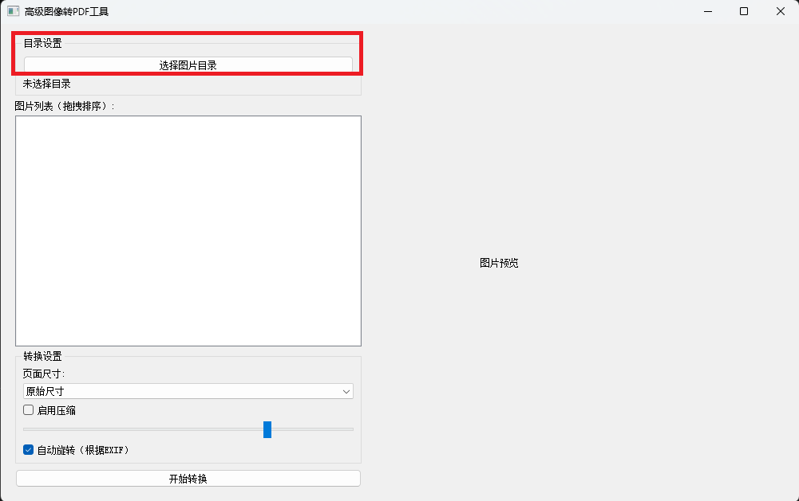
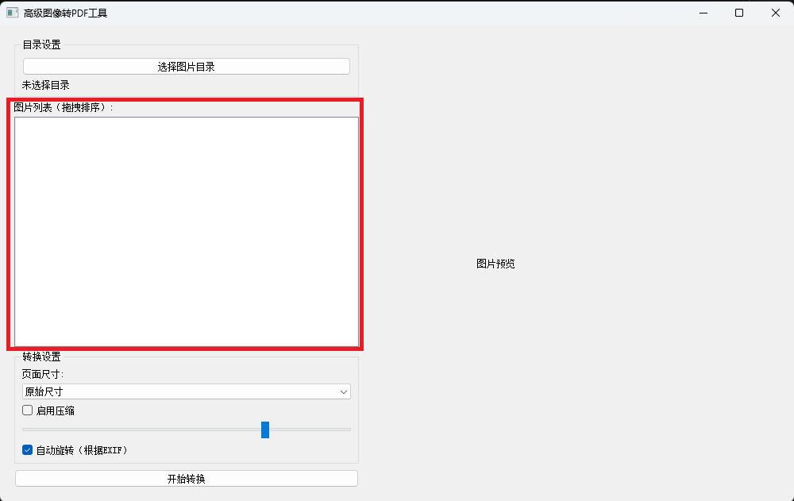
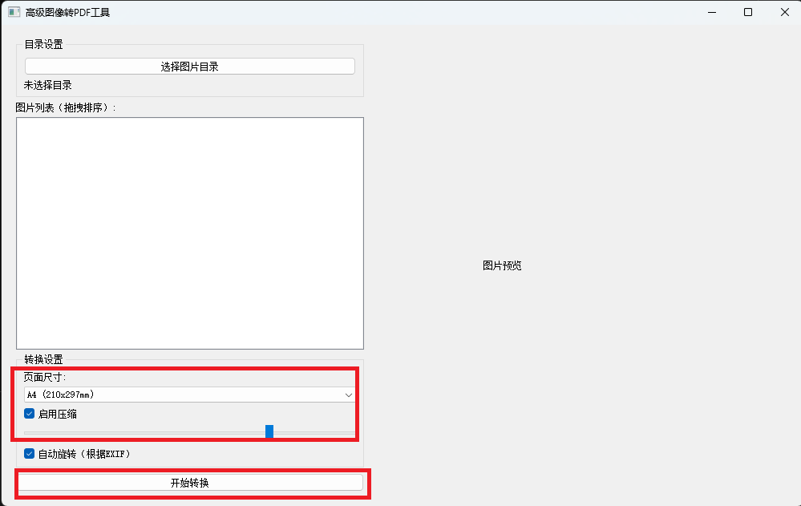

# 基于python，实现图片合成为PDF文件

以下代码，仅限于个人研究学习使用，处理操作的图像文件，仅限于个人拥有全部所有权的文件。请勿用于非法用途，若有非法使用，本人概不负责。


个人产生这个需求的情景：我想要将一个自己拥有的许多的图像图片，查阅不方便，我想要将它们合并为一个PDF文件，方便管理，方便查阅，因此催生了这个需求。经过一番查找答案，使用AI，询问AI，最终得到了一个基本可用的如下代码，可以满足基本使用需求。仅限于个人研究学习使用，请勿用作非法用途。


## python安装：

去python官网，下载并安装python可执行程序。

## 依赖安装：

```python
pip install PyQt5 Pillow psutil
```

## 基本可用代码如下：

```python
# image_to_pdf_final.py
import sys
import os
import platform
from concurrent.futures import ThreadPoolExecutor
from PIL import Image, ImageOps
from PyQt5.QtWidgets import (QApplication, QMainWindow, QWidget, QVBoxLayout, 
                            QHBoxLayout, QPushButton, QFileDialog, QListWidget,
                            QLabel, QProgressDialog, QGroupBox, QCheckBox,
                            QSlider, QComboBox, QMessageBox, QSplitter)
from PyQt5.QtCore import Qt, QDir, QSize
from PyQt5.QtGui import QPixmap, QImage

# 添加内存优化模块
try:
    import psutil
except ImportError:
    psutil = None

class ImageToPDFConverter(QMainWindow):
    def __init__(self):
        super().__init__()
        self.preview_size = QSize(300, 400)  # 提前初始化预览尺寸
        self.init_ui()
        self.image_files = []
        self.current_dir = ""

        # 初始化默认设置
        self.settings = {
            'resolution': 300,
            'compression': 75,
            'page_size': '原始尺寸',
            'auto_rotate': True
        }

    def init_ui(self):
        self.setWindowTitle('高级图像转PDF工具')
        self.setGeometry(300, 300, 1000, 600)

        main_widget = QWidget()
        self.setCentralWidget(main_widget)

        # 主布局
        main_layout = QHBoxLayout()
        splitter = QSplitter(Qt.Horizontal)

        # 左侧控制面板
        left_panel = QWidget()
        left_layout = QVBoxLayout()

        # 目录选择区域
        dir_group = QGroupBox("目录设置")
        dir_layout = QVBoxLayout()
        self.btn_choose = QPushButton("选择图片目录", self)
        self.btn_choose.clicked.connect(self.choose_directory)
        self.lbl_dir = QLabel("未选择目录")
        dir_layout.addWidget(self.btn_choose)
        dir_layout.addWidget(self.lbl_dir)
        dir_group.setLayout(dir_layout)

        # 文件列表区域
        self.list_widget = QListWidget()
        self.list_widget.setDragDropMode(QListWidget.InternalMove)
        self.list_widget.itemSelectionChanged.connect(self.show_preview)

        # 右侧预览区域
        right_panel = QWidget()
        right_layout = QVBoxLayout()
        self.preview_label = QLabel("图片预览")
        self.preview_label.setAlignment(Qt.AlignCenter)
        self.preview_label.setFixedSize(self.preview_size)  # 使用已初始化的尺寸
        right_layout.addWidget(self.preview_label)

        # 设置区域
        settings_group = QGroupBox("转换设置")
        settings_layout = QVBoxLayout()

        # 页面尺寸选择
        self.page_size_combo = QComboBox()
        self.page_size_combo.addItems(["原始尺寸", "A4 (210x297mm)", "Letter (216x279mm)", "自定义"])
        self.page_size_combo.currentIndexChanged.connect(self.update_settings)

        # 压缩设置
        self.compression_check = QCheckBox("启用压缩")
        self.compression_slider = QSlider(Qt.Horizontal)
        self.compression_slider.setRange(1, 100)
        self.compression_slider.setValue(75)

        # 自动旋转
        self.rotate_check = QCheckBox("自动旋转（根据EXIF）")
        self.rotate_check.setChecked(True)

        settings_layout.addWidget(QLabel("页面尺寸:"))
        settings_layout.addWidget(self.page_size_combo)
        settings_layout.addWidget(self.compression_check)
        settings_layout.addWidget(self.compression_slider)
        settings_layout.addWidget(self.rotate_check)
        settings_group.setLayout(settings_layout)

        # 组装布局
        left_layout.addWidget(dir_group)
        left_layout.addWidget(QLabel("图片列表（拖拽排序）:"))
        left_layout.addWidget(self.list_widget)
        left_layout.addWidget(settings_group)

        # 操作按钮
        self.btn_convert = QPushButton("开始转换", self)
        self.btn_convert.clicked.connect(self.convert_to_pdf)
        left_layout.addWidget(self.btn_convert)

        left_panel.setLayout(left_layout)
        right_panel.setLayout(right_layout)

        splitter.addWidget(left_panel)
        splitter.addWidget(right_panel)
        main_layout.addWidget(splitter)
        main_widget.setLayout(main_layout)

        # 高DPI支持
        if hasattr(Qt, 'AA_EnableHighDpiScaling'):
            QApplication.setAttribute(Qt.AA_EnableHighDpiScaling, True)
            QApplication.setAttribute(Qt.AA_UseHighDpiPixmaps, True)

    def choose_directory(self):
        """目录选择方法实现"""
        directory = QFileDialog.getExistingDirectory(self, "选择图片目录", QDir.homePath())
        if directory:
            self.current_dir = directory
            self.lbl_dir.setText(directory)
            self.scan_image_files(directory)

    def scan_image_files(self, directory):
        """扫描图片文件"""
        valid_extensions = ['.jpg', '.jpeg', '.png', '.bmp', '.tiff', '.webp']
        self.image_files = [f for f in os.listdir(directory) 
                          if os.path.splitext(f)[1].lower() in valid_extensions]
        self.image_files.sort()

        self.list_widget.clear()
        self.list_widget.addItems(self.image_files)

    def get_ordered_files(self):
        """获取排序后的文件列表"""
        return [self.list_widget.item(i).text() for i in range(self.list_widget.count())]

    def process_image(self, filepath):
        """多线程图像处理核心方法"""
        try:
            img = Image.open(filepath)

            # 自动旋转处理
            if self.settings['auto_rotate']:
                img = ImageOps.exif_transpose(img)

            # 颜色模式转换
            if img.mode in ('RGBA', 'LA'):
                background = Image.new('RGB', img.size, (255, 255, 255))
                background.paste(img, mask=img.split()[-1])
                img = background

            # 页面尺寸调整
            if self.settings['page_size'] != '原始尺寸':
                img = self.resize_image(img)

            return img
        except Exception as e:
            print(f"处理失败: {filepath} - {str(e)}")
            return None

    def resize_image(self, img):
        """根据设置调整图像尺寸"""
        dpi = self.settings['resolution']

        if 'A4' in self.settings['page_size']:
            target_size = (int(210 * dpi / 25.4), int(297 * dpi / 25.4))
        elif 'Letter' in self.settings['page_size']:
            target_size = (int(216 * dpi / 25.4), int(279 * dpi / 25.4))
        else:
            return img

        # 保持宽高比调整
        img.thumbnail(target_size, Image.LANCZOS)
        return img

    def check_memory(self, required_mb):
        """内存检查（需要psutil）"""
        if psutil:
            mem = psutil.virtual_memory()
            return mem.available >= required_mb * 1024 * 1024
        return True

    def convert_to_pdf(self):
        """增强版PDF转换方法"""
        if not self.image_files:
            QMessageBox.warning(self, "错误", "没有找到可用的图片文件！")
            return

        save_path, _ = QFileDialog.getSaveFileName(self, "保存PDF文件", 
                                                 os.path.join(self.current_dir, "output.pdf"), 
                                                 "PDF Files (*.pdf)")
        if not save_path:
            return

        try:
            progress = QProgressDialog("正在转换PDF...", "取消", 0, len(self.image_files), self)
            progress.setWindowModality(Qt.WindowModal)

            # 估算所需内存（每张图片约10MB）
            if not self.check_memory(len(self.image_files) * 10):
                QMessageBox.warning(self, "内存不足", "可用内存不足，请减少处理图片数量")
                return

            with ThreadPoolExecutor() as executor:
                futures = []
                images = []

                for i, filename in enumerate(self.get_ordered_files()):
                    filepath = os.path.join(self.current_dir, filename)
                    futures.append(executor.submit(self.process_image, filepath))

                for i, future in enumerate(futures):
                    progress.setValue(i)
                    if progress.wasCanceled():
                        break
                    img = future.result()
                    if img is not None:
                        images.append(img)

                if images:
                    save_args = {
                        'save_all': True,
                        'append_images': images[1:],
                        'resolution': self.settings['resolution']
                    }
                    if self.compression_check.isChecked():
                        save_args['quality'] = self.settings['compression']

                    images[0].save(save_path, "PDF", **save_args)
                    QMessageBox.information(self, "完成", f"PDF文件已保存至：\n{save_path}")

        except Exception as e:
            QMessageBox.critical(self, "错误", f"转换失败：{str(e)}")
        finally:
            progress.close()

    def show_preview(self):
        """图片预览功能实现"""
        selected = self.list_widget.currentItem()
        if not selected or not self.current_dir:
            return

        filepath = os.path.join(self.current_dir, selected.text())
        try:
            # 加载并处理图片
            img = Image.open(filepath)
            img.thumbnail((self.preview_size.width(), self.preview_size.height()))

            # 转换为Qt兼容格式
            if img.mode == "RGB":
                qimage = QImage(img.tobytes(), img.size[0], img.size[1], 
                               img.size[0]*3, QImage.Format_RGB888)
            elif img.mode == "RGBA":
                qimage = QImage(img.tobytes(), img.size[0], img.size[1], 
                               img.size[0]*4, QImage.Format_RGBA8888)
            else:
                img = img.convert("RGB")
                qimage = QImage(img.tobytes(), img.size[0], img.size[1], 
                               img.size[0]*3, QImage.Format_RGB888)

            self.preview_label.setPixmap(QPixmap.fromImage(qimage))
        except Exception as e:
            print(f"预览失败: {str(e)}")

    def update_settings(self):
        """同步界面设置到参数"""
        self.settings.update({
            'page_size': self.page_size_combo.currentText(),
            'compression': self.compression_slider.value(),
            'auto_rotate': self.rotate_check.isChecked()
        })

if __name__ == '__main__':
    app = QApplication(sys.argv)
    ex = ImageToPDFConverter()
    ex.show()
    sys.exit(app.exec_())
```

## 执行测试：

将上述代码，保存为`image2pdf.py`文件。


将如下命令写入`start.bat`脚本文件，双击即可自动调用这个文件：

```powershell
chcp 65001

@echo off
cd /d "%~dp0"
python image2pdf.py
```


## 简单教程如下：

选择对应的图片目录：



图片排序：



合成PDF文件：


