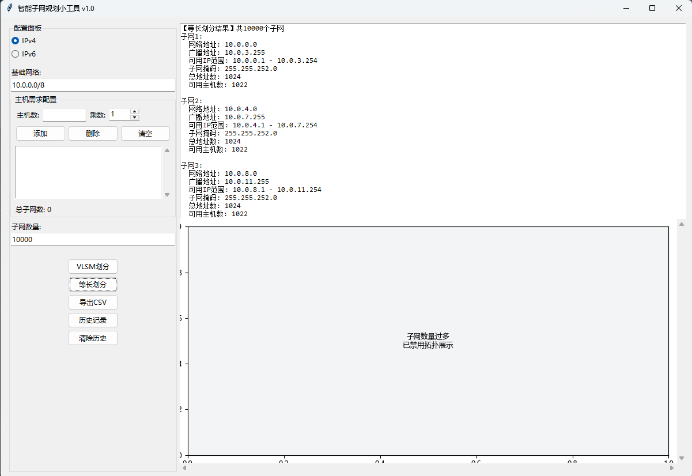

# 基于python，实现IPv4/IPv6子网自动划分小工具

以下代码，仅限于个人研究学习使用，可以实现常见的子网划分，可以导出为csv格式，满足日常工作需要。请勿用于非法用途，若有非法使用，本人概不负责。

个人产生这个需求的情景：出于尊重版权的考虑，我想开发一个程序，可以满足个人在网络规划，划分子网方面的一些需求。IPv4有VLSM划分和等长划分2种方法，来划分子网；IPv6只有等长划分这1种划分子网的方法。经过一番查找答案，使用AI，询问AI，最终得到了一个基本可用的如下代码，可以满足基本使用需求。仅限于个人研究学习使用，请勿用作非法用途。


## 使用说明：

最大子网划分个数为10000个，matplotlib绘图展示为50个。

ipv4使用示例截图：




ipv6使用示例截图：


## python安装：

去python官网，下载并安装python可执行程序。

## 依赖安装：

```python
pip install matplotlib psutil
```

## 基本可用代码如下：

```python

import tkinter as tk
from tkinter import ttk, messagebox, filedialog, Scrollbar
import ipaddress
import csv
import json
from datetime import datetime
import matplotlib.pyplot as plt
from matplotlib.backends.backend_tkagg import FigureCanvasTkAgg
import sys
from itertools import islice
import psutil
import matplotlib as mpl
if mpl.__version__ >= '3.4':
    mpl.rcParams['font.family'] = 'sans-serif'
    mpl.rcParams['font.sans-serif'] = ['Microsoft YaHei', 'SimHei']
else:
    mpl.rc('font', **{
        'family': 'sans-serif',
        'sans-serif': ['Microsoft YaHei', 'SimHei']
    })

class SubnetCalculatorPro(tk.Tk):
    def __init__(self):
            super().__init__()
            # 提前设置Matplotlib全局参数
            self._configure_matplotlib()
            self.title("智能子网规划小工具 v1.0")
            self.geometry("1200x800")
            self.history_file = "subnet_history.json"
            self.current_data = []
            self._init_ui()
            self._load_history()
            self.host_requirements = []  # 初始化主机需求列表
            #self._check_fonts()  # 新增字体检测


    def _configure_matplotlib(self):
        """深度配置中文显示"""
        plt.rcParams.update({
            'font.sans-serif': ['Microsoft YaHei', 'SimHei'],  # 双保险字体配置
            'axes.unicode_minus': False,
            'font.size': 9,
            'figure.titlesize': 12,
            'axes.labelsize': 10
        })

    def _init_ui(self):
        # 主容器
        main_frame = ttk.Frame(self)
        main_frame.pack(fill=tk.BOTH, expand=True, padx=10, pady=10)

        # 控制面板
        control_frame = ttk.LabelFrame(main_frame, text="配置面板")
        control_frame.pack(side=tk.LEFT, fill=tk.Y, padx=5)

        # IP版本选择
        self.ip_version = tk.StringVar(value="IPv4")
        ttk.Radiobutton(control_frame, text="IPv4", variable=self.ip_version,
                       value="IPv4", command=self._toggle_ip_version).pack(anchor=tk.W)
        ttk.Radiobutton(control_frame, text="IPv6", variable=self.ip_version,
                       value="IPv6", command=self._toggle_ip_version).pack(anchor=tk.W)

        # 输入组件
        input_group = ttk.Frame(control_frame)
        input_group.pack(pady=10, fill=tk.X)

        ttk.Label(input_group, text="基础网络:").pack(anchor=tk.W)
        self.network_entry = ttk.Entry(input_group, width=25)
        self.network_entry.pack(fill=tk.X)

        # 主机需求输入区域
        host_frame = ttk.LabelFrame(input_group, text="主机需求配置")
        host_frame.pack(fill=tk.X, pady=5)

        host_input_frame = ttk.Frame(host_frame)
        host_input_frame.pack(fill=tk.X, padx=5, pady=5)

        ttk.Label(host_input_frame, text="主机数:").grid(row=0, column=0, padx=2)
        self.host_count_entry = ttk.Entry(host_input_frame, width=10)
        self.host_count_entry.grid(row=0, column=1, padx=2)

        ttk.Label(host_input_frame, text="乘数:").grid(row=0, column=2, padx=2)
        self.host_multiplier = ttk.Spinbox(host_input_frame, from_=1, to=100, width=5)
        self.host_multiplier.grid(row=0, column=3, padx=2)
        self.host_multiplier.set("1")


        # 添加按钮和列表框
        btn_frame = ttk.Frame(host_frame)
        btn_frame.pack(fill=tk.X, padx=5, pady=2)

        ttk.Button(btn_frame, text="添加", command=self._add_host_requirement).grid(row=0, column=0, padx=2)
        ttk.Button(btn_frame, text="删除", command=self._remove_host_requirement).grid(row=0, column=1, padx=2)
        ttk.Button(btn_frame, text="清空", command=self._clear_requirements).grid(row=0, column=2, padx=2)

        # 需求列表框
        list_frame = ttk.Frame(host_frame)
        list_frame.pack(fill=tk.BOTH, expand=True, padx=5, pady=5)

        self.requirements_listbox = tk.Listbox(list_frame, height=5)
        self.requirements_listbox.pack(side=tk.LEFT, fill=tk.BOTH, expand=True)

        # 添加滚动条
        scrollbar = ttk.Scrollbar(list_frame, orient="vertical", command=self.requirements_listbox.yview)
        scrollbar.pack(side=tk.RIGHT, fill=tk.Y)
        self.requirements_listbox.config(yscrollcommand=scrollbar.set)

        # 添加需求汇总标签
        self.summary_label = ttk.Label(host_frame, text="总子网数: 0")
        self.summary_label.pack(anchor=tk.W, padx=5, pady=2)

        # 保留原有的子网数量输入
        ttk.Label(input_group, text="子网数量:").pack(anchor=tk.W)
        self.subnet_count_entry = ttk.Entry(input_group)
        self.subnet_count_entry.pack(fill=tk.X)

        # 操作按钮
        btn_group = ttk.Frame(control_frame)
        btn_group.pack(pady=10)

        # 修改后的按钮创建部分
        self.vlsm_btn = ttk.Button(btn_group, text="VLSM划分", command=self._vlsm_subnetting)
        self.vlsm_btn.grid(row=0, column=0, pady=2)
        ttk.Button(btn_group, text="等长划分", command=self._equal_subnetting).grid(row=1, column=0, pady=2)
        ttk.Button(btn_group, text="导出CSV", command=self._export_csv).grid(row=2, column=0, pady=2)
        ttk.Button(btn_group, text="历史记录", command=self._show_history).grid(row=3, column=0, pady=2)
        ttk.Button(btn_group, text="清除历史", command=self._clear_history).grid(row=4, column=0, pady=2)

        # 结果展示区
        result_frame = ttk.Frame(main_frame)
        result_frame.pack(side=tk.RIGHT, fill=tk.BOTH, expand=True)

        # 文字结果
        self.result_text = tk.Text(result_frame, wrap=tk.WORD, font=('Consolas', 9))
        self.result_text.pack(side=tk.TOP, fill=tk.X)

        # 拓扑可视化区域（修改部分）
        self.figure = plt.Figure(figsize=(6,4))  # 独立创建figure
        self.ax = self.figure.add_subplot(111)   # 显式创建axes
        self.ax.grid(True, linestyle='--', alpha=0.7)
        self.ax.set_facecolor('#F3F4F6')

        # 创建画布容器
        plot_container = ttk.Frame(result_frame)
        plot_container.pack(side=tk.TOP, fill=tk.BOTH, expand=True)  # 关键修改点

        # 创建画布时应指定父容器为plot_container
        self.canvas = FigureCanvasTkAgg(self.figure, plot_container)
        canvas = self.canvas.get_tk_widget()

        # 添加滚动条
        scroll_y = Scrollbar(plot_container, orient="vertical", command=canvas.yview)
        scroll_x = Scrollbar(plot_container, orient="horizontal", command=canvas.xview)
        canvas.configure(yscrollcommand=scroll_y.set, xscrollcommand=scroll_x.set)

        # 统一使用grid布局
        canvas.grid(row=0, column=0, sticky="nsew")
        scroll_y.grid(row=0, column=1, sticky="ns")
        scroll_x.grid(row=1, column=0, sticky="ew")

        # 设置容器权重
        plot_container.rowconfigure(0, weight=1)
        plot_container.columnconfigure(0, weight=1)

    def _add_host_requirement(self):
        """添加主机需求到列表"""
        try:
            host_count = int(self.host_count_entry.get())
            multiplier = int(self.host_multiplier.get())

            if host_count <= 0:
                messagebox.showerror("输入错误", "主机数量必须大于0")
                return

            if multiplier <= 0:
                messagebox.showerror("输入错误", "乘数必须大于0")
                return

            # 添加到列表框，格式改为：数量 x 主机数
            self.requirements_listbox.insert(tk.END, f"{multiplier} x {host_count}")
            self.host_count_entry.delete(0, tk.END)  # 清空输入框
            self.host_count_entry.delete(0, tk.END)  # 清空输入框
            self._update_requirements_summary()  # 更新汇总信息


        except ValueError:
            messagebox.showerror("输入错误", "请输入有效的数字")


    def _remove_host_requirement(self):
        """从列表中删除选中的主机需求"""
        selected = self.requirements_listbox.curselection()
        if selected:
            self.requirements_listbox.delete(selected)
            self._update_requirements_summary()  # 更新汇总信息
        else:
            messagebox.showinfo("提示", "请先选择要删除的项")

    def _clear_requirements(self):
        """清空主机需求列表"""
        if messagebox.askyesno("确认", "确定要清空所有主机需求吗？"):
            self.requirements_listbox.delete(0, tk.END)
            self._update_requirements_summary()  # 更新汇总信息
            messagebox.showinfo("成功", "主机需求已清空")

    def _update_requirements_summary(self):
        """更新需求汇总信息"""
        total_subnets = 0
        for i in range(self.requirements_listbox.size()):
            item = self.requirements_listbox.get(i)
            parts = item.split('x')
            count = int(parts[0].strip())
            total_subnets += count

        # 可以在界面上显示总需求数
        if hasattr(self, 'summary_label'):
            self.summary_label.config(text=f"总子网数: {total_subnets}")


    def _toggle_ip_version(self):
        """切换IP版本时的界面更新"""
        current_version = self.ip_version.get()
        if current_version == "IPv6":
            self.host_count_entry.state(['disabled'])  # 修改为正确的变量名
            self.vlsm_btn.state(['disabled'])  # 新增禁用VLSM按钮
        else:
            self.host_count_entry.state(['!disabled'])  # 修改为正确的变量名
            self.vlsm_btn.state(['!disabled'])  # 恢复启用


    def _validate_network(self):
        """验证网络地址输入"""
        try:
            if self.ip_version.get() == "IPv4":
                return ipaddress.IPv4Network(self.network_entry.get().strip(), strict=False)
            return ipaddress.IPv6Network(self.network_entry.get().strip(), strict=False)
        except ValueError as e:
            messagebox.showerror("输入错误", f"无效网络格式：{str(e)}")
            return None
    def _vlsm_subnetting(self):
        """VLSM动态划分核心逻辑（支持IPv6）"""
        process = psutil.Process()
        if process.memory_info().rss > 500 * 1024 * 1024:  # 500MB限制
            raise MemoryError("内存使用超过安全阈值")
        network = self._validate_network()
        if not network: return

        try:
            # 从列表框获取主机需求
            requirements = []
            for i in range(self.requirements_listbox.size()):
                item = self.requirements_listbox.get(i)
                # 解析格式：数量 x 主机数
                parts = item.split('x')
                count = int(parts[0].strip())
                hosts = int(parts[1].strip())
                # 添加多个相同的主机需求
                requirements.extend([hosts] * count)

            if not requirements:
                messagebox.showwarning("警告", "请先添加主机需求")
                return


            subnet_count = len(requirements)  # 新增关键行
            MAX_SUBNETS = 10000

            if subnet_count > MAX_SUBNETS:
                raise ValueError(f"子网数量超过最大限制{MAX_SUBNETS}")
            self._validate_vlsm(network, requirements)
            sorted_hosts = sorted(requirements, reverse=True)
            subnets = []
            # 在最终显示前确保是完整列表
            self._display_result(subnets, "VLSM")
            self._update_topology(subnets)

            available_networks = [network]  # 初始化可用网络块列表

            for hosts in sorted_hosts:
                required_ips = hosts + 2
                prefix = 128 if isinstance(network, ipaddress.IPv6Network) else 32
                prefix -= required_ips.bit_length()
                found = False

                # 遍历所有可用块（按地址空间从大到小排序）
                for i in range(len(available_networks)):
                    net = available_networks[i]
                    if net.prefixlen <= prefix:
                        subnet = next(net.subnets(new_prefix=prefix))
                        remaining = list(net.address_exclude(subnet))

                        # 更新可用网络块列表
                        del available_networks[i]
                        available_networks.extend(remaining)
                        # 关键修改点：使用父网络判断排序方向
                        available_networks.sort(
                            key=lambda net: net.num_addresses,
                            reverse=not isinstance(network, ipaddress.IPv6Network)
                        )

                        subnets.append(subnet)
                        found = True
                        break

                if not found:
                    raise ValueError(f"无法满足需求：{hosts}主机")

            self._display_result(subnets, "VLSM")
            self._update_topology(subnets)
            self._save_to_history({
                "type": "VLSM",
                "network": str(network),
                "requirements": requirements,
                "timestamp": datetime.now().isoformat()
            })

        except Exception as e:
            messagebox.showerror("计算错误", f"VLSM划分失败：{str(e)}")

    def _validate_vlsm(self, network, requirements):
        """VLSM需求验证"""
        total_required = sum(2**(req.bit_length()+1) for req in requirements)
        if total_required > network.num_addresses:
            raise ValueError(f"总需求({total_required})超过父网络容量({network.num_addresses})")


    def _equal_subnetting(self):
        """等长子网划分核心逻辑（支持IPv6）"""
        network = self._validate_network()
        if not network: return

        try:
            # 修复点1：先获取用户输入再验证
            subnet_count = int(self.subnet_count_entry.get())
            MAX_SUBNETS = 10000  # 移动验证位置到try块内部

            # 修复点2：添加最小值校验
            if subnet_count < 1:
                raise ValueError("子网数量不能小于1")

            if subnet_count > MAX_SUBNETS:
                raise ValueError(f"子网数量超过最大限制{MAX_SUBNETS}")

            required_bits = (subnet_count-1).bit_length()
            max_prefix = 126 if isinstance(network, ipaddress.IPv6Network) else 30
            new_prefix = network.prefixlen + required_bits

            if new_prefix > max_prefix:
                raise ValueError("子网数量超出地址空间容量")

            # 关键修复：生成器转列表
            subnets = list(islice(network.subnets(new_prefix=new_prefix), subnet_count))

            self._display_result(subnets, "等长")
            self._update_topology(subnets)
            self._save_to_history({
                "type": "等长",
                "network": str(network),
                "subnet_count": subnet_count,
                "timestamp": datetime.now().isoformat()
            })

        except ValueError as e:
            messagebox.showerror("输入错误", str(e))

    def _display_result(self, subnets, stype):
        """显示划分结果"""
        self.current_data = []  # 清空旧数据
        total_subnets = len(subnets)
        result = f"【{stype}划分结果】共{total_subnets}个子网\n"

        display_limit = 100  # 仅影响显示数量

        # 完整存储所有数据（关键修复点）
        for idx, subnet in enumerate(subnets, 1):
            data = {
                "子网": idx,
                "网络地址": str(subnet.network_address),
                "广播地址": str(subnet.broadcast_address),
                "可用范围": f"{subnet[1]} - {subnet[-2]}" if not subnet.is_unspecified else "N/A",
                "掩码": str(subnet.netmask),
                "总地址数": subnet.num_addresses,
                "可用主机": subnet.num_addresses - 2
            }
            self.current_data.append(data)  # 存储全部数据

            # 仅生成前100条的显示内容
            if idx <= display_limit:
                result += (
                    f"子网{idx}:\n"
                    f"  网络地址: {data['网络地址']}\n"
                    f"  广播地址: {data['广播地址']}\n"
                    f"  可用IP范围: {data['可用范围']}\n"
                    f"  子网掩码: {data['掩码']}\n"
                    f"  总地址数: {data['总地址数']}\n"
                    f"  可用主机数: {data['可用主机']}\n\n"
                )

        if total_subnets > display_limit:
            result += f"\n(界面已隐藏{total_subnets-display_limit}个子网，导出CSV可查看完整数据)"

        self.result_text.config(state=tk.NORMAL)
        self.result_text.delete(1.0, tk.END)
        self.result_text.insert(tk.END, result)
        self.result_text.config(state=tk.DISABLED)

    def _get_dynamic_font(self):
        """动态获取字体避免缓存问题"""
        from matplotlib.font_manager import FontProperties
        font_paths = [
            'C:/Windows/Fonts/msyh.ttc',    # 微软雅黑
            'C:/Windows/Fonts/simhei.ttf',  # 黑体
            '/usr/share/fonts/truetype/msttcorefonts/msyh.ttf'  # Linux备用路径
        ]

        for path in font_paths:
            try:
                return lambda size: FontProperties(fname=path, size=size)
            except:
                continue
        return lambda size: FontProperties(size=size)  # 降级处理

    def _update_topology(self, subnets):
        if not isinstance(subnets, list):  # 类型检查
            subnets = list(subnets)
        if len(subnets) > 50:  # 设置图表显示阈值
            self.ax.clear()
            self.ax.text(0.5, 0.5, "子网数量过多\n已禁用拓扑展示", 
                        ha='center', va='center')
            self.canvas.draw_idle()
            return        

        self.ax.clear()

        # 动态加载字体避免缓存问题
        cn_font = self._get_dynamic_font()

        # 计算最大坐标范围
        max_cols = 4
        rows = (len(subnets) + max_cols - 1) // max_cols
        max_x = max_cols * 3 - 1
        max_y = rows * 3 - 1

        # 生成拓扑图（关键修改点）
        for i, subnet in enumerate(subnets):
            col = i % max_cols
            row = rows - 1 - i // max_cols
            x = col * 3
            y = row * 3
            self.ax.add_patch(plt.Circle((x, y), 0.8, color='#93C5FD'))

            # 使用字体属性对象
            self.ax.text(
                x, y+1.2, f"子网 {i+1}", 
                ha='center', 
                va='bottom', 
                fontproperties=cn_font(9)  # 动态字体
            )
            self.ax.text(
                x, y, f"{subnet.network_address}", 
                ha='center', 
                va='center', 
                fontproperties=cn_font(8)
            )

        # 布局优化
        self.ax.set_xlim(-2, max_x + 2)
        self.ax.set_ylim(-2, max_y + 2)
        self.ax.axis('off')
        self.figure.tight_layout()
        self.canvas.draw_idle()

    def _check_fonts(self):
        """深度字体可用性检测"""
        from matplotlib.font_manager import fontManager, FontProperties

        required_glyphs = {
            '子': '\u5b50',
            '网': '\u7f51',
            '划': '\u5212'
        }

        missing = []
        for font in fontManager.ttflist:
            if 'YaHei' in font.name or 'SimHei' in font.name:
                for char_name, char in required_glyphs.items():
                    if not font.get_charmap().get(ord(char)):
                        missing.append(f"{char_name}({char})")
                if missing:
                    messagebox.showwarning(
                        "字体不完整",
                        f"当前字体 {font.name} 缺失字符: {', '.join(missing)}\n"
                        "建议安装完整版微软雅黑字体"
                    )
                    break

    def _get_cn_font(self, size=10):
        """获取中文字体属性"""
        from matplotlib.font_manager import FontProperties
        return FontProperties(
            fname='C:/Windows/Fonts/msyh.ttc',  # 微软雅黑绝对路径
            size=size
        )

    def _export_csv(self):
        """导出CSV文件"""
        if not self.current_data:
            messagebox.showwarning("警告", "没有可导出的数据")
            return

        file_path = filedialog.asksaveasfilename(
            defaultextension=".csv",
            filetypes=[("CSV Files", "*.csv")]
        )
        if file_path:
            try:
                # 修复点1：定义明确的字段列表
                field_names = ["子网", "网络地址", "广播地址", "可用范围", 
                              "掩码", "总地址数", "可用主机"]

                with open(file_path, 'w', newline='', encoding='utf-8') as f:
                    writer = csv.DictWriter(f, fieldnames=field_names)
                    writer.writeheader()

                    # 修复点2：遍历当前数据而非生成器
                    for data in self.current_data:
                        writer.writerow({
                            '子网': data['子网'],
                            '网络地址': data['网络地址'],
                            '广播地址': data['广播地址'],
                            '可用范围': data['可用范围'],
                            '掩码': data['掩码'],
                            '总地址数': data['总地址数'],
                            '可用主机': data['可用主机']
                        })

                messagebox.showinfo("导出成功", f"文件已保存至：{file_path}")

            except PermissionError:
                messagebox.showerror("权限拒绝", "请关闭已打开的文件后再导出")
            except Exception as e:
                messagebox.showerror("导出错误", f"发生未知错误：{str(e)}")


    def _save_to_history(self, data):
        """保存到历史记录"""
        try:
            with open(self.history_file, 'a+') as f:
                f.seek(0)
                history = json.load(f) if f.read() else []
                history.append(data)
                f.seek(0)
                f.truncate()
                json.dump(history, f, indent=2)
        except:
            with open(self.history_file, 'w') as f:
                json.dump([data], f)

    def _load_history(self):
        """加载历史记录"""
        try:
            with open(self.history_file, 'r') as f:
                self.history = json.load(f)
        except (FileNotFoundError, json.JSONDecodeError):
            self.history = []

    def _show_history(self):
        """显示历史记录窗口"""
        history_win = tk.Toplevel(self)
        history_win.title("操作历史")

        tree = ttk.Treeview(history_win, columns=("type", "network", "time"), show="headings")
        tree.heading("type", text="类型")
        tree.heading("network", text="网络地址")
        tree.heading("time", text="操作时间")

        for record in self.history[-20:]:  # 显示最近20条
            tree.insert("", tk.END, values=(
                record.get('type', ''),
                record.get('network', ''),
                record.get('timestamp', '')
            ))

        tree.pack(fill=tk.BOTH, expand=True)

    def _clear_history(self):
        """清除历史记录"""
        if messagebox.askyesno("确认", "确定要清除所有历史记录吗？"):
            self.history = []
            with open(self.history_file, 'w') as f:
                f.write('')
            messagebox.showinfo("成功", "历史记录已清除")

if __name__ == "__main__":
    try:
        if sys.version_info < (3, 9):
            messagebox.showerror("版本错误", "IPv6功能需要Python 3.9+")
        else:
            app = SubnetCalculatorPro()
            app.mainloop()
    except Exception as e:
        messagebox.showerror("致命错误", 
            f"程序初始化失败：{str(e)}\n"
            "请检查：\n"
            "1. Python版本是否为3.9+\n"
            "2. 依赖包是否安装正确\n"
            "3. 系统字体配置是否完整")
```

## 执行测试：

将上述代码，保存为`subnet-tool.pyw`文件。


将如下命令写入`start.bat`脚本文件，双击即可自动调用这个文件：

```powershell
@echo off
cd /d "%~dp0"
start "" pythonw subnet-tool.pyw
```
