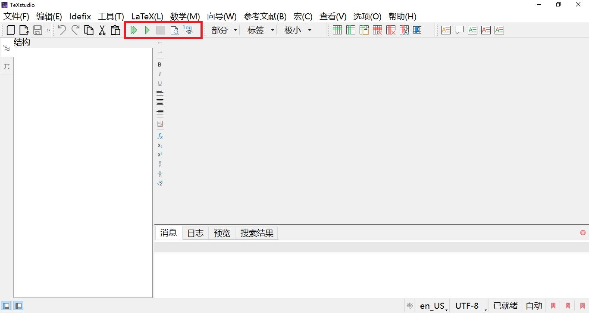
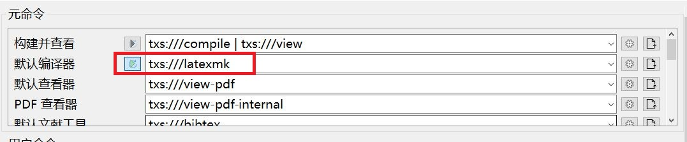
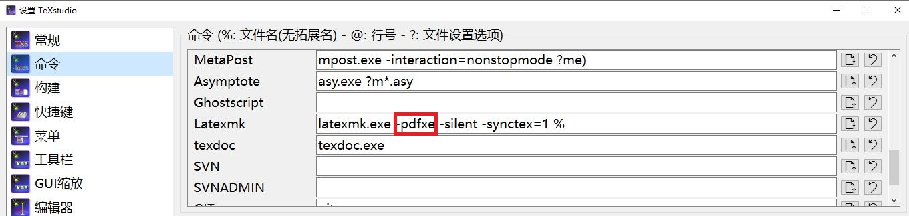

## LaTeX的优势是什么？

大文档管理优势，50页以内的文档，短管理周期的文档，使用Word的效率会高一些。LaTeX呢？在于大文档管理。当你的项目，文档协作项目，大于100页，或者是长周期，比如一年，二年，十年，使用LaTeX会有明显的优势。


我使用LaTeX，管理过超过10000页的文档，比如项目文档分类汇总，多个项目的验收文档合并管理等等。比如LaTeX管理个人的日记，一天一至两页，一年有365天，十年有3650天。


不必刻意关注LaTeX的数学输入，公式输入之类的。如果有需要用到，可以直接使用，用不到，也可以不用。TeXstudio里，有个向导中的“数学助手”，便于输入数学，有个数位板辅助输入，就更加方便了。


LaTeX，核心优势是专注于内容，而非格式。将创作重心，放到内容创作上面来。“扬长避短”。


## TeXstudio

完整的工具链是什么？

1. 前端：TeXStudio 4.8.6

2. 后端：TeX Live 2025

3. 文献管理：JabRef

4. 版本控制：Git/SVN（有需要时，按需使用；没有需要时，可以忽略）

5. 主要编译逻辑：使用`latexmk`命令，调用`xelatex`，进行编译

图形操作界面主要使用部分（工具栏=》工具部分）如下：



相关编译配置，默认编译器修改为`latexmk`：

设置=》构建=》默认编译器：`txs:///latexmk`



修改`latexmk`的默认参数为`pdfxe`：

设置=》命令=》latexmk：`latexmk.exe -pdfxe -silent -synctex=1 %`




## 一个实用的latex项目文档结构

Windows下使用tree命令查看文档目录如下：

```powershell
PS: -> tree /a /f
```

整体project文档结构：

```bash
project
    |
    +---main.tex
    |
    +---cfg
    |   +---end.tex
    |   +---settings.tex
    |   +---title-toc.tex
    |   |
    |   \---bib            %文献目录，用于存放文献
    |        \---main.bib  
    |
    +---data
        +---picture
                \---...    %图片目录，用于存放项目图片
        \---recording
                \---...    %文档目录，用于存放子文件，如input、include等命令插入的子*.tex文件
```

### main.tex内容如下：

```latex
%环境：Windows 10 LTSC 操作系统（可替换）
%工具链：TeX Live 2025+TeXStudio 4.8.6（跨平台）
%编译引擎：使用Latexmk，调用XeLaTeX、Bibtex、MakeIndex等
%索引，关键信息，添加索引，方便查询
\documentclass[UTF8,a4paper]{ctexbook}
%%文档设置文件
\input{cfg/settings}
%%基本信息
%题目
\title{XXXXX}
%作者或组织
\author{XXX}
%日期：今天
\date{\today}
%%开始正文文档
\begin{document}
%封面，目录
\input{cfg/title-toc}
%==============================================
%正文开始
%==============================================
%latex共有7级大纲，常用的为5级大纲。段落、子段落两级不常用
\part{部分}
\chapter{章}

%此处一定要手动输入\cite{},千万不要直接快捷键引用，会失败的。
本模板制作，参考书籍《\LaTeX 入门》\cite{刘海洋2013latex}。

\section{节}
\subsection{小节}
\subsubsection{子小节}

\index{索引示例}

\index{高亮示例}

\hly{黄色高亮}，命令为\textbackslash ly\{text\}

\hlr{红色高亮}，命令为\textbackslash ly\{text\}

\hlg{绿色高亮}，命令为\textbackslash ly\{text\}

\hlp{粉红色高亮}，命令为\textbackslash ly\{text\}

\hlo{橄榄色高亮}，命令为\textbackslash ly\{text\}

\newpage
easyReview示例，\index{审阅功能实现}

\alert{请注意此处}，命令为\textbackslash alert\{text\}

\vfill

\comment{\mbox{解释原文}}{此处为解释部分}，命令为\textbackslash comment\{\textbackslash mbox\{原文\}\}\{解释\}

\vfill

\add{新添加部分}，命令为\textbackslash add\{text\}

\vfill

\remove{\mbox{删除}}，命令为\textbackslash remove\{\textbackslash mbox\{text\}\}

\vfill

\replace{\mbox{替代前原文}}{替代后正文}，命令为\textbackslash replace\{\textbackslash mbox\{text\}\}\{text\}

\vfill

\highlight{\mbox{高亮}}，命令为\textbackslash highlight\{\textbackslash mbox\{text\}\}

\newpage

其他部分，请详细阅读配置文件“cfg/settings.tex”以及刘海洋老师的《\LaTeX 入门》

%==============================================
%文档收尾
%==============================================
\input{cfg/end}
\end{document}
```

### main.bib内容如下：

```latex
% Encoding: UTF-8

@Book{刘海洋2013latex,
  title     = {LaTeX 入门},
  publisher = {电子工业出版社},
  year      = {2013},
  author    = {刘海洋},
}

@Book{谭志彬2016系统集成项目管理工程师教程（第2版）,
  title     = {系统集成项目管理工程师教程（第2版）},
  publisher = {清华大学出版社},
  year      = {2016},
  author    = {谭志彬 \& 柳纯录},
}

@book{柳纯录2017信息系统项目管理师教程（第3版）,
    title={信息系统项目管理师教程（第3版）},
    author={柳纯录},
    year={2017},
    publisher={清华大学出版社有限公司}
}

@Book{中文版Excel2019宝典（第10版）,
  title     = {中文版 Excel 2019宝典（第10版）},
  publisher = {清华大学出版社有限公司},
  year      = {2019},
  author    = {赵利通 \& 梁原},
}

@Book{中文版Access2019宝典（第9版）,
  title     = {中文版 Access 2019 宝典（第9版）},
  publisher = {清华大学出版社有限公司},
  year      = {2019},
  author    = {张骏温 \& 何保锋},
}

@Comment{jabref-meta: databaseType:bibtex;}
```

### end.tex内容如下：

```latex
\part{参考资料}
%参考文献
\bibliographystyle{plain}
\bibliography{cfg/bib/main}
%索引
\printindex
```

### settings.tex内容如下：

```latex
%目录超链接设置
\usepackage[colorlinks,
        linkcolor=red,
        citecolor=green,
        anchorcolor=blue,
        bookmarksnumbered=true,
        pagebackref=true,
        hyperindex=true,
        bookmarksopen=true,
        bookmarksopenlevel=0]{hyperref}%PDF超链接
%%整体颜色说明：目录超链接为红色，强调文字为黄色，引用部分文字为蓝色。


%+++++++++++++++++++++++++++++++++++++++++++++
%%文字高亮支持
\usepackage[dvipsnames, svgnames, x11names]{xcolor}
\usepackage[normalem]{ulem} 
\newcommand\hly{\bgroup\markoverwith
    {\textcolor{yellow}{\rule[-.5ex]{2pt}{2.5ex}}}\ULon}%强调命令——黄色
\newcommand\hlr{\bgroup\markoverwith
    {\textcolor{red}{\rule[-.5ex]{2pt}{2.5ex}}}\ULon}%强调命令——红色
\newcommand\hlg{\bgroup\markoverwith
    {\textcolor{green}{\rule[-.5ex]{2pt}{2.5ex}}}\ULon}%强调命令——绿色
\newcommand\hlp{\bgroup\markoverwith
    {\textcolor{pink}{\rule[-.5ex]{2pt}{2.5ex}}}\ULon}%强调命令——粉红色
\newcommand\hlo{\bgroup\markoverwith
    {\textcolor{olive}{\rule[-.5ex]{2pt}{2.5ex}}}\ULon}%强调命令——淡褐色/橄榄绿色


%+++++++++++++++++++++++++++++++++++++++++++++
%汉语文字划线问题（下划线、删除线、下加点等等）
\usepackage{CJKfntef}


%+++++++++++++++++++++++++++++++++++++++++++++
%索引
\usepackage{imakeidx}
\makeindex


%+++++++++++++++++++++++++++++++++++++++++++++
%参考文献
\usepackage{cite}


%+++++++++++++++++++++++++++++++++++++++++++++
%自动添加目录、图表目录、参考文献、索引等标签
\usepackage{tocbibind}


%+++++++++++++++++++++++++++++++++++++++++++++
%ctex宏包引入
\usepackage{ctex}
\ctexset{today=small}


%+++++++++++++++++++++++++++++++++++++++++++++
%使用跨页表格
\usepackage{longtable}


%+++++++++++++++++++++++++++++++++++++++++++++
%代码环境引入及显示设置
\usepackage{listings}
\lstset{
    breaklines,
    columns=fullflexible,
    numbers=left, 
    numberstyle= \tiny, 
    keywordstyle= \color{OrangeRed3},
    commentstyle=\color{ForestGreen}, 
    frame=TrbL, 
    rulesepcolor= \color{LightYellow3} 
} 


%+++++++++++++++++++++++++++++++++++++++++++++
%AMS宏包引入，数学符号支持大全
\usepackage{amsmath}
\usepackage{amsfonts}
\usepackage{amssymb}


%+++++++++++++++++++++++++++++++++++++++++++++
%float宏包和graphicx宏包结合使用
%插入图片
\usepackage{float}
\usepackage{graphicx}
%%示例如下：
%%\begin{figure}[H]%浮动，严格在此位置，结合float宏包
%%    \centering%居中
%%    \includegraphics[width=0.85\linewidth]{图片路径}
%%    \caption{}%图标题
%%    \label{}%标签
%%\end{figure}


%+++++++++++++++++++++++++++++++++++++++++++++
%引入pdf文档
\usepackage{pdfpages}
%插入pdf文档带页码，整体页码编号
\includepdfset{pagecommand={\thispagestyle{plain}}}
%%示例：\includepdf[pages={1-}]{data/pdf-documents/2019/12/01-7.pdf}


%+++++++++++++++++++++++++++++++++++++++++++++
%引入个性化图标
%星星图标
\usepackage{typicons}
\usepackage{fontawesome5}


%+++++++++++++++++++++++++++++++++++++++++++++
%插入空白页面支持
\usepackage{fancyhdr}


%+++++++++++++++++++++++++++++++++++++++++++++
%文档页面布局部分，页边距设置
%\usepackage[top=2.54cm,bottom=2.54cm,right=3.18cm,left=3.18cm]{geometry}%“常规”
%\usepackage[top=1.27cm,bottom=1.27cm,right=1.27cm,left=1.27cm]{geometry}%“窄”
\usepackage[top=2.54cm,bottom=2.54cm,right=1.91cm,left=1.91cm]{geometry}%“中等”
%\usepackage[top=2.54cm,bottom=2.54cm,right=5.08cm,left=5.08cm]{geometry}%“宽”


%+++++++++++++++++++++++++++++++++++++++++++++
%目录相关设置。
\setcounter{tocdepth}{3}
\setcounter{secnumdepth}{3}
%编号深度
%0，1级深度
%1，2级深度
%2，3级深度
%3，4级深度


%+++++++++++++++++++++++++++++++++++++++++++++
%自定义ccy-quotation环境，文字颜色设置为蓝色
\newenvironment{ccy-quotation}{\begin{quotation}
        \color{blue}
}{\end{quotation}}


%+++++++++++++++++++++++++++++++++++++++++++++
%审阅注释修改批注，文章精益求精
\usepackage{easyReview}

%%正式编译无此包的正文前，请取消下面三行的注释
%\setreviewsoff
%\renewcommand{\replace}[2]{#2}
%\renewcommand{\remove}[1]{}

%%命令示例
%
%%警示，请注意此部分
%\alert{text}
%
%%评论部分文字
%\comment{text}{comment}
%
%%添加文字
%\add{text}
%
%%删除正文部分
%\remove{\mbox{text}}
%
%%替代正文部分
%\replace{\mbox{text}}{replacement}
%
%%黄色高亮
%\highlight{\mbox{text}}

%+++++++++++++++++++++++++++++++++++++++++++++


```

### title-toc.tex内容如下：

```latex
%封面
\maketitle
%添加空白页
\newpage
\clearpage
\phantom{s}
\thispagestyle{empty}
%目录
\tableofcontents
\listoffigures
\listoftables


```


