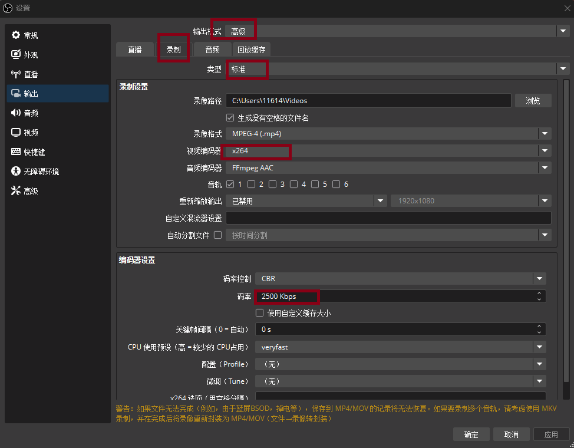
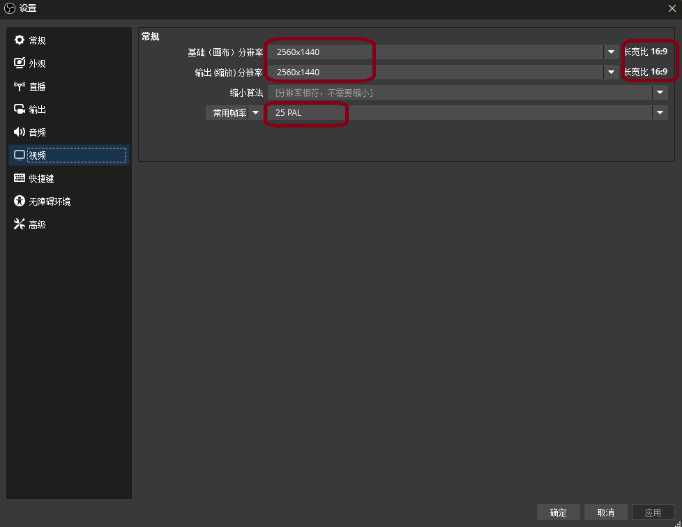
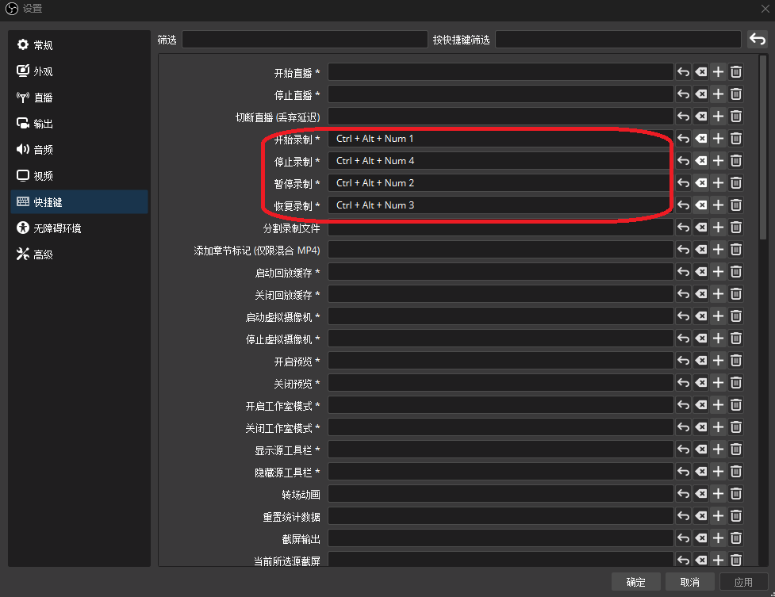
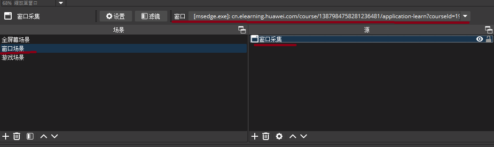

## OBS Studio + FFmpeg + ImageMagick 实现MP4视频转PDF文档

### （一）安装相关软件

1. 去OBS的官网，下载安装最新版本的OBS Studio软件

2. 去https://github.com/GyanD/codexffmpeg/releases下载最新版本的FFmpeg二进制文件，如ffmpeg-7.1.1-full_build.zip，并解压缩到相关路径，添加相关的环境变量，使命令行终端下，可以执行`ffmpeg`命令。

3. 去ImageMagick的官网，下载安装最新版本的ImageMagick软件，是命令行终端下，可以执行`magick`命令，如果安装后，搜索不到`magick`命令，则添加相关的环境变量即可。

### （二）配置OBS软件

关键配置截图1：




关键配置截图2：




关键配置截图3：




关键配置截图4：




OBS Studio在这整个流程中的关键作用是，录制如在线播放的课程的视频，尤其是关键页PPT，用于解决没有课件的问题，网课找不到对应PPT的问题，解决培训不发PPT文件，只发线下打印的纸质PPT教材的问题。推荐的录制标准是2k分辨率，25帧/秒，2500 kbps的码率。


### （三）写入相关脚本

#### 1.无损抽帧bat脚本如下：

```powershell
chcp 65001

@echo off
setlocal enabledelayedexpansion

for %%a in (*.mp4 *.avi *.mov *.mkv) do (
    set "fname=%%~na"
    if not exist "!fname!\" (
        mkdir "!fname!"
    )
    ffmpeg -i "%%a" -vf "select=not(mod(n\,15))" -vsync vfr "!fname!\output_%%04d.png"
)

echo 处理完成
pause
```

想要修改抽帧的频率，可以修改这个`"select=not(mod(n\,15))"`部分。

#### 2.低精度（jpg）抽帧生成pdf文件的bat脚本如下：

```powershell
chcp 65001

@echo off
setlocal enabledelayedexpansion

for %%a in (*.mp4 *.avi *.mov *.mkv) do (
    set "fname=%%~na"
    if not exist "!fname!\" (
        mkdir "!fname!"
    )
    ffmpeg -i "%%a" -vf "select=eq(n\,0)+gt(scene\,0.05),mpdecimate" -vsync vfr "!fname!\output_%%04d.jpg"
    magick "!fname!\*.jpg" "!fname!\!fname!.pdf"
)

echo 处理完成
pause
```


#### 3.高精度（png）抽帧生成pdf文件的bat脚本如下：

```powershell
chcp 65001

@echo off
setlocal enabledelayedexpansion

for %%a in (*.mp4 *.avi *.mov *.mkv) do (
    set "fname=%%~na"
    if not exist "!fname!\" (
        mkdir "!fname!"
    )
    ffmpeg -i "%%a" -vf "select=eq(n\,0)+gt(scene\,0.05),mpdecimate" -vsync vfr "!fname!\output_%%04d.png"
    magick "!fname!\*.png" "!fname!\!fname!.pdf"
)

echo 处理完成
pause
```


